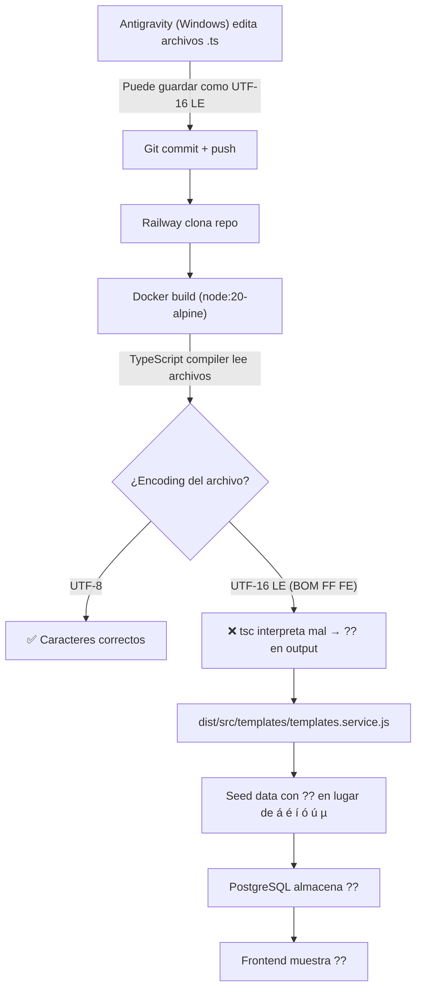

# Diagnóstico de Encoding — Producción (Railway)

## Paso 1: Archivos del módulo de templates (backend)

```
apps/api/src/templates/
├── dto/
│   └── templates.dto.ts        (711 bytes)
├── templates.controller.ts     (4,535 bytes)
├── templates.module.ts         (390 bytes)
└── templates.service.ts        (10,040 bytes)
```

## Paso 2: Archivos con marcadores µ y caracteres especiales

### Archivos que contienen el carácter µ:

| Archivo | Marcadores µ | Líneas clave |
|---------|-------------|--------------|
| `apps/web/src/lib/proposalVariables.ts` (6,935 bytes) | `µCiudad`, `µFechaEmision`, `µCLIENTE`, `µCOT`, `µAsunto`, `µValidez`, `µGarantia` | L20-27, L104, L128, L132, L134 |
| `apps/web/src/pages/proposals/ProposalDocBuilder.tsx` (31,131 bytes) | Referencia a marcadores µ en comentarios | L55, L69 |

### Archivos con vocales tildadas/ñ en strings literales del backend:

| Archivo | Caracteres especiales en strings |
|---------|--------------------------------|
| `apps/api/src/templates/templates.service.ts` (10,040 bytes) | Seed defaults: `Presentación`, `Información`, `Índice`, `Términos`, `Condiciones`, `válidos`, `tecnológicas`, `innovación`, `Quiénes`, etc. (líneas 236-306) |

### Archivos frontend con caracteres especiales en strings visibles:

| Archivo | Caracteres especiales |
|---------|----------------------|
| `apps/web/src/pages/admin/DefaultPagesAdmin.tsx` (34,417 bytes) | `Índice`, `Términos`, `Condiciones`, `Presentación`, `Personalizada`, `Información` (L32-38), `Plantillas`, `Eliminar`, `Descripción`, etc. |
| `apps/web/src/lib/proposalVariables.ts` (6,935 bytes) | `atención`, `garantías`, `soluciones`, `línea`, `comunicación`, `Medellín`, `Bogotá` (L162-164) |

> [!IMPORTANT]
> **No pude verificar encoding con bytes** (`Get-Content -Encoding Byte`) porque `run_command` falla con _"sandboxing is not supported on Windows"_. El usuario debe ejecutar estos comandos manualmente:

```powershell
# Archivos CRÍTICOS a verificar:
@(
  "apps\web\src\lib\proposalVariables.ts",
  "apps\api\src\templates\templates.service.ts",
  "apps\web\src\pages\admin\DefaultPagesAdmin.tsx"
) | ForEach-Object {
  $bytes = [System.IO.File]::ReadAllBytes("d:\novotechflow\$_")
  $first4 = ($bytes[0..3] -join ' ')
  Write-Host "$_ → bytes: $first4"
}
```

**Referencia de bytes:**
- `255 254` = UTF-16 LE (BOM) → **ROTO en producción**
- `239 187 191` = UTF-8 con BOM → OK
- Bytes ASCII normales (ej: `105 109 112`) = UTF-8 sin BOM → **Correcto**

### Indicador indirecto de tamaño (sospecha UTF-16 LE):

| Archivo | Bytes | Líneas | Bytes/línea |
|---------|-------|--------|-------------|
| `DefaultPagesAdmin.tsx` | 34,417 | 675 | **51.0** |
| `templates.service.ts` | 10,040 | 338 | **29.7** |
| `proposalVariables.ts` | 6,935 | 192 | **36.1** |

> [!NOTE]
> Un ratio de ~51 bytes/línea para `DefaultPagesAdmin.tsx` es alto pero no conclusivo por sí solo (tiene muchas líneas con className largo). Lo decisivo son los primeros bytes.

## Paso 3: Encoding — Pendiente de verificación manual

Ver comando PowerShell arriba.

## Paso 4: Dockerfile del API

```dockerfile
# Stage 1: Build
FROM node:20-alpine AS builder
WORKDIR /app
RUN npm install -g pnpm@8.15.5
COPY package.json pnpm-lock.yaml pnpm-workspace.yaml ./
COPY apps/api/package.json apps/api/
COPY packages/ packages/
RUN pnpm install --frozen-lockfile --filter api...
COPY apps/api/ apps/api/
RUN cd apps/api && npx prisma generate
RUN cd apps/api && pnpm build

# Stage 2: Production
FROM node:20-alpine AS runner
RUN apk add --no-cache openssl
WORKDIR /app
RUN npm install -g pnpm@8.15.5
COPY --from=builder /app/apps/api/dist ./dist
COPY --from=builder /app/apps/api/node_modules ./node_modules
COPY --from=builder /app/apps/api/prisma ./prisma
COPY --from=builder /app/apps/api/package.json ./
COPY --from=builder /app/apps/api/tsconfig.json ./
RUN mkdir -p uploads/signatures uploads/defaults uploads/templates
EXPOSE 3000
RUN npm install prisma ts-node typescript
CMD ["sh", "-c", "npx prisma migrate deploy && node dist/src/main.js"]
```

> [!WARNING]
> **No hay configuración de `LANG` ni `LC_ALL` en el Dockerfile.** Alpine Linux por defecto usa locale `C` (ASCII only), lo que puede causar problemas con caracteres no-ASCII si Node.js lee archivos UTF-16 LE. Sin embargo, Node.js 20 maneja UTF-8 correctamente por defecto.

## Paso 5: docker-compose.yml y PostgreSQL encoding

```yaml
services:
  db:
    image: postgres:15-alpine
    environment:
      POSTGRES_USER: ${DB_USER:-novotechflow}
      POSTGRES_PASSWORD: ${DB_PASSWORD:-changeme}
      POSTGRES_DB: ${DB_NAME:-novotechflow}
    ports:
      - "5432:5432"
    volumes:
      - postgres-data:/var/lib/postgresql/data

  api:
    build:
      context: .
      dockerfile: apps/api/Dockerfile
    environment:
      DATABASE_URL: postgresql://${DB_USER}:${DB_PASSWORD}@db:5432/${DB_NAME}
      JWT_SECRET: ${JWT_SECRET}
      CORS_ORIGIN: ${CORS_ORIGIN:-http://localhost}
```

> [!NOTE]
> PostgreSQL 15 por defecto usa `UTF8` encoding al crear la DB. La connection string **no tiene parámetro `?charset=utf8`**, pero PostgreSQL no usa ese parámetro (a diferencia de MySQL). El encoding de la DB se configura con `POSTGRES_INITDB_ARGS`. En PostgreSQL 15-alpine, **UTF8 es el default**, así que la DB no es el problema.

---

## Análisis y Causa Raíz

### Flujo del problema:



### ¿Por qué funciona en local?

En desarrollo local (`pnpm dev`), Vite/ts-node ejecutan los archivos fuente directamente. Windows+Node.js pueden manejar UTF-16 LE porque:
1. Node.js en Windows puede detectar BOM y ajustar el encoding
2. Vite tiene su propio file reader que puede manejar BOM

En producción (Docker/Alpine), el compilador TypeScript (`pnpm build` → `tsc`) lee los archivos como UTF-8 por defecto. Si un archivo tiene BOM UTF-16 LE (`FF FE`), `tsc` lo malinterpreta y los caracteres no-ASCII se pierden.

### Archivos afectados (candidatos principales):

1. **`apps/api/src/templates/templates.service.ts`** — Contiene todo el seed data con caracteres españoles. Si está en UTF-16 LE, el seed genera `??` en la DB.
2. **`apps/web/src/lib/proposalVariables.ts`** — Contiene los marcadores µ y texto en español. Si está en UTF-16 LE, el frontend compilado tendrá `??` en lugar de `µ`.
3. **`apps/web/src/pages/admin/DefaultPagesAdmin.tsx`** — Labels con tildes como `Índice`, `Términos`, `Presentación`.

### Nota sobre el seed vs contenido editado:

El seed (`seedDefaultsIfEmpty`) solo se ejecuta **una vez** cuando no hay plantillas en la DB. Si las plantillas ya existen (creadas en local con datos correctos), el seed no re-ejecuta. Pero si Railway desplegó con una DB limpia y el seed corrió con el archivo corrupto, los datos en la DB ya tienen `??`.

Por otro lado, el frontend (`proposalVariables.ts` y `DefaultPagesAdmin.tsx`) se compilan en cada deploy. Si están en UTF-16 LE, **cada deploy produce un bundle con `??`**.

---

## Próximos pasos sugeridos

1. **Verificar encoding** ejecutando el comando PowerShell del Paso 3 manualmente
2. **Si se confirma UTF-16 LE**, re-guardar los archivos afectados como UTF-8 sin BOM
3. **En la DB de producción**, limpiar/re-seedear las plantillas con datos correctos
4. **Prevención**: Agregar `ENV LANG=C.UTF-8` al Dockerfile como buena práctica
