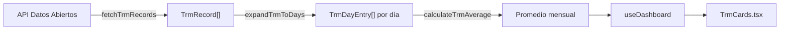

# TRM Histórica en Dashboard

## Resumen

Se agregaron datos de TRM histórica al Dashboard: TRM del día (ya existente), promedio TRM del mes actual, y promedio TRM del mes anterior. Los promedios se calculan expandiendo los registros de la API a días calendario individuales para manejar correctamente fines de semana y festivos.

## Archivos Modificados/Creados

### [NEW] [trm-service.ts](file:///d:/novotechflow/apps/web/src/lib/trm-service.ts)
Servicio puro con 4 funciones para consultar y procesar TRM histórica:
- `fetchTrmRecords` — consulta la API de Datos Abiertos con timeout de 10s
- `expandTrmToDays` — **función clave** que expande registros multi-día a días calendario individuales
- `calculateTrmAverage` — promedio aritmético simple
- `getTrmMonthlyAverage` — orquestador que combina las 3 anteriores

### [MODIFY] [constants.ts](file:///d:/novotechflow/apps/web/src/lib/constants.ts)
```diff:constants.ts
// ──────────────────────────────────────────────────────────
// Constantes de negocio — NovoTechFlow
// Centralizan magic numbers y strings en un solo lugar.
// ──────────────────────────────────────────────────────────

import {
    FileText, FileSignature, Building2, ListOrdered,
    Cpu, DollarSign,
    Image as ImageIcon,
} from 'lucide-react';
import type { ProposalStatus } from './types';

/** Tasa de IVA colombiano (19%). */
export const IVA_RATE = 0.19;

/** Porcentaje de flete para proveedores mayoristas. */
export const MAYORISTA_FLETE_PCT = 1.5;

/** Nombre del proveedor mayorista. */
export const PROVEEDOR_MAYORISTA = 'MAYORISTA';

/** Debounce para búsquedas de autocompletado (ms). */
export const AUTOCOMPLETE_DEBOUNCE_MS = 200;

/** Debounce para cierre de sugerencias en onBlur (ms). */
export const SUGGESTION_BLUR_DELAY_MS = 200;

/** Máximo de sugerencias a mostrar en autocompletados. */
export const MAX_SUGGESTIONS = 20;

/** Labels legibles para cada tipo de ítem. */
export const ITEM_TYPE_LABELS: Record<string, string> = {
    PCS: 'PCs',
    ACCESSORIES: 'Accesorios y Opciones',
    PC_SERVICES: 'Servicios PCs',
    SOFTWARE: 'Software',
    INFRASTRUCTURE: 'Infraestructura',
    INFRA_SERVICES: 'Servicios de Infraestructura',
} as const;

/** Mapas de especificaciones técnicas por categoría de ítem. */
export const SPEC_FIELDS_BY_ITEM_TYPE: Record<string, Record<string, { label: string; cat: string }>> = {
    PCS: {
        formato: { label: 'Formato', cat: 'FORMATO' },
        fabricante: { label: 'Fabricante', cat: 'FABRICANTE' },
        modelo: { label: 'Modelo', cat: 'MODELO' },
        procesador: { label: 'Procesador', cat: 'PROCESADOR' },
        sistemaOperativo: { label: 'Sistema Operativo', cat: 'SISTEMA_OPERATIVO' },
        graficos: { label: 'Gráficos', cat: 'GRAFICOS' },
        memoriaRam: { label: 'Memoria RAM', cat: 'MEMORIA_RAM' },
        almacenamiento: { label: 'Almacenamiento', cat: 'ALMACENAMIENTO' },
        pantalla: { label: 'Pantalla', cat: 'PANTALLA' },
        network: { label: 'Network', cat: 'NETWORK' },
        seguridad: { label: 'Seguridad', cat: 'SEGURIDAD' },
        garantiaBateria: { label: 'Garantía Batería', cat: 'GARANTIA_BATERIA' },
        garantiaEquipo: { label: 'Garantía Equipo', cat: 'GARANTIA_EQUIPO' },
    },
    ACCESSORIES: {
        tipo: { label: 'Tipo', cat: 'ACC_TIPO' },
        fabricante: { label: 'Fabricante', cat: 'FABRICANTE' },
        garantia: { label: 'Garantía', cat: 'ACC_GARANTIA' },
    },
    PC_SERVICES: {
        tipo: { label: 'Tipo de Servicio', cat: 'SVC_TIPO' },
        responsable: { label: 'Responsable', cat: 'SVC_RESPONSABLE' },
        unidadMedida: { label: 'Unidad de Medida', cat: 'SVC_UM' },
    },
    SOFTWARE: {
        tipo: { label: 'Tipo de Software', cat: 'SW_TIPO' },
        fabricante: { label: 'Fabricante', cat: 'FABRICANTE' },
        unidadMedida: { label: 'Unidad de Medida', cat: 'SW_UM' },
    },
    INFRASTRUCTURE: {
        tipo: { label: 'Tipo de Infraestructura', cat: 'INFRA_TIPO' },
        fabricante: { label: 'Fabricante', cat: 'FABRICANTE' },
        garantia: { label: 'Garantía', cat: 'INFRA_GARANTIA' },
    },
    INFRA_SERVICES: {
        tipo: { label: 'Tipo de Servicio', cat: 'INFRA_SVC_TIPO' },
        responsable: { label: 'Responsable', cat: 'INFRA_SVC_RESPONSABLE' },
        unidadMedida: { label: 'Unidad de Medida', cat: 'INFRA_SVC_UM' },
    },
} as const;

// ── Proposal Document Builder constants ──────────────────────

/** Page type display labels */
export const PAGE_TYPE_LABELS: Record<string, string> = {
    COVER: 'Portada',
    PRESENTATION: 'Carta de Presentación',
    COMPANY_INFO: 'Info. General',
    INDEX: 'Índice',
    TECH_SPEC: 'Propuesta Técnica',
    ECONOMIC: 'Propuesta Económica',
    TERMS: 'Términos y Condiciones',
    CUSTOM: 'Página Personalizada',
};

/** Page type icons & colors */
export const PAGE_TYPE_STYLES: Record<string, { bg: string; text: string; border: string; icon: typeof FileText }> = {
    COVER: { bg: 'bg-amber-50', text: 'text-amber-600', border: 'border-amber-200', icon: ImageIcon },
    PRESENTATION: { bg: 'bg-sky-50', text: 'text-sky-600', border: 'border-sky-200', icon: FileSignature },
    COMPANY_INFO: { bg: 'bg-emerald-50', text: 'text-emerald-600', border: 'border-emerald-200', icon: Building2 },
    INDEX: { bg: 'bg-violet-50', text: 'text-violet-600', border: 'border-violet-200', icon: ListOrdered },
    TECH_SPEC: { bg: 'bg-cyan-50', text: 'text-cyan-600', border: 'border-cyan-200', icon: Cpu },
    ECONOMIC: { bg: 'bg-teal-50', text: 'text-teal-600', border: 'border-teal-200', icon: DollarSign },
    TERMS: { bg: 'bg-rose-50', text: 'text-rose-600', border: 'border-rose-200', icon: FileText },
    CUSTOM: { bg: 'bg-indigo-50', text: 'text-indigo-600', border: 'border-indigo-200', icon: FileText },
};

/** Virtual section IDs for the generated sections */
export const VIRTUAL_TECH_SPEC_ID = '__virtual_tech_spec__';
export const VIRTUAL_ECONOMIC_ID = '__virtual_economic__';

// ── Dashboard constants ──────────────────────────────────────


/** Status badge configuration for Dashboard rows. */
export const STATUS_CONFIG: Record<ProposalStatus, { label: string; bg: string; text: string; border: string }> = {
    ELABORACION:        { label: 'Elaboración',    bg: 'bg-amber-50',   text: 'text-amber-700',   border: 'border-amber-200' },
    PROPUESTA:          { label: 'Propuesta',      bg: 'bg-blue-50',    text: 'text-blue-700',    border: 'border-blue-200' },
    GANADA:             { label: 'Ganada',          bg: 'bg-emerald-50', text: 'text-emerald-700', border: 'border-emerald-200' },
    PERDIDA:            { label: 'Perdida',         bg: 'bg-red-50',     text: 'text-red-700',     border: 'border-red-200' },
    PENDIENTE_FACTURAR: { label: 'Pend. Facturar', bg: 'bg-orange-50',  text: 'text-orange-700',  border: 'border-orange-200' },
    FACTURADA:          { label: 'Facturada',       bg: 'bg-teal-50',    text: 'text-teal-700',    border: 'border-teal-200' },
};

/** All proposal statuses in display order. */
export const ALL_STATUSES: ProposalStatus[] = ['ELABORACION', 'PROPUESTA', 'GANADA', 'PERDIDA', 'PENDIENTE_FACTURAR', 'FACTURADA'];

/** Statuses valid for billing projections. */
export const PROJECTION_STATUSES: ProposalStatus[] = ['PENDIENTE_FACTURAR', 'FACTURADA'];

/** Acquisition type badge configuration. */
export const ACQUISITION_CONFIG: Record<string, { label: string; bg: string; text: string; border: string }> = {
    VENTA: { label: 'Venta', bg: 'bg-sky-50', text: 'text-sky-700', border: 'border-sky-200' },
    DAAS:  { label: 'DaaS',  bg: 'bg-pink-50', text: 'text-pink-700', border: 'border-pink-200' },
};

/** Format a number as Colombian Pesos (COP). */
export function formatCOP(value: number): string {
    return '$' + value.toLocaleString('es-CO', { minimumFractionDigits: 0, maximumFractionDigits: 0 });
}

/** Format a number as US Dollars (USD). */
export function formatUSD(value: number): string {
    return '$' + value.toLocaleString('en-US', { minimumFractionDigits: 2, maximumFractionDigits: 2 });
}

/** TRM public API endpoint (Colombian Central Bank rate). */
export const TRM_API_URL = 'https://co.dolarapi.com/v1/trm';

// ── Proposal Calculations constants ──────────────────────────

/** Acquisition mode for a scenario (Venta vs DaaS). */
export type AcquisitionMode = 'VENTA' | 'DAAS_12' | 'DAAS_24' | 'DAAS_36' | 'DAAS_48' | 'DAAS_60';

/** Dropdown options for acquisition mode selector. */
export const ACQUISITION_OPTIONS: { value: AcquisitionMode; label: string }[] = [
    { value: 'VENTA', label: 'Venta' },
    { value: 'DAAS_12', label: 'DaaS 12 Meses' },
    { value: 'DAAS_24', label: 'DaaS 24 Meses' },
    { value: 'DAAS_36', label: 'DaaS 36 Meses' },
    { value: 'DAAS_48', label: 'DaaS 48 Meses' },
    { value: 'DAAS_60', label: 'DaaS 60 Meses' },
];
===
// ──────────────────────────────────────────────────────────
// Constantes de negocio — NovoTechFlow
// Centralizan magic numbers y strings en un solo lugar.
// ──────────────────────────────────────────────────────────

import {
    FileText, FileSignature, Building2, ListOrdered,
    Cpu, DollarSign,
    Image as ImageIcon,
} from 'lucide-react';
import type { ProposalStatus } from './types';

/** Tasa de IVA colombiano (19%). */
export const IVA_RATE = 0.19;

/** Porcentaje de flete para proveedores mayoristas. */
export const MAYORISTA_FLETE_PCT = 1.5;

/** Nombre del proveedor mayorista. */
export const PROVEEDOR_MAYORISTA = 'MAYORISTA';

/** Debounce para búsquedas de autocompletado (ms). */
export const AUTOCOMPLETE_DEBOUNCE_MS = 200;

/** Debounce para cierre de sugerencias en onBlur (ms). */
export const SUGGESTION_BLUR_DELAY_MS = 200;

/** Máximo de sugerencias a mostrar en autocompletados. */
export const MAX_SUGGESTIONS = 20;

/** Labels legibles para cada tipo de ítem. */
export const ITEM_TYPE_LABELS: Record<string, string> = {
    PCS: 'PCs',
    ACCESSORIES: 'Accesorios y Opciones',
    PC_SERVICES: 'Servicios PCs',
    SOFTWARE: 'Software',
    INFRASTRUCTURE: 'Infraestructura',
    INFRA_SERVICES: 'Servicios de Infraestructura',
} as const;

/** Mapas de especificaciones técnicas por categoría de ítem. */
export const SPEC_FIELDS_BY_ITEM_TYPE: Record<string, Record<string, { label: string; cat: string }>> = {
    PCS: {
        formato: { label: 'Formato', cat: 'FORMATO' },
        fabricante: { label: 'Fabricante', cat: 'FABRICANTE' },
        modelo: { label: 'Modelo', cat: 'MODELO' },
        procesador: { label: 'Procesador', cat: 'PROCESADOR' },
        sistemaOperativo: { label: 'Sistema Operativo', cat: 'SISTEMA_OPERATIVO' },
        graficos: { label: 'Gráficos', cat: 'GRAFICOS' },
        memoriaRam: { label: 'Memoria RAM', cat: 'MEMORIA_RAM' },
        almacenamiento: { label: 'Almacenamiento', cat: 'ALMACENAMIENTO' },
        pantalla: { label: 'Pantalla', cat: 'PANTALLA' },
        network: { label: 'Network', cat: 'NETWORK' },
        seguridad: { label: 'Seguridad', cat: 'SEGURIDAD' },
        garantiaBateria: { label: 'Garantía Batería', cat: 'GARANTIA_BATERIA' },
        garantiaEquipo: { label: 'Garantía Equipo', cat: 'GARANTIA_EQUIPO' },
    },
    ACCESSORIES: {
        tipo: { label: 'Tipo', cat: 'ACC_TIPO' },
        fabricante: { label: 'Fabricante', cat: 'FABRICANTE' },
        garantia: { label: 'Garantía', cat: 'ACC_GARANTIA' },
    },
    PC_SERVICES: {
        tipo: { label: 'Tipo de Servicio', cat: 'SVC_TIPO' },
        responsable: { label: 'Responsable', cat: 'SVC_RESPONSABLE' },
        unidadMedida: { label: 'Unidad de Medida', cat: 'SVC_UM' },
    },
    SOFTWARE: {
        tipo: { label: 'Tipo de Software', cat: 'SW_TIPO' },
        fabricante: { label: 'Fabricante', cat: 'FABRICANTE' },
        unidadMedida: { label: 'Unidad de Medida', cat: 'SW_UM' },
    },
    INFRASTRUCTURE: {
        tipo: { label: 'Tipo de Infraestructura', cat: 'INFRA_TIPO' },
        fabricante: { label: 'Fabricante', cat: 'FABRICANTE' },
        garantia: { label: 'Garantía', cat: 'INFRA_GARANTIA' },
    },
    INFRA_SERVICES: {
        tipo: { label: 'Tipo de Servicio', cat: 'INFRA_SVC_TIPO' },
        responsable: { label: 'Responsable', cat: 'INFRA_SVC_RESPONSABLE' },
        unidadMedida: { label: 'Unidad de Medida', cat: 'INFRA_SVC_UM' },
    },
} as const;

// ── Proposal Document Builder constants ──────────────────────

/** Page type display labels */
export const PAGE_TYPE_LABELS: Record<string, string> = {
    COVER: 'Portada',
    PRESENTATION: 'Carta de Presentación',
    COMPANY_INFO: 'Info. General',
    INDEX: 'Índice',
    TECH_SPEC: 'Propuesta Técnica',
    ECONOMIC: 'Propuesta Económica',
    TERMS: 'Términos y Condiciones',
    CUSTOM: 'Página Personalizada',
};

/** Page type icons & colors */
export const PAGE_TYPE_STYLES: Record<string, { bg: string; text: string; border: string; icon: typeof FileText }> = {
    COVER: { bg: 'bg-amber-50', text: 'text-amber-600', border: 'border-amber-200', icon: ImageIcon },
    PRESENTATION: { bg: 'bg-sky-50', text: 'text-sky-600', border: 'border-sky-200', icon: FileSignature },
    COMPANY_INFO: { bg: 'bg-emerald-50', text: 'text-emerald-600', border: 'border-emerald-200', icon: Building2 },
    INDEX: { bg: 'bg-violet-50', text: 'text-violet-600', border: 'border-violet-200', icon: ListOrdered },
    TECH_SPEC: { bg: 'bg-cyan-50', text: 'text-cyan-600', border: 'border-cyan-200', icon: Cpu },
    ECONOMIC: { bg: 'bg-teal-50', text: 'text-teal-600', border: 'border-teal-200', icon: DollarSign },
    TERMS: { bg: 'bg-rose-50', text: 'text-rose-600', border: 'border-rose-200', icon: FileText },
    CUSTOM: { bg: 'bg-indigo-50', text: 'text-indigo-600', border: 'border-indigo-200', icon: FileText },
};

/** Virtual section IDs for the generated sections */
export const VIRTUAL_TECH_SPEC_ID = '__virtual_tech_spec__';
export const VIRTUAL_ECONOMIC_ID = '__virtual_economic__';

// ── Dashboard constants ──────────────────────────────────────


/** Status badge configuration for Dashboard rows. */
export const STATUS_CONFIG: Record<ProposalStatus, { label: string; bg: string; text: string; border: string }> = {
    ELABORACION:        { label: 'Elaboración',    bg: 'bg-amber-50',   text: 'text-amber-700',   border: 'border-amber-200' },
    PROPUESTA:          { label: 'Propuesta',      bg: 'bg-blue-50',    text: 'text-blue-700',    border: 'border-blue-200' },
    GANADA:             { label: 'Ganada',          bg: 'bg-emerald-50', text: 'text-emerald-700', border: 'border-emerald-200' },
    PERDIDA:            { label: 'Perdida',         bg: 'bg-red-50',     text: 'text-red-700',     border: 'border-red-200' },
    PENDIENTE_FACTURAR: { label: 'Pend. Facturar', bg: 'bg-orange-50',  text: 'text-orange-700',  border: 'border-orange-200' },
    FACTURADA:          { label: 'Facturada',       bg: 'bg-teal-50',    text: 'text-teal-700',    border: 'border-teal-200' },
};

/** All proposal statuses in display order. */
export const ALL_STATUSES: ProposalStatus[] = ['ELABORACION', 'PROPUESTA', 'GANADA', 'PERDIDA', 'PENDIENTE_FACTURAR', 'FACTURADA'];

/** Statuses valid for billing projections. */
export const PROJECTION_STATUSES: ProposalStatus[] = ['PENDIENTE_FACTURAR', 'FACTURADA'];

/** Acquisition type badge configuration. */
export const ACQUISITION_CONFIG: Record<string, { label: string; bg: string; text: string; border: string }> = {
    VENTA: { label: 'Venta', bg: 'bg-sky-50', text: 'text-sky-700', border: 'border-sky-200' },
    DAAS:  { label: 'DaaS',  bg: 'bg-pink-50', text: 'text-pink-700', border: 'border-pink-200' },
};

/** Format a number as Colombian Pesos (COP). */
export function formatCOP(value: number): string {
    return '$' + value.toLocaleString('es-CO', { minimumFractionDigits: 0, maximumFractionDigits: 0 });
}

/** Format a number as US Dollars (USD). */
export function formatUSD(value: number): string {
    return '$' + value.toLocaleString('en-US', { minimumFractionDigits: 2, maximumFractionDigits: 2 });
}

/** TRM public API endpoint (Colombian Central Bank rate). */
export const TRM_API_URL = 'https://co.dolarapi.com/v1/trm';

/** TRM historical data API endpoint (Datos Abiertos Colombia). */
export const TRM_HISTORICAL_API_URL = 'https://www.datos.gov.co/resource/32sa-8pi3.json';

/** Month names in Spanish (1-indexed: index 0 unused). */
export const MONTH_NAMES_ES = [
    '', 'Enero', 'Febrero', 'Marzo', 'Abril', 'Mayo', 'Junio',
    'Julio', 'Agosto', 'Septiembre', 'Octubre', 'Noviembre', 'Diciembre',
] as const;

// ── Proposal Calculations constants ──────────────────────────

/** Acquisition mode for a scenario (Venta vs DaaS). */
export type AcquisitionMode = 'VENTA' | 'DAAS_12' | 'DAAS_24' | 'DAAS_36' | 'DAAS_48' | 'DAAS_60';

/** Dropdown options for acquisition mode selector. */
export const ACQUISITION_OPTIONS: { value: AcquisitionMode; label: string }[] = [
    { value: 'VENTA', label: 'Venta' },
    { value: 'DAAS_12', label: 'DaaS 12 Meses' },
    { value: 'DAAS_24', label: 'DaaS 24 Meses' },
    { value: 'DAAS_36', label: 'DaaS 36 Meses' },
    { value: 'DAAS_48', label: 'DaaS 48 Meses' },
    { value: 'DAAS_60', label: 'DaaS 60 Meses' },
];
```

### [MODIFY] [useDashboard.ts](file:///d:/novotechflow/apps/web/src/hooks/useDashboard.ts)
```diff:useDashboard.ts
import { useState, useEffect, useMemo } from 'react';
import { api } from '../lib/api';
import { TRM_API_URL } from '../lib/constants';
import { calculateScenarioTotals } from '../lib/pricing-engine';
import type { ProposalSummary, ProposalStatus, BillingProjection, AcquisitionType } from '../lib/types';

// ── Types ────────────────────────────────────────────────────

type CurrencyCode = 'COP' | 'USD';

interface MinSubtotalResult {
    subtotal: number | null;
    currency: CurrencyCode | null;
}

type ProposalWithSubtotal = ProposalSummary & MinSubtotalResult;

export interface DashboardRow {
    id: string;
    code: string;
    clientName: string;
    subject: string;
    minSubtotal: number | null;
    minSubtotalCurrency: CurrencyCode | null;
    status: ProposalStatus;
    closeDate?: string | null;
    billingDate?: string | null;
    acquisitionType?: AcquisitionType | null;
    updatedAt: string;
    user?: { name: string; nomenclature: string };
    isProjection: boolean;
    originalProposal?: ProposalWithSubtotal;
    originalProjection?: BillingProjection;
}

export interface BillingCards {
    facturadoMesAnterior: number;
    facturadoMesActual: number;
    facturadoTrimestreActual: number;
    proyeccionTrimestreSiguiente: number;
    pendFactMesActual: number;
    pendFactMesSiguiente: number;
}

// ── Pure helpers ─────────────────────────────────────────────

/** Find the scenario with the minimum subtotal and return its value + currency. */
function computeMinSubtotal(proposal: ProposalSummary): MinSubtotalResult {
    if (!proposal.scenarios || proposal.scenarios.length === 0) {
        return { subtotal: null, currency: null };
    }

    let minSubtotal: number | null = null;
    let minCurrency: CurrencyCode | null = null;

    for (const scenario of proposal.scenarios) {
        const totals = calculateScenarioTotals(scenario.scenarioItems);
        const sub = totals.subtotal;

        if (minSubtotal === null || sub < minSubtotal) {
            minSubtotal = sub;
            minCurrency = (scenario.currency === 'USD' ? 'USD' : 'COP') as CurrencyCode;
        }
    }

    return { subtotal: minSubtotal, currency: minCurrency };
}

/**
 * Convert a subtotal to USD.
 * - If already in USD → return as-is.
 * - If COP and trmRate > 0 → divide.
 * - Otherwise → null.
 */
export function getSubtotalUsd(
    subtotal: number | null,
    currency: CurrencyCode | null,
    trmRate: number | null,
): number | null {
    if (subtotal === null || currency === null) return null;
    if (currency === 'USD') return subtotal;
    if (currency === 'COP' && trmRate && trmRate > 0) return subtotal / trmRate;
    return null;
}

/** Parse ISO date → { month (0-indexed), year } without timezone shift. */
function parseDate(dateStr: string): { month: number; year: number } {
    const [datePart] = dateStr.split('T');
    const [y, m] = datePart.split('-').map(Number);
    return { month: m - 1, year: y };
}

/** Compute billing cards for a single acquisition type. All subtotals converted to USD. */
function computeBillingCards(
    proposals: ProposalWithSubtotal[],
    projections: BillingProjection[],
    acquisitionFilter: AcquisitionType,
    trmRate: number | null,
): BillingCards {
    const now = new Date();
    const thisMonth = now.getMonth();
    const thisYear = now.getFullYear();
    const prevMonth = thisMonth === 0 ? 11 : thisMonth - 1;
    const prevMonthYear = thisMonth === 0 ? thisYear - 1 : thisYear;
    const currentQuarter = Math.floor(thisMonth / 3);
    const nextQuarter = (currentQuarter + 1) % 4;
    const nextQuarterYear = nextQuarter === 0 ? thisYear + 1 : thisYear;
    const nextMonth = thisMonth === 11 ? 0 : thisMonth + 1;
    const nextMonthYear = thisMonth === 11 ? thisYear + 1 : thisYear;

    let facturadoMesAnterior = 0;
    let facturadoMesActual = 0;
    let facturadoTrimestreActual = 0;
    let proyeccionTrimestreSiguiente = 0;
    let pendFactMesActual = 0;
    let pendFactMesSiguiente = 0;

    const filteredProposals = proposals.filter(p => p.acquisitionType === acquisitionFilter);
    const filteredProjections = projections.filter(pr => pr.acquisitionType === acquisitionFilter);

    for (const p of filteredProposals) {
        const sub = getSubtotalUsd(p.subtotal, p.currency, trmRate) ?? 0;

        if (p.status === 'FACTURADA' && p.billingDate) {
            const { month, year } = parseDate(p.billingDate);
            if (month === prevMonth && year === prevMonthYear) facturadoMesAnterior += sub;
            if (month === thisMonth && year === thisYear) facturadoMesActual += sub;
            if (Math.floor(month / 3) === currentQuarter && year === thisYear) facturadoTrimestreActual += sub;
        }

        if (p.status === 'PENDIENTE_FACTURAR' && p.billingDate) {
            const { month, year } = parseDate(p.billingDate);
            if (Math.floor(month / 3) === currentQuarter && year === thisYear) facturadoTrimestreActual += sub;
            if (Math.floor(month / 3) === nextQuarter && year === nextQuarterYear) proyeccionTrimestreSiguiente += sub;
            if (month === thisMonth && year === thisYear) pendFactMesActual += sub;
            if (month === nextMonth && year === nextMonthYear) pendFactMesSiguiente += sub;
        }

        if (p.status === 'GANADA' && p.closeDate) {
            const { month, year } = parseDate(p.closeDate);
            if (Math.floor(month / 3) === nextQuarter && year === nextQuarterYear) proyeccionTrimestreSiguiente += sub;
        }
    }

    // Projections: assumed COP if no currency info; convert to USD via TRM
    for (const pr of filteredProjections) {
        const rawSub = Number(pr.subtotal) || 0;
        const sub = getSubtotalUsd(rawSub, 'COP', trmRate) ?? 0;

        if (pr.status === 'FACTURADA' && pr.billingDate) {
            const { month, year } = parseDate(pr.billingDate);
            if (month === prevMonth && year === prevMonthYear) facturadoMesAnterior += sub;
            if (month === thisMonth && year === thisYear) facturadoMesActual += sub;
            if (Math.floor(month / 3) === currentQuarter && year === thisYear) facturadoTrimestreActual += sub;
        }

        if (pr.status === 'PENDIENTE_FACTURAR' && pr.billingDate) {
            const { month, year } = parseDate(pr.billingDate);
            if (Math.floor(month / 3) === currentQuarter && year === thisYear) facturadoTrimestreActual += sub;
            if (Math.floor(month / 3) === nextQuarter && year === nextQuarterYear) proyeccionTrimestreSiguiente += sub;
            if (month === thisMonth && year === thisYear) pendFactMesActual += sub;
            if (month === nextMonth && year === nextMonthYear) pendFactMesSiguiente += sub;
        }
    }

    return { facturadoMesAnterior, facturadoMesActual, facturadoTrimestreActual, proyeccionTrimestreSiguiente, pendFactMesActual, pendFactMesSiguiente };
}

// ── Hook ─────────────────────────────────────────────────────

export function useDashboard() {
    const [proposals, setProposals] = useState<ProposalSummary[]>([]);
    const [projections, setProjections] = useState<BillingProjection[]>([]);
    const [loading, setLoading] = useState(true);

    // TRM (frontend-only, editable)
    const [trmRate, setTrmRate] = useState<number | null>(null);

    // Filter state
    const [showFilters, setShowFilters] = useState(false);
    const [searchTerm, setSearchTerm] = useState('');
    const [statusFilters, setStatusFilters] = useState<Set<ProposalStatus>>(new Set());
    const [subtotalMin, setSubtotalMin] = useState('');
    const [subtotalMax, setSubtotalMax] = useState('');

    // Clone action state
    const [cloning, setCloning] = useState<string | null>(null);

    useEffect(() => {
        loadData();
        fetchTrm();
    }, []);

    const loadData = async () => {
        try {
            const [proposalsRes, projectionsRes] = await Promise.all([
                api.get('/proposals'),
                api.get('/billing-projections'),
            ]);
            setProposals(proposalsRes.data);
            setProjections(projectionsRes.data);
        } catch (error) {
            console.error("Error cargando datos:", error);
        } finally {
            setLoading(false);
        }
    };

    /** Fetch TRM once on mount as suggested default value. */
    const fetchTrm = async () => {
        try {
            const res = await fetch(TRM_API_URL);
            const data = await res.json();
            setTrmRate(data.valor ?? null);
        } catch (error) {
            console.error('Error fetching TRM:', error);
        }
    };

    const loadProposals = async () => {
        try {
            const res = await api.get('/proposals');
            setProposals(res.data);
        } catch (error) {
            console.error("Error cargando propuestas:", error);
        }
    };

    // ── Computed values ──
    const proposalsWithSubtotals = useMemo(() => {
        return proposals.map(p => {
            const { subtotal, currency } = computeMinSubtotal(p);
            return { ...p, subtotal, currency };
        });
    }, [proposals]);

    // ── Unified rows (proposals + projections) ──
    const allRows: DashboardRow[] = useMemo(() => {
        const proposalRows: DashboardRow[] = proposalsWithSubtotals.map(p => ({
            id: p.id,
            code: p.proposalCode,
            clientName: p.clientName,
            subject: p.subject,
            minSubtotal: p.subtotal,
            minSubtotalCurrency: p.currency,
            status: p.status,
            closeDate: p.closeDate,
            billingDate: p.billingDate,
            acquisitionType: p.acquisitionType,
            updatedAt: p.updatedAt,
            user: p.user,
            isProjection: false,
            originalProposal: p,
        }));

        const projectionRows: DashboardRow[] = projections.map(pr => ({
            id: pr.id,
            code: pr.projectionCode,
            clientName: pr.clientName,
            subject: '',
            minSubtotal: Number(pr.subtotal),
            minSubtotalCurrency: 'COP' as CurrencyCode,
            status: pr.status as ProposalStatus,
            closeDate: null,
            billingDate: pr.billingDate,
            acquisitionType: pr.acquisitionType,
            updatedAt: pr.updatedAt,
            user: pr.user,
            isProjection: true,
            originalProjection: pr,
        }));

        return [...proposalRows, ...projectionRows];
    }, [proposalsWithSubtotals, projections]);

    const filtered = useMemo(() => {
        return allRows.filter(p => {
            if (searchTerm) {
                const term = searchTerm.toLowerCase();
                const matches = p.code?.toLowerCase().includes(term) ||
                    p.clientName.toLowerCase().includes(term) ||
                    p.subject.toLowerCase().includes(term);
                if (!matches) return false;
            }
            if (statusFilters.size > 0 && !statusFilters.has(p.status)) return false;
            if (subtotalMin && p.minSubtotal !== null && p.minSubtotal < parseFloat(subtotalMin)) return false;
            if (subtotalMax && p.minSubtotal !== null && p.minSubtotal > parseFloat(subtotalMax)) return false;
            return true;
        });
    }, [allRows, searchTerm, statusFilters, subtotalMin, subtotalMax]);

    // ── Billing summary cards per acquisition type (values in USD) ──
    const billingCardsVenta: BillingCards = useMemo(
        () => computeBillingCards(proposalsWithSubtotals, projections, 'VENTA', trmRate),
        [proposalsWithSubtotals, projections, trmRate],
    );

    const billingCardsDaas: BillingCards = useMemo(
        () => computeBillingCards(proposalsWithSubtotals, projections, 'DAAS', trmRate),
        [proposalsWithSubtotals, projections, trmRate],
    );

    // ── Actions ──
    const handleStatusChange = async (id: string, newStatus: ProposalStatus) => {
        try {
            await api.patch(`/proposals/${id}`, { status: newStatus });
            setProposals(prev => prev.map(p => p.id === id ? { ...p, status: newStatus } : p));
        } catch (error) {
            console.error(error);
        }
    };

    const handleDateChange = async (id: string, field: 'closeDate' | 'billingDate', value: string) => {
        try {
            await api.patch(`/proposals/${id}`, { [field]: value || null });
            setProposals(prev => prev.map(p => p.id === id ? { ...p, [field]: value || null } : p));
        } catch (error) {
            console.error(error);
        }
    };

    const handleClone = async (id: string, cloneType: 'NEW_VERSION' | 'NEW_PROPOSAL') => {
        setCloning(id);
        try {
            await api.post(`/proposals/${id}/clone`, { cloneType });
            await loadProposals();
        } catch (error) {
            console.error(error);
            alert('No se pudo clonar la propuesta.');
        } finally {
            setCloning(null);
        }
    };

    const handleDelete = async (id: string, code: string) => {
        if (!window.confirm(`⚠️ ¿Estás seguro de que deseas eliminar permanentemente la propuesta ${code}?\n\nEsta acción no se puede deshacer. Se eliminarán todos los ítems, escenarios y datos asociados.`)) return;

        try {
            await api.delete(`/proposals/${id}`);
            setProposals(proposals.filter(p => p.id !== id));
        } catch (error) {
            console.error(error);
            alert("No se pudo eliminar la propuesta.");
        }
    };

    const handleAcquisitionChange = async (id: string, value: AcquisitionType) => {
        try {
            await api.patch(`/proposals/${id}`, { acquisitionType: value });
            setProposals(prev => prev.map(p => p.id === id ? { ...p, acquisitionType: value } : p));
        } catch (error) {
            console.error(error);
        }
    };

    const handleProjectionAcquisitionChange = async (id: string, value: AcquisitionType) => {
        try {
            await api.patch(`/billing-projections/${id}`, { acquisitionType: value });
            setProjections(prev => prev.map(pr => pr.id === id ? { ...pr, acquisitionType: value } : pr));
        } catch (error) {
            console.error(error);
        }
    };

    const handleProjectionStatusChange = async (id: string, newStatus: ProposalStatus) => {
        try {
            await api.patch(`/billing-projections/${id}`, { status: newStatus });
            setProjections(prev => prev.map(pr => pr.id === id ? { ...pr, status: newStatus as 'PENDIENTE_FACTURAR' | 'FACTURADA' } : pr));
        } catch (error) {
            console.error(error);
        }
    };

    const handleProjectionDateChange = async (id: string, value: string) => {
        try {
            await api.patch(`/billing-projections/${id}`, { billingDate: value || null });
            setProjections(prev => prev.map(pr => pr.id === id ? { ...pr, billingDate: value || null } : pr));
        } catch (error) {
            console.error(error);
        }
    };

    const toggleStatusFilter = (status: ProposalStatus) => {
        setStatusFilters(prev => {
            const next = new Set(prev);
            if (next.has(status)) next.delete(status);
            else next.add(status);
            return next;
        });
    };

    const clearFilters = () => {
        setSearchTerm('');
        setStatusFilters(new Set());
        setSubtotalMin('');
        setSubtotalMax('');
    };

    const hasActiveFilters = searchTerm || statusFilters.size > 0 || subtotalMin || subtotalMax;

    return {
        // State
        loading,
        filtered,
        billingCardsVenta,
        billingCardsDaas,
        cloning,
        setProjections,
        trmRate,
        setTrmRate,

        // Filter state
        showFilters,
        setShowFilters,
        searchTerm,
        setSearchTerm,
        statusFilters,
        subtotalMin,
        setSubtotalMin,
        subtotalMax,
        setSubtotalMax,
        hasActiveFilters,

        // Actions
        handleStatusChange,
        handleDateChange,
        handleClone,
        handleDelete,
        handleAcquisitionChange,
        handleProjectionAcquisitionChange,
        handleProjectionStatusChange,
        handleProjectionDateChange,
        toggleStatusFilter,
        clearFilters,
    };
}
===
import { useState, useEffect, useMemo } from 'react';
import { api } from '../lib/api';
import { TRM_API_URL } from '../lib/constants';
import { calculateScenarioTotals } from '../lib/pricing-engine';
import { getTrmMonthlyAverage } from '../lib/trm-service';
import type { ProposalSummary, ProposalStatus, BillingProjection, AcquisitionType } from '../lib/types';

// ── Types ────────────────────────────────────────────────────

type CurrencyCode = 'COP' | 'USD';

interface MinSubtotalResult {
    subtotal: number | null;
    currency: CurrencyCode | null;
}

type ProposalWithSubtotal = ProposalSummary & MinSubtotalResult;

export interface DashboardRow {
    id: string;
    code: string;
    clientName: string;
    subject: string;
    minSubtotal: number | null;
    minSubtotalCurrency: CurrencyCode | null;
    status: ProposalStatus;
    closeDate?: string | null;
    billingDate?: string | null;
    acquisitionType?: AcquisitionType | null;
    updatedAt: string;
    user?: { name: string; nomenclature: string };
    isProjection: boolean;
    originalProposal?: ProposalWithSubtotal;
    originalProjection?: BillingProjection;
}

export interface BillingCards {
    facturadoMesAnterior: number;
    facturadoMesActual: number;
    facturadoTrimestreActual: number;
    proyeccionTrimestreSiguiente: number;
    pendFactMesActual: number;
    pendFactMesSiguiente: number;
}

// ── Pure helpers ─────────────────────────────────────────────

/** Find the scenario with the minimum subtotal and return its value + currency. */
function computeMinSubtotal(proposal: ProposalSummary): MinSubtotalResult {
    if (!proposal.scenarios || proposal.scenarios.length === 0) {
        return { subtotal: null, currency: null };
    }

    let minSubtotal: number | null = null;
    let minCurrency: CurrencyCode | null = null;

    for (const scenario of proposal.scenarios) {
        const totals = calculateScenarioTotals(scenario.scenarioItems);
        const sub = totals.subtotal;

        if (minSubtotal === null || sub < minSubtotal) {
            minSubtotal = sub;
            minCurrency = (scenario.currency === 'USD' ? 'USD' : 'COP') as CurrencyCode;
        }
    }

    return { subtotal: minSubtotal, currency: minCurrency };
}

/**
 * Convert a subtotal to USD.
 * - If already in USD → return as-is.
 * - If COP and trmRate > 0 → divide.
 * - Otherwise → null.
 */
export function getSubtotalUsd(
    subtotal: number | null,
    currency: CurrencyCode | null,
    trmRate: number | null,
): number | null {
    if (subtotal === null || currency === null) return null;
    if (currency === 'USD') return subtotal;
    if (currency === 'COP' && trmRate && trmRate > 0) return subtotal / trmRate;
    return null;
}

/** Parse ISO date → { month (0-indexed), year } without timezone shift. */
function parseDate(dateStr: string): { month: number; year: number } {
    const [datePart] = dateStr.split('T');
    const [y, m] = datePart.split('-').map(Number);
    return { month: m - 1, year: y };
}

/** Compute billing cards for a single acquisition type. All subtotals converted to USD. */
function computeBillingCards(
    proposals: ProposalWithSubtotal[],
    projections: BillingProjection[],
    acquisitionFilter: AcquisitionType,
    trmRate: number | null,
): BillingCards {
    const now = new Date();
    const thisMonth = now.getMonth();
    const thisYear = now.getFullYear();
    const prevMonth = thisMonth === 0 ? 11 : thisMonth - 1;
    const prevMonthYear = thisMonth === 0 ? thisYear - 1 : thisYear;
    const currentQuarter = Math.floor(thisMonth / 3);
    const nextQuarter = (currentQuarter + 1) % 4;
    const nextQuarterYear = nextQuarter === 0 ? thisYear + 1 : thisYear;
    const nextMonth = thisMonth === 11 ? 0 : thisMonth + 1;
    const nextMonthYear = thisMonth === 11 ? thisYear + 1 : thisYear;

    let facturadoMesAnterior = 0;
    let facturadoMesActual = 0;
    let facturadoTrimestreActual = 0;
    let proyeccionTrimestreSiguiente = 0;
    let pendFactMesActual = 0;
    let pendFactMesSiguiente = 0;

    const filteredProposals = proposals.filter(p => p.acquisitionType === acquisitionFilter);
    const filteredProjections = projections.filter(pr => pr.acquisitionType === acquisitionFilter);

    for (const p of filteredProposals) {
        const sub = getSubtotalUsd(p.subtotal, p.currency, trmRate) ?? 0;

        if (p.status === 'FACTURADA' && p.billingDate) {
            const { month, year } = parseDate(p.billingDate);
            if (month === prevMonth && year === prevMonthYear) facturadoMesAnterior += sub;
            if (month === thisMonth && year === thisYear) facturadoMesActual += sub;
            if (Math.floor(month / 3) === currentQuarter && year === thisYear) facturadoTrimestreActual += sub;
        }

        if (p.status === 'PENDIENTE_FACTURAR' && p.billingDate) {
            const { month, year } = parseDate(p.billingDate);
            if (Math.floor(month / 3) === currentQuarter && year === thisYear) facturadoTrimestreActual += sub;
            if (Math.floor(month / 3) === nextQuarter && year === nextQuarterYear) proyeccionTrimestreSiguiente += sub;
            if (month === thisMonth && year === thisYear) pendFactMesActual += sub;
            if (month === nextMonth && year === nextMonthYear) pendFactMesSiguiente += sub;
        }

        if (p.status === 'GANADA' && p.closeDate) {
            const { month, year } = parseDate(p.closeDate);
            if (Math.floor(month / 3) === nextQuarter && year === nextQuarterYear) proyeccionTrimestreSiguiente += sub;
        }
    }

    // Projections: assumed COP if no currency info; convert to USD via TRM
    for (const pr of filteredProjections) {
        const rawSub = Number(pr.subtotal) || 0;
        const sub = getSubtotalUsd(rawSub, 'COP', trmRate) ?? 0;

        if (pr.status === 'FACTURADA' && pr.billingDate) {
            const { month, year } = parseDate(pr.billingDate);
            if (month === prevMonth && year === prevMonthYear) facturadoMesAnterior += sub;
            if (month === thisMonth && year === thisYear) facturadoMesActual += sub;
            if (Math.floor(month / 3) === currentQuarter && year === thisYear) facturadoTrimestreActual += sub;
        }

        if (pr.status === 'PENDIENTE_FACTURAR' && pr.billingDate) {
            const { month, year } = parseDate(pr.billingDate);
            if (Math.floor(month / 3) === currentQuarter && year === thisYear) facturadoTrimestreActual += sub;
            if (Math.floor(month / 3) === nextQuarter && year === nextQuarterYear) proyeccionTrimestreSiguiente += sub;
            if (month === thisMonth && year === thisYear) pendFactMesActual += sub;
            if (month === nextMonth && year === nextMonthYear) pendFactMesSiguiente += sub;
        }
    }

    return { facturadoMesAnterior, facturadoMesActual, facturadoTrimestreActual, proyeccionTrimestreSiguiente, pendFactMesActual, pendFactMesSiguiente };
}

// ── Hook ─────────────────────────────────────────────────────

export function useDashboard() {
    const [proposals, setProposals] = useState<ProposalSummary[]>([]);
    const [projections, setProjections] = useState<BillingProjection[]>([]);
    const [loading, setLoading] = useState(true);

    // TRM (frontend-only, editable)
    const [trmRate, setTrmRate] = useState<number | null>(null);

    // TRM historical averages
    const [trmCurrentMonthAvg, setTrmCurrentMonthAvg] = useState<number | null>(null);
    const [trmPreviousMonthAvg, setTrmPreviousMonthAvg] = useState<number | null>(null);
    const [isLoadingTrmAverages, setIsLoadingTrmAverages] = useState(true);

    // Filter state
    const [showFilters, setShowFilters] = useState(false);
    const [searchTerm, setSearchTerm] = useState('');
    const [statusFilters, setStatusFilters] = useState<Set<ProposalStatus>>(new Set());
    const [subtotalMin, setSubtotalMin] = useState('');
    const [subtotalMax, setSubtotalMax] = useState('');

    // Clone action state
    const [cloning, setCloning] = useState<string | null>(null);

    useEffect(() => {
        loadData();
        fetchTrm();
        fetchTrmAverages();
    }, []);

    const loadData = async () => {
        try {
            const [proposalsRes, projectionsRes] = await Promise.all([
                api.get('/proposals'),
                api.get('/billing-projections'),
            ]);
            setProposals(proposalsRes.data);
            setProjections(projectionsRes.data);
        } catch (error) {
            console.error("Error cargando datos:", error);
        } finally {
            setLoading(false);
        }
    };

    /** Fetch TRM once on mount as suggested default value. */
    const fetchTrm = async () => {
        try {
            const res = await fetch(TRM_API_URL);
            const data = await res.json();
            setTrmRate(data.valor ?? null);
        } catch (error) {
            console.error('Error fetching TRM:', error);
        }
    };

    /** Fetch current and previous month TRM averages in parallel. */
    const fetchTrmAverages = async () => {
        setIsLoadingTrmAverages(true);

        const now = new Date();
        const currentMonth = now.getMonth() + 1;
        const currentYear = now.getFullYear();
        const prevMonth = currentMonth === 1 ? 12 : currentMonth - 1;
        const prevYear = currentMonth === 1 ? currentYear - 1 : currentYear;

        try {
            const [currentAvg, previousAvg] = await Promise.all([
                getTrmMonthlyAverage(currentYear, currentMonth),
                getTrmMonthlyAverage(prevYear, prevMonth),
            ]);

            setTrmCurrentMonthAvg(currentAvg);
            setTrmPreviousMonthAvg(previousAvg);
        } catch (error) {
            console.error('Error fetching TRM averages:', error);
        } finally {
            setIsLoadingTrmAverages(false);
        }
    };

    const loadProposals = async () => {
        try {
            const res = await api.get('/proposals');
            setProposals(res.data);
        } catch (error) {
            console.error("Error cargando propuestas:", error);
        }
    };

    // ── Computed values ──
    const proposalsWithSubtotals = useMemo(() => {
        return proposals.map(p => {
            const { subtotal, currency } = computeMinSubtotal(p);
            return { ...p, subtotal, currency };
        });
    }, [proposals]);

    // ── Unified rows (proposals + projections) ──
    const allRows: DashboardRow[] = useMemo(() => {
        const proposalRows: DashboardRow[] = proposalsWithSubtotals.map(p => ({
            id: p.id,
            code: p.proposalCode,
            clientName: p.clientName,
            subject: p.subject,
            minSubtotal: p.subtotal,
            minSubtotalCurrency: p.currency,
            status: p.status,
            closeDate: p.closeDate,
            billingDate: p.billingDate,
            acquisitionType: p.acquisitionType,
            updatedAt: p.updatedAt,
            user: p.user,
            isProjection: false,
            originalProposal: p,
        }));

        const projectionRows: DashboardRow[] = projections.map(pr => ({
            id: pr.id,
            code: pr.projectionCode,
            clientName: pr.clientName,
            subject: '',
            minSubtotal: Number(pr.subtotal),
            minSubtotalCurrency: 'COP' as CurrencyCode,
            status: pr.status as ProposalStatus,
            closeDate: null,
            billingDate: pr.billingDate,
            acquisitionType: pr.acquisitionType,
            updatedAt: pr.updatedAt,
            user: pr.user,
            isProjection: true,
            originalProjection: pr,
        }));

        return [...proposalRows, ...projectionRows];
    }, [proposalsWithSubtotals, projections]);

    const filtered = useMemo(() => {
        return allRows.filter(p => {
            if (searchTerm) {
                const term = searchTerm.toLowerCase();
                const matches = p.code?.toLowerCase().includes(term) ||
                    p.clientName.toLowerCase().includes(term) ||
                    p.subject.toLowerCase().includes(term);
                if (!matches) return false;
            }
            if (statusFilters.size > 0 && !statusFilters.has(p.status)) return false;
            if (subtotalMin && p.minSubtotal !== null && p.minSubtotal < parseFloat(subtotalMin)) return false;
            if (subtotalMax && p.minSubtotal !== null && p.minSubtotal > parseFloat(subtotalMax)) return false;
            return true;
        });
    }, [allRows, searchTerm, statusFilters, subtotalMin, subtotalMax]);

    // ── Billing summary cards per acquisition type (values in USD) ──
    const billingCardsVenta: BillingCards = useMemo(
        () => computeBillingCards(proposalsWithSubtotals, projections, 'VENTA', trmRate),
        [proposalsWithSubtotals, projections, trmRate],
    );

    const billingCardsDaas: BillingCards = useMemo(
        () => computeBillingCards(proposalsWithSubtotals, projections, 'DAAS', trmRate),
        [proposalsWithSubtotals, projections, trmRate],
    );

    // ── Actions ──
    const handleStatusChange = async (id: string, newStatus: ProposalStatus) => {
        try {
            await api.patch(`/proposals/${id}`, { status: newStatus });
            setProposals(prev => prev.map(p => p.id === id ? { ...p, status: newStatus } : p));
        } catch (error) {
            console.error(error);
        }
    };

    const handleDateChange = async (id: string, field: 'closeDate' | 'billingDate', value: string) => {
        try {
            await api.patch(`/proposals/${id}`, { [field]: value || null });
            setProposals(prev => prev.map(p => p.id === id ? { ...p, [field]: value || null } : p));
        } catch (error) {
            console.error(error);
        }
    };

    const handleClone = async (id: string, cloneType: 'NEW_VERSION' | 'NEW_PROPOSAL') => {
        setCloning(id);
        try {
            await api.post(`/proposals/${id}/clone`, { cloneType });
            await loadProposals();
        } catch (error) {
            console.error(error);
            alert('No se pudo clonar la propuesta.');
        } finally {
            setCloning(null);
        }
    };

    const handleDelete = async (id: string, code: string) => {
        if (!window.confirm(`⚠️ ¿Estás seguro de que deseas eliminar permanentemente la propuesta ${code}?\n\nEsta acción no se puede deshacer. Se eliminarán todos los ítems, escenarios y datos asociados.`)) return;

        try {
            await api.delete(`/proposals/${id}`);
            setProposals(proposals.filter(p => p.id !== id));
        } catch (error) {
            console.error(error);
            alert("No se pudo eliminar la propuesta.");
        }
    };

    const handleAcquisitionChange = async (id: string, value: AcquisitionType) => {
        try {
            await api.patch(`/proposals/${id}`, { acquisitionType: value });
            setProposals(prev => prev.map(p => p.id === id ? { ...p, acquisitionType: value } : p));
        } catch (error) {
            console.error(error);
        }
    };

    const handleProjectionAcquisitionChange = async (id: string, value: AcquisitionType) => {
        try {
            await api.patch(`/billing-projections/${id}`, { acquisitionType: value });
            setProjections(prev => prev.map(pr => pr.id === id ? { ...pr, acquisitionType: value } : pr));
        } catch (error) {
            console.error(error);
        }
    };

    const handleProjectionStatusChange = async (id: string, newStatus: ProposalStatus) => {
        try {
            await api.patch(`/billing-projections/${id}`, { status: newStatus });
            setProjections(prev => prev.map(pr => pr.id === id ? { ...pr, status: newStatus as 'PENDIENTE_FACTURAR' | 'FACTURADA' } : pr));
        } catch (error) {
            console.error(error);
        }
    };

    const handleProjectionDateChange = async (id: string, value: string) => {
        try {
            await api.patch(`/billing-projections/${id}`, { billingDate: value || null });
            setProjections(prev => prev.map(pr => pr.id === id ? { ...pr, billingDate: value || null } : pr));
        } catch (error) {
            console.error(error);
        }
    };

    const toggleStatusFilter = (status: ProposalStatus) => {
        setStatusFilters(prev => {
            const next = new Set(prev);
            if (next.has(status)) next.delete(status);
            else next.add(status);
            return next;
        });
    };

    const clearFilters = () => {
        setSearchTerm('');
        setStatusFilters(new Set());
        setSubtotalMin('');
        setSubtotalMax('');
    };

    const hasActiveFilters = searchTerm || statusFilters.size > 0 || subtotalMin || subtotalMax;

    return {
        // State
        loading,
        filtered,
        billingCardsVenta,
        billingCardsDaas,
        cloning,
        setProjections,
        trmRate,
        setTrmRate,
        trmCurrentMonthAvg,
        trmPreviousMonthAvg,
        isLoadingTrmAverages,

        // Filter state
        showFilters,
        setShowFilters,
        searchTerm,
        setSearchTerm,
        statusFilters,
        subtotalMin,
        setSubtotalMin,
        subtotalMax,
        setSubtotalMax,
        hasActiveFilters,

        // Actions
        handleStatusChange,
        handleDateChange,
        handleClone,
        handleDelete,
        handleAcquisitionChange,
        handleProjectionAcquisitionChange,
        handleProjectionStatusChange,
        handleProjectionDateChange,
        toggleStatusFilter,
        clearFilters,
    };
}
```

### [NEW] [TrmCards.tsx](file:///d:/novotechflow/apps/web/src/pages/dashboard/TrmCards.tsx)
Componente data-driven que renderiza 3 tarjetas en fila horizontal:
- **TRM del Día** (verde) — valor del campo editable existente
- **Promedio [Mes Actual] [Año]** (azul) — ej: "Promedio Abril 2026"
- **Promedio [Mes Anterior] [Año]** (ámbar) — ej: "Promedio Marzo 2026"

### [MODIFY] [Dashboard.tsx](file:///d:/novotechflow/apps/web/src/pages/Dashboard.tsx)
```diff:Dashboard.tsx
import { useNavigate } from 'react-router-dom';
import {
    PlusCircle, Trash2, Edit2, Loader2,
    Copy, Search, Filter, X, Receipt,
} from 'lucide-react';
import { useAuthStore } from '../store/authStore';
import { useDashboard, getSubtotalUsd } from '../hooks/useDashboard';
import { useProjections } from '../hooks/useProjections';
import { STATUS_CONFIG, ALL_STATUSES, PROJECTION_STATUSES, ACQUISITION_CONFIG, formatCOP, formatUSD } from '../lib/constants';
import type { ProposalStatus, AcquisitionType } from '../lib/types';
import BillingCards from './dashboard/BillingCards';
import ProjectionModal from './dashboard/ProjectionModal';

/** Format a subtotal with its currency label (COP or USD). */
function formatSubtotalWithCurrency(value: number, currency: 'COP' | 'USD' | null): string {
    if (currency === 'USD') return `USD ${formatUSD(value)}`;
    return `COP ${formatCOP(value)}`;
}

export default function Dashboard() {
    const navigate = useNavigate();
    const { user } = useAuthStore();

    const {
        loading, filtered, billingCardsVenta, billingCardsDaas, cloning, setProjections,
        trmRate, setTrmRate,
        showFilters, setShowFilters, searchTerm, setSearchTerm,
        statusFilters, subtotalMin, setSubtotalMin, subtotalMax, setSubtotalMax,
        hasActiveFilters,
        handleStatusChange, handleDateChange, handleClone, handleDelete,
        handleAcquisitionChange, handleProjectionAcquisitionChange,
        handleProjectionStatusChange, handleProjectionDateChange,
        toggleStatusFilter, clearFilters,
    } = useDashboard();

    const {
        showProjectionModal, setShowProjectionModal,
        editingProjection, projForm, setProjForm, savingProjection,
        openNewProjectionModal, openEditProjectionModal,
        handleSaveProjection, handleDeleteProjection,
    } = useProjections(setProjections);

    if (loading) {
        return (
            <div className="flex justify-center items-center py-20">
                <Loader2 className="h-8 w-8 text-indigo-600 animate-spin" />
            </div>
        );
    }

    return (
        <div className="max-w-7xl mx-auto space-y-6">
            {/* Header */}
            <div className="flex flex-col md:flex-row md:items-center justify-between gap-4">
                <div>
                    <h2 className="text-2xl font-bold tracking-tight text-gray-900">
                        {user?.role === 'ADMIN' ? 'Resumen Global de Actividad' : 'Mis Propuestas'}
                    </h2>
                    <p className="text-gray-500 text-sm">
                        {user?.role === 'ADMIN' ? 'Métricas y propuestas de todo el equipo comercial.' : 'Gestiona tus cotizaciones y cierres.'}
                    </p>
                </div>
                <div className="flex items-center gap-3">
                    {/* TRM Input */}
                    <div className="flex items-center gap-2 bg-white border border-gray-200 rounded-xl px-3 py-1.5">
                        <label htmlFor="trm-input" className="text-[10px] font-bold uppercase tracking-wider text-gray-400 whitespace-nowrap">
                            TRM (COP/USD)
                        </label>
                        <input
                            id="trm-input"
                            type="number"
                            step="0.01"
                            value={trmRate ?? ''}
                            onChange={(e) => setTrmRate(e.target.value ? Number(e.target.value) : null)}
                            className="w-[100px] text-sm font-mono font-bold text-emerald-700 bg-emerald-50 border border-emerald-200 rounded-lg px-2 py-1 text-right focus:ring-2 focus:ring-emerald-600/20 focus:border-emerald-300"
                            placeholder="—"
                        />
                    </div>
                    <button
                        onClick={openNewProjectionModal}
                        className="flex items-center space-x-2 bg-gradient-to-r from-violet-600 to-purple-600 hover:from-violet-700 hover:to-purple-700 text-white px-5 py-2.5 rounded-xl transition-all shadow-lg shadow-violet-600/25"
                    >
                        <Receipt className="h-5 w-5" />
                        <span>Proyección de Facturación</span>
                    </button>
                    <button
                        onClick={() => navigate('/proposals/new')}
                        className="flex items-center space-x-2 bg-indigo-600 hover:bg-indigo-700 text-white px-5 py-2.5 rounded-xl transition-all shadow-lg shadow-indigo-600/25"
                    >
                        <PlusCircle className="h-5 w-5" />
                        <span>Nueva Propuesta</span>
                    </button>
                </div>
            </div>

            {/* Financial Cards */}
            <BillingCards billingCardsVenta={billingCardsVenta} billingCardsDaas={billingCardsDaas} />

            {/* Filter Toggle + Search */}
            <div className="flex items-center gap-3">
                <div className="relative flex-1">
                    <Search className="absolute left-3 top-2.5 h-4 w-4 text-gray-400" />
                    <input
                        type="text"
                        placeholder="Buscar por código, cliente o asunto..."
                        value={searchTerm}
                        onChange={(e) => setSearchTerm(e.target.value)}
                        className="w-full pl-9 pr-4 py-2.5 bg-white border border-gray-200 rounded-xl text-sm focus:ring-2 focus:ring-indigo-600/20 focus:border-indigo-300"
                    />
                </div>
                <button
                    onClick={() => setShowFilters(!showFilters)}
                    className={`flex items-center space-x-2 px-4 py-2.5 rounded-xl border text-sm font-semibold transition-colors ${showFilters || hasActiveFilters ? 'bg-indigo-50 border-indigo-200 text-indigo-700' : 'bg-white border-gray-200 text-gray-600 hover:bg-gray-50'}`}
                >
                    <Filter className="h-4 w-4" />
                    <span>Filtros</span>
                    {hasActiveFilters && <span className="h-2 w-2 bg-indigo-500 rounded-full" />}
                </button>
                {hasActiveFilters && (
                    <button onClick={clearFilters} className="p-2.5 text-gray-400 hover:text-red-500 transition-colors">
                        <X className="h-4 w-4" />
                    </button>
                )}
            </div>

            {/* Collapsible Filters */}
            {showFilters && (
                <div className="bg-white rounded-2xl border border-gray-100 shadow-sm p-5 space-y-4 animate-in slide-in-from-top-2">
                    <div>
                        <label className="text-[10px] font-bold text-gray-400 uppercase tracking-wider mb-2 block">Estado</label>
                        <div className="flex flex-wrap gap-2">
                            {ALL_STATUSES.map(s => {
                                const cfg = STATUS_CONFIG[s];
                                const active = statusFilters.has(s);
                                return (
                                    <button
                                        key={s}
                                        onClick={() => toggleStatusFilter(s)}
                                        className={`px-3 py-1.5 rounded-lg text-[10px] font-bold uppercase tracking-wide border transition-all ${active ? `${cfg.bg} ${cfg.text} ${cfg.border}` : 'bg-gray-50 text-gray-400 border-transparent hover:bg-gray-100'}`}
                                    >
                                        {cfg.label}
                                    </button>
                                );
                            })}
                        </div>
                    </div>
                    <div className="grid grid-cols-2 gap-4">
                        <div>
                            <label className="text-[10px] font-bold text-gray-400 uppercase tracking-wider mb-1 block">Subtotal mín.</label>
                            <input
                                type="number"
                                placeholder="0"
                                value={subtotalMin}
                                onChange={(e) => setSubtotalMin(e.target.value)}
                                className="w-full px-3 py-2 bg-gray-50 border border-gray-200 rounded-xl text-sm"
                            />
                        </div>
                        <div>
                            <label className="text-[10px] font-bold text-gray-400 uppercase tracking-wider mb-1 block">Subtotal máx.</label>
                            <input
                                type="number"
                                placeholder="∞"
                                value={subtotalMax}
                                onChange={(e) => setSubtotalMax(e.target.value)}
                                className="w-full px-3 py-2 bg-gray-50 border border-gray-200 rounded-xl text-sm"
                            />
                        </div>
                    </div>
                </div>
            )}

            {/* Proposals Table */}
            <div className="bg-white rounded-2xl shadow-sm border border-gray-100 overflow-hidden">
                <div className="px-6 py-4 border-b border-gray-100 bg-gray-50/50 flex items-center justify-between">
                    <h3 className="text-sm font-bold text-gray-700 uppercase tracking-wider">
                        {filtered.length} Registro{filtered.length !== 1 ? 's' : ''}
                    </h3>
                </div>

                <div className="overflow-x-auto">
                    <table className="w-full text-left text-sm text-gray-600">
                        <thead className="bg-gray-50 text-[10px] uppercase text-gray-400 font-bold tracking-wider border-b border-gray-100">
                            <tr>
                                <th className="px-5 py-3">Código</th>
                                <th className="px-4 py-3">Cliente / Asunto</th>
                                {user?.role === 'ADMIN' && <th className="px-4 py-3 text-center">Asesor</th>}
                                <th className="px-4 py-3 text-center">F. Cierre</th>
                                <th className="px-4 py-3 text-center">Actualización</th>
                                <th className="px-4 py-3 text-right">Subtotal Min.</th>
                                <th className="px-4 py-3 text-right">USD Est.</th>
                                <th className="px-4 py-3 text-center">Adquisición</th>
                                <th className="px-4 py-3 text-center">Estado</th>
                                <th className="px-4 py-3 text-center">Acciones</th>
                            </tr>
                        </thead>
                        <tbody className="divide-y divide-gray-50">
                            {filtered.length === 0 ? (
                                <tr>
                                    <td colSpan={user?.role === 'ADMIN' ? 10 : 9} className="px-6 py-16 text-center text-gray-400">
                                        No hay propuestas que coincidan con los filtros.
                                    </td>
                                </tr>
                            ) : (
                                filtered.map((row) => {
                                    const usdEst = getSubtotalUsd(row.minSubtotal, row.minSubtotalCurrency, trmRate);

                                    if (row.isProjection) {
                                        // ── Projection Row ──
                                        const pr = row.originalProjection!;
                                        const cfg = STATUS_CONFIG[row.status];
                                        return (
                                            <tr key={`proj-${row.id}`} className="hover:bg-violet-50/30 transition-colors group bg-violet-50/10">
                                                <td className="px-5 py-4">
                                                    <div className="flex items-center gap-2">
                                                        <span className="font-mono font-black text-violet-600 text-xs">{row.code}</span>
                                                        <span className="text-[8px] font-bold uppercase bg-violet-100 text-violet-600 px-1.5 py-0.5 rounded-md border border-violet-200">PROY</span>
                                                    </div>
                                                </td>
                                                <td className="px-4 py-4">
                                                    <p className="font-bold text-gray-900 text-sm">{row.clientName}</p>
                                                    <p className="text-[10px] text-violet-400 mt-0.5">Proyección de facturación</p>
                                                </td>
                                                {user?.role === 'ADMIN' && (
                                                    <td className="px-4 py-4 text-center">
                                                        <span className="text-[10px] font-bold uppercase text-violet-600 bg-violet-50 px-2 py-1 rounded-lg border border-violet-100">
                                                            {pr.user?.nomenclature || '??'} - {pr.user?.name?.split(' ')[0]}
                                                        </span>
                                                    </td>
                                                )}
                                                <td className="px-4 py-4 text-center">
                                                    <span className="text-[10px] text-gray-300">—</span>
                                                </td>
                                                <td className="px-4 py-4 text-center text-[10px] text-gray-400 font-semibold">
                                                    {new Date(row.updatedAt).toLocaleDateString('es-CO', { day: '2-digit', month: 'short', year: '2-digit' })}
                                                </td>
                                                <td className="px-4 py-4 text-right">
                                                    <span className="font-mono font-black text-xs text-emerald-700">
                                                        {formatSubtotalWithCurrency(Number(pr.subtotal), row.minSubtotalCurrency)}
                                                    </span>
                                                </td>
                                                <td className="px-4 py-4 text-right">
                                                    {usdEst !== null ? (
                                                        <span className="font-mono font-black text-xs text-blue-700">USD {formatUSD(usdEst)}</span>
                                                    ) : (
                                                        <span className="text-[10px] text-gray-300">—</span>
                                                    )}
                                                </td>
                                                <td className="px-4 py-4 text-center">
                                                    <select
                                                        value={pr.acquisitionType || ''}
                                                        onChange={(e) => handleProjectionAcquisitionChange(row.id, e.target.value as AcquisitionType)}
                                                        className={`text-[10px] font-bold uppercase px-2 py-1.5 rounded-lg border cursor-pointer focus:ring-2 focus:ring-sky-600/20 ${
                                                            pr.acquisitionType && ACQUISITION_CONFIG[pr.acquisitionType]
                                                                ? `${ACQUISITION_CONFIG[pr.acquisitionType].bg} ${ACQUISITION_CONFIG[pr.acquisitionType].text} ${ACQUISITION_CONFIG[pr.acquisitionType].border}`
                                                                : 'bg-gray-50 text-gray-400 border-gray-200'
                                                        }`}
                                                    >
                                                        <option value="">— Seleccionar —</option>
                                                        <option value="VENTA">Venta</option>
                                                        <option value="DAAS">DaaS</option>
                                                    </select>
                                                </td>
                                                <td className="px-4 py-4 text-center">
                                                    <select
                                                        value={row.status}
                                                        onChange={(e) => handleProjectionStatusChange(row.id, e.target.value as ProposalStatus)}
                                                        className={`text-[10px] font-bold uppercase px-2 py-1.5 rounded-lg border ${cfg.bg} ${cfg.text} ${cfg.border} cursor-pointer focus:ring-2 focus:ring-violet-600/20`}
                                                    >
                                                        {PROJECTION_STATUSES.map(s => (
                                                            <option key={s} value={s}>{STATUS_CONFIG[s].label}</option>
                                                        ))}
                                                    </select>
                                                    <div className="mt-2">
                                                        <span className="text-[9px] font-bold text-orange-500 uppercase tracking-wider block mb-0.5">Fecha de facturación</span>
                                                        <input
                                                            type="date"
                                                            value={pr.billingDate ? new Date(pr.billingDate).toISOString().split('T')[0] : ''}
                                                            onChange={(e) => handleProjectionDateChange(row.id, e.target.value)}
                                                            className="text-[10px] font-semibold text-orange-600 bg-orange-50 border border-orange-200 rounded-lg px-2 py-1 w-[130px]"
                                                        />
                                                    </div>
                                                </td>
                                                <td className="px-4 py-4 text-center">
                                                    <div className="flex items-center justify-center space-x-1">
                                                        <button
                                                            onClick={() => openEditProjectionModal(pr)}
                                                            className="p-1.5 text-gray-400 hover:text-violet-600 hover:bg-violet-50 rounded-lg transition-all"
                                                            title="Editar proyección"
                                                        >
                                                            <Edit2 className="h-3.5 w-3.5" />
                                                        </button>
                                                        <button
                                                            onClick={() => handleDeleteProjection(row.id, row.code)}
                                                            className="p-1.5 text-gray-400 hover:text-red-600 hover:bg-red-50 rounded-lg transition-all"
                                                            title="Eliminar proyección"
                                                        >
                                                            <Trash2 className="h-3.5 w-3.5" />
                                                        </button>
                                                    </div>
                                                </td>
                                            </tr>
                                        );
                                    }

                                    // ── Proposal Row (original logic) ──
                                    const p = row.originalProposal!;
                                    const cfg = STATUS_CONFIG[p.status];
                                    const needsBillingDate = p.status === 'PENDIENTE_FACTURAR' || p.status === 'FACTURADA';

                                    return (
                                        <tr key={p.id} className="hover:bg-gray-50/50 transition-colors group">
                                            <td className="px-5 py-4">
                                                <span className="font-mono font-black text-indigo-600 text-xs">{p.proposalCode}</span>
                                            </td>
                                            <td className="px-4 py-4">
                                                <p className="font-bold text-gray-900 text-sm">{p.clientName}</p>
                                                <p className="text-[10px] text-gray-400 mt-0.5 line-clamp-1" title={p.subject}>{p.subject}</p>
                                            </td>
                                            {user?.role === 'ADMIN' && (
                                                <td className="px-4 py-4 text-center">
                                                    <span className="text-[10px] font-bold uppercase text-indigo-600 bg-indigo-50 px-2 py-1 rounded-lg border border-indigo-100">
                                                        {p.user?.nomenclature || '??'} - {p.user?.name?.split(' ')[0]}
                                                    </span>
                                                </td>
                                            )}
                                            <td className="px-4 py-4 text-center">
                                                <input
                                                    type="date"
                                                    value={p.closeDate ? new Date(p.closeDate).toISOString().split('T')[0] : ''}
                                                    onChange={(e) => handleDateChange(p.id, 'closeDate', e.target.value)}
                                                    className="text-[11px] font-semibold text-gray-600 bg-gray-50 border border-gray-200 rounded-lg px-2 py-1.5 w-[120px]"
                                                />

                                            </td>
                                            <td className="px-4 py-4 text-center text-[10px] text-gray-400 font-semibold">
                                                {new Date(p.updatedAt).toLocaleDateString('es-CO', { day: '2-digit', month: 'short', year: '2-digit' })}
                                            </td>
                                            <td className="px-4 py-4 text-right">
                                                {row.minSubtotal !== null ? (
                                                    <span className="font-mono font-black text-xs text-emerald-700">
                                                        {formatSubtotalWithCurrency(row.minSubtotal, row.minSubtotalCurrency)}
                                                    </span>
                                                ) : (
                                                    <span className="text-[10px] text-gray-300">Sin escenario</span>
                                                )}
                                            </td>
                                            <td className="px-4 py-4 text-right">
                                                {usdEst !== null ? (
                                                    <span className="font-mono font-black text-xs text-blue-700">USD {formatUSD(usdEst)}</span>
                                                ) : (
                                                    <span className="text-[10px] text-gray-300">—</span>
                                                )}
                                            </td>
                                            <td className="px-4 py-4 text-center">
                                                <select
                                                    value={p.acquisitionType || ''}
                                                    onChange={(e) => handleAcquisitionChange(p.id, e.target.value as AcquisitionType)}
                                                    className={`text-[10px] font-bold uppercase px-2 py-1.5 rounded-lg border cursor-pointer focus:ring-2 focus:ring-sky-600/20 ${
                                                        p.acquisitionType && ACQUISITION_CONFIG[p.acquisitionType]
                                                            ? `${ACQUISITION_CONFIG[p.acquisitionType].bg} ${ACQUISITION_CONFIG[p.acquisitionType].text} ${ACQUISITION_CONFIG[p.acquisitionType].border}`
                                                            : 'bg-gray-50 text-gray-400 border-gray-200'
                                                    }`}
                                                >
                                                    <option value="">— Seleccionar —</option>
                                                    <option value="VENTA">Venta</option>
                                                    <option value="DAAS">DaaS</option>
                                                </select>
                                            </td>
                                            <td className="px-4 py-4 text-center">
                                                <select
                                                    value={p.status}
                                                    onChange={(e) => handleStatusChange(p.id, e.target.value as ProposalStatus)}
                                                    className={`text-[10px] font-bold uppercase px-2 py-1.5 rounded-lg border ${cfg.bg} ${cfg.text} ${cfg.border} cursor-pointer focus:ring-2 focus:ring-indigo-600/20`}
                                                >
                                                    {ALL_STATUSES.map(s => (
                                                        <option key={s} value={s}>{STATUS_CONFIG[s].label}</option>
                                                    ))}
                                                </select>
                                                {needsBillingDate && (
                                                    <div className="mt-2">
                                                        <span className="text-[9px] font-bold text-orange-500 uppercase tracking-wider block mb-0.5">Fecha de facturación</span>
                                                        <input
                                                            type="date"
                                                            value={p.billingDate ? new Date(p.billingDate).toISOString().split('T')[0] : ''}
                                                            onChange={(e) => handleDateChange(p.id, 'billingDate', e.target.value)}
                                                            className="text-[10px] font-semibold text-orange-600 bg-orange-50 border border-orange-200 rounded-lg px-2 py-1 w-[130px]"
                                                        />
                                                    </div>
                                                )}
                                            </td>
                                            <td className="px-4 py-4 text-center">
                                                <div className="flex items-center justify-center space-x-1">
                                                    <button
                                                        onClick={() => navigate(`/proposals/${p.id}/builder`)}
                                                        className="p-1.5 text-gray-400 hover:text-indigo-600 hover:bg-indigo-50 rounded-lg transition-all"
                                                        title="Editar"
                                                    >
                                                        <Edit2 className="h-3.5 w-3.5" />
                                                    </button>
                                                    <button
                                                        onClick={() => handleClone(p.id, 'NEW_VERSION')}
                                                        disabled={cloning === p.id}
                                                        className="p-1.5 text-gray-400 hover:text-blue-600 hover:bg-blue-50 rounded-lg transition-all"
                                                        title="Clonar versión"
                                                    >
                                                        <Copy className="h-3.5 w-3.5" />
                                                    </button>
                                                    <button
                                                        onClick={() => handleClone(p.id, 'NEW_PROPOSAL')}
                                                        disabled={cloning === p.id}
                                                        className="p-1.5 text-gray-400 hover:text-violet-600 hover:bg-violet-50 rounded-lg transition-all"
                                                        title="Clonar como nueva propuesta"
                                                    >
                                                        <PlusCircle className="h-3.5 w-3.5" />
                                                    </button>
                                                    <button
                                                        onClick={() => handleDelete(p.id, p.proposalCode || '')}
                                                        className="p-1.5 text-gray-400 hover:text-red-600 hover:bg-red-50 rounded-lg transition-all"
                                                        title="Eliminar"
                                                    >
                                                        <Trash2 className="h-3.5 w-3.5" />
                                                    </button>
                                                </div>
                                            </td>
                                        </tr>
                                    );
                                })
                            )}
                        </tbody>
                    </table>
                </div>
            </div>

            {/* Projection Modal */}
            {showProjectionModal && (
                <ProjectionModal
                    editingProjection={editingProjection}
                    projForm={projForm}
                    setProjForm={setProjForm}
                    savingProjection={savingProjection}
                    onSave={handleSaveProjection}
                    onClose={() => setShowProjectionModal(false)}
                />
            )}
        </div>
    );
}
===
import { useNavigate } from 'react-router-dom';
import {
    PlusCircle, Trash2, Edit2, Loader2,
    Copy, Search, Filter, X, Receipt,
} from 'lucide-react';
import { useAuthStore } from '../store/authStore';
import { useDashboard, getSubtotalUsd } from '../hooks/useDashboard';
import { useProjections } from '../hooks/useProjections';
import { STATUS_CONFIG, ALL_STATUSES, PROJECTION_STATUSES, ACQUISITION_CONFIG, formatCOP, formatUSD } from '../lib/constants';
import type { ProposalStatus, AcquisitionType } from '../lib/types';
import BillingCards from './dashboard/BillingCards';
import ProjectionModal from './dashboard/ProjectionModal';
import TrmCards from './dashboard/TrmCards';

/** Format a subtotal with its currency label (COP or USD). */
function formatSubtotalWithCurrency(value: number, currency: 'COP' | 'USD' | null): string {
    if (currency === 'USD') return `USD ${formatUSD(value)}`;
    return `COP ${formatCOP(value)}`;
}

export default function Dashboard() {
    const navigate = useNavigate();
    const { user } = useAuthStore();

    const {
        loading, filtered, billingCardsVenta, billingCardsDaas, cloning, setProjections,
        trmRate, setTrmRate,
        trmCurrentMonthAvg, trmPreviousMonthAvg, isLoadingTrmAverages,
        showFilters, setShowFilters, searchTerm, setSearchTerm,
        statusFilters, subtotalMin, setSubtotalMin, subtotalMax, setSubtotalMax,
        hasActiveFilters,
        handleStatusChange, handleDateChange, handleClone, handleDelete,
        handleAcquisitionChange, handleProjectionAcquisitionChange,
        handleProjectionStatusChange, handleProjectionDateChange,
        toggleStatusFilter, clearFilters,
    } = useDashboard();

    const {
        showProjectionModal, setShowProjectionModal,
        editingProjection, projForm, setProjForm, savingProjection,
        openNewProjectionModal, openEditProjectionModal,
        handleSaveProjection, handleDeleteProjection,
    } = useProjections(setProjections);

    if (loading) {
        return (
            <div className="flex justify-center items-center py-20">
                <Loader2 className="h-8 w-8 text-indigo-600 animate-spin" />
            </div>
        );
    }

    return (
        <div className="max-w-7xl mx-auto space-y-6">
            {/* Header */}
            <div className="flex flex-col md:flex-row md:items-center justify-between gap-4">
                <div>
                    <h2 className="text-2xl font-bold tracking-tight text-gray-900">
                        {user?.role === 'ADMIN' ? 'Resumen Global de Actividad' : 'Mis Propuestas'}
                    </h2>
                    <p className="text-gray-500 text-sm">
                        {user?.role === 'ADMIN' ? 'Métricas y propuestas de todo el equipo comercial.' : 'Gestiona tus cotizaciones y cierres.'}
                    </p>
                </div>
                <div className="flex items-center gap-3">
                    {/* TRM Input */}
                    <div className="flex items-center gap-2 bg-white border border-gray-200 rounded-xl px-3 py-1.5">
                        <label htmlFor="trm-input" className="text-[10px] font-bold uppercase tracking-wider text-gray-400 whitespace-nowrap">
                            TRM (COP/USD)
                        </label>
                        <input
                            id="trm-input"
                            type="number"
                            step="0.01"
                            value={trmRate ?? ''}
                            onChange={(e) => setTrmRate(e.target.value ? Number(e.target.value) : null)}
                            className="w-[100px] text-sm font-mono font-bold text-emerald-700 bg-emerald-50 border border-emerald-200 rounded-lg px-2 py-1 text-right focus:ring-2 focus:ring-emerald-600/20 focus:border-emerald-300"
                            placeholder="—"
                        />
                    </div>
                    <button
                        onClick={openNewProjectionModal}
                        className="flex items-center space-x-2 bg-gradient-to-r from-violet-600 to-purple-600 hover:from-violet-700 hover:to-purple-700 text-white px-5 py-2.5 rounded-xl transition-all shadow-lg shadow-violet-600/25"
                    >
                        <Receipt className="h-5 w-5" />
                        <span>Proyección de Facturación</span>
                    </button>
                    <button
                        onClick={() => navigate('/proposals/new')}
                        className="flex items-center space-x-2 bg-indigo-600 hover:bg-indigo-700 text-white px-5 py-2.5 rounded-xl transition-all shadow-lg shadow-indigo-600/25"
                    >
                        <PlusCircle className="h-5 w-5" />
                        <span>Nueva Propuesta</span>
                    </button>
                </div>
            </div>

            {/* TRM Cards */}
            <TrmCards
                trmRate={trmRate}
                trmCurrentMonthAvg={trmCurrentMonthAvg}
                trmPreviousMonthAvg={trmPreviousMonthAvg}
                isLoadingTrmAverages={isLoadingTrmAverages}
            />

            {/* Financial Cards */}
            <BillingCards billingCardsVenta={billingCardsVenta} billingCardsDaas={billingCardsDaas} />

            {/* Filter Toggle + Search */}
            <div className="flex items-center gap-3">
                <div className="relative flex-1">
                    <Search className="absolute left-3 top-2.5 h-4 w-4 text-gray-400" />
                    <input
                        type="text"
                        placeholder="Buscar por código, cliente o asunto..."
                        value={searchTerm}
                        onChange={(e) => setSearchTerm(e.target.value)}
                        className="w-full pl-9 pr-4 py-2.5 bg-white border border-gray-200 rounded-xl text-sm focus:ring-2 focus:ring-indigo-600/20 focus:border-indigo-300"
                    />
                </div>
                <button
                    onClick={() => setShowFilters(!showFilters)}
                    className={`flex items-center space-x-2 px-4 py-2.5 rounded-xl border text-sm font-semibold transition-colors ${showFilters || hasActiveFilters ? 'bg-indigo-50 border-indigo-200 text-indigo-700' : 'bg-white border-gray-200 text-gray-600 hover:bg-gray-50'}`}
                >
                    <Filter className="h-4 w-4" />
                    <span>Filtros</span>
                    {hasActiveFilters && <span className="h-2 w-2 bg-indigo-500 rounded-full" />}
                </button>
                {hasActiveFilters && (
                    <button onClick={clearFilters} className="p-2.5 text-gray-400 hover:text-red-500 transition-colors">
                        <X className="h-4 w-4" />
                    </button>
                )}
            </div>

            {/* Collapsible Filters */}
            {showFilters && (
                <div className="bg-white rounded-2xl border border-gray-100 shadow-sm p-5 space-y-4 animate-in slide-in-from-top-2">
                    <div>
                        <label className="text-[10px] font-bold text-gray-400 uppercase tracking-wider mb-2 block">Estado</label>
                        <div className="flex flex-wrap gap-2">
                            {ALL_STATUSES.map(s => {
                                const cfg = STATUS_CONFIG[s];
                                const active = statusFilters.has(s);
                                return (
                                    <button
                                        key={s}
                                        onClick={() => toggleStatusFilter(s)}
                                        className={`px-3 py-1.5 rounded-lg text-[10px] font-bold uppercase tracking-wide border transition-all ${active ? `${cfg.bg} ${cfg.text} ${cfg.border}` : 'bg-gray-50 text-gray-400 border-transparent hover:bg-gray-100'}`}
                                    >
                                        {cfg.label}
                                    </button>
                                );
                            })}
                        </div>
                    </div>
                    <div className="grid grid-cols-2 gap-4">
                        <div>
                            <label className="text-[10px] font-bold text-gray-400 uppercase tracking-wider mb-1 block">Subtotal mín.</label>
                            <input
                                type="number"
                                placeholder="0"
                                value={subtotalMin}
                                onChange={(e) => setSubtotalMin(e.target.value)}
                                className="w-full px-3 py-2 bg-gray-50 border border-gray-200 rounded-xl text-sm"
                            />
                        </div>
                        <div>
                            <label className="text-[10px] font-bold text-gray-400 uppercase tracking-wider mb-1 block">Subtotal máx.</label>
                            <input
                                type="number"
                                placeholder="∞"
                                value={subtotalMax}
                                onChange={(e) => setSubtotalMax(e.target.value)}
                                className="w-full px-3 py-2 bg-gray-50 border border-gray-200 rounded-xl text-sm"
                            />
                        </div>
                    </div>
                </div>
            )}

            {/* Proposals Table */}
            <div className="bg-white rounded-2xl shadow-sm border border-gray-100 overflow-hidden">
                <div className="px-6 py-4 border-b border-gray-100 bg-gray-50/50 flex items-center justify-between">
                    <h3 className="text-sm font-bold text-gray-700 uppercase tracking-wider">
                        {filtered.length} Registro{filtered.length !== 1 ? 's' : ''}
                    </h3>
                </div>

                <div className="overflow-x-auto">
                    <table className="w-full text-left text-sm text-gray-600">
                        <thead className="bg-gray-50 text-[10px] uppercase text-gray-400 font-bold tracking-wider border-b border-gray-100">
                            <tr>
                                <th className="px-5 py-3">Código</th>
                                <th className="px-4 py-3">Cliente / Asunto</th>
                                {user?.role === 'ADMIN' && <th className="px-4 py-3 text-center">Asesor</th>}
                                <th className="px-4 py-3 text-center">F. Cierre</th>
                                <th className="px-4 py-3 text-center">Actualización</th>
                                <th className="px-4 py-3 text-right">Subtotal Min.</th>
                                <th className="px-4 py-3 text-right">USD Est.</th>
                                <th className="px-4 py-3 text-center">Adquisición</th>
                                <th className="px-4 py-3 text-center">Estado</th>
                                <th className="px-4 py-3 text-center">Acciones</th>
                            </tr>
                        </thead>
                        <tbody className="divide-y divide-gray-50">
                            {filtered.length === 0 ? (
                                <tr>
                                    <td colSpan={user?.role === 'ADMIN' ? 10 : 9} className="px-6 py-16 text-center text-gray-400">
                                        No hay propuestas que coincidan con los filtros.
                                    </td>
                                </tr>
                            ) : (
                                filtered.map((row) => {
                                    const usdEst = getSubtotalUsd(row.minSubtotal, row.minSubtotalCurrency, trmRate);

                                    if (row.isProjection) {
                                        // ── Projection Row ──
                                        const pr = row.originalProjection!;
                                        const cfg = STATUS_CONFIG[row.status];
                                        return (
                                            <tr key={`proj-${row.id}`} className="hover:bg-violet-50/30 transition-colors group bg-violet-50/10">
                                                <td className="px-5 py-4">
                                                    <div className="flex items-center gap-2">
                                                        <span className="font-mono font-black text-violet-600 text-xs">{row.code}</span>
                                                        <span className="text-[8px] font-bold uppercase bg-violet-100 text-violet-600 px-1.5 py-0.5 rounded-md border border-violet-200">PROY</span>
                                                    </div>
                                                </td>
                                                <td className="px-4 py-4">
                                                    <p className="font-bold text-gray-900 text-sm">{row.clientName}</p>
                                                    <p className="text-[10px] text-violet-400 mt-0.5">Proyección de facturación</p>
                                                </td>
                                                {user?.role === 'ADMIN' && (
                                                    <td className="px-4 py-4 text-center">
                                                        <span className="text-[10px] font-bold uppercase text-violet-600 bg-violet-50 px-2 py-1 rounded-lg border border-violet-100">
                                                            {pr.user?.nomenclature || '??'} - {pr.user?.name?.split(' ')[0]}
                                                        </span>
                                                    </td>
                                                )}
                                                <td className="px-4 py-4 text-center">
                                                    <span className="text-[10px] text-gray-300">—</span>
                                                </td>
                                                <td className="px-4 py-4 text-center text-[10px] text-gray-400 font-semibold">
                                                    {new Date(row.updatedAt).toLocaleDateString('es-CO', { day: '2-digit', month: 'short', year: '2-digit' })}
                                                </td>
                                                <td className="px-4 py-4 text-right">
                                                    <span className="font-mono font-black text-xs text-emerald-700">
                                                        {formatSubtotalWithCurrency(Number(pr.subtotal), row.minSubtotalCurrency)}
                                                    </span>
                                                </td>
                                                <td className="px-4 py-4 text-right">
                                                    {usdEst !== null ? (
                                                        <span className="font-mono font-black text-xs text-blue-700">USD {formatUSD(usdEst)}</span>
                                                    ) : (
                                                        <span className="text-[10px] text-gray-300">—</span>
                                                    )}
                                                </td>
                                                <td className="px-4 py-4 text-center">
                                                    <select
                                                        value={pr.acquisitionType || ''}
                                                        onChange={(e) => handleProjectionAcquisitionChange(row.id, e.target.value as AcquisitionType)}
                                                        className={`text-[10px] font-bold uppercase px-2 py-1.5 rounded-lg border cursor-pointer focus:ring-2 focus:ring-sky-600/20 ${
                                                            pr.acquisitionType && ACQUISITION_CONFIG[pr.acquisitionType]
                                                                ? `${ACQUISITION_CONFIG[pr.acquisitionType].bg} ${ACQUISITION_CONFIG[pr.acquisitionType].text} ${ACQUISITION_CONFIG[pr.acquisitionType].border}`
                                                                : 'bg-gray-50 text-gray-400 border-gray-200'
                                                        }`}
                                                    >
                                                        <option value="">— Seleccionar —</option>
                                                        <option value="VENTA">Venta</option>
                                                        <option value="DAAS">DaaS</option>
                                                    </select>
                                                </td>
                                                <td className="px-4 py-4 text-center">
                                                    <select
                                                        value={row.status}
                                                        onChange={(e) => handleProjectionStatusChange(row.id, e.target.value as ProposalStatus)}
                                                        className={`text-[10px] font-bold uppercase px-2 py-1.5 rounded-lg border ${cfg.bg} ${cfg.text} ${cfg.border} cursor-pointer focus:ring-2 focus:ring-violet-600/20`}
                                                    >
                                                        {PROJECTION_STATUSES.map(s => (
                                                            <option key={s} value={s}>{STATUS_CONFIG[s].label}</option>
                                                        ))}
                                                    </select>
                                                    <div className="mt-2">
                                                        <span className="text-[9px] font-bold text-orange-500 uppercase tracking-wider block mb-0.5">Fecha de facturación</span>
                                                        <input
                                                            type="date"
                                                            value={pr.billingDate ? new Date(pr.billingDate).toISOString().split('T')[0] : ''}
                                                            onChange={(e) => handleProjectionDateChange(row.id, e.target.value)}
                                                            className="text-[10px] font-semibold text-orange-600 bg-orange-50 border border-orange-200 rounded-lg px-2 py-1 w-[130px]"
                                                        />
                                                    </div>
                                                </td>
                                                <td className="px-4 py-4 text-center">
                                                    <div className="flex items-center justify-center space-x-1">
                                                        <button
                                                            onClick={() => openEditProjectionModal(pr)}
                                                            className="p-1.5 text-gray-400 hover:text-violet-600 hover:bg-violet-50 rounded-lg transition-all"
                                                            title="Editar proyección"
                                                        >
                                                            <Edit2 className="h-3.5 w-3.5" />
                                                        </button>
                                                        <button
                                                            onClick={() => handleDeleteProjection(row.id, row.code)}
                                                            className="p-1.5 text-gray-400 hover:text-red-600 hover:bg-red-50 rounded-lg transition-all"
                                                            title="Eliminar proyección"
                                                        >
                                                            <Trash2 className="h-3.5 w-3.5" />
                                                        </button>
                                                    </div>
                                                </td>
                                            </tr>
                                        );
                                    }

                                    // ── Proposal Row (original logic) ──
                                    const p = row.originalProposal!;
                                    const cfg = STATUS_CONFIG[p.status];
                                    const needsBillingDate = p.status === 'PENDIENTE_FACTURAR' || p.status === 'FACTURADA';

                                    return (
                                        <tr key={p.id} className="hover:bg-gray-50/50 transition-colors group">
                                            <td className="px-5 py-4">
                                                <span className="font-mono font-black text-indigo-600 text-xs">{p.proposalCode}</span>
                                            </td>
                                            <td className="px-4 py-4">
                                                <p className="font-bold text-gray-900 text-sm">{p.clientName}</p>
                                                <p className="text-[10px] text-gray-400 mt-0.5 line-clamp-1" title={p.subject}>{p.subject}</p>
                                            </td>
                                            {user?.role === 'ADMIN' && (
                                                <td className="px-4 py-4 text-center">
                                                    <span className="text-[10px] font-bold uppercase text-indigo-600 bg-indigo-50 px-2 py-1 rounded-lg border border-indigo-100">
                                                        {p.user?.nomenclature || '??'} - {p.user?.name?.split(' ')[0]}
                                                    </span>
                                                </td>
                                            )}
                                            <td className="px-4 py-4 text-center">
                                                <input
                                                    type="date"
                                                    value={p.closeDate ? new Date(p.closeDate).toISOString().split('T')[0] : ''}
                                                    onChange={(e) => handleDateChange(p.id, 'closeDate', e.target.value)}
                                                    className="text-[11px] font-semibold text-gray-600 bg-gray-50 border border-gray-200 rounded-lg px-2 py-1.5 w-[120px]"
                                                />

                                            </td>
                                            <td className="px-4 py-4 text-center text-[10px] text-gray-400 font-semibold">
                                                {new Date(p.updatedAt).toLocaleDateString('es-CO', { day: '2-digit', month: 'short', year: '2-digit' })}
                                            </td>
                                            <td className="px-4 py-4 text-right">
                                                {row.minSubtotal !== null ? (
                                                    <span className="font-mono font-black text-xs text-emerald-700">
                                                        {formatSubtotalWithCurrency(row.minSubtotal, row.minSubtotalCurrency)}
                                                    </span>
                                                ) : (
                                                    <span className="text-[10px] text-gray-300">Sin escenario</span>
                                                )}
                                            </td>
                                            <td className="px-4 py-4 text-right">
                                                {usdEst !== null ? (
                                                    <span className="font-mono font-black text-xs text-blue-700">USD {formatUSD(usdEst)}</span>
                                                ) : (
                                                    <span className="text-[10px] text-gray-300">—</span>
                                                )}
                                            </td>
                                            <td className="px-4 py-4 text-center">
                                                <select
                                                    value={p.acquisitionType || ''}
                                                    onChange={(e) => handleAcquisitionChange(p.id, e.target.value as AcquisitionType)}
                                                    className={`text-[10px] font-bold uppercase px-2 py-1.5 rounded-lg border cursor-pointer focus:ring-2 focus:ring-sky-600/20 ${
                                                        p.acquisitionType && ACQUISITION_CONFIG[p.acquisitionType]
                                                            ? `${ACQUISITION_CONFIG[p.acquisitionType].bg} ${ACQUISITION_CONFIG[p.acquisitionType].text} ${ACQUISITION_CONFIG[p.acquisitionType].border}`
                                                            : 'bg-gray-50 text-gray-400 border-gray-200'
                                                    }`}
                                                >
                                                    <option value="">— Seleccionar —</option>
                                                    <option value="VENTA">Venta</option>
                                                    <option value="DAAS">DaaS</option>
                                                </select>
                                            </td>
                                            <td className="px-4 py-4 text-center">
                                                <select
                                                    value={p.status}
                                                    onChange={(e) => handleStatusChange(p.id, e.target.value as ProposalStatus)}
                                                    className={`text-[10px] font-bold uppercase px-2 py-1.5 rounded-lg border ${cfg.bg} ${cfg.text} ${cfg.border} cursor-pointer focus:ring-2 focus:ring-indigo-600/20`}
                                                >
                                                    {ALL_STATUSES.map(s => (
                                                        <option key={s} value={s}>{STATUS_CONFIG[s].label}</option>
                                                    ))}
                                                </select>
                                                {needsBillingDate && (
                                                    <div className="mt-2">
                                                        <span className="text-[9px] font-bold text-orange-500 uppercase tracking-wider block mb-0.5">Fecha de facturación</span>
                                                        <input
                                                            type="date"
                                                            value={p.billingDate ? new Date(p.billingDate).toISOString().split('T')[0] : ''}
                                                            onChange={(e) => handleDateChange(p.id, 'billingDate', e.target.value)}
                                                            className="text-[10px] font-semibold text-orange-600 bg-orange-50 border border-orange-200 rounded-lg px-2 py-1 w-[130px]"
                                                        />
                                                    </div>
                                                )}
                                            </td>
                                            <td className="px-4 py-4 text-center">
                                                <div className="flex items-center justify-center space-x-1">
                                                    <button
                                                        onClick={() => navigate(`/proposals/${p.id}/builder`)}
                                                        className="p-1.5 text-gray-400 hover:text-indigo-600 hover:bg-indigo-50 rounded-lg transition-all"
                                                        title="Editar"
                                                    >
                                                        <Edit2 className="h-3.5 w-3.5" />
                                                    </button>
                                                    <button
                                                        onClick={() => handleClone(p.id, 'NEW_VERSION')}
                                                        disabled={cloning === p.id}
                                                        className="p-1.5 text-gray-400 hover:text-blue-600 hover:bg-blue-50 rounded-lg transition-all"
                                                        title="Clonar versión"
                                                    >
                                                        <Copy className="h-3.5 w-3.5" />
                                                    </button>
                                                    <button
                                                        onClick={() => handleClone(p.id, 'NEW_PROPOSAL')}
                                                        disabled={cloning === p.id}
                                                        className="p-1.5 text-gray-400 hover:text-violet-600 hover:bg-violet-50 rounded-lg transition-all"
                                                        title="Clonar como nueva propuesta"
                                                    >
                                                        <PlusCircle className="h-3.5 w-3.5" />
                                                    </button>
                                                    <button
                                                        onClick={() => handleDelete(p.id, p.proposalCode || '')}
                                                        className="p-1.5 text-gray-400 hover:text-red-600 hover:bg-red-50 rounded-lg transition-all"
                                                        title="Eliminar"
                                                    >
                                                        <Trash2 className="h-3.5 w-3.5" />
                                                    </button>
                                                </div>
                                            </td>
                                        </tr>
                                    );
                                })
                            )}
                        </tbody>
                    </table>
                </div>
            </div>

            {/* Projection Modal */}
            {showProjectionModal && (
                <ProjectionModal
                    editingProjection={editingProjection}
                    projForm={projForm}
                    setProjForm={setProjForm}
                    savingProjection={savingProjection}
                    onSave={handleSaveProjection}
                    onClose={() => setShowProjectionModal(false)}
                />
            )}
        </div>
    );
}
```

## Diseño de la solución



> [!IMPORTANT]
> La función `expandTrmToDays` es la clave del diseño. Los fines de semana/festivos vienen como una sola fila donde `vigenciadesde ≠ vigenciahasta`. Sin expandir, el promedio estaría sesgado porque cada fila (sin importar cuántos días cubra) contaría como 1 solo dato.

## Estados de la UI

| Estado | Comportamiento |
|--------|---------------|
| Cargando | Spinner + "Cargando..." en las tarjetas de promedios |
| Éxito | Valor formateado con `formatCOP` (ej: $4.235) |
| Error/sin datos | Texto "No disponible" sin romper el Dashboard |

## Verificación

- [ ] `tsc --noEmit` pasa sin errores (no se pudo ejecutar por problemas de sandbox, verificar manualmente)
- [ ] La app de desarrollo (`pnpm dev`) ya está corriendo — verificar en el navegador
