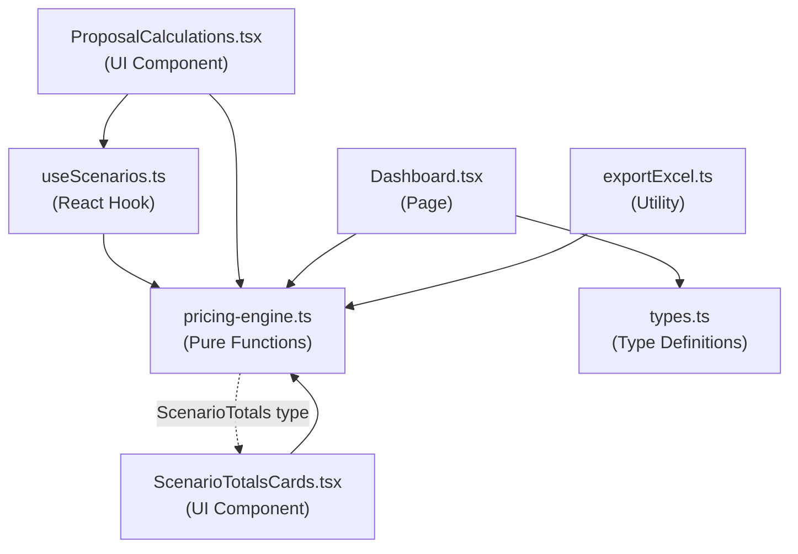

# Walkthrough — Pricing Engine Consolidation

## Objective
Eliminate financial calculation duplication across 4 files by creating a centralized `pricing-engine.ts` module with pure functions, then refactoring all consumers to use it.

## Files Modified Summary

| # | Archivo | Acción | Líneas eliminadas | Líneas añadidas | Cambio neto |
|---|---------|--------|:-:|:-:|:-:|
| 1 | `lib/pricing-engine.ts` | **[NEW]** | — | ~250 | +250 |
| 2 | `hooks/useScenarios.ts` | Refactored | ~95 | ~25 | **-70** |
| 3 | `pages/proposals/ProposalCalculations.tsx` | Refactored | ~55 | ~10 | **-45** |
| 4 | `pages/Dashboard.tsx` | Refactored | ~35 | ~5 | **-30** |
| 5 | `lib/exportExcel.ts` | Refactored | ~50 | ~12 | **-38** |
| 6 | `lib/types.ts` | Updated | 0 | 3 | +3 |
| 7 | `components/proposals/ScenarioTotalsCards.tsx` | Import fix | 1 | 1 | 0 |
| | **TOTALES** | | **~236** | **~306** | **+70** |

> Net increase is the pricing engine itself. Duplicated code removed: **~235 lines**.

---

## Diffs por Archivo

### 1. [NEW] pricing-engine.ts
```diff:pricing-engine.ts
===
// ──────────────────────────────────────────────────────────
// Pricing Engine — Single source of truth for financial calcs
// Pure functions, zero React/state dependencies
// ──────────────────────────────────────────────────────────

// ── Constants ────────────────────────────────────────────
export const IVA_RATE = 0.19;
export const MAX_MARGIN = 100;

// ── Types ────────────────────────────────────────────────
export interface PricingItem {
    unitCost: number;
    internalCosts?: { fletePct?: number | string };
    marginPct: number;
    isTaxable: boolean;
}

export interface PricingScenarioItem {
    quantity: number;
    marginPctOverride?: number | null;
    isDilpidate?: boolean;
    item: PricingItem;
    children?: PricingScenarioItem[];
}

export interface ScenarioTotals {
    beforeVat: number;
    nonTaxed: number;
    subtotal: number;
    vat: number;
    total: number;
    globalMarginPct: number;
}

// ── Pure calculation functions ───────────────────────────

/**
 * Landed cost of a parent item = unitCost × (1 + fletePct / 100)
 */
export function calculateParentLandedCost(unitCost: number, fletePct: number): number {
    return unitCost * (1 + fletePct / 100);
}

/**
 * Sum of (childLanded × childQuantity) across all children.
 * Returns the TOTAL children cost (not per-parent-unit).
 */
export function calculateChildrenCostPerUnit(children: PricingScenarioItem[]): number {
    let total = 0;
    for (const child of children) {
        const cCost = Number(child.item.unitCost);
        const cFlete = Number(child.item.internalCosts?.fletePct || 0);
        total += cCost * (1 + cFlete / 100) * child.quantity;
    }
    return total;
}

/**
 * Base landed cost per parent unit = parentLanded + (childrenTotal / parentQuantity)
 */
export function calculateBaseLandedCost(
    parentLandedCost: number,
    childrenCostPerUnit: number,
    quantity: number,
): number {
    return parentLandedCost + (childrenCostPerUnit / quantity);
}

/**
 * Total cost of all diluted items: Σ(unitCost × quantity) for isDilpidate=true.
 */
export function calculateTotalDilutedCost(items: PricingScenarioItem[]): number {
    let total = 0;
    for (const si of items) {
        if (si.isDilpidate) {
            total += Number(si.item.unitCost) * si.quantity;
        }
    }
    return total;
}

/**
 * Total normal subtotal: Σ(unitCost × quantity) for isDilpidate=false.
 * Used as the weight denominator for dilution distribution.
 */
export function calculateTotalNormalSubtotal(items: PricingScenarioItem[]): number {
    let total = 0;
    for (const si of items) {
        if (!si.isDilpidate) {
            total += Number(si.item.unitCost) * si.quantity;
        }
    }
    return total;
}

/**
 * Dilution share per unit for a normal item, based on weight-proportional distribution.
 * Weight = (itemCost × itemQuantity) / totalNormalSubtotal
 * dilutionPerUnit = (weight × totalDilutedCost) / itemQuantity
 */
export function calculateDilutionPerUnit(
    itemCost: number,
    itemQuantity: number,
    totalNormalSubtotal: number,
    totalDilutedCost: number,
): number {
    if (totalNormalSubtotal <= 0 || totalDilutedCost <= 0 || itemQuantity <= 0) return 0;
    const itemWeight = (itemCost * itemQuantity) / totalNormalSubtotal;
    return (itemWeight * totalDilutedCost) / itemQuantity;
}

/**
 * Effective landed cost = baseLandedCost + dilutionPerUnit
 */
export function calculateEffectiveLandedCost(
    baseLandedCost: number,
    dilutionPerUnit: number,
): number {
    return baseLandedCost + dilutionPerUnit;
}

/**
 * Resolve the effective margin for a scenario item.
 * Uses nullish coalescing: override takes priority unless null/undefined.
 */
export function resolveMargin(
    marginPctOverride: number | null | undefined,
    itemMarginPct: number,
): number {
    return marginPctOverride ?? Number(itemMarginPct);
}

/**
 * Unit sale price = effectiveLandedCost / (1 - margin/100).
 * Returns 0 if margin >= MAX_MARGIN (avoids division by zero or negative price).
 */
export function calculateUnitPrice(effectiveLandedCost: number, margin: number): number {
    if (margin >= MAX_MARGIN) return 0;
    return effectiveLandedCost / (1 - margin / 100);
}

/**
 * Line total = unitPrice × quantity.
 */
export function calculateLineTotal(unitPrice: number, quantity: number): number {
    return unitPrice * quantity;
}

/**
 * Inverse calculation: derive margin from a given sale price.
 * margin = ((unitPrice - effectiveLandedCost) / unitPrice) × 100
 */
export function calculateMarginFromPrice(
    unitPrice: number,
    effectiveLandedCost: number,
): number {
    if (unitPrice <= 0) return 0;
    return ((unitPrice - effectiveLandedCost) / unitPrice) * 100;
}

// ── Display values for a single item ─────────────────────

export interface ItemDisplayValues {
    parentLandedCost: number;
    childrenCostPerUnit: number;
    baseLandedCost: number;
    dilutionPerUnit: number;
    effectiveLandedCost: number;
    margin: number;
    unitPrice: number;
    lineTotal: number;
}

/**
 * Computes all display values for a single scenario item,
 * considering the full list of items for dilution distribution.
 */
export function calculateItemDisplayValues(
    si: PricingScenarioItem,
    allItems: PricingScenarioItem[],
): ItemDisplayValues {
    const cost = Number(si.item.unitCost);
    const flete = Number(si.item.internalCosts?.fletePct || 0);
    const parentLanded = calculateParentLandedCost(cost, flete);

    const children = si.children || [];
    const childrenCost = calculateChildrenCostPerUnit(children);
    const baseLanded = calculateBaseLandedCost(parentLanded, childrenCost, si.quantity);

    // Dilution (only for non-diluted items)
    let dilution = 0;
    if (!si.isDilpidate) {
        const totalDilutedCost = calculateTotalDilutedCost(allItems);
        const totalNormalSub = calculateTotalNormalSubtotal(allItems);
        dilution = calculateDilutionPerUnit(cost, si.quantity, totalNormalSub, totalDilutedCost);
    }

    const effectiveLanded = calculateEffectiveLandedCost(baseLanded, dilution);
    const margin = resolveMargin(si.marginPctOverride, si.item.marginPct);

    let unitPrice = 0;
    if (!si.isDilpidate) {
        unitPrice = calculateUnitPrice(effectiveLanded, margin);
    }

    const lineTotal = calculateLineTotal(unitPrice, si.quantity);

    return {
        parentLandedCost: parentLanded,
        childrenCostPerUnit: childrenCost,
        baseLandedCost: baseLanded,
        dilutionPerUnit: dilution,
        effectiveLandedCost: effectiveLanded,
        margin,
        unitPrice,
        lineTotal,
    };
}

// ── Scenario-level totals ────────────────────────────────

/**
 * Calculate full financial totals for a scenario.
 * Includes dilution, taxable/non-taxable split, IVA, and global margin.
 */
export function calculateScenarioTotals(scenarioItems: PricingScenarioItem[]): ScenarioTotals {
    let beforeVat = 0;
    let nonTaxed = 0;
    let totalCost = 0;

    // Pre-compute dilution aggregates
    const totalDilutedCost = calculateTotalDilutedCost(scenarioItems);
    const totalNormalSubtotal = calculateTotalNormalSubtotal(scenarioItems);

    const normalItems = scenarioItems.filter(si => !si.isDilpidate);

    for (const si of normalItems) {
        const cost = Number(si.item.unitCost);
        const flete = Number(si.item.internalCosts?.fletePct || 0);
        const parentLanded = calculateParentLandedCost(cost, flete);

        const children = si.children || [];
        const childrenCost = calculateChildrenCostPerUnit(children);
        const baseLanded = calculateBaseLandedCost(parentLanded, childrenCost, si.quantity);

        const dilution = calculateDilutionPerUnit(
            cost, si.quantity, totalNormalSubtotal, totalDilutedCost,
        );
        const effectiveLanded = calculateEffectiveLandedCost(baseLanded, dilution);

        const margin = resolveMargin(si.marginPctOverride, si.item.marginPct);
        const unitPrice = calculateUnitPrice(effectiveLanded, margin);
        const lineTotal = calculateLineTotal(unitPrice, si.quantity);

        totalCost += effectiveLanded * si.quantity;

        if (si.item.isTaxable) {
            beforeVat += lineTotal;
        } else {
            nonTaxed += lineTotal;
        }
    }

    const totalPrice = beforeVat + nonTaxed;
    const globalMarginPct = totalPrice > 0 ? ((totalPrice - totalCost) / totalPrice) * 100 : 0;
    const subtotal = beforeVat + nonTaxed;
    const vat = beforeVat * IVA_RATE;
    const total = beforeVat + vat + nonTaxed;

    return { beforeVat, nonTaxed, subtotal, vat, total, globalMarginPct };
}
```

### 2. useScenarios.ts
```diff:useScenarios.ts
import { useState, useEffect, useCallback } from 'react';
import { api } from '../lib/api';

// ── Tipos ────────────────────────────────────────────────────
export interface ProposalCalcItem {
    id: string;
    name: string;
    itemType: string;
    unitCost: number;
    marginPct: number;
    unitPrice: number;
    quantity: number;
    isTaxable: boolean;
    description?: string;
    internalCosts?: {
        fletePct?: number;
        proveedor?: string;
    };
    technicalSpecs?: Record<string, string | undefined>;
}

export interface ScenarioItem {
    id?: string;
    itemId: string;
    parentId?: string | null;
    quantity: number;
    marginPctOverride?: number;
    isDilpidate?: boolean;
    item: ProposalCalcItem;
    children?: ScenarioItem[];
}

export interface Scenario {
    id: string;
    name: string;
    currency: string;
    description?: string;
    scenarioItems: ScenarioItem[];
}

export interface ScenarioTotals {
    beforeVat: number;
    nonTaxed: number;
    subtotal: number;
    vat: number;
    total: number;
    globalMarginPct: number;
}

// ── Hook ─────────────────────────────────────────────────────
export function useScenarios(proposalId: string | undefined) {
    const [loading, setLoading] = useState(true);
    const [saving, setSaving] = useState(false);
    // eslint-disable-next-line @typescript-eslint/no-explicit-any
    const [proposal, setProposal] = useState<any>(null);
    const [proposalItems, setProposalItems] = useState<ProposalCalcItem[]>([]);
    const [scenarios, setScenarios] = useState<Scenario[]>([]);
    const [activeScenarioId, setActiveScenarioId] = useState<string | null>(null);
    const [trm, setTrm] = useState<{ valor: number; fechaActualizacion: string } | null>(null);
    const [extraTrm, setExtraTrm] = useState<{ setIcapAverage: number | null; wilkinsonSpot: number | null } | null>(null);

    const loadData = useCallback(async () => {
        if (!proposalId) return;
        try {
            setLoading(true);
            const [propRes, scenariosRes] = await Promise.all([
                api.get(`/proposals/${proposalId}`),
                api.get(`/proposals/${proposalId}/scenarios`),
            ]);

            setProposal(propRes.data);
            setProposalItems(propRes.data.proposalItems || []);
            setScenarios(scenariosRes.data || []);

            if (scenariosRes.data?.length > 0 && !activeScenarioId) {
                setActiveScenarioId(scenariosRes.data[0].id);
            }
        } catch (error) {
            console.error('Error loading calculations data', error);
        } finally {
            setLoading(false);
        }

        // TRM oficial
        try {
            const trmRes = await fetch('https://co.dolarapi.com/v1/trm');
            const trmData = await trmRes.json();
            setTrm({ valor: trmData.valor, fechaActualizacion: trmData.fechaActualizacion });
        } catch (error) {
            console.error('Error fetching TRM', error);
        }

        // TRM extras (SET-ICAP & Wilkinson)
        try {
            const extraRes = await api.get('/proposals/trm-extra');
            setExtraTrm(extraRes.data);
        } catch (error) {
            console.error('Error fetching extra TRM', error);
        }
    }, [proposalId, activeScenarioId]);

    useEffect(() => {
        loadData();
    }, [proposalId]); // eslint-disable-line react-hooks/exhaustive-deps

    // ── Escenarios CRUD ──────────────────────────────────────
    const createScenario = async (name: string) => {
        if (!name.trim()) return;
        setSaving(true);
        try {
            const res = await api.post(`/proposals/${proposalId}/scenarios`, {
                name,
                description: '',
            });
            setScenarios(prev => [...prev, { ...res.data, scenarioItems: [] }]);
            setActiveScenarioId(res.data.id);
            return true;
        } catch (error) {
            console.error(error);
            alert('No se pudo crear el escenario');
            return false;
        } finally {
            setSaving(false);
        }
    };

    const deleteScenario = async (sid: string) => {
        if (!confirm('¿Eliminar este escenario?')) return;
        try {
            await api.delete(`/proposals/scenarios/${sid}`);
            setScenarios(prev => prev.filter(s => s.id !== sid));
            if (activeScenarioId === sid) setActiveScenarioId(null);
        } catch (error) {
            console.error(error);
        }
    };

    // ── Items en escenario ───────────────────────────────────
    const addItemToScenario = async (itemId: string) => {
        if (!activeScenarioId) return;
        const item = proposalItems.find(i => i.id === itemId);
        if (!item) return;

        try {
            const res = await api.post(`/proposals/scenarios/${activeScenarioId}/items`, {
                itemId,
                quantity: Number(item.quantity) || 1,
                marginPct: Number(item.marginPct) || 0,
            });
            setScenarios(prev =>
                prev.map(s =>
                    s.id === activeScenarioId
                        ? { ...s, scenarioItems: [...s.scenarioItems, { ...res.data, item }] }
                        : s,
                ),
            );
        } catch (error) {
            console.error(error);
        }
    };

    const removeItemFromScenario = async (siId: string) => {
        try {
            await api.delete(`/proposals/scenarios/items/${siId}`);
            setScenarios(prev =>
                prev.map(s =>
                    s.id === activeScenarioId
                        ? { ...s, scenarioItems: s.scenarioItems.filter(si => si.id !== siId) }
                        : s,
                ),
            );
        } catch (error) {
            console.error(error);
        }
    };

    const addChildItem = async (parentScenarioItemId: string, proposalItemId: string) => {
        if (!activeScenarioId) return;
        const item = proposalItems.find(i => i.id === proposalItemId);
        if (!item) return;

        try {
            const res = await api.post(`/proposals/scenarios/${activeScenarioId}/items`, {
                itemId: proposalItemId,
                parentId: parentScenarioItemId,
                quantity: Number(item.quantity) || 1,
                marginPct: Number(item.marginPct) || 0,
            });
            const newChild: ScenarioItem = { ...res.data, item };
            setScenarios(prev =>
                prev.map(s =>
                    s.id === activeScenarioId
                        ? {
                              ...s,
                              scenarioItems: s.scenarioItems.map(si =>
                                  si.id === parentScenarioItemId
                                      ? { ...si, children: [...(si.children || []), newChild] }
                                      : si,
                              ),
                          }
                        : s,
                ),
            );
        } catch (error) {
            console.error(error);
        }
    };

    const removeChildItem = async (parentScenarioItemId: string, childId: string) => {
        try {
            await api.delete(`/proposals/scenarios/items/${childId}`);
            setScenarios(prev =>
                prev.map(s =>
                    s.id === activeScenarioId
                        ? {
                              ...s,
                              scenarioItems: s.scenarioItems.map(si =>
                                  si.id === parentScenarioItemId
                                      ? { ...si, children: (si.children || []).filter(c => c.id !== childId) }
                                      : si,
                              ),
                          }
                        : s,
                ),
            );
        } catch (error) {
            console.error(error);
        }
    };

    const updateChildQuantity = async (parentSiId: string, childId: string, qty: string) => {
        const val = parseInt(qty, 10);
        if (isNaN(val) || val < 0) return;
        try {
            await api.patch(`/proposals/scenarios/items/${childId}`, { quantity: val });
            setScenarios(prev =>
                prev.map(s =>
                    s.id === activeScenarioId
                        ? {
                              ...s,
                              scenarioItems: s.scenarioItems.map(si =>
                                  si.id === parentSiId
                                      ? {
                                            ...si,
                                            children: (si.children || []).map(c =>
                                                c.id === childId ? { ...c, quantity: val } : c,
                                            ),
                                        }
                                      : si,
                              ),
                          }
                        : s,
                ),
            );
        } catch (error) {
            console.error(error);
        }
    };

    const changeCurrency = async (currency: string) => {
        if (!activeScenarioId) return;
        try {
            await api.patch(`/proposals/scenarios/${activeScenarioId}`, { currency });
            setScenarios(prev => prev.map(s => (s.id === activeScenarioId ? { ...s, currency } : s)));
        } catch (error) {
            console.error(error);
        }
    };

    const renameScenario = async (scenarioId: string, name: string) => {
        const trimmed = name.trim();
        if (!trimmed) return;
        try {
            await api.patch(`/proposals/scenarios/${scenarioId}`, { name: trimmed });
            setScenarios(prev => prev.map(s => (s.id === scenarioId ? { ...s, name: trimmed } : s)));
        } catch (error) {
            console.error(error);
        }
    };

    const cloneScenario = async (scenarioId: string) => {
        try {
            setSaving(true);
            const res = await api.post(`/proposals/scenarios/${scenarioId}/clone`);
            setScenarios(prev => [...prev, res.data]);
            setActiveScenarioId(res.data.id);
        } catch (error) {
            console.error(error);
            alert('No se pudo clonar el escenario');
        } finally {
            setSaving(false);
        }
    };

    const updateMargin = async (siId: string, margin: string) => {
        const val = parseFloat(margin.replace(',', '.'));
        if (isNaN(val)) return;
        try {
            await api.patch(`/proposals/scenarios/items/${siId}`, { marginPct: val });
            setScenarios(prev =>
                prev.map(s => ({
                    ...s,
                    scenarioItems: s.scenarioItems.map(si => (si.id === siId ? { ...si, marginPctOverride: val } : si)),
                })),
            );
        } catch (error) {
            console.error(error);
        }
    };

    const updateQuantity = async (siId: string, qty: string) => {
        const val = parseInt(qty, 10);
        if (isNaN(val)) return;
        try {
            await api.patch(`/proposals/scenarios/items/${siId}`, { quantity: val });
            setScenarios(prev =>
                prev.map(s => ({
                    ...s,
                    scenarioItems: s.scenarioItems.map(si => (si.id === siId ? { ...si, quantity: val } : si)),
                })),
            );
        } catch (error) {
            console.error(error);
        }
    };

    const toggleDilpidate = async (siId: string) => {
        const scenario = scenarios.find(s => s.scenarioItems.some(si => si.id === siId));
        if (!scenario) return;
        const si = scenario.scenarioItems.find(i => i.id === siId);
        if (!si) return;
        const newVal = !si.isDilpidate;
        try {
            // When enabling dilute, force margin to 0
            const patchData: Record<string, unknown> = { isDilpidate: newVal };
            if (newVal) patchData.marginPct = 0;
            await api.patch(`/proposals/scenarios/items/${siId}`, patchData);
            setScenarios(prev =>
                prev.map(s => ({
                    ...s,
                    scenarioItems: s.scenarioItems.map(item =>
                        item.id === siId
                            ? { ...item, isDilpidate: newVal, ...(newVal ? { marginPctOverride: 0 } : {}) }
                            : item,
                    ),
                })),
            );
        } catch (error) {
            console.error(error);
        }
    };

    const updateUnitPrice = async (siId: string, price: string) => {
        const val = parseFloat(price.replace(',', '.'));
        if (isNaN(val) || val <= 0) return;

        const scenario = scenarios.find(s => s.scenarioItems.some(si => si.id === siId));
        if (!scenario) return;
        const si = scenario.scenarioItems.find(i => i.id === siId);
        if (!si) return;

        const cost = Number(si.item.unitCost);
        const flete = Number(si.item.internalCosts?.fletePct || 0);
        const parentLandedCost = cost * (1 + flete / 100);

        // Include children costs in landed cost for margin calculation
        let childrenCostPerUnit = 0;
        if (si.children && si.children.length > 0) {
            si.children.forEach(child => {
                const cCost = Number(child.item.unitCost);
                const cFlete = Number(child.item.internalCosts?.fletePct || 0);
                childrenCostPerUnit += cCost * (1 + cFlete / 100) * child.quantity;
            });
        }
        const effectiveLandedCost = parentLandedCost + (childrenCostPerUnit / si.quantity);
        const newMargin = ((val - effectiveLandedCost) / val) * 100;

        try {
            await api.patch(`/proposals/scenarios/items/${siId}`, { marginPct: newMargin });
            setScenarios(prev =>
                prev.map(s => ({
                    ...s,
                    scenarioItems: s.scenarioItems.map(i => (i.id === siId ? { ...i, marginPctOverride: newMargin } : i)),
                })),
            );
        } catch (error) {
            console.error(error);
        }
    };

    const updateGlobalMargin = async (margin: string) => {
        const val = parseFloat(margin.replace(',', '.'));
        if (isNaN(val) || !activeScenarioId) return;
        try {
            await api.patch(`/proposals/scenarios/${activeScenarioId}/apply-margin`, { marginPct: val });
            setScenarios(prev =>
                prev.map(s =>
                    s.id === activeScenarioId
                        ? { ...s, scenarioItems: s.scenarioItems.map(si => ({ ...si, marginPctOverride: val })) }
                        : s,
                ),
            );
        } catch (error) {
            console.error(error);
            alert('No se pudo aplicar el margen global.');
        }
    };

    // ── Cálculos ─────────────────────────────────────────────
    const calculateTotals = (scenario: Scenario): ScenarioTotals => {
        let beforeVat = 0;
        let nonTaxed = 0;
        let totalCost = 0;

        // 1. Calculate total diluted cost: unitCost × quantity
        let totalDilutedCost = 0;
        const normalItems = scenario.scenarioItems.filter(si => !si.isDilpidate);
        const dilutedItems = scenario.scenarioItems.filter(si => si.isDilpidate);

        dilutedItems.forEach(si => {
            totalDilutedCost += Number(si.item.unitCost) * si.quantity;
        });

        // 2. Calculate total non-diluted subtotal: Σ(unitCost × quantity) for weights
        let totalNormalSubtotal = 0;
        normalItems.forEach(si => {
            totalNormalSubtotal += Number(si.item.unitCost) * si.quantity;
        });

        // 3. Process normal items: calculate weight, add proportional dilution, then apply margin
        normalItems.forEach(si => {
            const item = si.item;
            const cost = Number(item.unitCost);
            const flete = Number(item.internalCosts?.fletePct || 0);
            const parentLandedCost = cost * (1 + flete / 100);

            let childrenCostPerUnit = 0;
            if (si.children && si.children.length > 0) {
                si.children.forEach(child => {
                    const childCost = Number(child.item.unitCost);
                    const childFlete = Number(child.item.internalCosts?.fletePct || 0);
                    childrenCostPerUnit += childCost * (1 + childFlete / 100) * child.quantity;
                });
            }

            const baseLandedCost = parentLandedCost + (childrenCostPerUnit / si.quantity);

            // Weight based on unitCost × quantity
            const itemWeight = totalNormalSubtotal > 0
                ? (cost * si.quantity) / totalNormalSubtotal
                : 0;
            // Dilution share per unit = (weight × totalDilutedCost) / quantity
            const dilutionPerUnit = si.quantity > 0
                ? (itemWeight * totalDilutedCost) / si.quantity
                : 0;
            // New effective cost = base landed cost + dilution per unit
            const effectiveLandedCost = baseLandedCost + dilutionPerUnit;

            const marginOverride = si.marginPctOverride;
            const margin = marginOverride !== undefined && marginOverride !== null ? marginOverride : Number(item.marginPct);

            let unitPrice = 0;
            if (margin < 100) {
                unitPrice = effectiveLandedCost / (1 - margin / 100);
            }

            const totalItem = unitPrice * si.quantity;
            totalCost += effectiveLandedCost * si.quantity;

            if (item.isTaxable) {
                beforeVat += totalItem;
            } else {
                nonTaxed += totalItem;
            }
        });

        // Diluted cost is already absorbed into normal items' effectiveLandedCost
        // so no need to add it again here

        const totalPrice = beforeVat + nonTaxed;
        const globalMarginPct = totalPrice > 0 ? ((totalPrice - totalCost) / totalPrice) * 100 : 0;
        const subtotal = beforeVat + nonTaxed;
        const vat = beforeVat * 0.19;
        const total = beforeVat + vat + nonTaxed;

        return { beforeVat, nonTaxed, subtotal, vat, total, globalMarginPct };
    };

    const activeScenario = scenarios.find(s => s.id === activeScenarioId) ?? null;
    const totals: ScenarioTotals = activeScenario
        ? calculateTotals(activeScenario)
        : { beforeVat: 0, nonTaxed: 0, subtotal: 0, vat: 0, total: 0, globalMarginPct: 0 };

    return {
        loading,
        saving,
        proposal,
        proposalItems,
        scenarios,
        activeScenarioId,
        setActiveScenarioId,
        activeScenario,
        totals,
        trm,
        extraTrm,
        loadData,
        createScenario,
        deleteScenario,
        addItemToScenario,
        removeItemFromScenario,
        addChildItem,
        removeChildItem,
        updateChildQuantity,
        changeCurrency,
        updateMargin,
        updateQuantity,
        updateUnitPrice,
        updateGlobalMargin,
        toggleDilpidate,
        renameScenario,
        cloneScenario,
    };
}
===
import { useState, useEffect, useCallback } from 'react';
import { api } from '../lib/api';
import {
    calculateScenarioTotals,
    calculateParentLandedCost,
    calculateChildrenCostPerUnit,
    calculateBaseLandedCost,
    calculateDilutionPerUnit,
    calculateEffectiveLandedCost,
    calculateTotalDilutedCost,
    calculateTotalNormalSubtotal,
    calculateMarginFromPrice,
    type ScenarioTotals,
} from '../lib/pricing-engine';

// ── Tipos ────────────────────────────────────────────────────
// ProposalCalcItem is kept here for backward-compat with consumers
// that import it from this file (ItemPickerModal, ProposalCalculations, etc.)
export interface ProposalCalcItem {
    id: string;
    name: string;
    itemType: string;
    unitCost: number;
    marginPct: number;
    unitPrice: number;
    quantity: number;
    isTaxable: boolean;
    description?: string;
    internalCosts?: {
        fletePct?: number;
        proveedor?: string;
    };
    technicalSpecs?: Record<string, string | undefined>;
}

export interface ScenarioItem {
    id?: string;
    itemId: string;
    parentId?: string | null;
    quantity: number;
    marginPctOverride?: number;
    isDilpidate?: boolean;
    item: ProposalCalcItem;
    children?: ScenarioItem[];
}

export interface Scenario {
    id: string;
    name: string;
    currency: string;
    description?: string;
    scenarioItems: ScenarioItem[];
}

// Re-export ScenarioTotals from pricing-engine for consumers
export type { ScenarioTotals };

// ── Hook ─────────────────────────────────────────────────────
export function useScenarios(proposalId: string | undefined) {
    const [loading, setLoading] = useState(true);
    const [saving, setSaving] = useState(false);
    // eslint-disable-next-line @typescript-eslint/no-explicit-any
    const [proposal, setProposal] = useState<any>(null);
    const [proposalItems, setProposalItems] = useState<ProposalCalcItem[]>([]);
    const [scenarios, setScenarios] = useState<Scenario[]>([]);
    const [activeScenarioId, setActiveScenarioId] = useState<string | null>(null);
    const [trm, setTrm] = useState<{ valor: number; fechaActualizacion: string } | null>(null);
    const [extraTrm, setExtraTrm] = useState<{ setIcapAverage: number | null; wilkinsonSpot: number | null } | null>(null);

    const loadData = useCallback(async () => {
        if (!proposalId) return;
        try {
            setLoading(true);
            const [propRes, scenariosRes] = await Promise.all([
                api.get(`/proposals/${proposalId}`),
                api.get(`/proposals/${proposalId}/scenarios`),
            ]);

            setProposal(propRes.data);
            setProposalItems(propRes.data.proposalItems || []);
            setScenarios(scenariosRes.data || []);

            if (scenariosRes.data?.length > 0 && !activeScenarioId) {
                setActiveScenarioId(scenariosRes.data[0].id);
            }
        } catch (error) {
            console.error('Error loading calculations data', error);
        } finally {
            setLoading(false);
        }

        // TRM oficial
        try {
            const trmRes = await fetch('https://co.dolarapi.com/v1/trm');
            const trmData = await trmRes.json();
            setTrm({ valor: trmData.valor, fechaActualizacion: trmData.fechaActualizacion });
        } catch (error) {
            console.error('Error fetching TRM', error);
        }

        // TRM extras (SET-ICAP & Wilkinson)
        try {
            const extraRes = await api.get('/proposals/trm-extra');
            setExtraTrm(extraRes.data);
        } catch (error) {
            console.error('Error fetching extra TRM', error);
        }
    }, [proposalId, activeScenarioId]);

    useEffect(() => {
        loadData();
    }, [proposalId]); // eslint-disable-line react-hooks/exhaustive-deps

    // ── Escenarios CRUD ──────────────────────────────────────
    const createScenario = async (name: string) => {
        if (!name.trim()) return;
        setSaving(true);
        try {
            const res = await api.post(`/proposals/${proposalId}/scenarios`, {
                name,
                description: '',
            });
            setScenarios(prev => [...prev, { ...res.data, scenarioItems: [] }]);
            setActiveScenarioId(res.data.id);
            return true;
        } catch (error) {
            console.error(error);
            alert('No se pudo crear el escenario');
            return false;
        } finally {
            setSaving(false);
        }
    };

    const deleteScenario = async (sid: string) => {
        if (!confirm('¿Eliminar este escenario?')) return;
        try {
            await api.delete(`/proposals/scenarios/${sid}`);
            setScenarios(prev => prev.filter(s => s.id !== sid));
            if (activeScenarioId === sid) setActiveScenarioId(null);
        } catch (error) {
            console.error(error);
        }
    };

    // ── Items en escenario ───────────────────────────────────
    const addItemToScenario = async (itemId: string) => {
        if (!activeScenarioId) return;
        const item = proposalItems.find(i => i.id === itemId);
        if (!item) return;

        try {
            const res = await api.post(`/proposals/scenarios/${activeScenarioId}/items`, {
                itemId,
                quantity: Number(item.quantity) || 1,
                marginPct: Number(item.marginPct) || 0,
            });
            setScenarios(prev =>
                prev.map(s =>
                    s.id === activeScenarioId
                        ? { ...s, scenarioItems: [...s.scenarioItems, { ...res.data, item }] }
                        : s,
                ),
            );
        } catch (error) {
            console.error(error);
        }
    };

    const removeItemFromScenario = async (siId: string) => {
        try {
            await api.delete(`/proposals/scenarios/items/${siId}`);
            setScenarios(prev =>
                prev.map(s =>
                    s.id === activeScenarioId
                        ? { ...s, scenarioItems: s.scenarioItems.filter(si => si.id !== siId) }
                        : s,
                ),
            );
        } catch (error) {
            console.error(error);
        }
    };

    const addChildItem = async (parentScenarioItemId: string, proposalItemId: string) => {
        if (!activeScenarioId) return;
        const item = proposalItems.find(i => i.id === proposalItemId);
        if (!item) return;

        try {
            const res = await api.post(`/proposals/scenarios/${activeScenarioId}/items`, {
                itemId: proposalItemId,
                parentId: parentScenarioItemId,
                quantity: Number(item.quantity) || 1,
                marginPct: Number(item.marginPct) || 0,
            });
            const newChild: ScenarioItem = { ...res.data, item };
            setScenarios(prev =>
                prev.map(s =>
                    s.id === activeScenarioId
                        ? {
                              ...s,
                              scenarioItems: s.scenarioItems.map(si =>
                                  si.id === parentScenarioItemId
                                      ? { ...si, children: [...(si.children || []), newChild] }
                                      : si,
                              ),
                          }
                        : s,
                ),
            );
        } catch (error) {
            console.error(error);
        }
    };

    const removeChildItem = async (parentScenarioItemId: string, childId: string) => {
        try {
            await api.delete(`/proposals/scenarios/items/${childId}`);
            setScenarios(prev =>
                prev.map(s =>
                    s.id === activeScenarioId
                        ? {
                              ...s,
                              scenarioItems: s.scenarioItems.map(si =>
                                  si.id === parentScenarioItemId
                                      ? { ...si, children: (si.children || []).filter(c => c.id !== childId) }
                                      : si,
                              ),
                          }
                        : s,
                ),
            );
        } catch (error) {
            console.error(error);
        }
    };

    const updateChildQuantity = async (parentSiId: string, childId: string, qty: string) => {
        const val = parseInt(qty, 10);
        if (isNaN(val) || val < 0) return;
        try {
            await api.patch(`/proposals/scenarios/items/${childId}`, { quantity: val });
            setScenarios(prev =>
                prev.map(s =>
                    s.id === activeScenarioId
                        ? {
                              ...s,
                              scenarioItems: s.scenarioItems.map(si =>
                                  si.id === parentSiId
                                      ? {
                                            ...si,
                                            children: (si.children || []).map(c =>
                                                c.id === childId ? { ...c, quantity: val } : c,
                                            ),
                                        }
                                      : si,
                              ),
                          }
                        : s,
                ),
            );
        } catch (error) {
            console.error(error);
        }
    };

    const changeCurrency = async (currency: string) => {
        if (!activeScenarioId) return;
        try {
            await api.patch(`/proposals/scenarios/${activeScenarioId}`, { currency });
            setScenarios(prev => prev.map(s => (s.id === activeScenarioId ? { ...s, currency } : s)));
        } catch (error) {
            console.error(error);
        }
    };

    const renameScenario = async (scenarioId: string, name: string) => {
        const trimmed = name.trim();
        if (!trimmed) return;
        try {
            await api.patch(`/proposals/scenarios/${scenarioId}`, { name: trimmed });
            setScenarios(prev => prev.map(s => (s.id === scenarioId ? { ...s, name: trimmed } : s)));
        } catch (error) {
            console.error(error);
        }
    };

    const cloneScenario = async (scenarioId: string) => {
        try {
            setSaving(true);
            const res = await api.post(`/proposals/scenarios/${scenarioId}/clone`);
            setScenarios(prev => [...prev, res.data]);
            setActiveScenarioId(res.data.id);
        } catch (error) {
            console.error(error);
            alert('No se pudo clonar el escenario');
        } finally {
            setSaving(false);
        }
    };

    const updateMargin = async (siId: string, margin: string) => {
        const val = parseFloat(margin.replace(',', '.'));
        if (isNaN(val)) return;
        try {
            await api.patch(`/proposals/scenarios/items/${siId}`, { marginPct: val });
            setScenarios(prev =>
                prev.map(s => ({
                    ...s,
                    scenarioItems: s.scenarioItems.map(si => (si.id === siId ? { ...si, marginPctOverride: val } : si)),
                })),
            );
        } catch (error) {
            console.error(error);
        }
    };

    const updateQuantity = async (siId: string, qty: string) => {
        const val = parseInt(qty, 10);
        if (isNaN(val)) return;
        try {
            await api.patch(`/proposals/scenarios/items/${siId}`, { quantity: val });
            setScenarios(prev =>
                prev.map(s => ({
                    ...s,
                    scenarioItems: s.scenarioItems.map(si => (si.id === siId ? { ...si, quantity: val } : si)),
                })),
            );
        } catch (error) {
            console.error(error);
        }
    };

    const toggleDilpidate = async (siId: string) => {
        const scenario = scenarios.find(s => s.scenarioItems.some(si => si.id === siId));
        if (!scenario) return;
        const si = scenario.scenarioItems.find(i => i.id === siId);
        if (!si) return;
        const newVal = !si.isDilpidate;
        try {
            // When enabling dilute, force margin to 0
            const patchData: Record<string, unknown> = { isDilpidate: newVal };
            if (newVal) patchData.marginPct = 0;
            await api.patch(`/proposals/scenarios/items/${siId}`, patchData);
            setScenarios(prev =>
                prev.map(s => ({
                    ...s,
                    scenarioItems: s.scenarioItems.map(item =>
                        item.id === siId
                            ? { ...item, isDilpidate: newVal, ...(newVal ? { marginPctOverride: 0 } : {}) }
                            : item,
                    ),
                })),
            );
        } catch (error) {
            console.error(error);
        }
    };

    const updateUnitPrice = async (siId: string, price: string) => {
        const val = parseFloat(price.replace(',', '.'));
        if (isNaN(val) || val <= 0) return;

        const scenario = scenarios.find(s => s.scenarioItems.some(si => si.id === siId));
        if (!scenario) return;
        const si = scenario.scenarioItems.find(i => i.id === siId);
        if (!si) return;

        const cost = Number(si.item.unitCost);
        const flete = Number(si.item.internalCosts?.fletePct || 0);
        const parentLanded = calculateParentLandedCost(cost, flete);
        const childrenCost = calculateChildrenCostPerUnit(si.children || []);
        const baseLanded = calculateBaseLandedCost(parentLanded, childrenCost, si.quantity);

        // Include dilution in effective cost for accurate margin reverse-calc
        const totalDilutedCost = calculateTotalDilutedCost(scenario.scenarioItems);
        const totalNormalSub = calculateTotalNormalSubtotal(scenario.scenarioItems);
        const dilution = calculateDilutionPerUnit(cost, si.quantity, totalNormalSub, totalDilutedCost);
        const effectiveLanded = calculateEffectiveLandedCost(baseLanded, dilution);
        const newMargin = calculateMarginFromPrice(val, effectiveLanded);

        try {
            await api.patch(`/proposals/scenarios/items/${siId}`, { marginPct: newMargin });
            setScenarios(prev =>
                prev.map(s => ({
                    ...s,
                    scenarioItems: s.scenarioItems.map(i => (i.id === siId ? { ...i, marginPctOverride: newMargin } : i)),
                })),
            );
        } catch (error) {
            console.error(error);
        }
    };

    const updateGlobalMargin = async (margin: string) => {
        const val = parseFloat(margin.replace(',', '.'));
        if (isNaN(val) || !activeScenarioId) return;
        try {
            await api.patch(`/proposals/scenarios/${activeScenarioId}/apply-margin`, { marginPct: val });
            setScenarios(prev =>
                prev.map(s =>
                    s.id === activeScenarioId
                        ? { ...s, scenarioItems: s.scenarioItems.map(si => ({ ...si, marginPctOverride: val })) }
                        : s,
                ),
            );
        } catch (error) {
            console.error(error);
            alert('No se pudo aplicar el margen global.');
        }
    };

    // ── Cálculos (delegated to pricing-engine) ────────────────
    const calculateTotals = (scenario: Scenario): ScenarioTotals => {
        return calculateScenarioTotals(scenario.scenarioItems);
    };

    const activeScenario = scenarios.find(s => s.id === activeScenarioId) ?? null;
    const totals: ScenarioTotals = activeScenario
        ? calculateTotals(activeScenario)
        : { beforeVat: 0, nonTaxed: 0, subtotal: 0, vat: 0, total: 0, globalMarginPct: 0 };

    return {
        loading,
        saving,
        proposal,
        proposalItems,
        scenarios,
        activeScenarioId,
        setActiveScenarioId,
        activeScenario,
        totals,
        trm,
        extraTrm,
        loadData,
        createScenario,
        deleteScenario,
        addItemToScenario,
        removeItemFromScenario,
        addChildItem,
        removeChildItem,
        updateChildQuantity,
        changeCurrency,
        updateMargin,
        updateQuantity,
        updateUnitPrice,
        updateGlobalMargin,
        toggleDilpidate,
        renameScenario,
        cloneScenario,
    };
}
```

### 3. ProposalCalculations.tsx
```diff:ProposalCalculations.tsx
import { useState, useRef } from 'react';
import { useParams, useNavigate } from 'react-router-dom';
import { motion, AnimatePresence } from 'framer-motion';
import {
    Calculator, Plus, Trash2,
    ArrowLeft, Loader2, Package,
    AlertCircle, TrendingUp,
    Percent, RotateCcw, ChevronDown, Layers, Pencil, Copy, BookOpen, ShoppingCart, FileSpreadsheet
} from 'lucide-react';
import { cn } from '../../lib/utils';
import { useScenarios, type ProposalCalcItem } from '../../hooks/useScenarios';
import ItemPickerModal from '../../components/proposals/ItemPickerModal';
import ScenarioTotalsCards from '../../components/proposals/ScenarioTotalsCards';
import { exportToExcel } from '../../lib/exportExcel';
import { useAuthStore } from '../../store/authStore';

export default function ProposalCalculations() {
    const { id } = useParams<{ id: string }>();
    const navigate = useNavigate();

    const {
        loading, saving, proposal, proposalItems, scenarios,
        activeScenarioId, setActiveScenarioId, activeScenario, totals,
        trm, extraTrm, loadData,
        createScenario, deleteScenario,
        addItemToScenario, removeItemFromScenario,
        addChildItem, removeChildItem, updateChildQuantity,
        changeCurrency, updateMargin, updateQuantity,
        updateUnitPrice, updateGlobalMargin, toggleDilpidate,
        renameScenario,
        cloneScenario,
    } = useScenarios(id);

    // UI-only state
    const [isCreatingScenario, setIsCreatingScenario] = useState(false);
    const [newScenarioName, setNewScenarioName] = useState('');
    const [isPickingItems, setIsPickingItems] = useState(false);
    const [editingCell, setEditingCell] = useState<{ id: string; field: string; value: string } | null>(null);
    const [globalMarginBuffer, setGlobalMarginBuffer] = useState<string | null>(null);
    const [expandedItems, setExpandedItems] = useState<Set<string>>(new Set());
    const [pickingChildrenFor, setPickingChildrenFor] = useState<string | null>(null);
    const [editingScenarioName, setEditingScenarioName] = useState<string | null>(null);
    const scenarioNameInputRef = useRef<HTMLInputElement>(null);

    // ── Acquisition mode per scenario (VENTA / DAAS) ──
    type AcquisitionMode = 'VENTA' | 'DAAS_12' | 'DAAS_24' | 'DAAS_36' | 'DAAS_48' | 'DAAS_60';
    const ACQUISITION_OPTIONS: { value: AcquisitionMode; label: string }[] = [
        { value: 'VENTA', label: 'Venta' },
        { value: 'DAAS_12', label: 'DaaS 12 Meses' },
        { value: 'DAAS_24', label: 'DaaS 24 Meses' },
        { value: 'DAAS_36', label: 'DaaS 36 Meses' },
        { value: 'DAAS_48', label: 'DaaS 48 Meses' },
        { value: 'DAAS_60', label: 'DaaS 60 Meses' },
    ];
    // Per-scenario acquisition mode
    const [acquisitionModes, setAcquisitionModes] = useState<Record<string, AcquisitionMode>>({});
    // Saved margins snapshot: { scenarioId → { global: number, items: { siId: margin } } }
    const savedMarginsRef = useRef<Record<string, { global: number; items: Record<string, number> }>>({});

    const isDaasMode = (scenarioId: string | null) => {
        if (!scenarioId) return false;
        return (acquisitionModes[scenarioId] || 'VENTA') !== 'VENTA';
    };

    const handleAcquisitionChange = async (newMode: AcquisitionMode) => {
        if (!activeScenarioId || !activeScenario) return;
        const currentMode = acquisitionModes[activeScenarioId] || 'VENTA';
        if (newMode === currentMode) return;

        if (newMode !== 'VENTA' && currentMode === 'VENTA') {
            // Switching TO DaaS → save current margins, then set all to 0
            const marginSnapshot: Record<string, number> = {};
            activeScenario.scenarioItems.forEach(si => {
                const margin = si.marginPctOverride !== undefined && si.marginPctOverride !== null
                    ? si.marginPctOverride
                    : Number(si.item.marginPct);
                marginSnapshot[si.id!] = margin;
            });
            savedMarginsRef.current[activeScenarioId] = {
                global: totals.globalMarginPct,
                items: marginSnapshot,
            };
            // Apply 0 margin globally
            await updateGlobalMargin('0');
        } else if (newMode === 'VENTA' && currentMode !== 'VENTA') {
            // Switching BACK to VENTA → restore saved margins
            const saved = savedMarginsRef.current[activeScenarioId];
            if (saved) {
                // Restore each item's margin
                for (const [siId, margin] of Object.entries(saved.items)) {
                    await updateMargin(siId, margin.toString());
                }
                delete savedMarginsRef.current[activeScenarioId];
            }
        } else if (newMode !== 'VENTA' && currentMode !== 'VENTA') {
            // Switching between DaaS modes — margins stay at 0, just update the mode
        }

        setAcquisitionModes(prev => ({ ...prev, [activeScenarioId]: newMode }));
    };

    const handleCreateScenario = async (e: React.FormEvent) => {
        e.preventDefault();
        const ok = await createScenario(newScenarioName);
        if (ok) {
            setNewScenarioName('');
            setIsCreatingScenario(false);
        }
    };

    const toggleExpandItem = (siId: string) => {
        setExpandedItems(prev => {
            const next = new Set(prev);
            if (next.has(siId)) next.delete(siId);
            else next.add(siId);
            return next;
        });
    };

    if (loading || !proposal) {
        return (
            <div className="flex justify-center items-center h-64">
                <Loader2 className="h-8 w-8 text-indigo-600 animate-spin" />
            </div>
        );
    }

    return (
        <div className="max-w-[1600px] mx-auto space-y-6 px-4 pb-20">
            {/* Header */}
            <div className="flex items-center justify-between">
                <div className="flex items-center space-x-4">
                    <button 
                        onClick={() => navigate(`/proposals/${id}/builder`)}
                        className="p-3 bg-white border border-slate-100 rounded-2xl shadow-sm text-slate-400 hover:text-indigo-600 transition-colors"
                    >
                        <ArrowLeft className="h-5 w-5" />
                    </button>
                    <div>
                        <h2 className="text-3xl font-extrabold tracking-tight text-slate-900 flex items-center">
                            <Calculator className="h-8 w-8 mr-3 text-indigo-600" />
                            Ventana de Cálculos
                        </h2>
                        <div className="flex items-center space-x-4 mt-1">
                            <p className="text-slate-500 text-sm font-medium">Modelación de Escenarios y Proyecciones Financieras</p>
                            {trm && (
                                <div className="flex items-center space-x-4 bg-emerald-50 px-6 py-4 rounded-[2rem] border-2 border-emerald-200 shadow-xl ml-6">
                                    <div className="w-3 h-3 bg-emerald-500 rounded-full animate-pulse shadow-[0_0_10px_rgba(16,185,129,0.5)]"></div>
                                    <div className="flex flex-col justify-center">
                                        <div className="flex items-center space-x-2 mb-1">
                                            <span className="text-2xl font-black text-emerald-900 leading-none">
                                                ${trm.valor.toLocaleString('es-CO', { minimumFractionDigits: 2 })}
                                            </span>
                                            <span className="text-[10px] font-black text-emerald-600 bg-white px-2 py-0.5 rounded-lg border border-emerald-100 uppercase tracking-tighter">TRM USD/COP</span>
                                        </div>
                                        <div className="flex items-center space-x-1.5">
                                            <span className="text-[11px] font-black text-slate-900 uppercase tracking-[0.1em]">
                                                Vigencia Oficial:
                                            </span>
                                            <span className="text-[11px] font-bold text-indigo-600">
                                                {new Date().toLocaleDateString('es-CO', { day: '2-digit', month: 'long', year: 'numeric' })}
                                            </span>
                                        </div>
                                    </div>

                                    <button 
                                        onClick={loadData}
                                        disabled={loading}
                                        className="p-3 bg-white hover:bg-emerald-100 text-emerald-600 rounded-2xl border border-emerald-100 shadow-sm transition-all active:scale-95 disabled:opacity-50"
                                        title="Actualizar TRM"
                                    >
                                        <RotateCcw className={cn("h-4 w-4", loading && "animate-spin")} />
                                    </button>
                                    
                                    {(extraTrm?.setIcapAverage || extraTrm?.wilkinsonSpot) && (
                                        <>
                                            <div className="w-px h-10 bg-emerald-200 mx-2 hidden md:block"></div>
                                            <div className="flex flex-col justify-center">
                                                <span className="text-[9px] font-black text-rose-500 uppercase tracking-widest leading-none mb-1">Dólar Mañana (Est.)</span>
                                                <div className="flex items-baseline space-x-3">
                                                    {extraTrm.setIcapAverage && (
                                                        <div className="flex flex-col">
                                                            <span className="text-lg font-black text-slate-800 leading-none">
                                                                ${extraTrm.setIcapAverage.toLocaleString('es-CO', { minimumFractionDigits: 2 })}
                                                            </span>
                                                            <span className="text-[8px] font-black text-slate-400 uppercase">SET-ICAP</span>
                                                        </div>
                                                    )}
                                                    {extraTrm.wilkinsonSpot && (
                                                        <div className="flex flex-col">
                                                            <span className="text-lg font-black text-slate-800 leading-none">
                                                                ${extraTrm.wilkinsonSpot.toLocaleString('es-CO', { minimumFractionDigits: 2 })}
                                                            </span>
                                                            <span className="text-[8px] font-black text-slate-400 uppercase">SPOT</span>
                                                        </div>
                                                    )}
                                                </div>
                                            </div>
                                        </>
                                    )}
                                </div>
                            )}
                        </div>
                    </div>
                </div>
                <div className="bg-white px-6 py-3 rounded-2xl border border-slate-100 shadow-sm text-right ring-1 ring-slate-100">
                    <span className="text-[10px] text-slate-400 uppercase font-black tracking-[0.2em]">Propuesta No.</span>
                    <p className="text-2xl font-mono font-black text-indigo-600 leading-tight">{proposal.proposalCode}</p>
                </div>
            </div>

            {/* Navigation to Document Builder + Export */}
            <div className="flex justify-end space-x-3">
                <button 
                    onClick={async () => {
                        const { user } = useAuthStore.getState();
                        await exportToExcel({
                            proposalCode: proposal.proposalCode,
                            clientName: proposal.clientName,
                            userName: user?.name || 'Usuario',
                            scenarios,
                            proposalItems,
                            acquisitionModes,
                        });
                    }}
                    disabled={scenarios.length === 0}
                    className="flex items-center space-x-3 px-6 py-3 bg-emerald-600 text-white rounded-2xl shadow-lg shadow-emerald-200 hover:bg-emerald-700 transition-all font-black text-[10px] uppercase tracking-widest disabled:opacity-40 disabled:cursor-not-allowed"
                >
                    <FileSpreadsheet className="h-4 w-4" />
                    <span>Exportar Excel</span>
                </button>
                <button 
                    onClick={() => navigate(`/proposals/${id}/document`)}
                    className="flex items-center space-x-3 px-6 py-3 bg-indigo-600 text-white rounded-2xl shadow-lg shadow-indigo-200 hover:bg-indigo-700 transition-all font-black text-[10px] uppercase tracking-widest"
                >
                    <BookOpen className="h-4 w-4" />
                    <span>Construir Documento</span>
                </button>
            </div>

            <div className="grid grid-cols-1 lg:grid-cols-12 gap-8">
                {/* Sidebar de Escenarios */}
                <div className="lg:col-span-3 space-y-4">
                    <div className="bg-white rounded-[2rem] p-6 shadow-sm border border-slate-100">
                        <div className="flex items-center justify-between mb-6">
                            <h3 className="text-xs font-black text-slate-400 uppercase tracking-widest">Escenarios</h3>
                            <button 
                                onClick={() => setIsCreatingScenario(true)}
                                className="p-2 bg-indigo-50 text-indigo-600 rounded-xl hover:bg-indigo-600 hover:text-white transition-all scale-90"
                            >
                                <Plus className="h-4 w-4" />
                            </button>
                        </div>

                        <div className="space-y-2">
                            <AnimatePresence mode="popLayout">
                                {scenarios.map(s => (
                                    <motion.div 
                                        key={s.id}
                                        layout
                                        initial={{ opacity: 0, x: -20 }}
                                        animate={{ opacity: 1, x: 0 }}
                                        exit={{ opacity: 0, x: -20 }}
                                        onClick={() => setActiveScenarioId(s.id)}
                                        className={cn(
                                            "group flex items-center justify-between p-4 rounded-2xl cursor-pointer transition-all border-2",
                                            activeScenarioId === s.id 
                                                ? "bg-indigo-600 border-indigo-600 text-white shadow-lg shadow-indigo-100" 
                                                : "bg-slate-50 border-transparent hover:bg-white hover:border-indigo-100 text-slate-600"
                                        )}
                                    >
                                        <div className="flex items-center space-x-3">
                                            <TrendingUp className={cn("h-4 w-4", activeScenarioId === s.id ? "text-indigo-200" : "text-slate-400")} />
                                            <span className="text-sm font-black tracking-tight">{s.name}</span>
                                        </div>
                                        <div className="flex items-center space-x-1">
                                            <button 
                                                onClick={(e) => { e.stopPropagation(); cloneScenario(s.id); }}
                                                className={cn(
                                                    "p-1.5 rounded-lg opacity-0 group-hover:opacity-100 transition-opacity",
                                                    activeScenarioId === s.id ? "hover:bg-indigo-500 text-indigo-200" : "hover:bg-indigo-50 text-slate-400 hover:text-indigo-500"
                                                )}
                                                title="Clonar escenario"
                                            >
                                                <Copy className="h-3.5 w-3.5" />
                                            </button>
                                            <button 
                                                onClick={(e) => { e.stopPropagation(); deleteScenario(s.id); }}
                                                className={cn(
                                                    "p-1.5 rounded-lg opacity-0 group-hover:opacity-100 transition-opacity",
                                                    activeScenarioId === s.id ? "hover:bg-indigo-500 text-indigo-200" : "hover:bg-red-50 text-slate-400 hover:text-red-500"
                                                )}
                                            >
                                                <Trash2 className="h-3.5 w-3.5" />
                                            </button>
                                        </div>
                                    </motion.div>
                                ))}
                            </AnimatePresence>

                            {isCreatingScenario && (
                                <motion.form 
                                    initial={{ opacity: 0, y: 10 }}
                                    animate={{ opacity: 1, y: 0 }}
                                    onSubmit={handleCreateScenario}
                                    className="p-2 space-y-3"
                                >
                                    <input 
                                        autoFocus
                                        type="text" 
                                        placeholder="Nombre del escenario..."
                                        value={newScenarioName}
                                        onChange={(e) => setNewScenarioName(e.target.value)}
                                        className="w-full px-4 py-3 rounded-xl bg-white border-2 border-indigo-100 text-sm font-bold focus:ring-0"
                                    />
                                    <div className="flex space-x-2">
                                        <button 
                                            type="submit" 
                                            disabled={saving}
                                            className="flex-1 bg-indigo-600 text-white py-2 rounded-xl text-[10px] font-black uppercase tracking-widest flex justify-center items-center"
                                        >
                                            {saving ? <Loader2 className="h-3 w-3 animate-spin" /> : "Crear"}
                                        </button>
                                        <button type="button" onClick={() => setIsCreatingScenario(false)} className="px-4 py-2 text-slate-400 text-[10px] font-black uppercase tracking-widest">Cancelar</button>
                                    </div>
                                </motion.form>
                            )}

                            {scenarios.length === 0 && !isCreatingScenario && (
                                <div className="py-8 text-center px-4">
                                    <AlertCircle className="h-10 w-10 mx-auto text-slate-200 mb-3" />
                                    <p className="text-[10px] font-bold text-slate-400 uppercase tracking-widest leading-relaxed">No hay escenarios activos.<br/>Cree uno para comenzar.</p>
                                </div>
                            )}
                        </div>
                    </div>
                </div>

                {/* Contenido Principal */}
                <div className="lg:col-span-9 space-y-6">
                    {activeScenario ? (
                        <>
                            {/* Editor de Escenario */}
                            <div className="bg-white rounded-[2.5rem] shadow-xl shadow-slate-100 border border-slate-100 overflow-hidden min-h-[500px] flex flex-col">
                                <div className="p-8 bg-slate-50/50 border-b border-slate-100 flex items-center justify-between">
                                    <div className="flex items-center space-x-4">
                                        <div className="bg-indigo-600 p-3 rounded-2xl shadow-lg shadow-indigo-200">
                                            <TrendingUp className="h-6 w-6 text-white" />
                                        </div>
                                        <div>
                                            {editingScenarioName !== null ? (
                                                <input
                                                    ref={scenarioNameInputRef}
                                                    type="text"
                                                    value={editingScenarioName}
                                                    onChange={(e) => setEditingScenarioName(e.target.value)}
                                                    onBlur={() => {
                                                        if (editingScenarioName.trim() && editingScenarioName.trim() !== activeScenario.name) {
                                                            renameScenario(activeScenario.id, editingScenarioName);
                                                        }
                                                        setEditingScenarioName(null);
                                                    }}
                                                    onKeyDown={(e) => {
                                                        if (e.key === 'Enter') {
                                                            (e.target as HTMLInputElement).blur();
                                                        }
                                                        if (e.key === 'Escape') {
                                                            setEditingScenarioName(null);
                                                        }
                                                    }}
                                                    autoFocus
                                                    className="text-xl font-black text-slate-900 tracking-tight bg-white border-2 border-indigo-200 rounded-xl px-3 py-1 focus:ring-2 focus:ring-indigo-400 focus:border-indigo-400 outline-none w-full max-w-md"
                                                />
                                            ) : (
                                                <button
                                                    onClick={() => setEditingScenarioName(activeScenario.name)}
                                                    className="group/name flex items-center space-x-2 hover:bg-indigo-50 rounded-xl px-3 py-1 -mx-3 -my-1 transition-colors"
                                                    title="Haga clic para editar el nombre del escenario"
                                                >
                                                    <h4 className="text-xl font-black text-slate-900 tracking-tight">{activeScenario.name}</h4>
                                                    <Pencil className="h-3.5 w-3.5 text-slate-300 group-hover/name:text-indigo-500 transition-colors" />
                                                </button>
                                            )}
                                            <p className="text-sm text-slate-500 font-medium mt-0.5">Modelando {activeScenario.scenarioItems.length} ítems en este escenario.</p>
                                        </div>
                                    </div>
                                    <div className="flex items-center space-x-6">
                                        <div className="flex flex-col items-end mr-4">
                                            <span className="text-[9px] font-black text-emerald-600 uppercase tracking-widest mb-1">Margen Global</span>
                                            <div className={cn(
                                                "flex items-center px-4 py-2 rounded-xl border shadow-sm",
                                                isDaasMode(activeScenarioId)
                                                    ? "bg-slate-100 border-slate-200"
                                                    : "bg-emerald-50 border-emerald-100"
                                            )}>
                                                <input 
                                                    type="text"
                                                    value={globalMarginBuffer !== null ? globalMarginBuffer : totals.globalMarginPct.toFixed(2)}
                                                    onFocus={() => !isDaasMode(activeScenarioId) && setGlobalMarginBuffer(totals.globalMarginPct.toFixed(2))}
                                                    onChange={(e) => !isDaasMode(activeScenarioId) && setGlobalMarginBuffer(e.target.value)}
                                                    onBlur={(e) => {
                                                        if (!isDaasMode(activeScenarioId)) {
                                                            updateGlobalMargin(e.target.value);
                                                            setGlobalMarginBuffer(null);
                                                        }
                                                    }}
                                                    disabled={isDaasMode(activeScenarioId)}
                                                    className={cn(
                                                        "w-16 bg-transparent border-none text-right font-black p-0 focus:ring-0 text-sm",
                                                        isDaasMode(activeScenarioId)
                                                            ? "text-slate-400 cursor-not-allowed"
                                                            : "text-emerald-700"
                                                    )}
                                                />
                                                <span className={cn(
                                                    "ml-1 text-xs font-black",
                                                    isDaasMode(activeScenarioId) ? "text-slate-400" : "text-emerald-600"
                                                )}>%</span>
                                            </div>
                                        </div>

                                        {/* Acquisition Mode Selector */}
                                        <div className="flex flex-col items-end mr-4">
                                            <span className="text-[9px] font-black text-sky-600 uppercase tracking-widest mb-1">Adquisición</span>
                                            <div className="flex items-center bg-sky-50 px-3 py-2 rounded-xl border border-sky-100 shadow-sm">
                                                <ShoppingCart className="h-3.5 w-3.5 text-sky-400 mr-2" />
                                                <select
                                                    value={acquisitionModes[activeScenarioId!] || 'VENTA'}
                                                    onChange={(e) => handleAcquisitionChange(e.target.value as AcquisitionMode)}
                                                    className={cn(
                                                        "bg-transparent border-none font-black text-xs focus:ring-0 cursor-pointer pr-6",
                                                        isDaasMode(activeScenarioId) ? "text-pink-600" : "text-sky-700"
                                                    )}
                                                >
                                                    {ACQUISITION_OPTIONS.map(opt => (
                                                        <option key={opt.value} value={opt.value}>{opt.label}</option>
                                                    ))}
                                                </select>
                                            </div>
                                        </div>

                                        <div className="flex bg-slate-100 p-1 rounded-xl border border-slate-200">
                                            <button 
                                                onClick={() => changeCurrency('COP')}
                                                className={cn(
                                                    "px-4 py-2 rounded-lg text-[10px] font-black transition-all",
                                                    activeScenario.currency === 'COP' ? "bg-white text-indigo-600 shadow-sm" : "text-slate-400 hover:text-slate-600"
                                                )}
                                            >
                                                COP
                                            </button>
                                            <button 
                                                onClick={() => changeCurrency('USD')}
                                                className={cn(
                                                    "px-4 py-2 rounded-lg text-[10px] font-black transition-all",
                                                    activeScenario.currency === 'USD' ? "bg-white text-indigo-600 shadow-sm" : "text-slate-400 hover:text-slate-600"
                                                )}
                                            >
                                                USD
                                            </button>
                                        </div>

                                        <button 
                                            onClick={() => setIsPickingItems(true)}
                                            className="flex items-center space-x-3 bg-indigo-600 hover:bg-indigo-700 text-white px-8 py-4 rounded-2xl shadow-xl shadow-indigo-100 transition-all font-black text-[11px] uppercase tracking-widest"
                                        >
                                            <Plus className="h-4 w-4" />
                                            <span>Pick de Items</span>
                                        </button>
                                    </div>
                                </div>

                                <div className="flex-1 overflow-x-auto">
                                    <table className="w-full text-left border-collapse">
                                        <thead className="bg-slate-50 border-y border-slate-100">
                                            <tr>
                                                <th className="px-8 py-6 text-[10px] font-black text-slate-400 uppercase tracking-[0.2em]">ITEM #</th>
                                                <th className="px-4 py-6 text-[10px] font-black text-slate-400 uppercase tracking-[0.2em]">Configuración de Item</th>
                                                <th className="px-4 py-6 text-[10px] font-black text-slate-400 uppercase tracking-[0.2em] text-center">Cant.</th>
                                                <th className="px-4 py-6 text-[10px] font-black text-slate-400 uppercase tracking-[0.2em] text-center">Margen (%)</th>
                                                <th className="px-4 py-6 text-[10px] font-black text-slate-400 uppercase tracking-[0.2em] text-right">Unitario ($)</th>
                                                <th className="px-4 py-6 text-[10px] font-black text-slate-400 uppercase tracking-[0.2em] text-right">Total ($)</th>
                                                <th className="px-4 py-6 text-[10px] font-black text-amber-500 uppercase tracking-[0.2em] text-center" title="Diluir el costo de este ítem entre los demás">
                                                    <div className="flex items-center justify-center space-x-1">
                                                        <Layers className="h-3 w-3" />
                                                        <span>Diluir</span>
                                                    </div>
                                                </th>
                                                <th className="px-8 py-6 text-[10px] font-black text-slate-400 uppercase tracking-[0.2em] text-right"></th>
                                            </tr>
                                        </thead>
                                        <tbody className="divide-y divide-slate-50">
                                            {activeScenario.scenarioItems.length === 0 ? (
                                                <tr>
                                                    <td colSpan={8} className="px-8 py-24 text-center">
                                                        <div className="max-w-xs mx-auto space-y-4 opacity-30 grayscale">
                                                            <Package className="h-16 w-16 mx-auto text-slate-400" />
                                                            <p className="text-sm font-bold text-slate-500">No hay ítems en este escenario. Realice un picking para empezar.</p>
                                                        </div>
                                                    </td>
                                                </tr>
                                            ) : (
                                                [...activeScenario.scenarioItems]
                                                    .sort((a, b) => {
                                                        // Diluted items go first
                                                        if (a.isDilpidate && !b.isDilpidate) return -1;
                                                        if (!a.isDilpidate && b.isDilpidate) return 1;
                                                        return 0;
                                                    })
                                                    .map((si, idx) => {
                                                    // Precompute dilution distribution for the display
                                                    const allItems = activeScenario.scenarioItems;
                                                    const dilutedItems = allItems.filter(i => i.isDilpidate);
                                                    const normalItems = allItems.filter(i => !i.isDilpidate);

                                                    // Total diluted cost: unitCost × quantity
                                                    let totalDilutedCost = 0;
                                                    dilutedItems.forEach(di => {
                                                        totalDilutedCost += Number(di.item.unitCost) * di.quantity;
                                                    });

                                                    // Total normal subtotal: Σ(unitCost × quantity) for weights
                                                    let totalNormalSubtotal = 0;
                                                    normalItems.forEach(ni => {
                                                        totalNormalSubtotal += Number(ni.item.unitCost) * ni.quantity;
                                                    });

                                                    const item = si.item;
                                                    const globalItemIdx = proposal?.proposalItems.findIndex((pi: ProposalCalcItem) => pi.id === si.itemId) ?? -1;
                                                    const displayIdx = globalItemIdx !== -1 ? globalItemIdx + 1 : idx + 1;
                                                    
                                                    const cost = Number(item.unitCost);
                                                    const flete = Number(item.internalCosts?.fletePct || 0);
                                                    const parentLandedCost = cost * (1 + flete / 100);

                                                    // Calculate children costs
                                                    let childrenCostPerUnit = 0;
                                                    const children = si.children || [];
                                                    children.forEach(child => {
                                                        const cCost = Number(child.item.unitCost);
                                                        const cFlete = Number(child.item.internalCosts?.fletePct || 0);
                                                        childrenCostPerUnit += cCost * (1 + cFlete / 100) * child.quantity;
                                                    });
                                                    const baseLandedCost = parentLandedCost + (childrenCostPerUnit / si.quantity);

                                                    // For non-diluted items: weight-based proportional share of diluted cost
                                                    let effectiveLandedCost = baseLandedCost;
                                                    if (!si.isDilpidate && totalNormalSubtotal > 0 && totalDilutedCost > 0) {
                                                        const cost = Number(item.unitCost);
                                                        const itemWeight = (cost * si.quantity) / totalNormalSubtotal;
                                                        const dilutionPerUnit = (itemWeight * totalDilutedCost) / si.quantity;
                                                        effectiveLandedCost = baseLandedCost + dilutionPerUnit;
                                                    }

                                                    const margin = si.marginPctOverride !== undefined ? si.marginPctOverride : Number(item.marginPct);
                                                    let unitPrice = 0;
                                                    if (!si.isDilpidate && margin < 100) {
                                                        unitPrice = effectiveLandedCost / (1 - margin / 100);
                                                    }

                                                    const isExpanded = expandedItems.has(si.id!);
                                                    const childCount = children.length;

                                                    return (
                                                        <>
                                                        <tr key={si.id} className={cn(
                                                            "group transition-colors",
                                                            si.isDilpidate
                                                                ? "bg-amber-50/70 hover:bg-amber-50"
                                                                : "hover:bg-slate-50"
                                                        )}>
                                                            <td className="px-8 py-6">
                                                                <div className="flex items-center space-x-2">
                                                                    <button
                                                                        onClick={() => toggleExpandItem(si.id!)}
                                                                        className={cn(
                                                                            "p-1 rounded-lg transition-all",
                                                                            isExpanded ? "bg-indigo-100 text-indigo-600" : "text-slate-300 hover:text-indigo-400 hover:bg-indigo-50"
                                                                        )}
                                                                    >
                                                                        <ChevronDown className={cn("h-3.5 w-3.5 transition-transform", isExpanded && "rotate-180")} />
                                                                    </button>
                                                                    <span className="text-[11px] font-black text-indigo-400 bg-indigo-50 px-2 py-1 rounded-lg">#{displayIdx}</span>
                                                                    {childCount > 0 && (
                                                                        <span className="text-[9px] font-black bg-violet-100 text-violet-600 px-1.5 py-0.5 rounded-md">
                                                                            +{childCount}
                                                                        </span>
                                                                    )}
                                                                </div>
                                                            </td>
                                                            <td className="px-4 py-6">
                                                                <div className="flex flex-col">
                                                                    <span className="font-black text-slate-900 text-sm">{item.name}</span>
                                                                    <span className="text-[10px] text-slate-400 font-bold uppercase">{item.itemType} {item.isTaxable ? '(Gravado 19%)' : '(No Gravado)'}</span>
                                                                    {childCount > 0 && (
                                                                        <span className="text-[9px] text-violet-500 font-bold mt-0.5">
                                                                            Incluye {childCount} sub-ítem{childCount > 1 ? 's' : ''} oculto{childCount > 1 ? 's' : ''}
                                                                        </span>
                                                                    )}
                                                                </div>
                                                            </td>
                                                            <td className="px-4 py-6">
                                                                <input 
                                                                    type="text" 
                                                                    value={si.quantity}
                                                                    onChange={(e) => updateQuantity(si.id!, e.target.value)}
                                                                    className="w-16 mx-auto bg-slate-100 border-none rounded-xl text-center font-black text-xs py-2"
                                                                />
                                                            </td>
                                                            <td className="px-4 py-6">
                                                                {si.isDilpidate ? (
                                                                    <div className="relative w-24 mx-auto">
                                                                        <input 
                                                                            type="text" 
                                                                            value="0.00"
                                                                            disabled
                                                                            className="w-full bg-amber-50 border-none rounded-xl text-center font-black text-xs py-2 pl-6 text-amber-400 cursor-not-allowed"
                                                                        />
                                                                        <Percent className="absolute left-2 top-2.5 h-3 w-3 text-amber-300" />
                                                                    </div>
                                                                ) : isDaasMode(activeScenarioId) ? (
                                                                    <div className="relative w-24 mx-auto">
                                                                        <input 
                                                                            type="text" 
                                                                            value="0.00"
                                                                            disabled
                                                                            className="w-full bg-pink-50 border-none rounded-xl text-center font-black text-xs py-2 pl-6 text-pink-400 cursor-not-allowed"
                                                                        />
                                                                        <Percent className="absolute left-2 top-2.5 h-3 w-3 text-pink-300" />
                                                                    </div>
                                                                ) : (
                                                                    <div className="relative w-24 mx-auto">
                                                                        <input 
                                                                            type="text" 
                                                                            value={editingCell?.id === si.id && editingCell?.field === 'margin' 
                                                                                ? editingCell.value 
                                                                                : Number((si.marginPctOverride !== undefined && si.marginPctOverride !== null) ? si.marginPctOverride : item.marginPct).toFixed(2)}
                                                                            onFocus={() => {
                                                                                const val = Number((si.marginPctOverride !== undefined && si.marginPctOverride !== null) ? si.marginPctOverride : item.marginPct);
                                                                                setEditingCell({ id: si.id!, field: 'margin', value: val.toFixed(2) });
                                                                            }}
                                                                            onChange={(e) => setEditingCell({ id: si.id!, field: 'margin', value: e.target.value })}
                                                                            onBlur={(e) => {
                                                                                updateMargin(si.id!, e.target.value);
                                                                                setEditingCell(null);
                                                                            }}
                                                                            className={cn(
                                                                                "w-full bg-indigo-50 border-none rounded-xl text-center font-black text-xs py-2 pl-6",
                                                                                (si.marginPctOverride !== undefined && si.marginPctOverride !== null) ? "text-indigo-600" : "text-slate-400"
                                                                            )}
                                                                        />
                                                                        <Percent className="absolute left-2 top-2.5 h-3 w-3 text-indigo-300" />
                                                                    </div>
                                                                )}
                                                            </td>
                                                            <td className="px-4 py-6 text-right font-mono text-xs text-slate-500">
                                                                {si.isDilpidate ? (
                                                                    <span className="text-xs font-black text-amber-400">—</span>
                                                                ) : isDaasMode(activeScenarioId) ? (
                                                                    <span className="text-xs font-black text-pink-400 bg-pink-50 px-3 py-2 rounded-xl">{unitPrice.toFixed(2)}</span>
                                                                ) : (
                                                                    <input 
                                                                        type="text"
                                                                        value={editingCell?.id === si.id && editingCell?.field === 'price' 
                                                                            ? editingCell.value 
                                                                            : unitPrice.toFixed(2)}
                                                                        onFocus={() => setEditingCell({ id: si.id!, field: 'price', value: unitPrice.toFixed(2) })}
                                                                        onChange={(e) => setEditingCell({ id: si.id!, field: 'price', value: e.target.value })}
                                                                        onBlur={(e) => {
                                                                            updateUnitPrice(si.id!, e.target.value);
                                                                            setEditingCell(null);
                                                                        }}
                                                                        className="w-24 bg-slate-100 border-none rounded-xl text-right font-black text-xs py-2 px-3 focus:ring-2 focus:ring-indigo-600/20"
                                                                    />
                                                                )}
                                                            </td>
                                                            <td className="px-4 py-6 text-right font-mono font-black text-indigo-600">
                                                                {si.isDilpidate ? (
                                                                    <span className="text-[10px] font-black text-amber-600 bg-amber-100 px-3 py-1.5 rounded-lg uppercase tracking-widest">
                                                                        Diluido
                                                                    </span>
                                                                ) : (
                                                                    <>${ (unitPrice * si.quantity).toLocaleString('es-CO', { minimumFractionDigits: 2, maximumFractionDigits: 2 })}</>
                                                                )}
                                                            </td>
                                                            <td className="px-4 py-6 text-center">
                                                                <button
                                                                    onClick={() => toggleDilpidate(si.id!)}
                                                                    className={cn(
                                                                        "p-2 rounded-xl transition-all border-2",
                                                                        si.isDilpidate
                                                                            ? "bg-amber-500 border-amber-500 text-white shadow-lg shadow-amber-200 scale-110"
                                                                            : "bg-white border-slate-200 text-slate-300 hover:border-amber-300 hover:text-amber-500"
                                                                    )}
                                                                    title={si.isDilpidate ? 'Quitar dilución de costo' : 'Diluir costo entre los demás ítems'}
                                                                >
                                                                    <Layers className="h-3.5 w-3.5" />
                                                                </button>
                                                            </td>
                                                            <td className="px-8 py-6 text-right">
                                                                <button 
                                                                    onClick={() => removeItemFromScenario(si.id!)}
                                                                    className="p-2 text-slate-300 hover:text-red-500 transition-colors"
                                                                >
                                                                    <Trash2 className="h-4 w-4" />
                                                                </button>
                                                            </td>
                                                        </tr>
                                                        {/* Expanded children section */}
                                                        {isExpanded && (
                                                            <tr key={`${si.id}-children`}>
                                                                <td colSpan={8} className="px-0 py-0">
                                                                    <motion.div
                                                                        initial={{ height: 0, opacity: 0 }}
                                                                        animate={{ height: 'auto', opacity: 1 }}
                                                                        exit={{ height: 0, opacity: 0 }}
                                                                        className="bg-violet-50/50 border-y border-violet-100"
                                                                    >
                                                                        <div className="px-12 py-4 space-y-2">
                                                                            <div className="flex items-center justify-between mb-2">
                                                                                <span className="text-[9px] font-black text-violet-500 uppercase tracking-widest">Sub-ítems ocultos de #{displayIdx}</span>
                                                                                <button
                                                                                    onClick={() => setPickingChildrenFor(si.id!)}
                                                                                    className="flex items-center space-x-1.5 text-[9px] font-black uppercase tracking-widest text-violet-600 bg-violet-100 hover:bg-violet-200 px-3 py-1.5 rounded-lg transition-colors"
                                                                                >
                                                                                    <Plus className="h-3 w-3" />
                                                                                    <span>Agregar Oculto</span>
                                                                                </button>
                                                                            </div>
                                                                            {children.length === 0 ? (
                                                                                <p className="text-[10px] text-violet-400 font-bold py-3 text-center">No hay sub-ítems ocultos. Agregue artículos cuyo costo se absorba dentro del ítem #{displayIdx}.</p>
                                                                            ) : (
                                                                                children.map(child => {
                                                                                    const childGlobalIdx = proposal?.proposalItems.findIndex((pi: ProposalCalcItem) => pi.id === child.itemId) ?? -1;
                                                                                    const childDisplayIdx = childGlobalIdx !== -1 ? childGlobalIdx + 1 : '?';
                                                                                    const cCost = Number(child.item.unitCost);
                                                                                    const cFlete = Number(child.item.internalCosts?.fletePct || 0);
                                                                                    const cLanded = cCost * (1 + cFlete / 100);
                                                                                    return (
                                                                                        <div key={child.id} className="flex items-center justify-between bg-white px-4 py-3 rounded-xl border border-violet-100 shadow-sm">
                                                                                            <div className="flex items-center space-x-3 flex-1 min-w-0">
                                                                                                <span className="text-[10px] font-black text-violet-400 bg-violet-100 px-1.5 py-0.5 rounded shrink-0">#{childDisplayIdx}</span>
                                                                                                <div className="min-w-0">
                                                                                                    <p className="text-xs font-black text-slate-800 truncate">{child.item.name}</p>
                                                                                                    <p className="text-[9px] text-slate-400 font-bold uppercase">{child.item.itemType}</p>
                                                                                                </div>
                                                                                            </div>
                                                                                            <div className="flex items-center space-x-5 shrink-0">
                                                                                                <div className="flex flex-col items-center">
                                                                                                    <span className="text-[8px] font-black text-slate-400 uppercase tracking-widest mb-0.5">Cant.</span>
                                                                                                    <input
                                                                                                        type="text"
                                                                                                        inputMode="numeric"
                                                                                                        value={child.quantity}
                                                                                                        onChange={(e) => updateChildQuantity(si.id!, child.id!, e.target.value)}
                                                                                                        className="w-14 text-[11px] font-black text-slate-700 bg-slate-100 hover:bg-slate-200 focus:bg-white focus:ring-2 focus:ring-violet-300 border-none px-2 py-1 rounded-lg text-center transition-all"
                                                                                                    />
                                                                                                </div>
                                                                                                <div className="flex flex-col items-end">
                                                                                                    <span className="text-[8px] font-black text-slate-400 uppercase tracking-widest mb-0.5">Costo Unit.</span>
                                                                                                    <span className="text-[11px] font-mono font-black text-emerald-600">${cLanded.toLocaleString('es-CO', { minimumFractionDigits: 2, maximumFractionDigits: 2 })}</span>
                                                                                                </div>
                                                                                                <div className="flex flex-col items-end">
                                                                                                    <span className="text-[8px] font-black text-slate-400 uppercase tracking-widest mb-0.5">Total</span>
                                                                                                    <span className="text-[11px] font-mono font-black text-violet-600">${(cLanded * child.quantity).toLocaleString('es-CO', { minimumFractionDigits: 2, maximumFractionDigits: 2 })}</span>
                                                                                                </div>
                                                                                                <button
                                                                                                    onClick={() => removeChildItem(si.id!, child.id!)}
                                                                                                    className="p-1.5 text-slate-300 hover:text-red-500 transition-colors"
                                                                                                >
                                                                                                    <Trash2 className="h-3 w-3" />
                                                                                                </button>
                                                                                            </div>
                                                                                        </div>
                                                                                    );
                                                                                })
                                                                            )}
                                                                            {children.length > 0 && (
                                                                                <div className="flex justify-end pt-1">
                                                                                    <span className="text-[9px] font-black text-violet-600 bg-violet-100 px-3 py-1 rounded-lg">
                                                                                        Costo oculto total: ${childrenCostPerUnit.toLocaleString('es-CO', { minimumFractionDigits: 2 })}
                                                                                    </span>
                                                                                </div>
                                                                            )}
                                                                        </div>
                                                                    </motion.div>
                                                                </td>
                                                            </tr>
                                                        )}
                                                        </>
                                                    );
                                                })
                                            )}
                                        </tbody>
                                    </table>
                                </div>
                            </div>

                            <ScenarioTotalsCards totals={totals} currency={activeScenario.currency} />
                        </>
                    ) : (
                        <div className="bg-white rounded-[2.5rem] p-32 text-center border-2 border-dashed border-slate-100">
                             <Calculator className="h-20 w-20 mx-auto text-slate-100 mb-6" />
                             <h4 className="text-xl font-black text-slate-300 uppercase tracking-tight">Seleccione o cree un escenario para modelar costos.</h4>
                        </div>
                    )}
                </div>
            </div>

            <ItemPickerModal
                isOpen={isPickingItems}
                onClose={() => setIsPickingItems(false)}
                proposalItems={proposalItems}
                scenarioItems={activeScenario?.scenarioItems}
                onAddItem={addItemToScenario}
            />

            {/* Child item picker — filters out the parent itself and items already added as children */}
            <ItemPickerModal
                isOpen={pickingChildrenFor !== null}
                onClose={() => setPickingChildrenFor(null)}
                proposalItems={proposalItems.filter(pi => {
                    const parentSi = activeScenario?.scenarioItems.find(si => si.id === pickingChildrenFor);
                    if (!parentSi) return true;
                    if (pi.id === parentSi.itemId) return false;
                    return true;
                })}
                scenarioItems={(() => {
                    const parentSi = activeScenario?.scenarioItems.find(si => si.id === pickingChildrenFor);
                    return parentSi?.children?.map(c => ({ ...c, itemId: c.itemId })) || [];
                })()}
                onAddItem={(itemId) => {
                    if (pickingChildrenFor) {
                        addChildItem(pickingChildrenFor, itemId);
                    }
                }}
            />
        </div>
    );
}
===
import { useState, useRef } from 'react';
import { useParams, useNavigate } from 'react-router-dom';
import { motion, AnimatePresence } from 'framer-motion';
import {
    Calculator, Plus, Trash2,
    ArrowLeft, Loader2, Package,
    AlertCircle, TrendingUp,
    Percent, RotateCcw, ChevronDown, Layers, Pencil, Copy, BookOpen, ShoppingCart, FileSpreadsheet
} from 'lucide-react';
import { cn } from '../../lib/utils';
import { useScenarios, type ProposalCalcItem } from '../../hooks/useScenarios';
import ItemPickerModal from '../../components/proposals/ItemPickerModal';
import ScenarioTotalsCards from '../../components/proposals/ScenarioTotalsCards';
import { exportToExcel } from '../../lib/exportExcel';
import { useAuthStore } from '../../store/authStore';
import { calculateItemDisplayValues, calculateParentLandedCost, resolveMargin } from '../../lib/pricing-engine';

export default function ProposalCalculations() {
    const { id } = useParams<{ id: string }>();
    const navigate = useNavigate();

    const {
        loading, saving, proposal, proposalItems, scenarios,
        activeScenarioId, setActiveScenarioId, activeScenario, totals,
        trm, extraTrm, loadData,
        createScenario, deleteScenario,
        addItemToScenario, removeItemFromScenario,
        addChildItem, removeChildItem, updateChildQuantity,
        changeCurrency, updateMargin, updateQuantity,
        updateUnitPrice, updateGlobalMargin, toggleDilpidate,
        renameScenario,
        cloneScenario,
    } = useScenarios(id);

    // UI-only state
    const [isCreatingScenario, setIsCreatingScenario] = useState(false);
    const [newScenarioName, setNewScenarioName] = useState('');
    const [isPickingItems, setIsPickingItems] = useState(false);
    const [editingCell, setEditingCell] = useState<{ id: string; field: string; value: string } | null>(null);
    const [globalMarginBuffer, setGlobalMarginBuffer] = useState<string | null>(null);
    const [expandedItems, setExpandedItems] = useState<Set<string>>(new Set());
    const [pickingChildrenFor, setPickingChildrenFor] = useState<string | null>(null);
    const [editingScenarioName, setEditingScenarioName] = useState<string | null>(null);
    const scenarioNameInputRef = useRef<HTMLInputElement>(null);

    // ── Acquisition mode per scenario (VENTA / DAAS) ──
    type AcquisitionMode = 'VENTA' | 'DAAS_12' | 'DAAS_24' | 'DAAS_36' | 'DAAS_48' | 'DAAS_60';
    const ACQUISITION_OPTIONS: { value: AcquisitionMode; label: string }[] = [
        { value: 'VENTA', label: 'Venta' },
        { value: 'DAAS_12', label: 'DaaS 12 Meses' },
        { value: 'DAAS_24', label: 'DaaS 24 Meses' },
        { value: 'DAAS_36', label: 'DaaS 36 Meses' },
        { value: 'DAAS_48', label: 'DaaS 48 Meses' },
        { value: 'DAAS_60', label: 'DaaS 60 Meses' },
    ];
    // Per-scenario acquisition mode
    const [acquisitionModes, setAcquisitionModes] = useState<Record<string, AcquisitionMode>>({});
    // Saved margins snapshot: { scenarioId → { global: number, items: { siId: margin } } }
    const savedMarginsRef = useRef<Record<string, { global: number; items: Record<string, number> }>>({});

    const isDaasMode = (scenarioId: string | null) => {
        if (!scenarioId) return false;
        return (acquisitionModes[scenarioId] || 'VENTA') !== 'VENTA';
    };

    const handleAcquisitionChange = async (newMode: AcquisitionMode) => {
        if (!activeScenarioId || !activeScenario) return;
        const currentMode = acquisitionModes[activeScenarioId] || 'VENTA';
        if (newMode === currentMode) return;

        if (newMode !== 'VENTA' && currentMode === 'VENTA') {
            // Switching TO DaaS → save current margins, then set all to 0
            const marginSnapshot: Record<string, number> = {};
            activeScenario.scenarioItems.forEach(si => {
                const margin = resolveMargin(si.marginPctOverride, si.item.marginPct);
                marginSnapshot[si.id!] = margin;
            });
            savedMarginsRef.current[activeScenarioId] = {
                global: totals.globalMarginPct,
                items: marginSnapshot,
            };
            // Apply 0 margin globally
            await updateGlobalMargin('0');
        } else if (newMode === 'VENTA' && currentMode !== 'VENTA') {
            // Switching BACK to VENTA → restore saved margins
            const saved = savedMarginsRef.current[activeScenarioId];
            if (saved) {
                // Restore each item's margin
                for (const [siId, margin] of Object.entries(saved.items)) {
                    await updateMargin(siId, margin.toString());
                }
                delete savedMarginsRef.current[activeScenarioId];
            }
        } else if (newMode !== 'VENTA' && currentMode !== 'VENTA') {
            // Switching between DaaS modes — margins stay at 0, just update the mode
        }

        setAcquisitionModes(prev => ({ ...prev, [activeScenarioId]: newMode }));
    };

    const handleCreateScenario = async (e: React.FormEvent) => {
        e.preventDefault();
        const ok = await createScenario(newScenarioName);
        if (ok) {
            setNewScenarioName('');
            setIsCreatingScenario(false);
        }
    };

    const toggleExpandItem = (siId: string) => {
        setExpandedItems(prev => {
            const next = new Set(prev);
            if (next.has(siId)) next.delete(siId);
            else next.add(siId);
            return next;
        });
    };

    if (loading || !proposal) {
        return (
            <div className="flex justify-center items-center h-64">
                <Loader2 className="h-8 w-8 text-indigo-600 animate-spin" />
            </div>
        );
    }

    return (
        <div className="max-w-[1600px] mx-auto space-y-6 px-4 pb-20">
            {/* Header */}
            <div className="flex items-center justify-between">
                <div className="flex items-center space-x-4">
                    <button 
                        onClick={() => navigate(`/proposals/${id}/builder`)}
                        className="p-3 bg-white border border-slate-100 rounded-2xl shadow-sm text-slate-400 hover:text-indigo-600 transition-colors"
                    >
                        <ArrowLeft className="h-5 w-5" />
                    </button>
                    <div>
                        <h2 className="text-3xl font-extrabold tracking-tight text-slate-900 flex items-center">
                            <Calculator className="h-8 w-8 mr-3 text-indigo-600" />
                            Ventana de Cálculos
                        </h2>
                        <div className="flex items-center space-x-4 mt-1">
                            <p className="text-slate-500 text-sm font-medium">Modelación de Escenarios y Proyecciones Financieras</p>
                            {trm && (
                                <div className="flex items-center space-x-4 bg-emerald-50 px-6 py-4 rounded-[2rem] border-2 border-emerald-200 shadow-xl ml-6">
                                    <div className="w-3 h-3 bg-emerald-500 rounded-full animate-pulse shadow-[0_0_10px_rgba(16,185,129,0.5)]"></div>
                                    <div className="flex flex-col justify-center">
                                        <div className="flex items-center space-x-2 mb-1">
                                            <span className="text-2xl font-black text-emerald-900 leading-none">
                                                ${trm.valor.toLocaleString('es-CO', { minimumFractionDigits: 2 })}
                                            </span>
                                            <span className="text-[10px] font-black text-emerald-600 bg-white px-2 py-0.5 rounded-lg border border-emerald-100 uppercase tracking-tighter">TRM USD/COP</span>
                                        </div>
                                        <div className="flex items-center space-x-1.5">
                                            <span className="text-[11px] font-black text-slate-900 uppercase tracking-[0.1em]">
                                                Vigencia Oficial:
                                            </span>
                                            <span className="text-[11px] font-bold text-indigo-600">
                                                {new Date().toLocaleDateString('es-CO', { day: '2-digit', month: 'long', year: 'numeric' })}
                                            </span>
                                        </div>
                                    </div>

                                    <button 
                                        onClick={loadData}
                                        disabled={loading}
                                        className="p-3 bg-white hover:bg-emerald-100 text-emerald-600 rounded-2xl border border-emerald-100 shadow-sm transition-all active:scale-95 disabled:opacity-50"
                                        title="Actualizar TRM"
                                    >
                                        <RotateCcw className={cn("h-4 w-4", loading && "animate-spin")} />
                                    </button>
                                    
                                    {(extraTrm?.setIcapAverage || extraTrm?.wilkinsonSpot) && (
                                        <>
                                            <div className="w-px h-10 bg-emerald-200 mx-2 hidden md:block"></div>
                                            <div className="flex flex-col justify-center">
                                                <span className="text-[9px] font-black text-rose-500 uppercase tracking-widest leading-none mb-1">Dólar Mañana (Est.)</span>
                                                <div className="flex items-baseline space-x-3">
                                                    {extraTrm.setIcapAverage && (
                                                        <div className="flex flex-col">
                                                            <span className="text-lg font-black text-slate-800 leading-none">
                                                                ${extraTrm.setIcapAverage.toLocaleString('es-CO', { minimumFractionDigits: 2 })}
                                                            </span>
                                                            <span className="text-[8px] font-black text-slate-400 uppercase">SET-ICAP</span>
                                                        </div>
                                                    )}
                                                    {extraTrm.wilkinsonSpot && (
                                                        <div className="flex flex-col">
                                                            <span className="text-lg font-black text-slate-800 leading-none">
                                                                ${extraTrm.wilkinsonSpot.toLocaleString('es-CO', { minimumFractionDigits: 2 })}
                                                            </span>
                                                            <span className="text-[8px] font-black text-slate-400 uppercase">SPOT</span>
                                                        </div>
                                                    )}
                                                </div>
                                            </div>
                                        </>
                                    )}
                                </div>
                            )}
                        </div>
                    </div>
                </div>
                <div className="bg-white px-6 py-3 rounded-2xl border border-slate-100 shadow-sm text-right ring-1 ring-slate-100">
                    <span className="text-[10px] text-slate-400 uppercase font-black tracking-[0.2em]">Propuesta No.</span>
                    <p className="text-2xl font-mono font-black text-indigo-600 leading-tight">{proposal.proposalCode}</p>
                </div>
            </div>

            {/* Navigation to Document Builder + Export */}
            <div className="flex justify-end space-x-3">
                <button 
                    onClick={async () => {
                        const { user } = useAuthStore.getState();
                        await exportToExcel({
                            proposalCode: proposal.proposalCode,
                            clientName: proposal.clientName,
                            userName: user?.name || 'Usuario',
                            scenarios,
                            proposalItems,
                            acquisitionModes,
                        });
                    }}
                    disabled={scenarios.length === 0}
                    className="flex items-center space-x-3 px-6 py-3 bg-emerald-600 text-white rounded-2xl shadow-lg shadow-emerald-200 hover:bg-emerald-700 transition-all font-black text-[10px] uppercase tracking-widest disabled:opacity-40 disabled:cursor-not-allowed"
                >
                    <FileSpreadsheet className="h-4 w-4" />
                    <span>Exportar Excel</span>
                </button>
                <button 
                    onClick={() => navigate(`/proposals/${id}/document`)}
                    className="flex items-center space-x-3 px-6 py-3 bg-indigo-600 text-white rounded-2xl shadow-lg shadow-indigo-200 hover:bg-indigo-700 transition-all font-black text-[10px] uppercase tracking-widest"
                >
                    <BookOpen className="h-4 w-4" />
                    <span>Construir Documento</span>
                </button>
            </div>

            <div className="grid grid-cols-1 lg:grid-cols-12 gap-8">
                {/* Sidebar de Escenarios */}
                <div className="lg:col-span-3 space-y-4">
                    <div className="bg-white rounded-[2rem] p-6 shadow-sm border border-slate-100">
                        <div className="flex items-center justify-between mb-6">
                            <h3 className="text-xs font-black text-slate-400 uppercase tracking-widest">Escenarios</h3>
                            <button 
                                onClick={() => setIsCreatingScenario(true)}
                                className="p-2 bg-indigo-50 text-indigo-600 rounded-xl hover:bg-indigo-600 hover:text-white transition-all scale-90"
                            >
                                <Plus className="h-4 w-4" />
                            </button>
                        </div>

                        <div className="space-y-2">
                            <AnimatePresence mode="popLayout">
                                {scenarios.map(s => (
                                    <motion.div 
                                        key={s.id}
                                        layout
                                        initial={{ opacity: 0, x: -20 }}
                                        animate={{ opacity: 1, x: 0 }}
                                        exit={{ opacity: 0, x: -20 }}
                                        onClick={() => setActiveScenarioId(s.id)}
                                        className={cn(
                                            "group flex items-center justify-between p-4 rounded-2xl cursor-pointer transition-all border-2",
                                            activeScenarioId === s.id 
                                                ? "bg-indigo-600 border-indigo-600 text-white shadow-lg shadow-indigo-100" 
                                                : "bg-slate-50 border-transparent hover:bg-white hover:border-indigo-100 text-slate-600"
                                        )}
                                    >
                                        <div className="flex items-center space-x-3">
                                            <TrendingUp className={cn("h-4 w-4", activeScenarioId === s.id ? "text-indigo-200" : "text-slate-400")} />
                                            <span className="text-sm font-black tracking-tight">{s.name}</span>
                                        </div>
                                        <div className="flex items-center space-x-1">
                                            <button 
                                                onClick={(e) => { e.stopPropagation(); cloneScenario(s.id); }}
                                                className={cn(
                                                    "p-1.5 rounded-lg opacity-0 group-hover:opacity-100 transition-opacity",
                                                    activeScenarioId === s.id ? "hover:bg-indigo-500 text-indigo-200" : "hover:bg-indigo-50 text-slate-400 hover:text-indigo-500"
                                                )}
                                                title="Clonar escenario"
                                            >
                                                <Copy className="h-3.5 w-3.5" />
                                            </button>
                                            <button 
                                                onClick={(e) => { e.stopPropagation(); deleteScenario(s.id); }}
                                                className={cn(
                                                    "p-1.5 rounded-lg opacity-0 group-hover:opacity-100 transition-opacity",
                                                    activeScenarioId === s.id ? "hover:bg-indigo-500 text-indigo-200" : "hover:bg-red-50 text-slate-400 hover:text-red-500"
                                                )}
                                            >
                                                <Trash2 className="h-3.5 w-3.5" />
                                            </button>
                                        </div>
                                    </motion.div>
                                ))}
                            </AnimatePresence>

                            {isCreatingScenario && (
                                <motion.form 
                                    initial={{ opacity: 0, y: 10 }}
                                    animate={{ opacity: 1, y: 0 }}
                                    onSubmit={handleCreateScenario}
                                    className="p-2 space-y-3"
                                >
                                    <input 
                                        autoFocus
                                        type="text" 
                                        placeholder="Nombre del escenario..."
                                        value={newScenarioName}
                                        onChange={(e) => setNewScenarioName(e.target.value)}
                                        className="w-full px-4 py-3 rounded-xl bg-white border-2 border-indigo-100 text-sm font-bold focus:ring-0"
                                    />
                                    <div className="flex space-x-2">
                                        <button 
                                            type="submit" 
                                            disabled={saving}
                                            className="flex-1 bg-indigo-600 text-white py-2 rounded-xl text-[10px] font-black uppercase tracking-widest flex justify-center items-center"
                                        >
                                            {saving ? <Loader2 className="h-3 w-3 animate-spin" /> : "Crear"}
                                        </button>
                                        <button type="button" onClick={() => setIsCreatingScenario(false)} className="px-4 py-2 text-slate-400 text-[10px] font-black uppercase tracking-widest">Cancelar</button>
                                    </div>
                                </motion.form>
                            )}

                            {scenarios.length === 0 && !isCreatingScenario && (
                                <div className="py-8 text-center px-4">
                                    <AlertCircle className="h-10 w-10 mx-auto text-slate-200 mb-3" />
                                    <p className="text-[10px] font-bold text-slate-400 uppercase tracking-widest leading-relaxed">No hay escenarios activos.<br/>Cree uno para comenzar.</p>
                                </div>
                            )}
                        </div>
                    </div>
                </div>

                {/* Contenido Principal */}
                <div className="lg:col-span-9 space-y-6">
                    {activeScenario ? (
                        <>
                            {/* Editor de Escenario */}
                            <div className="bg-white rounded-[2.5rem] shadow-xl shadow-slate-100 border border-slate-100 overflow-hidden min-h-[500px] flex flex-col">
                                <div className="p-8 bg-slate-50/50 border-b border-slate-100 flex items-center justify-between">
                                    <div className="flex items-center space-x-4">
                                        <div className="bg-indigo-600 p-3 rounded-2xl shadow-lg shadow-indigo-200">
                                            <TrendingUp className="h-6 w-6 text-white" />
                                        </div>
                                        <div>
                                            {editingScenarioName !== null ? (
                                                <input
                                                    ref={scenarioNameInputRef}
                                                    type="text"
                                                    value={editingScenarioName}
                                                    onChange={(e) => setEditingScenarioName(e.target.value)}
                                                    onBlur={() => {
                                                        if (editingScenarioName.trim() && editingScenarioName.trim() !== activeScenario.name) {
                                                            renameScenario(activeScenario.id, editingScenarioName);
                                                        }
                                                        setEditingScenarioName(null);
                                                    }}
                                                    onKeyDown={(e) => {
                                                        if (e.key === 'Enter') {
                                                            (e.target as HTMLInputElement).blur();
                                                        }
                                                        if (e.key === 'Escape') {
                                                            setEditingScenarioName(null);
                                                        }
                                                    }}
                                                    autoFocus
                                                    className="text-xl font-black text-slate-900 tracking-tight bg-white border-2 border-indigo-200 rounded-xl px-3 py-1 focus:ring-2 focus:ring-indigo-400 focus:border-indigo-400 outline-none w-full max-w-md"
                                                />
                                            ) : (
                                                <button
                                                    onClick={() => setEditingScenarioName(activeScenario.name)}
                                                    className="group/name flex items-center space-x-2 hover:bg-indigo-50 rounded-xl px-3 py-1 -mx-3 -my-1 transition-colors"
                                                    title="Haga clic para editar el nombre del escenario"
                                                >
                                                    <h4 className="text-xl font-black text-slate-900 tracking-tight">{activeScenario.name}</h4>
                                                    <Pencil className="h-3.5 w-3.5 text-slate-300 group-hover/name:text-indigo-500 transition-colors" />
                                                </button>
                                            )}
                                            <p className="text-sm text-slate-500 font-medium mt-0.5">Modelando {activeScenario.scenarioItems.length} ítems en este escenario.</p>
                                        </div>
                                    </div>
                                    <div className="flex items-center space-x-6">
                                        <div className="flex flex-col items-end mr-4">
                                            <span className="text-[9px] font-black text-emerald-600 uppercase tracking-widest mb-1">Margen Global</span>
                                            <div className={cn(
                                                "flex items-center px-4 py-2 rounded-xl border shadow-sm",
                                                isDaasMode(activeScenarioId)
                                                    ? "bg-slate-100 border-slate-200"
                                                    : "bg-emerald-50 border-emerald-100"
                                            )}>
                                                <input 
                                                    type="text"
                                                    value={globalMarginBuffer !== null ? globalMarginBuffer : totals.globalMarginPct.toFixed(2)}
                                                    onFocus={() => !isDaasMode(activeScenarioId) && setGlobalMarginBuffer(totals.globalMarginPct.toFixed(2))}
                                                    onChange={(e) => !isDaasMode(activeScenarioId) && setGlobalMarginBuffer(e.target.value)}
                                                    onBlur={(e) => {
                                                        if (!isDaasMode(activeScenarioId)) {
                                                            updateGlobalMargin(e.target.value);
                                                            setGlobalMarginBuffer(null);
                                                        }
                                                    }}
                                                    disabled={isDaasMode(activeScenarioId)}
                                                    className={cn(
                                                        "w-16 bg-transparent border-none text-right font-black p-0 focus:ring-0 text-sm",
                                                        isDaasMode(activeScenarioId)
                                                            ? "text-slate-400 cursor-not-allowed"
                                                            : "text-emerald-700"
                                                    )}
                                                />
                                                <span className={cn(
                                                    "ml-1 text-xs font-black",
                                                    isDaasMode(activeScenarioId) ? "text-slate-400" : "text-emerald-600"
                                                )}>%</span>
                                            </div>
                                        </div>

                                        {/* Acquisition Mode Selector */}
                                        <div className="flex flex-col items-end mr-4">
                                            <span className="text-[9px] font-black text-sky-600 uppercase tracking-widest mb-1">Adquisición</span>
                                            <div className="flex items-center bg-sky-50 px-3 py-2 rounded-xl border border-sky-100 shadow-sm">
                                                <ShoppingCart className="h-3.5 w-3.5 text-sky-400 mr-2" />
                                                <select
                                                    value={acquisitionModes[activeScenarioId!] || 'VENTA'}
                                                    onChange={(e) => handleAcquisitionChange(e.target.value as AcquisitionMode)}
                                                    className={cn(
                                                        "bg-transparent border-none font-black text-xs focus:ring-0 cursor-pointer pr-6",
                                                        isDaasMode(activeScenarioId) ? "text-pink-600" : "text-sky-700"
                                                    )}
                                                >
                                                    {ACQUISITION_OPTIONS.map(opt => (
                                                        <option key={opt.value} value={opt.value}>{opt.label}</option>
                                                    ))}
                                                </select>
                                            </div>
                                        </div>

                                        <div className="flex bg-slate-100 p-1 rounded-xl border border-slate-200">
                                            <button 
                                                onClick={() => changeCurrency('COP')}
                                                className={cn(
                                                    "px-4 py-2 rounded-lg text-[10px] font-black transition-all",
                                                    activeScenario.currency === 'COP' ? "bg-white text-indigo-600 shadow-sm" : "text-slate-400 hover:text-slate-600"
                                                )}
                                            >
                                                COP
                                            </button>
                                            <button 
                                                onClick={() => changeCurrency('USD')}
                                                className={cn(
                                                    "px-4 py-2 rounded-lg text-[10px] font-black transition-all",
                                                    activeScenario.currency === 'USD' ? "bg-white text-indigo-600 shadow-sm" : "text-slate-400 hover:text-slate-600"
                                                )}
                                            >
                                                USD
                                            </button>
                                        </div>

                                        <button 
                                            onClick={() => setIsPickingItems(true)}
                                            className="flex items-center space-x-3 bg-indigo-600 hover:bg-indigo-700 text-white px-8 py-4 rounded-2xl shadow-xl shadow-indigo-100 transition-all font-black text-[11px] uppercase tracking-widest"
                                        >
                                            <Plus className="h-4 w-4" />
                                            <span>Pick de Items</span>
                                        </button>
                                    </div>
                                </div>

                                <div className="flex-1 overflow-x-auto">
                                    <table className="w-full text-left border-collapse">
                                        <thead className="bg-slate-50 border-y border-slate-100">
                                            <tr>
                                                <th className="px-8 py-6 text-[10px] font-black text-slate-400 uppercase tracking-[0.2em]">ITEM #</th>
                                                <th className="px-4 py-6 text-[10px] font-black text-slate-400 uppercase tracking-[0.2em]">Configuración de Item</th>
                                                <th className="px-4 py-6 text-[10px] font-black text-slate-400 uppercase tracking-[0.2em] text-center">Cant.</th>
                                                <th className="px-4 py-6 text-[10px] font-black text-slate-400 uppercase tracking-[0.2em] text-center">Margen (%)</th>
                                                <th className="px-4 py-6 text-[10px] font-black text-slate-400 uppercase tracking-[0.2em] text-right">Unitario ($)</th>
                                                <th className="px-4 py-6 text-[10px] font-black text-slate-400 uppercase tracking-[0.2em] text-right">Total ($)</th>
                                                <th className="px-4 py-6 text-[10px] font-black text-amber-500 uppercase tracking-[0.2em] text-center" title="Diluir el costo de este ítem entre los demás">
                                                    <div className="flex items-center justify-center space-x-1">
                                                        <Layers className="h-3 w-3" />
                                                        <span>Diluir</span>
                                                    </div>
                                                </th>
                                                <th className="px-8 py-6 text-[10px] font-black text-slate-400 uppercase tracking-[0.2em] text-right"></th>
                                            </tr>
                                        </thead>
                                        <tbody className="divide-y divide-slate-50">
                                            {activeScenario.scenarioItems.length === 0 ? (
                                                <tr>
                                                    <td colSpan={8} className="px-8 py-24 text-center">
                                                        <div className="max-w-xs mx-auto space-y-4 opacity-30 grayscale">
                                                            <Package className="h-16 w-16 mx-auto text-slate-400" />
                                                            <p className="text-sm font-bold text-slate-500">No hay ítems en este escenario. Realice un picking para empezar.</p>
                                                        </div>
                                                    </td>
                                                </tr>
                                            ) : (
                                                [...activeScenario.scenarioItems]
                                                    .sort((a, b) => {
                                                        // Diluted items go first
                                                        if (a.isDilpidate && !b.isDilpidate) return -1;
                                                        if (!a.isDilpidate && b.isDilpidate) return 1;
                                                        return 0;
                                                    })
                                                    .map((si, idx) => {
                                                    // Delegate all calculations to pricing engine
                                                    const displayValues = calculateItemDisplayValues(si, activeScenario.scenarioItems);
                                                    const { childrenCostPerUnit, margin, unitPrice } = displayValues;

                                                    const item = si.item;
                                                    const globalItemIdx = proposal?.proposalItems.findIndex((pi: ProposalCalcItem) => pi.id === si.itemId) ?? -1;
                                                    const displayIdx = globalItemIdx !== -1 ? globalItemIdx + 1 : idx + 1;

                                                    const children = si.children || [];
                                                    const isExpanded = expandedItems.has(si.id!);
                                                    const childCount = children.length;

                                                    return (
                                                        <>
                                                        <tr key={si.id} className={cn(
                                                            "group transition-colors",
                                                            si.isDilpidate
                                                                ? "bg-amber-50/70 hover:bg-amber-50"
                                                                : "hover:bg-slate-50"
                                                        )}>
                                                            <td className="px-8 py-6">
                                                                <div className="flex items-center space-x-2">
                                                                    <button
                                                                        onClick={() => toggleExpandItem(si.id!)}
                                                                        className={cn(
                                                                            "p-1 rounded-lg transition-all",
                                                                            isExpanded ? "bg-indigo-100 text-indigo-600" : "text-slate-300 hover:text-indigo-400 hover:bg-indigo-50"
                                                                        )}
                                                                    >
                                                                        <ChevronDown className={cn("h-3.5 w-3.5 transition-transform", isExpanded && "rotate-180")} />
                                                                    </button>
                                                                    <span className="text-[11px] font-black text-indigo-400 bg-indigo-50 px-2 py-1 rounded-lg">#{displayIdx}</span>
                                                                    {childCount > 0 && (
                                                                        <span className="text-[9px] font-black bg-violet-100 text-violet-600 px-1.5 py-0.5 rounded-md">
                                                                            +{childCount}
                                                                        </span>
                                                                    )}
                                                                </div>
                                                            </td>
                                                            <td className="px-4 py-6">
                                                                <div className="flex flex-col">
                                                                    <span className="font-black text-slate-900 text-sm">{item.name}</span>
                                                                    <span className="text-[10px] text-slate-400 font-bold uppercase">{item.itemType} {item.isTaxable ? '(Gravado 19%)' : '(No Gravado)'}</span>
                                                                    {childCount > 0 && (
                                                                        <span className="text-[9px] text-violet-500 font-bold mt-0.5">
                                                                            Incluye {childCount} sub-ítem{childCount > 1 ? 's' : ''} oculto{childCount > 1 ? 's' : ''}
                                                                        </span>
                                                                    )}
                                                                </div>
                                                            </td>
                                                            <td className="px-4 py-6">
                                                                <input 
                                                                    type="text" 
                                                                    value={si.quantity}
                                                                    onChange={(e) => updateQuantity(si.id!, e.target.value)}
                                                                    className="w-16 mx-auto bg-slate-100 border-none rounded-xl text-center font-black text-xs py-2"
                                                                />
                                                            </td>
                                                            <td className="px-4 py-6">
                                                                {si.isDilpidate ? (
                                                                    <div className="relative w-24 mx-auto">
                                                                        <input 
                                                                            type="text" 
                                                                            value="0.00"
                                                                            disabled
                                                                            className="w-full bg-amber-50 border-none rounded-xl text-center font-black text-xs py-2 pl-6 text-amber-400 cursor-not-allowed"
                                                                        />
                                                                        <Percent className="absolute left-2 top-2.5 h-3 w-3 text-amber-300" />
                                                                    </div>
                                                                ) : isDaasMode(activeScenarioId) ? (
                                                                    <div className="relative w-24 mx-auto">
                                                                        <input 
                                                                            type="text" 
                                                                            value="0.00"
                                                                            disabled
                                                                            className="w-full bg-pink-50 border-none rounded-xl text-center font-black text-xs py-2 pl-6 text-pink-400 cursor-not-allowed"
                                                                        />
                                                                        <Percent className="absolute left-2 top-2.5 h-3 w-3 text-pink-300" />
                                                                    </div>
                                                                ) : (
                                                                    <div className="relative w-24 mx-auto">
                                                                        <input 
                                                                            type="text" 
                                                                            value={editingCell?.id === si.id && editingCell?.field === 'margin' 
                                                                                ? editingCell.value 
                                                                                : margin.toFixed(2)}
                                                                            onFocus={() => {
                                                                                setEditingCell({ id: si.id!, field: 'margin', value: margin.toFixed(2) });
                                                                            }}
                                                                            onChange={(e) => setEditingCell({ id: si.id!, field: 'margin', value: e.target.value })}
                                                                            onBlur={(e) => {
                                                                                updateMargin(si.id!, e.target.value);
                                                                                setEditingCell(null);
                                                                            }}
                                                                            className={cn(
                                                                                "w-full bg-indigo-50 border-none rounded-xl text-center font-black text-xs py-2 pl-6",
                                                                                (si.marginPctOverride !== undefined && si.marginPctOverride !== null) ? "text-indigo-600" : "text-slate-400"
                                                                            )}
                                                                        />
                                                                        <Percent className="absolute left-2 top-2.5 h-3 w-3 text-indigo-300" />
                                                                    </div>
                                                                )}
                                                            </td>
                                                            <td className="px-4 py-6 text-right font-mono text-xs text-slate-500">
                                                                {si.isDilpidate ? (
                                                                    <span className="text-xs font-black text-amber-400">—</span>
                                                                ) : isDaasMode(activeScenarioId) ? (
                                                                    <span className="text-xs font-black text-pink-400 bg-pink-50 px-3 py-2 rounded-xl">{unitPrice.toFixed(2)}</span>
                                                                ) : (
                                                                    <input 
                                                                        type="text"
                                                                        value={editingCell?.id === si.id && editingCell?.field === 'price' 
                                                                            ? editingCell.value 
                                                                            : unitPrice.toFixed(2)}
                                                                        onFocus={() => setEditingCell({ id: si.id!, field: 'price', value: unitPrice.toFixed(2) })}
                                                                        onChange={(e) => setEditingCell({ id: si.id!, field: 'price', value: e.target.value })}
                                                                        onBlur={(e) => {
                                                                            updateUnitPrice(si.id!, e.target.value);
                                                                            setEditingCell(null);
                                                                        }}
                                                                        className="w-24 bg-slate-100 border-none rounded-xl text-right font-black text-xs py-2 px-3 focus:ring-2 focus:ring-indigo-600/20"
                                                                    />
                                                                )}
                                                            </td>
                                                            <td className="px-4 py-6 text-right font-mono font-black text-indigo-600">
                                                                {si.isDilpidate ? (
                                                                    <span className="text-[10px] font-black text-amber-600 bg-amber-100 px-3 py-1.5 rounded-lg uppercase tracking-widest">
                                                                        Diluido
                                                                    </span>
                                                                ) : (
                                                                    <>${ (unitPrice * si.quantity).toLocaleString('es-CO', { minimumFractionDigits: 2, maximumFractionDigits: 2 })}</>
                                                                )}
                                                            </td>
                                                            <td className="px-4 py-6 text-center">
                                                                <button
                                                                    onClick={() => toggleDilpidate(si.id!)}
                                                                    className={cn(
                                                                        "p-2 rounded-xl transition-all border-2",
                                                                        si.isDilpidate
                                                                            ? "bg-amber-500 border-amber-500 text-white shadow-lg shadow-amber-200 scale-110"
                                                                            : "bg-white border-slate-200 text-slate-300 hover:border-amber-300 hover:text-amber-500"
                                                                    )}
                                                                    title={si.isDilpidate ? 'Quitar dilución de costo' : 'Diluir costo entre los demás ítems'}
                                                                >
                                                                    <Layers className="h-3.5 w-3.5" />
                                                                </button>
                                                            </td>
                                                            <td className="px-8 py-6 text-right">
                                                                <button 
                                                                    onClick={() => removeItemFromScenario(si.id!)}
                                                                    className="p-2 text-slate-300 hover:text-red-500 transition-colors"
                                                                >
                                                                    <Trash2 className="h-4 w-4" />
                                                                </button>
                                                            </td>
                                                        </tr>
                                                        {/* Expanded children section */}
                                                        {isExpanded && (
                                                            <tr key={`${si.id}-children`}>
                                                                <td colSpan={8} className="px-0 py-0">
                                                                    <motion.div
                                                                        initial={{ height: 0, opacity: 0 }}
                                                                        animate={{ height: 'auto', opacity: 1 }}
                                                                        exit={{ height: 0, opacity: 0 }}
                                                                        className="bg-violet-50/50 border-y border-violet-100"
                                                                    >
                                                                        <div className="px-12 py-4 space-y-2">
                                                                            <div className="flex items-center justify-between mb-2">
                                                                                <span className="text-[9px] font-black text-violet-500 uppercase tracking-widest">Sub-ítems ocultos de #{displayIdx}</span>
                                                                                <button
                                                                                    onClick={() => setPickingChildrenFor(si.id!)}
                                                                                    className="flex items-center space-x-1.5 text-[9px] font-black uppercase tracking-widest text-violet-600 bg-violet-100 hover:bg-violet-200 px-3 py-1.5 rounded-lg transition-colors"
                                                                                >
                                                                                    <Plus className="h-3 w-3" />
                                                                                    <span>Agregar Oculto</span>
                                                                                </button>
                                                                            </div>
                                                                            {children.length === 0 ? (
                                                                                <p className="text-[10px] text-violet-400 font-bold py-3 text-center">No hay sub-ítems ocultos. Agregue artículos cuyo costo se absorba dentro del ítem #{displayIdx}.</p>
                                                                            ) : (
                                                                                children.map(child => {
                                                                                    const childGlobalIdx = proposal?.proposalItems.findIndex((pi: ProposalCalcItem) => pi.id === child.itemId) ?? -1;
                                                                                    const childDisplayIdx = childGlobalIdx !== -1 ? childGlobalIdx + 1 : '?';
                                                                                    const cLanded = calculateParentLandedCost(Number(child.item.unitCost), Number(child.item.internalCosts?.fletePct || 0));
                                                                                    return (
                                                                                        <div key={child.id} className="flex items-center justify-between bg-white px-4 py-3 rounded-xl border border-violet-100 shadow-sm">
                                                                                            <div className="flex items-center space-x-3 flex-1 min-w-0">
                                                                                                <span className="text-[10px] font-black text-violet-400 bg-violet-100 px-1.5 py-0.5 rounded shrink-0">#{childDisplayIdx}</span>
                                                                                                <div className="min-w-0">
                                                                                                    <p className="text-xs font-black text-slate-800 truncate">{child.item.name}</p>
                                                                                                    <p className="text-[9px] text-slate-400 font-bold uppercase">{child.item.itemType}</p>
                                                                                                </div>
                                                                                            </div>
                                                                                            <div className="flex items-center space-x-5 shrink-0">
                                                                                                <div className="flex flex-col items-center">
                                                                                                    <span className="text-[8px] font-black text-slate-400 uppercase tracking-widest mb-0.5">Cant.</span>
                                                                                                    <input
                                                                                                        type="text"
                                                                                                        inputMode="numeric"
                                                                                                        value={child.quantity}
                                                                                                        onChange={(e) => updateChildQuantity(si.id!, child.id!, e.target.value)}
                                                                                                        className="w-14 text-[11px] font-black text-slate-700 bg-slate-100 hover:bg-slate-200 focus:bg-white focus:ring-2 focus:ring-violet-300 border-none px-2 py-1 rounded-lg text-center transition-all"
                                                                                                    />
                                                                                                </div>
                                                                                                <div className="flex flex-col items-end">
                                                                                                    <span className="text-[8px] font-black text-slate-400 uppercase tracking-widest mb-0.5">Costo Unit.</span>
                                                                                                    <span className="text-[11px] font-mono font-black text-emerald-600">${cLanded.toLocaleString('es-CO', { minimumFractionDigits: 2, maximumFractionDigits: 2 })}</span>
                                                                                                </div>
                                                                                                <div className="flex flex-col items-end">
                                                                                                    <span className="text-[8px] font-black text-slate-400 uppercase tracking-widest mb-0.5">Total</span>
                                                                                                    <span className="text-[11px] font-mono font-black text-violet-600">${(cLanded * child.quantity).toLocaleString('es-CO', { minimumFractionDigits: 2, maximumFractionDigits: 2 })}</span>
                                                                                                </div>
                                                                                                <button
                                                                                                    onClick={() => removeChildItem(si.id!, child.id!)}
                                                                                                    className="p-1.5 text-slate-300 hover:text-red-500 transition-colors"
                                                                                                >
                                                                                                    <Trash2 className="h-3 w-3" />
                                                                                                </button>
                                                                                            </div>
                                                                                        </div>
                                                                                    );
                                                                                })
                                                                            )}
                                                                            {children.length > 0 && (
                                                                                <div className="flex justify-end pt-1">
                                                                                    <span className="text-[9px] font-black text-violet-600 bg-violet-100 px-3 py-1 rounded-lg">
                                                                                        Costo oculto total: ${childrenCostPerUnit.toLocaleString('es-CO', { minimumFractionDigits: 2 })}
                                                                                    </span>
                                                                                </div>
                                                                            )}
                                                                        </div>
                                                                    </motion.div>
                                                                </td>
                                                            </tr>
                                                        )}
                                                        </>
                                                    );
                                                })
                                            )}
                                        </tbody>
                                    </table>
                                </div>
                            </div>

                            <ScenarioTotalsCards totals={totals} currency={activeScenario.currency} />
                        </>
                    ) : (
                        <div className="bg-white rounded-[2.5rem] p-32 text-center border-2 border-dashed border-slate-100">
                             <Calculator className="h-20 w-20 mx-auto text-slate-100 mb-6" />
                             <h4 className="text-xl font-black text-slate-300 uppercase tracking-tight">Seleccione o cree un escenario para modelar costos.</h4>
                        </div>
                    )}
                </div>
            </div>

            <ItemPickerModal
                isOpen={isPickingItems}
                onClose={() => setIsPickingItems(false)}
                proposalItems={proposalItems}
                scenarioItems={activeScenario?.scenarioItems}
                onAddItem={addItemToScenario}
            />

            {/* Child item picker — filters out the parent itself and items already added as children */}
            <ItemPickerModal
                isOpen={pickingChildrenFor !== null}
                onClose={() => setPickingChildrenFor(null)}
                proposalItems={proposalItems.filter(pi => {
                    const parentSi = activeScenario?.scenarioItems.find(si => si.id === pickingChildrenFor);
                    if (!parentSi) return true;
                    if (pi.id === parentSi.itemId) return false;
                    return true;
                })}
                scenarioItems={(() => {
                    const parentSi = activeScenario?.scenarioItems.find(si => si.id === pickingChildrenFor);
                    return parentSi?.children?.map(c => ({ ...c, itemId: c.itemId })) || [];
                })()}
                onAddItem={(itemId) => {
                    if (pickingChildrenFor) {
                        addChildItem(pickingChildrenFor, itemId);
                    }
                }}
            />
        </div>
    );
}
```

### 4. Dashboard.tsx
```diff:Dashboard.tsx
import { useState, useEffect, useMemo } from 'react';
import { useNavigate } from 'react-router-dom';
import {
    PlusCircle, Trash2, Edit2, Loader2, Calendar,
    DollarSign, Clock, Copy, Search,
    Filter, X, TrendingUp, BarChart3, AlertCircle, Receipt
} from 'lucide-react';
import { api } from '../lib/api';
import { useAuthStore } from '../store/authStore';
import type { ProposalSummary, ProposalStatus, BillingProjection, AcquisitionType } from '../lib/types';

// ── Status configuration ──
const STATUS_CONFIG: Record<ProposalStatus, { label: string; bg: string; text: string; border: string }> = {
    ELABORACION:        { label: 'Elaboración',    bg: 'bg-amber-50',   text: 'text-amber-700',   border: 'border-amber-200' },
    PROPUESTA:          { label: 'Propuesta',      bg: 'bg-blue-50',    text: 'text-blue-700',    border: 'border-blue-200' },
    GANADA:             { label: 'Ganada',          bg: 'bg-emerald-50', text: 'text-emerald-700', border: 'border-emerald-200' },
    PERDIDA:            { label: 'Perdida',         bg: 'bg-red-50',     text: 'text-red-700',     border: 'border-red-200' },
    PENDIENTE_FACTURAR: { label: 'Pend. Facturar', bg: 'bg-orange-50',  text: 'text-orange-700',  border: 'border-orange-200' },
    FACTURADA:          { label: 'Facturada',       bg: 'bg-teal-50',    text: 'text-teal-700',    border: 'border-teal-200' },
};

const ALL_STATUSES: ProposalStatus[] = ['ELABORACION', 'PROPUESTA', 'GANADA', 'PERDIDA', 'PENDIENTE_FACTURAR', 'FACTURADA'];
const PROJECTION_STATUSES: ProposalStatus[] = ['PENDIENTE_FACTURAR', 'FACTURADA'];

// ── Utility: compute min-scenario subtotal ──
function computeMinSubtotal(proposal: ProposalSummary): number | null {
    if (!proposal.scenarios || proposal.scenarios.length === 0) return null;

    let minSubtotal: number | null = null;

    for (const scenario of proposal.scenarios) {
        let beforeVat = 0;
        let nonTaxed = 0;

        for (const si of scenario.scenarioItems) {
            const item = si.item;
            const cost = Number(item.unitCost);
            const flete = Number(item.internalCosts?.fletePct || 0);
            const parentLanded = cost * (1 + flete / 100);

            let childrenCost = 0;
            if (si.children) {
                for (const child of si.children) {
                    const cCost = Number(child.item.unitCost);
                    const cFlete = Number(child.item.internalCosts?.fletePct || 0);
                    childrenCost += cCost * (1 + cFlete / 100) * child.quantity;
                }
            }

            const effectiveLanded = parentLanded + (childrenCost / si.quantity);
            const margin = si.marginPctOverride ?? Number(item.marginPct);
            let unitPrice = 0;
            if (margin < 100) {
                unitPrice = effectiveLanded / (1 - margin / 100);
            }

            const total = unitPrice * si.quantity;
            if (item.isTaxable) beforeVat += total;
            else nonTaxed += total;
        }

        const subtotal = beforeVat + nonTaxed;
        if (minSubtotal === null || subtotal < minSubtotal) {
            minSubtotal = subtotal;
        }
    }

    return minSubtotal;
}

// ── Utility: format currency ──
function formatCOP(value: number): string {
    return '$' + value.toLocaleString('es-CO', { minimumFractionDigits: 0, maximumFractionDigits: 0 });
}

// ── Acquisition type config ──
const ACQUISITION_CONFIG: Record<string, { label: string; bg: string; text: string; border: string }> = {
    VENTA: { label: 'Venta', bg: 'bg-sky-50', text: 'text-sky-700', border: 'border-sky-200' },
    DAAS:  { label: 'DaaS',  bg: 'bg-pink-50', text: 'text-pink-700', border: 'border-pink-200' },
};

// ── Unified row type ──
interface DashboardRow {
    id: string;
    code: string;
    clientName: string;
    subject: string;
    minSubtotal: number | null;
    status: ProposalStatus;
    closeDate?: string | null;
    billingDate?: string | null;
    acquisitionType?: AcquisitionType | null;
    updatedAt: string;
    user?: { name: string; nomenclature: string };
    isProjection: boolean;
    // Only for proposals
    originalProposal?: ProposalSummary & { minSubtotal: number | null };
    // Only for projections
    originalProjection?: BillingProjection;
}

export default function Dashboard() {
    const navigate = useNavigate();
    const { user } = useAuthStore();
    const [proposals, setProposals] = useState<ProposalSummary[]>([]);
    const [projections, setProjections] = useState<BillingProjection[]>([]);
    const [loading, setLoading] = useState(true);

    // Filter state
    const [showFilters, setShowFilters] = useState(false);
    const [searchTerm, setSearchTerm] = useState('');
    const [statusFilters, setStatusFilters] = useState<Set<ProposalStatus>>(new Set());
    const [subtotalMin, setSubtotalMin] = useState('');
    const [subtotalMax, setSubtotalMax] = useState('');

    // Clone action state
    const [cloning, setCloning] = useState<string | null>(null);

    // Projection modal state
    const [showProjectionModal, setShowProjectionModal] = useState(false);
    const [editingProjection, setEditingProjection] = useState<BillingProjection | null>(null);
    const [projForm, setProjForm] = useState({
        clientName: '',
        subtotal: '',
        status: 'PENDIENTE_FACTURAR' as 'PENDIENTE_FACTURAR' | 'FACTURADA',
        billingDate: '',
        acquisitionType: '' as '' | 'VENTA' | 'DAAS',
    });
    const [savingProjection, setSavingProjection] = useState(false);

    useEffect(() => {
        loadData();
    }, []);

    const loadData = async () => {
        try {
            const [proposalsRes, projectionsRes] = await Promise.all([
                api.get('/proposals'),
                api.get('/billing-projections'),
            ]);
            setProposals(proposalsRes.data);
            setProjections(projectionsRes.data);
        } catch (error) {
            console.error("Error cargando datos:", error);
        } finally {
            setLoading(false);
        }
    };

    const loadProposals = async () => {
        try {
            const res = await api.get('/proposals');
            setProposals(res.data);
        } catch (error) {
            console.error("Error cargando propuestas:", error);
        }
    };


    // ── Computed values ──
    const proposalsWithSubtotals = useMemo(() => {
        return proposals.map(p => ({
            ...p,
            minSubtotal: computeMinSubtotal(p),
        }));
    }, [proposals]);

    // ── Unified rows (proposals + projections) ──
    const allRows: DashboardRow[] = useMemo(() => {
        const proposalRows: DashboardRow[] = proposalsWithSubtotals.map(p => ({
            id: p.id,
            code: p.proposalCode,
            clientName: p.clientName,
            subject: p.subject,
            minSubtotal: p.minSubtotal,
            status: p.status,
            closeDate: p.closeDate,
            billingDate: p.billingDate,
            acquisitionType: p.acquisitionType,
            updatedAt: p.updatedAt,
            user: p.user,
            isProjection: false,
            originalProposal: p,
        }));

        const projectionRows: DashboardRow[] = projections.map(pr => ({
            id: pr.id,
            code: pr.projectionCode,
            clientName: pr.clientName,
            subject: '',
            minSubtotal: Number(pr.subtotal),
            status: pr.status as ProposalStatus,
            closeDate: null,
            billingDate: pr.billingDate,
            acquisitionType: pr.acquisitionType,
            updatedAt: pr.updatedAt,
            user: pr.user,
            isProjection: true,
            originalProjection: pr,
        }));

        return [...proposalRows, ...projectionRows];
    }, [proposalsWithSubtotals, projections]);

    const filtered = useMemo(() => {
        return allRows.filter(p => {
            // Text search
            if (searchTerm) {
                const term = searchTerm.toLowerCase();
                const matches = p.code?.toLowerCase().includes(term) ||
                    p.clientName.toLowerCase().includes(term) ||
                    p.subject.toLowerCase().includes(term);
                if (!matches) return false;
            }
            // Status filter
            if (statusFilters.size > 0 && !statusFilters.has(p.status)) return false;
            // Subtotal range
            if (subtotalMin && p.minSubtotal !== null && p.minSubtotal < parseFloat(subtotalMin)) return false;
            if (subtotalMax && p.minSubtotal !== null && p.minSubtotal > parseFloat(subtotalMax)) return false;
            return true;
        });
    }, [allRows, searchTerm, statusFilters, subtotalMin, subtotalMax]);

    // ── Billing summary cards (includes projections) ──
    const billingCards = useMemo(() => {
        const now = new Date();
        const thisMonth = now.getMonth();
        const thisYear = now.getFullYear();
        const prevMonth = thisMonth === 0 ? 11 : thisMonth - 1;
        const prevMonthYear = thisMonth === 0 ? thisYear - 1 : thisYear;

        const currentQuarter = Math.floor(thisMonth / 3);
        const nextQuarter = (currentQuarter + 1) % 4;
        const nextQuarterYear = nextQuarter === 0 ? thisYear + 1 : thisYear;

        let facturadoMesAnterior = 0;
        let facturadoMesActual = 0;
        let facturadoTrimestreActual = 0;
        let proyeccionTrimestreSiguiente = 0;
        let pendFactMesActual = 0;
        let pendFactMesSiguiente = 0;

        const nextMonth = thisMonth === 11 ? 0 : thisMonth + 1;
        const nextMonthYear = thisMonth === 11 ? thisYear + 1 : thisYear;

        // Helper: parse ISO date string to { month (0-indexed), year } without timezone shift
        const parseDate = (dateStr: string) => {
            const [datePart] = dateStr.split('T');
            const [y, m] = datePart.split('-').map(Number);
            return { month: m - 1, year: y }; // month is 0-indexed to match JS convention
        };

        // Process proposals
        for (const p of proposalsWithSubtotals) {
            const sub = p.minSubtotal || 0;

            // FACTURADA — uses billingDate for mes anterior, mes actual, trimestre actual
            if (p.status === 'FACTURADA' && p.billingDate) {
                const { month, year } = parseDate(p.billingDate);
                if (month === prevMonth && year === prevMonthYear) {
                    facturadoMesAnterior += sub;
                }
                if (month === thisMonth && year === thisYear) {
                    facturadoMesActual += sub;
                }
                if (Math.floor(month / 3) === currentQuarter && year === thisYear) {
                    facturadoTrimestreActual += sub;
                }
            }

            // PENDIENTE_FACTURAR — uses billingDate for trimestre actual, projection, and monthly cards
            if (p.status === 'PENDIENTE_FACTURAR' && p.billingDate) {
                const { month, year } = parseDate(p.billingDate);

                // Trimestre actual
                if (Math.floor(month / 3) === currentQuarter && year === thisYear) {
                    facturadoTrimestreActual += sub;
                }

                // Proyección trimestre siguiente
                if (Math.floor(month / 3) === nextQuarter && year === nextQuarterYear) {
                    proyeccionTrimestreSiguiente += sub;
                }

                // Pend. Facturar por mes
                if (month === thisMonth && year === thisYear) {
                    pendFactMesActual += sub;
                }
                if (month === nextMonth && year === nextMonthYear) {
                    pendFactMesSiguiente += sub;
                }
            }

            // GANADA — uses closeDate for projection
            if (p.status === 'GANADA' && p.closeDate) {
                const { month, year } = parseDate(p.closeDate);
                if (Math.floor(month / 3) === nextQuarter && year === nextQuarterYear) {
                    proyeccionTrimestreSiguiente += sub;
                }
            }
        }

        // Process billing projections (same logic as proposals)
        for (const pr of projections) {
            const sub = Number(pr.subtotal) || 0;

            if (pr.status === 'FACTURADA' && pr.billingDate) {
                const { month, year } = parseDate(pr.billingDate);
                if (month === prevMonth && year === prevMonthYear) {
                    facturadoMesAnterior += sub;
                }
                if (month === thisMonth && year === thisYear) {
                    facturadoMesActual += sub;
                }
                if (Math.floor(month / 3) === currentQuarter && year === thisYear) {
                    facturadoTrimestreActual += sub;
                }
            }

            if (pr.status === 'PENDIENTE_FACTURAR' && pr.billingDate) {
                const { month, year } = parseDate(pr.billingDate);

                if (Math.floor(month / 3) === currentQuarter && year === thisYear) {
                    facturadoTrimestreActual += sub;
                }

                if (Math.floor(month / 3) === nextQuarter && year === nextQuarterYear) {
                    proyeccionTrimestreSiguiente += sub;
                }

                if (month === thisMonth && year === thisYear) {
                    pendFactMesActual += sub;
                }
                if (month === nextMonth && year === nextMonthYear) {
                    pendFactMesSiguiente += sub;
                }
            }
        }

        return { facturadoMesAnterior, facturadoMesActual, facturadoTrimestreActual, proyeccionTrimestreSiguiente, pendFactMesActual, pendFactMesSiguiente };
    }, [proposalsWithSubtotals, projections]);

    // ── Actions ──
    const handleStatusChange = async (id: string, newStatus: ProposalStatus) => {
        try {
            await api.patch(`/proposals/${id}`, { status: newStatus });
            setProposals(prev => prev.map(p => p.id === id ? { ...p, status: newStatus } : p));
        } catch (error) {
            console.error(error);
        }
    };

    const handleDateChange = async (id: string, field: 'closeDate' | 'billingDate', value: string) => {
        try {
            await api.patch(`/proposals/${id}`, { [field]: value || null });
            setProposals(prev => prev.map(p => p.id === id ? { ...p, [field]: value || null } : p));
        } catch (error) {
            console.error(error);
        }
    };

    const handleClone = async (id: string, cloneType: 'NEW_VERSION' | 'NEW_PROPOSAL') => {
        setCloning(id);
        try {
            await api.post(`/proposals/${id}/clone`, { cloneType });
            await loadProposals();
        } catch (error) {
            console.error(error);
            alert('No se pudo clonar la propuesta.');
        } finally {
            setCloning(null);
        }
    };

    const handleDelete = async (id: string, code: string) => {
        if (!window.confirm(`⚠️ ¿Estás seguro de que deseas eliminar permanentemente la propuesta ${code}?\n\nEsta acción no se puede deshacer. Se eliminarán todos los ítems, escenarios y datos asociados.`)) return;

        try {
            await api.delete(`/proposals/${id}`);
            setProposals(proposals.filter(p => p.id !== id));
        } catch (error) {
            console.error(error);
            alert("No se pudo eliminar la propuesta.");
        }
    };

    const handleAcquisitionChange = async (id: string, value: AcquisitionType) => {
        try {
            await api.patch(`/proposals/${id}`, { acquisitionType: value });
            setProposals(prev => prev.map(p => p.id === id ? { ...p, acquisitionType: value } : p));
        } catch (error) {
            console.error(error);
        }
    };

    const handleProjectionAcquisitionChange = async (id: string, value: AcquisitionType) => {
        try {
            await api.patch(`/billing-projections/${id}`, { acquisitionType: value });
            setProjections(prev => prev.map(pr => pr.id === id ? { ...pr, acquisitionType: value } : pr));
        } catch (error) {
            console.error(error);
        }
    };

    // ── Projection Actions ──
    const handleProjectionStatusChange = async (id: string, newStatus: ProposalStatus) => {
        try {
            await api.patch(`/billing-projections/${id}`, { status: newStatus });
            setProjections(prev => prev.map(pr => pr.id === id ? { ...pr, status: newStatus as 'PENDIENTE_FACTURAR' | 'FACTURADA' } : pr));
        } catch (error) {
            console.error(error);
        }
    };

    const handleProjectionDateChange = async (id: string, value: string) => {
        try {
            await api.patch(`/billing-projections/${id}`, { billingDate: value || null });
            setProjections(prev => prev.map(pr => pr.id === id ? { ...pr, billingDate: value || null } : pr));
        } catch (error) {
            console.error(error);
        }
    };

    const handleDeleteProjection = async (id: string, code: string) => {
        if (!window.confirm(`⚠️ ¿Estás seguro de que deseas eliminar la proyección ${code}?`)) return;

        try {
            await api.delete(`/billing-projections/${id}`);
            setProjections(prev => prev.filter(pr => pr.id !== id));
        } catch (error) {
            console.error(error);
            alert("No se pudo eliminar la proyección.");
        }
    };

    const openNewProjectionModal = () => {
        setEditingProjection(null);
        setProjForm({ clientName: '', subtotal: '', status: 'PENDIENTE_FACTURAR', billingDate: '', acquisitionType: '' });
        setShowProjectionModal(true);
    };

    const openEditProjectionModal = (pr: BillingProjection) => {
        setEditingProjection(pr);
        setProjForm({
            clientName: pr.clientName,
            subtotal: String(pr.subtotal),
            status: pr.status,
            billingDate: pr.billingDate ? new Date(pr.billingDate).toISOString().split('T')[0] : '',
            acquisitionType: (pr.acquisitionType || '') as '' | 'VENTA' | 'DAAS',
        });
        setShowProjectionModal(true);
    };

    const handleSaveProjection = async () => {
        if (!projForm.clientName.trim() || !projForm.subtotal) return;
        setSavingProjection(true);
        try {
            if (editingProjection) {
                const res = await api.patch(`/billing-projections/${editingProjection.id}`, {
                    clientName: projForm.clientName,
                    subtotal: parseFloat(projForm.subtotal),
                    status: projForm.status,
                    billingDate: projForm.billingDate || null,
                    acquisitionType: projForm.acquisitionType || undefined,
                });
                setProjections(prev => prev.map(pr => pr.id === editingProjection.id ? res.data : pr));
            } else {
                const res = await api.post('/billing-projections', {
                    clientName: projForm.clientName,
                    subtotal: parseFloat(projForm.subtotal),
                    status: projForm.status,
                    billingDate: projForm.billingDate || null,
                    acquisitionType: projForm.acquisitionType || undefined,
                });
                setProjections(prev => [res.data, ...prev]);
            }
            setShowProjectionModal(false);
        } catch (error) {
            console.error(error);
            alert('Error al guardar la proyección.');
        } finally {
            setSavingProjection(false);
        }
    };

    const toggleStatusFilter = (status: ProposalStatus) => {
        setStatusFilters(prev => {
            const next = new Set(prev);
            if (next.has(status)) next.delete(status);
            else next.add(status);
            return next;
        });
    };

    const clearFilters = () => {
        setSearchTerm('');
        setStatusFilters(new Set());
        setSubtotalMin('');
        setSubtotalMax('');
    };

    const hasActiveFilters = searchTerm || statusFilters.size > 0 || subtotalMin || subtotalMax;

    if (loading) {
        return (
            <div className="flex justify-center items-center py-20">
                <Loader2 className="h-8 w-8 text-indigo-600 animate-spin" />
            </div>
        );
    }

    return (
        <div className="max-w-7xl mx-auto space-y-6">
            {/* Header */}
            <div className="flex flex-col md:flex-row md:items-center justify-between gap-4">
                <div>
                    <h2 className="text-2xl font-bold tracking-tight text-gray-900">
                        {user?.role === 'ADMIN' ? 'Resumen Global de Actividad' : 'Mis Propuestas'}
                    </h2>
                    <p className="text-gray-500 text-sm">
                        {user?.role === 'ADMIN' ? 'Métricas y propuestas de todo el equipo comercial.' : 'Gestiona tus cotizaciones y cierres.'}
                    </p>
                </div>
                <div className="flex items-center gap-3">
                    <button
                        onClick={openNewProjectionModal}
                        className="flex items-center space-x-2 bg-gradient-to-r from-violet-600 to-purple-600 hover:from-violet-700 hover:to-purple-700 text-white px-5 py-2.5 rounded-xl transition-all shadow-lg shadow-violet-600/25"
                    >
                        <Receipt className="h-5 w-5" />
                        <span>Proyección de Facturación</span>
                    </button>
                    <button
                        onClick={() => navigate('/proposals/new')}
                        className="flex items-center space-x-2 bg-indigo-600 hover:bg-indigo-700 text-white px-5 py-2.5 rounded-xl transition-all shadow-lg shadow-indigo-600/25"
                    >
                        <PlusCircle className="h-5 w-5" />
                        <span>Nueva Propuesta</span>
                    </button>
                </div>
            </div>

            {/* Financial Cards */}
            <div className="grid gap-4 grid-cols-2 lg:grid-cols-3 xl:grid-cols-6">
                <div className="bg-white rounded-2xl p-5 shadow-sm border border-gray-100">
                    <div className="flex items-center space-x-3 mb-3">
                        <div className="h-10 w-10 bg-slate-100 rounded-xl flex items-center justify-center text-slate-500">
                            <Clock className="h-5 w-5" />
                        </div>
                        <span className="text-[10px] font-bold text-slate-400 uppercase tracking-wider">Fact. Mes Anterior</span>
                    </div>
                    <p className="text-lg font-black text-slate-800">{formatCOP(billingCards.facturadoMesAnterior)}</p>
                </div>
                <div className="bg-white rounded-2xl p-5 shadow-sm border border-gray-100">
                    <div className="flex items-center space-x-3 mb-3">
                        <div className="h-10 w-10 bg-emerald-50 rounded-xl flex items-center justify-center text-emerald-500">
                            <DollarSign className="h-5 w-5" />
                        </div>
                        <span className="text-[10px] font-bold text-emerald-500 uppercase tracking-wider">Fact. Mes Actual</span>
                    </div>
                    <p className="text-lg font-black text-emerald-700">{formatCOP(billingCards.facturadoMesActual)}</p>
                </div>
                <div className="bg-white rounded-2xl p-5 shadow-sm border border-orange-100 bg-gradient-to-br from-white to-orange-50/40">
                    <div className="flex items-center space-x-3 mb-3">
                        <div className="h-10 w-10 bg-orange-50 rounded-xl flex items-center justify-center text-orange-500">
                            <AlertCircle className="h-5 w-5" />
                        </div>
                        <span className="text-[10px] font-bold text-orange-500 uppercase tracking-wider">Pend. Fact. Mes Actual</span>
                    </div>
                    <p className="text-lg font-black text-orange-700">{formatCOP(billingCards.pendFactMesActual)}</p>
                </div>
                <div className="bg-white rounded-2xl p-5 shadow-sm border border-amber-100 bg-gradient-to-br from-white to-amber-50/40">
                    <div className="flex items-center space-x-3 mb-3">
                        <div className="h-10 w-10 bg-amber-50 rounded-xl flex items-center justify-center text-amber-500">
                            <Calendar className="h-5 w-5" />
                        </div>
                        <span className="text-[10px] font-bold text-amber-500 uppercase tracking-wider">Pend. Fact. Mes Sig.</span>
                    </div>
                    <p className="text-lg font-black text-amber-700">{formatCOP(billingCards.pendFactMesSiguiente)}</p>
                </div>
                <div className="bg-white rounded-2xl p-5 shadow-sm border border-gray-100">
                    <div className="flex items-center space-x-3 mb-3">
                        <div className="h-10 w-10 bg-blue-50 rounded-xl flex items-center justify-center text-blue-500">
                            <BarChart3 className="h-5 w-5" />
                        </div>
                        <span className="text-[10px] font-bold text-blue-500 uppercase tracking-wider">Trimestre Actual</span>
                    </div>
                    <p className="text-lg font-black text-blue-700">{formatCOP(billingCards.facturadoTrimestreActual)}</p>
                </div>
                <div className="bg-white rounded-2xl p-5 shadow-sm border border-gray-100">
                    <div className="flex items-center space-x-3 mb-3">
                        <div className="h-10 w-10 bg-violet-50 rounded-xl flex items-center justify-center text-violet-500">
                            <TrendingUp className="h-5 w-5" />
                        </div>
                        <span className="text-[10px] font-bold text-violet-500 uppercase tracking-wider">Proy. Trim. Sig.</span>
                    </div>
                    <p className="text-lg font-black text-violet-700">{formatCOP(billingCards.proyeccionTrimestreSiguiente)}</p>
                </div>
            </div>

            {/* Filter Toggle + Search */}
            <div className="flex items-center gap-3">
                <div className="relative flex-1">
                    <Search className="absolute left-3 top-2.5 h-4 w-4 text-gray-400" />
                    <input
                        type="text"
                        placeholder="Buscar por código, cliente o asunto..."
                        value={searchTerm}
                        onChange={(e) => setSearchTerm(e.target.value)}
                        className="w-full pl-9 pr-4 py-2.5 bg-white border border-gray-200 rounded-xl text-sm focus:ring-2 focus:ring-indigo-600/20 focus:border-indigo-300"
                    />
                </div>
                <button
                    onClick={() => setShowFilters(!showFilters)}
                    className={`flex items-center space-x-2 px-4 py-2.5 rounded-xl border text-sm font-semibold transition-colors ${showFilters || hasActiveFilters ? 'bg-indigo-50 border-indigo-200 text-indigo-700' : 'bg-white border-gray-200 text-gray-600 hover:bg-gray-50'}`}
                >
                    <Filter className="h-4 w-4" />
                    <span>Filtros</span>
                    {hasActiveFilters && <span className="h-2 w-2 bg-indigo-500 rounded-full" />}
                </button>
                {hasActiveFilters && (
                    <button onClick={clearFilters} className="p-2.5 text-gray-400 hover:text-red-500 transition-colors">
                        <X className="h-4 w-4" />
                    </button>
                )}
            </div>

            {/* Collapsible Filters */}
            {showFilters && (
                <div className="bg-white rounded-2xl border border-gray-100 shadow-sm p-5 space-y-4 animate-in slide-in-from-top-2">
                    <div>
                        <label className="text-[10px] font-bold text-gray-400 uppercase tracking-wider mb-2 block">Estado</label>
                        <div className="flex flex-wrap gap-2">
                            {ALL_STATUSES.map(s => {
                                const cfg = STATUS_CONFIG[s];
                                const active = statusFilters.has(s);
                                return (
                                    <button
                                        key={s}
                                        onClick={() => toggleStatusFilter(s)}
                                        className={`px-3 py-1.5 rounded-lg text-[10px] font-bold uppercase tracking-wide border transition-all ${active ? `${cfg.bg} ${cfg.text} ${cfg.border}` : 'bg-gray-50 text-gray-400 border-transparent hover:bg-gray-100'}`}
                                    >
                                        {cfg.label}
                                    </button>
                                );
                            })}
                        </div>
                    </div>
                    <div className="grid grid-cols-2 gap-4">
                        <div>
                            <label className="text-[10px] font-bold text-gray-400 uppercase tracking-wider mb-1 block">Subtotal mín.</label>
                            <input
                                type="number"
                                placeholder="0"
                                value={subtotalMin}
                                onChange={(e) => setSubtotalMin(e.target.value)}
                                className="w-full px-3 py-2 bg-gray-50 border border-gray-200 rounded-xl text-sm"
                            />
                        </div>
                        <div>
                            <label className="text-[10px] font-bold text-gray-400 uppercase tracking-wider mb-1 block">Subtotal máx.</label>
                            <input
                                type="number"
                                placeholder="∞"
                                value={subtotalMax}
                                onChange={(e) => setSubtotalMax(e.target.value)}
                                className="w-full px-3 py-2 bg-gray-50 border border-gray-200 rounded-xl text-sm"
                            />
                        </div>
                    </div>
                </div>
            )}

            {/* Proposals Table */}
            <div className="bg-white rounded-2xl shadow-sm border border-gray-100 overflow-hidden">
                <div className="px-6 py-4 border-b border-gray-100 bg-gray-50/50 flex items-center justify-between">
                    <h3 className="text-sm font-bold text-gray-700 uppercase tracking-wider">
                        {filtered.length} Registro{filtered.length !== 1 ? 's' : ''}
                    </h3>
                </div>

                <div className="overflow-x-auto">
                    <table className="w-full text-left text-sm text-gray-600">
                        <thead className="bg-gray-50 text-[10px] uppercase text-gray-400 font-bold tracking-wider border-b border-gray-100">
                            <tr>
                                <th className="px-5 py-3">Código</th>
                                <th className="px-4 py-3">Cliente / Asunto</th>
                                {user?.role === 'ADMIN' && <th className="px-4 py-3 text-center">Asesor</th>}
                                <th className="px-4 py-3 text-center">F. Cierre</th>
                                <th className="px-4 py-3 text-center">Actualización</th>
                                <th className="px-4 py-3 text-right">Subtotal Min.</th>
                                <th className="px-4 py-3 text-center">Adquisición</th>
                                <th className="px-4 py-3 text-center">Estado</th>
                                <th className="px-4 py-3 text-center">Acciones</th>
                            </tr>
                        </thead>
                        <tbody className="divide-y divide-gray-50">
                            {filtered.length === 0 ? (
                                <tr>
                                    <td colSpan={user?.role === 'ADMIN' ? 9 : 8} className="px-6 py-16 text-center text-gray-400">
                                        No hay propuestas que coincidan con los filtros.
                                    </td>
                                </tr>
                            ) : (
                                filtered.map((row) => {
                                    if (row.isProjection) {
                                        // ── Projection Row ──
                                        const pr = row.originalProjection!;
                                        const cfg = STATUS_CONFIG[row.status];
                                        return (
                                            <tr key={`proj-${row.id}`} className="hover:bg-violet-50/30 transition-colors group bg-violet-50/10">
                                                <td className="px-5 py-4">
                                                    <div className="flex items-center gap-2">
                                                        <span className="font-mono font-black text-violet-600 text-xs">{row.code}</span>
                                                        <span className="text-[8px] font-bold uppercase bg-violet-100 text-violet-600 px-1.5 py-0.5 rounded-md border border-violet-200">PROY</span>
                                                    </div>
                                                </td>
                                                <td className="px-4 py-4">
                                                    <p className="font-bold text-gray-900 text-sm">{row.clientName}</p>
                                                    <p className="text-[10px] text-violet-400 mt-0.5">Proyección de facturación</p>
                                                </td>
                                                {user?.role === 'ADMIN' && (
                                                    <td className="px-4 py-4 text-center">
                                                        <span className="text-[10px] font-bold uppercase text-violet-600 bg-violet-50 px-2 py-1 rounded-lg border border-violet-100">
                                                            {pr.user?.nomenclature || '??'} - {pr.user?.name?.split(' ')[0]}
                                                        </span>
                                                    </td>
                                                )}
                                                <td className="px-4 py-4 text-center">
                                                    <span className="text-[10px] text-gray-300">—</span>
                                                </td>
                                                <td className="px-4 py-4 text-center text-[10px] text-gray-400 font-semibold">
                                                    {new Date(row.updatedAt).toLocaleDateString('es-CO', { day: '2-digit', month: 'short', year: '2-digit' })}
                                                </td>
                                                <td className="px-4 py-4 text-right">
                                                    <span className="font-mono font-black text-xs text-emerald-700">{formatCOP(Number(pr.subtotal))}</span>
                                                </td>
                                                <td className="px-4 py-4 text-center">
                                                    <select
                                                        value={pr.acquisitionType || ''}
                                                        onChange={(e) => handleProjectionAcquisitionChange(row.id, e.target.value as AcquisitionType)}
                                                        className={`text-[10px] font-bold uppercase px-2 py-1.5 rounded-lg border cursor-pointer focus:ring-2 focus:ring-sky-600/20 ${
                                                            pr.acquisitionType && ACQUISITION_CONFIG[pr.acquisitionType]
                                                                ? `${ACQUISITION_CONFIG[pr.acquisitionType].bg} ${ACQUISITION_CONFIG[pr.acquisitionType].text} ${ACQUISITION_CONFIG[pr.acquisitionType].border}`
                                                                : 'bg-gray-50 text-gray-400 border-gray-200'
                                                        }`}
                                                    >
                                                        <option value="">— Seleccionar —</option>
                                                        <option value="VENTA">Venta</option>
                                                        <option value="DAAS">DaaS</option>
                                                    </select>
                                                </td>
                                                <td className="px-4 py-4 text-center">
                                                    <select
                                                        value={row.status}
                                                        onChange={(e) => handleProjectionStatusChange(row.id, e.target.value as ProposalStatus)}
                                                        className={`text-[10px] font-bold uppercase px-2 py-1.5 rounded-lg border ${cfg.bg} ${cfg.text} ${cfg.border} cursor-pointer focus:ring-2 focus:ring-violet-600/20`}
                                                    >
                                                        {PROJECTION_STATUSES.map(s => (
                                                            <option key={s} value={s}>{STATUS_CONFIG[s].label}</option>
                                                        ))}
                                                    </select>
                                                    <div className="mt-2">
                                                        <span className="text-[9px] font-bold text-orange-500 uppercase tracking-wider block mb-0.5">Fecha de facturación</span>
                                                        <input
                                                            type="date"
                                                            value={pr.billingDate ? new Date(pr.billingDate).toISOString().split('T')[0] : ''}
                                                            onChange={(e) => handleProjectionDateChange(row.id, e.target.value)}
                                                            className="text-[10px] font-semibold text-orange-600 bg-orange-50 border border-orange-200 rounded-lg px-2 py-1 w-[130px]"
                                                        />
                                                    </div>
                                                </td>
                                                <td className="px-4 py-4 text-center">
                                                    <div className="flex items-center justify-center space-x-1">
                                                        <button
                                                            onClick={() => openEditProjectionModal(pr)}
                                                            className="p-1.5 text-gray-400 hover:text-violet-600 hover:bg-violet-50 rounded-lg transition-all"
                                                            title="Editar proyección"
                                                        >
                                                            <Edit2 className="h-3.5 w-3.5" />
                                                        </button>
                                                        <button
                                                            onClick={() => handleDeleteProjection(row.id, row.code)}
                                                            className="p-1.5 text-gray-400 hover:text-red-600 hover:bg-red-50 rounded-lg transition-all"
                                                            title="Eliminar proyección"
                                                        >
                                                            <Trash2 className="h-3.5 w-3.5" />
                                                        </button>
                                                    </div>
                                                </td>
                                            </tr>
                                        );
                                    }

                                    // ── Proposal Row (original logic) ──
                                    const p = row.originalProposal!;
                                    const cfg = STATUS_CONFIG[p.status];
                                    const needsBillingDate = p.status === 'PENDIENTE_FACTURAR' || p.status === 'FACTURADA';

                                    return (
                                        <tr key={p.id} className="hover:bg-gray-50/50 transition-colors group">
                                            <td className="px-5 py-4">
                                                <span className="font-mono font-black text-indigo-600 text-xs">{p.proposalCode}</span>
                                            </td>
                                            <td className="px-4 py-4">
                                                <p className="font-bold text-gray-900 text-sm">{p.clientName}</p>
                                                <p className="text-[10px] text-gray-400 mt-0.5 line-clamp-1" title={p.subject}>{p.subject}</p>
                                            </td>
                                            {user?.role === 'ADMIN' && (
                                                <td className="px-4 py-4 text-center">
                                                    <span className="text-[10px] font-bold uppercase text-indigo-600 bg-indigo-50 px-2 py-1 rounded-lg border border-indigo-100">
                                                        {p.user?.nomenclature || '??'} - {p.user?.name?.split(' ')[0]}
                                                    </span>
                                                </td>
                                            )}
                                            <td className="px-4 py-4 text-center">
                                                <input
                                                    type="date"
                                                    value={p.closeDate ? new Date(p.closeDate).toISOString().split('T')[0] : ''}
                                                    onChange={(e) => handleDateChange(p.id, 'closeDate', e.target.value)}
                                                    className="text-[11px] font-semibold text-gray-600 bg-gray-50 border border-gray-200 rounded-lg px-2 py-1.5 w-[120px]"
                                                />

                                            </td>
                                            <td className="px-4 py-4 text-center text-[10px] text-gray-400 font-semibold">
                                                {new Date(p.updatedAt).toLocaleDateString('es-CO', { day: '2-digit', month: 'short', year: '2-digit' })}
                                            </td>
                                            <td className="px-4 py-4 text-right">
                                                {row.minSubtotal !== null ? (
                                                    <span className="font-mono font-black text-xs text-emerald-700">{formatCOP(row.minSubtotal)}</span>
                                                ) : (
                                                    <span className="text-[10px] text-gray-300">Sin escenario</span>
                                                )}
                                            </td>
                                            <td className="px-4 py-4 text-center">
                                                <select
                                                    value={p.acquisitionType || ''}
                                                    onChange={(e) => handleAcquisitionChange(p.id, e.target.value as AcquisitionType)}
                                                    className={`text-[10px] font-bold uppercase px-2 py-1.5 rounded-lg border cursor-pointer focus:ring-2 focus:ring-sky-600/20 ${
                                                        p.acquisitionType && ACQUISITION_CONFIG[p.acquisitionType]
                                                            ? `${ACQUISITION_CONFIG[p.acquisitionType].bg} ${ACQUISITION_CONFIG[p.acquisitionType].text} ${ACQUISITION_CONFIG[p.acquisitionType].border}`
                                                            : 'bg-gray-50 text-gray-400 border-gray-200'
                                                    }`}
                                                >
                                                    <option value="">— Seleccionar —</option>
                                                    <option value="VENTA">Venta</option>
                                                    <option value="DAAS">DaaS</option>
                                                </select>
                                            </td>
                                            <td className="px-4 py-4 text-center">
                                                <select
                                                    value={p.status}
                                                    onChange={(e) => handleStatusChange(p.id, e.target.value as ProposalStatus)}
                                                    className={`text-[10px] font-bold uppercase px-2 py-1.5 rounded-lg border ${cfg.bg} ${cfg.text} ${cfg.border} cursor-pointer focus:ring-2 focus:ring-indigo-600/20`}
                                                >
                                                    {ALL_STATUSES.map(s => (
                                                        <option key={s} value={s}>{STATUS_CONFIG[s].label}</option>
                                                    ))}
                                                </select>
                                                {needsBillingDate && (
                                                    <div className="mt-2">
                                                        <span className="text-[9px] font-bold text-orange-500 uppercase tracking-wider block mb-0.5">Fecha de facturación</span>
                                                        <input
                                                            type="date"
                                                            value={p.billingDate ? new Date(p.billingDate).toISOString().split('T')[0] : ''}
                                                            onChange={(e) => handleDateChange(p.id, 'billingDate', e.target.value)}
                                                            className="text-[10px] font-semibold text-orange-600 bg-orange-50 border border-orange-200 rounded-lg px-2 py-1 w-[130px]"
                                                        />
                                                    </div>
                                                )}
                                            </td>
                                            <td className="px-4 py-4 text-center">
                                                <div className="flex items-center justify-center space-x-1">
                                                    <button
                                                        onClick={() => navigate(`/proposals/${p.id}/builder`)}
                                                        className="p-1.5 text-gray-400 hover:text-indigo-600 hover:bg-indigo-50 rounded-lg transition-all"
                                                        title="Editar"
                                                    >
                                                        <Edit2 className="h-3.5 w-3.5" />
                                                    </button>
                                                    <button
                                                        onClick={() => handleClone(p.id, 'NEW_VERSION')}
                                                        disabled={cloning === p.id}
                                                        className="p-1.5 text-gray-400 hover:text-blue-600 hover:bg-blue-50 rounded-lg transition-all"
                                                        title="Clonar versión"
                                                    >
                                                        <Copy className="h-3.5 w-3.5" />
                                                    </button>
                                                    <button
                                                        onClick={() => handleClone(p.id, 'NEW_PROPOSAL')}
                                                        disabled={cloning === p.id}
                                                        className="p-1.5 text-gray-400 hover:text-violet-600 hover:bg-violet-50 rounded-lg transition-all"
                                                        title="Clonar como nueva propuesta"
                                                    >
                                                        <PlusCircle className="h-3.5 w-3.5" />
                                                    </button>
                                                    <button
                                                        onClick={() => handleDelete(p.id, p.proposalCode || '')}
                                                        className="p-1.5 text-gray-400 hover:text-red-600 hover:bg-red-50 rounded-lg transition-all"
                                                        title="Eliminar"
                                                    >
                                                        <Trash2 className="h-3.5 w-3.5" />
                                                    </button>
                                                </div>
                                            </td>
                                        </tr>
                                    );
                                })
                            )}
                        </tbody>
                    </table>
                </div>
            </div>

            {/* Projection Modal */}
            {showProjectionModal && (
                <div className="fixed inset-0 z-50 flex items-center justify-center bg-black/40 backdrop-blur-sm" onClick={() => setShowProjectionModal(false)}>
                    <div
                        className="bg-white rounded-2xl shadow-2xl w-full max-w-md mx-4 overflow-hidden animate-in zoom-in-95"
                        onClick={(e) => e.stopPropagation()}
                    >
                        {/* Modal Header */}
                        <div className="bg-gradient-to-r from-violet-600 to-purple-600 px-6 py-4 flex items-center justify-between">
                            <div className="flex items-center space-x-3">
                                <Receipt className="h-5 w-5 text-white/80" />
                                <h3 className="text-lg font-bold text-white">
                                    {editingProjection ? 'Editar Proyección' : 'Nueva Proyección de Facturación'}
                                </h3>
                            </div>
                            <button onClick={() => setShowProjectionModal(false)} className="text-white/70 hover:text-white transition-colors">
                                <X className="h-5 w-5" />
                            </button>
                        </div>

                        {/* Modal Body */}
                        <div className="p-6 space-y-5">
                            {/* Client Name */}
                            <div>
                                <label className="text-[10px] font-bold text-gray-400 uppercase tracking-wider mb-2 block">Cliente</label>
                                <input
                                    type="text"
                                    value={projForm.clientName}
                                    onChange={(e) => setProjForm(prev => ({ ...prev, clientName: e.target.value }))}
                                    placeholder="Nombre del cliente"
                                    className="w-full px-4 py-3 bg-gray-50 border border-gray-200 rounded-xl text-sm font-semibold text-gray-800 focus:ring-2 focus:ring-violet-600/20 focus:border-violet-300 transition-all"
                                    autoFocus
                                />
                            </div>

                            {/* Subtotal */}
                            <div>
                                <label className="text-[10px] font-bold text-gray-400 uppercase tracking-wider mb-2 block">Subtotal</label>
                                <div className="relative">
                                    <span className="absolute left-4 top-3 text-gray-400 font-bold text-sm">$</span>
                                    <input
                                        type="number"
                                        value={projForm.subtotal}
                                        onChange={(e) => setProjForm(prev => ({ ...prev, subtotal: e.target.value }))}
                                        placeholder="0"
                                        className="w-full pl-8 pr-4 py-3 bg-gray-50 border border-gray-200 rounded-xl text-sm font-semibold text-gray-800 focus:ring-2 focus:ring-violet-600/20 focus:border-violet-300 transition-all"
                                    />
                                </div>
                            </div>

                            {/* Status */}
                            <div>
                                <label className="text-[10px] font-bold text-gray-400 uppercase tracking-wider mb-2 block">Estado</label>
                                <select
                                    value={projForm.status}
                                    onChange={(e) => setProjForm(prev => ({ ...prev, status: e.target.value as 'PENDIENTE_FACTURAR' | 'FACTURADA' }))}
                                    className="w-full px-4 py-3 bg-gray-50 border border-gray-200 rounded-xl text-sm font-semibold text-gray-800 focus:ring-2 focus:ring-violet-600/20 focus:border-violet-300 transition-all cursor-pointer"
                                >
                                    <option value="PENDIENTE_FACTURAR">Pendiente Facturar</option>
                                    <option value="FACTURADA">Facturada</option>
                                </select>
                            </div>

                            {/* Acquisition Type */}
                            <div>
                                <label className="text-[10px] font-bold text-gray-400 uppercase tracking-wider mb-2 block">Adquisición</label>
                                <select
                                    value={projForm.acquisitionType}
                                    onChange={(e) => setProjForm(prev => ({ ...prev, acquisitionType: e.target.value as '' | 'VENTA' | 'DAAS' }))}
                                    className="w-full px-4 py-3 bg-gray-50 border border-gray-200 rounded-xl text-sm font-semibold text-gray-800 focus:ring-2 focus:ring-violet-600/20 focus:border-violet-300 transition-all cursor-pointer"
                                >
                                    <option value="">— Seleccionar —</option>
                                    <option value="VENTA">Venta</option>
                                    <option value="DAAS">DaaS</option>
                                </select>
                            </div>

                            {/* Billing Date */}
                            <div>
                                <label className="text-[10px] font-bold text-gray-400 uppercase tracking-wider mb-2 block">Fecha de Facturación</label>
                                <input
                                    type="date"
                                    value={projForm.billingDate}
                                    onChange={(e) => setProjForm(prev => ({ ...prev, billingDate: e.target.value }))}
                                    className="w-full px-4 py-3 bg-gray-50 border border-gray-200 rounded-xl text-sm font-semibold text-gray-800 focus:ring-2 focus:ring-violet-600/20 focus:border-violet-300 transition-all"
                                />
                            </div>
                        </div>

                        {/* Modal Footer */}
                        <div className="px-6 py-4 bg-gray-50 border-t border-gray-100 flex items-center justify-end space-x-3">
                            <button
                                onClick={() => setShowProjectionModal(false)}
                                className="px-5 py-2.5 text-sm font-semibold text-gray-600 hover:text-gray-800 transition-colors"
                            >
                                Cancelar
                            </button>
                            <button
                                onClick={handleSaveProjection}
                                disabled={savingProjection || !projForm.clientName.trim() || !projForm.subtotal}
                                className="flex items-center space-x-2 bg-gradient-to-r from-violet-600 to-purple-600 hover:from-violet-700 hover:to-purple-700 disabled:opacity-50 disabled:cursor-not-allowed text-white px-6 py-2.5 rounded-xl text-sm font-semibold transition-all shadow-lg shadow-violet-600/25"
                            >
                                {savingProjection ? (
                                    <Loader2 className="h-4 w-4 animate-spin" />
                                ) : (
                                    <Receipt className="h-4 w-4" />
                                )}
                                <span>{editingProjection ? 'Guardar Cambios' : 'Crear Proyección'}</span>
                            </button>
                        </div>
                    </div>
                </div>
            )}
        </div>
    );
}
===
import { useState, useEffect, useMemo } from 'react';
import { useNavigate } from 'react-router-dom';
import {
    PlusCircle, Trash2, Edit2, Loader2, Calendar,
    DollarSign, Clock, Copy, Search,
    Filter, X, TrendingUp, BarChart3, AlertCircle, Receipt
} from 'lucide-react';
import { api } from '../lib/api';
import { useAuthStore } from '../store/authStore';
import type { ProposalSummary, ProposalStatus, BillingProjection, AcquisitionType } from '../lib/types';
import { calculateScenarioTotals } from '../lib/pricing-engine';

// ── Status configuration ──
const STATUS_CONFIG: Record<ProposalStatus, { label: string; bg: string; text: string; border: string }> = {
    ELABORACION:        { label: 'Elaboración',    bg: 'bg-amber-50',   text: 'text-amber-700',   border: 'border-amber-200' },
    PROPUESTA:          { label: 'Propuesta',      bg: 'bg-blue-50',    text: 'text-blue-700',    border: 'border-blue-200' },
    GANADA:             { label: 'Ganada',          bg: 'bg-emerald-50', text: 'text-emerald-700', border: 'border-emerald-200' },
    PERDIDA:            { label: 'Perdida',         bg: 'bg-red-50',     text: 'text-red-700',     border: 'border-red-200' },
    PENDIENTE_FACTURAR: { label: 'Pend. Facturar', bg: 'bg-orange-50',  text: 'text-orange-700',  border: 'border-orange-200' },
    FACTURADA:          { label: 'Facturada',       bg: 'bg-teal-50',    text: 'text-teal-700',    border: 'border-teal-200' },
};

const ALL_STATUSES: ProposalStatus[] = ['ELABORACION', 'PROPUESTA', 'GANADA', 'PERDIDA', 'PENDIENTE_FACTURAR', 'FACTURADA'];
const PROJECTION_STATUSES: ProposalStatus[] = ['PENDIENTE_FACTURAR', 'FACTURADA'];

// ── Utility: compute min-scenario subtotal (via pricing engine) ──
function computeMinSubtotal(proposal: ProposalSummary): number | null {
    if (!proposal.scenarios || proposal.scenarios.length === 0) return null;

    let minSubtotal: number | null = null;

    for (const scenario of proposal.scenarios) {
        // Delegate to centralized engine (includes dilution, children, etc.)
        const totals = calculateScenarioTotals(scenario.scenarioItems);
        const subtotal = totals.subtotal;

        if (minSubtotal === null || subtotal < minSubtotal) {
            minSubtotal = subtotal;
        }
    }

    return minSubtotal;
}

// ── Utility: format currency ──
function formatCOP(value: number): string {
    return '$' + value.toLocaleString('es-CO', { minimumFractionDigits: 0, maximumFractionDigits: 0 });
}

// ── Acquisition type config ──
const ACQUISITION_CONFIG: Record<string, { label: string; bg: string; text: string; border: string }> = {
    VENTA: { label: 'Venta', bg: 'bg-sky-50', text: 'text-sky-700', border: 'border-sky-200' },
    DAAS:  { label: 'DaaS',  bg: 'bg-pink-50', text: 'text-pink-700', border: 'border-pink-200' },
};

// ── Unified row type ──
interface DashboardRow {
    id: string;
    code: string;
    clientName: string;
    subject: string;
    minSubtotal: number | null;
    status: ProposalStatus;
    closeDate?: string | null;
    billingDate?: string | null;
    acquisitionType?: AcquisitionType | null;
    updatedAt: string;
    user?: { name: string; nomenclature: string };
    isProjection: boolean;
    // Only for proposals
    originalProposal?: ProposalSummary & { minSubtotal: number | null };
    // Only for projections
    originalProjection?: BillingProjection;
}

export default function Dashboard() {
    const navigate = useNavigate();
    const { user } = useAuthStore();
    const [proposals, setProposals] = useState<ProposalSummary[]>([]);
    const [projections, setProjections] = useState<BillingProjection[]>([]);
    const [loading, setLoading] = useState(true);

    // Filter state
    const [showFilters, setShowFilters] = useState(false);
    const [searchTerm, setSearchTerm] = useState('');
    const [statusFilters, setStatusFilters] = useState<Set<ProposalStatus>>(new Set());
    const [subtotalMin, setSubtotalMin] = useState('');
    const [subtotalMax, setSubtotalMax] = useState('');

    // Clone action state
    const [cloning, setCloning] = useState<string | null>(null);

    // Projection modal state
    const [showProjectionModal, setShowProjectionModal] = useState(false);
    const [editingProjection, setEditingProjection] = useState<BillingProjection | null>(null);
    const [projForm, setProjForm] = useState({
        clientName: '',
        subtotal: '',
        status: 'PENDIENTE_FACTURAR' as 'PENDIENTE_FACTURAR' | 'FACTURADA',
        billingDate: '',
        acquisitionType: '' as '' | 'VENTA' | 'DAAS',
    });
    const [savingProjection, setSavingProjection] = useState(false);

    useEffect(() => {
        loadData();
    }, []);

    const loadData = async () => {
        try {
            const [proposalsRes, projectionsRes] = await Promise.all([
                api.get('/proposals'),
                api.get('/billing-projections'),
            ]);
            setProposals(proposalsRes.data);
            setProjections(projectionsRes.data);
        } catch (error) {
            console.error("Error cargando datos:", error);
        } finally {
            setLoading(false);
        }
    };

    const loadProposals = async () => {
        try {
            const res = await api.get('/proposals');
            setProposals(res.data);
        } catch (error) {
            console.error("Error cargando propuestas:", error);
        }
    };


    // ── Computed values ──
    const proposalsWithSubtotals = useMemo(() => {
        return proposals.map(p => ({
            ...p,
            minSubtotal: computeMinSubtotal(p),
        }));
    }, [proposals]);

    // ── Unified rows (proposals + projections) ──
    const allRows: DashboardRow[] = useMemo(() => {
        const proposalRows: DashboardRow[] = proposalsWithSubtotals.map(p => ({
            id: p.id,
            code: p.proposalCode,
            clientName: p.clientName,
            subject: p.subject,
            minSubtotal: p.minSubtotal,
            status: p.status,
            closeDate: p.closeDate,
            billingDate: p.billingDate,
            acquisitionType: p.acquisitionType,
            updatedAt: p.updatedAt,
            user: p.user,
            isProjection: false,
            originalProposal: p,
        }));

        const projectionRows: DashboardRow[] = projections.map(pr => ({
            id: pr.id,
            code: pr.projectionCode,
            clientName: pr.clientName,
            subject: '',
            minSubtotal: Number(pr.subtotal),
            status: pr.status as ProposalStatus,
            closeDate: null,
            billingDate: pr.billingDate,
            acquisitionType: pr.acquisitionType,
            updatedAt: pr.updatedAt,
            user: pr.user,
            isProjection: true,
            originalProjection: pr,
        }));

        return [...proposalRows, ...projectionRows];
    }, [proposalsWithSubtotals, projections]);

    const filtered = useMemo(() => {
        return allRows.filter(p => {
            // Text search
            if (searchTerm) {
                const term = searchTerm.toLowerCase();
                const matches = p.code?.toLowerCase().includes(term) ||
                    p.clientName.toLowerCase().includes(term) ||
                    p.subject.toLowerCase().includes(term);
                if (!matches) return false;
            }
            // Status filter
            if (statusFilters.size > 0 && !statusFilters.has(p.status)) return false;
            // Subtotal range
            if (subtotalMin && p.minSubtotal !== null && p.minSubtotal < parseFloat(subtotalMin)) return false;
            if (subtotalMax && p.minSubtotal !== null && p.minSubtotal > parseFloat(subtotalMax)) return false;
            return true;
        });
    }, [allRows, searchTerm, statusFilters, subtotalMin, subtotalMax]);

    // ── Billing summary cards (includes projections) ──
    const billingCards = useMemo(() => {
        const now = new Date();
        const thisMonth = now.getMonth();
        const thisYear = now.getFullYear();
        const prevMonth = thisMonth === 0 ? 11 : thisMonth - 1;
        const prevMonthYear = thisMonth === 0 ? thisYear - 1 : thisYear;

        const currentQuarter = Math.floor(thisMonth / 3);
        const nextQuarter = (currentQuarter + 1) % 4;
        const nextQuarterYear = nextQuarter === 0 ? thisYear + 1 : thisYear;

        let facturadoMesAnterior = 0;
        let facturadoMesActual = 0;
        let facturadoTrimestreActual = 0;
        let proyeccionTrimestreSiguiente = 0;
        let pendFactMesActual = 0;
        let pendFactMesSiguiente = 0;

        const nextMonth = thisMonth === 11 ? 0 : thisMonth + 1;
        const nextMonthYear = thisMonth === 11 ? thisYear + 1 : thisYear;

        // Helper: parse ISO date string to { month (0-indexed), year } without timezone shift
        const parseDate = (dateStr: string) => {
            const [datePart] = dateStr.split('T');
            const [y, m] = datePart.split('-').map(Number);
            return { month: m - 1, year: y }; // month is 0-indexed to match JS convention
        };

        // Process proposals
        for (const p of proposalsWithSubtotals) {
            const sub = p.minSubtotal || 0;

            // FACTURADA — uses billingDate for mes anterior, mes actual, trimestre actual
            if (p.status === 'FACTURADA' && p.billingDate) {
                const { month, year } = parseDate(p.billingDate);
                if (month === prevMonth && year === prevMonthYear) {
                    facturadoMesAnterior += sub;
                }
                if (month === thisMonth && year === thisYear) {
                    facturadoMesActual += sub;
                }
                if (Math.floor(month / 3) === currentQuarter && year === thisYear) {
                    facturadoTrimestreActual += sub;
                }
            }

            // PENDIENTE_FACTURAR — uses billingDate for trimestre actual, projection, and monthly cards
            if (p.status === 'PENDIENTE_FACTURAR' && p.billingDate) {
                const { month, year } = parseDate(p.billingDate);

                // Trimestre actual
                if (Math.floor(month / 3) === currentQuarter && year === thisYear) {
                    facturadoTrimestreActual += sub;
                }

                // Proyección trimestre siguiente
                if (Math.floor(month / 3) === nextQuarter && year === nextQuarterYear) {
                    proyeccionTrimestreSiguiente += sub;
                }

                // Pend. Facturar por mes
                if (month === thisMonth && year === thisYear) {
                    pendFactMesActual += sub;
                }
                if (month === nextMonth && year === nextMonthYear) {
                    pendFactMesSiguiente += sub;
                }
            }

            // GANADA — uses closeDate for projection
            if (p.status === 'GANADA' && p.closeDate) {
                const { month, year } = parseDate(p.closeDate);
                if (Math.floor(month / 3) === nextQuarter && year === nextQuarterYear) {
                    proyeccionTrimestreSiguiente += sub;
                }
            }
        }

        // Process billing projections (same logic as proposals)
        for (const pr of projections) {
            const sub = Number(pr.subtotal) || 0;

            if (pr.status === 'FACTURADA' && pr.billingDate) {
                const { month, year } = parseDate(pr.billingDate);
                if (month === prevMonth && year === prevMonthYear) {
                    facturadoMesAnterior += sub;
                }
                if (month === thisMonth && year === thisYear) {
                    facturadoMesActual += sub;
                }
                if (Math.floor(month / 3) === currentQuarter && year === thisYear) {
                    facturadoTrimestreActual += sub;
                }
            }

            if (pr.status === 'PENDIENTE_FACTURAR' && pr.billingDate) {
                const { month, year } = parseDate(pr.billingDate);

                if (Math.floor(month / 3) === currentQuarter && year === thisYear) {
                    facturadoTrimestreActual += sub;
                }

                if (Math.floor(month / 3) === nextQuarter && year === nextQuarterYear) {
                    proyeccionTrimestreSiguiente += sub;
                }

                if (month === thisMonth && year === thisYear) {
                    pendFactMesActual += sub;
                }
                if (month === nextMonth && year === nextMonthYear) {
                    pendFactMesSiguiente += sub;
                }
            }
        }

        return { facturadoMesAnterior, facturadoMesActual, facturadoTrimestreActual, proyeccionTrimestreSiguiente, pendFactMesActual, pendFactMesSiguiente };
    }, [proposalsWithSubtotals, projections]);

    // ── Actions ──
    const handleStatusChange = async (id: string, newStatus: ProposalStatus) => {
        try {
            await api.patch(`/proposals/${id}`, { status: newStatus });
            setProposals(prev => prev.map(p => p.id === id ? { ...p, status: newStatus } : p));
        } catch (error) {
            console.error(error);
        }
    };

    const handleDateChange = async (id: string, field: 'closeDate' | 'billingDate', value: string) => {
        try {
            await api.patch(`/proposals/${id}`, { [field]: value || null });
            setProposals(prev => prev.map(p => p.id === id ? { ...p, [field]: value || null } : p));
        } catch (error) {
            console.error(error);
        }
    };

    const handleClone = async (id: string, cloneType: 'NEW_VERSION' | 'NEW_PROPOSAL') => {
        setCloning(id);
        try {
            await api.post(`/proposals/${id}/clone`, { cloneType });
            await loadProposals();
        } catch (error) {
            console.error(error);
            alert('No se pudo clonar la propuesta.');
        } finally {
            setCloning(null);
        }
    };

    const handleDelete = async (id: string, code: string) => {
        if (!window.confirm(`⚠️ ¿Estás seguro de que deseas eliminar permanentemente la propuesta ${code}?\n\nEsta acción no se puede deshacer. Se eliminarán todos los ítems, escenarios y datos asociados.`)) return;

        try {
            await api.delete(`/proposals/${id}`);
            setProposals(proposals.filter(p => p.id !== id));
        } catch (error) {
            console.error(error);
            alert("No se pudo eliminar la propuesta.");
        }
    };

    const handleAcquisitionChange = async (id: string, value: AcquisitionType) => {
        try {
            await api.patch(`/proposals/${id}`, { acquisitionType: value });
            setProposals(prev => prev.map(p => p.id === id ? { ...p, acquisitionType: value } : p));
        } catch (error) {
            console.error(error);
        }
    };

    const handleProjectionAcquisitionChange = async (id: string, value: AcquisitionType) => {
        try {
            await api.patch(`/billing-projections/${id}`, { acquisitionType: value });
            setProjections(prev => prev.map(pr => pr.id === id ? { ...pr, acquisitionType: value } : pr));
        } catch (error) {
            console.error(error);
        }
    };

    // ── Projection Actions ──
    const handleProjectionStatusChange = async (id: string, newStatus: ProposalStatus) => {
        try {
            await api.patch(`/billing-projections/${id}`, { status: newStatus });
            setProjections(prev => prev.map(pr => pr.id === id ? { ...pr, status: newStatus as 'PENDIENTE_FACTURAR' | 'FACTURADA' } : pr));
        } catch (error) {
            console.error(error);
        }
    };

    const handleProjectionDateChange = async (id: string, value: string) => {
        try {
            await api.patch(`/billing-projections/${id}`, { billingDate: value || null });
            setProjections(prev => prev.map(pr => pr.id === id ? { ...pr, billingDate: value || null } : pr));
        } catch (error) {
            console.error(error);
        }
    };

    const handleDeleteProjection = async (id: string, code: string) => {
        if (!window.confirm(`⚠️ ¿Estás seguro de que deseas eliminar la proyección ${code}?`)) return;

        try {
            await api.delete(`/billing-projections/${id}`);
            setProjections(prev => prev.filter(pr => pr.id !== id));
        } catch (error) {
            console.error(error);
            alert("No se pudo eliminar la proyección.");
        }
    };

    const openNewProjectionModal = () => {
        setEditingProjection(null);
        setProjForm({ clientName: '', subtotal: '', status: 'PENDIENTE_FACTURAR', billingDate: '', acquisitionType: '' });
        setShowProjectionModal(true);
    };

    const openEditProjectionModal = (pr: BillingProjection) => {
        setEditingProjection(pr);
        setProjForm({
            clientName: pr.clientName,
            subtotal: String(pr.subtotal),
            status: pr.status,
            billingDate: pr.billingDate ? new Date(pr.billingDate).toISOString().split('T')[0] : '',
            acquisitionType: (pr.acquisitionType || '') as '' | 'VENTA' | 'DAAS',
        });
        setShowProjectionModal(true);
    };

    const handleSaveProjection = async () => {
        if (!projForm.clientName.trim() || !projForm.subtotal) return;
        setSavingProjection(true);
        try {
            if (editingProjection) {
                const res = await api.patch(`/billing-projections/${editingProjection.id}`, {
                    clientName: projForm.clientName,
                    subtotal: parseFloat(projForm.subtotal),
                    status: projForm.status,
                    billingDate: projForm.billingDate || null,
                    acquisitionType: projForm.acquisitionType || undefined,
                });
                setProjections(prev => prev.map(pr => pr.id === editingProjection.id ? res.data : pr));
            } else {
                const res = await api.post('/billing-projections', {
                    clientName: projForm.clientName,
                    subtotal: parseFloat(projForm.subtotal),
                    status: projForm.status,
                    billingDate: projForm.billingDate || null,
                    acquisitionType: projForm.acquisitionType || undefined,
                });
                setProjections(prev => [res.data, ...prev]);
            }
            setShowProjectionModal(false);
        } catch (error) {
            console.error(error);
            alert('Error al guardar la proyección.');
        } finally {
            setSavingProjection(false);
        }
    };

    const toggleStatusFilter = (status: ProposalStatus) => {
        setStatusFilters(prev => {
            const next = new Set(prev);
            if (next.has(status)) next.delete(status);
            else next.add(status);
            return next;
        });
    };

    const clearFilters = () => {
        setSearchTerm('');
        setStatusFilters(new Set());
        setSubtotalMin('');
        setSubtotalMax('');
    };

    const hasActiveFilters = searchTerm || statusFilters.size > 0 || subtotalMin || subtotalMax;

    if (loading) {
        return (
            <div className="flex justify-center items-center py-20">
                <Loader2 className="h-8 w-8 text-indigo-600 animate-spin" />
            </div>
        );
    }

    return (
        <div className="max-w-7xl mx-auto space-y-6">
            {/* Header */}
            <div className="flex flex-col md:flex-row md:items-center justify-between gap-4">
                <div>
                    <h2 className="text-2xl font-bold tracking-tight text-gray-900">
                        {user?.role === 'ADMIN' ? 'Resumen Global de Actividad' : 'Mis Propuestas'}
                    </h2>
                    <p className="text-gray-500 text-sm">
                        {user?.role === 'ADMIN' ? 'Métricas y propuestas de todo el equipo comercial.' : 'Gestiona tus cotizaciones y cierres.'}
                    </p>
                </div>
                <div className="flex items-center gap-3">
                    <button
                        onClick={openNewProjectionModal}
                        className="flex items-center space-x-2 bg-gradient-to-r from-violet-600 to-purple-600 hover:from-violet-700 hover:to-purple-700 text-white px-5 py-2.5 rounded-xl transition-all shadow-lg shadow-violet-600/25"
                    >
                        <Receipt className="h-5 w-5" />
                        <span>Proyección de Facturación</span>
                    </button>
                    <button
                        onClick={() => navigate('/proposals/new')}
                        className="flex items-center space-x-2 bg-indigo-600 hover:bg-indigo-700 text-white px-5 py-2.5 rounded-xl transition-all shadow-lg shadow-indigo-600/25"
                    >
                        <PlusCircle className="h-5 w-5" />
                        <span>Nueva Propuesta</span>
                    </button>
                </div>
            </div>

            {/* Financial Cards */}
            <div className="grid gap-4 grid-cols-2 lg:grid-cols-3 xl:grid-cols-6">
                <div className="bg-white rounded-2xl p-5 shadow-sm border border-gray-100">
                    <div className="flex items-center space-x-3 mb-3">
                        <div className="h-10 w-10 bg-slate-100 rounded-xl flex items-center justify-center text-slate-500">
                            <Clock className="h-5 w-5" />
                        </div>
                        <span className="text-[10px] font-bold text-slate-400 uppercase tracking-wider">Fact. Mes Anterior</span>
                    </div>
                    <p className="text-lg font-black text-slate-800">{formatCOP(billingCards.facturadoMesAnterior)}</p>
                </div>
                <div className="bg-white rounded-2xl p-5 shadow-sm border border-gray-100">
                    <div className="flex items-center space-x-3 mb-3">
                        <div className="h-10 w-10 bg-emerald-50 rounded-xl flex items-center justify-center text-emerald-500">
                            <DollarSign className="h-5 w-5" />
                        </div>
                        <span className="text-[10px] font-bold text-emerald-500 uppercase tracking-wider">Fact. Mes Actual</span>
                    </div>
                    <p className="text-lg font-black text-emerald-700">{formatCOP(billingCards.facturadoMesActual)}</p>
                </div>
                <div className="bg-white rounded-2xl p-5 shadow-sm border border-orange-100 bg-gradient-to-br from-white to-orange-50/40">
                    <div className="flex items-center space-x-3 mb-3">
                        <div className="h-10 w-10 bg-orange-50 rounded-xl flex items-center justify-center text-orange-500">
                            <AlertCircle className="h-5 w-5" />
                        </div>
                        <span className="text-[10px] font-bold text-orange-500 uppercase tracking-wider">Pend. Fact. Mes Actual</span>
                    </div>
                    <p className="text-lg font-black text-orange-700">{formatCOP(billingCards.pendFactMesActual)}</p>
                </div>
                <div className="bg-white rounded-2xl p-5 shadow-sm border border-amber-100 bg-gradient-to-br from-white to-amber-50/40">
                    <div className="flex items-center space-x-3 mb-3">
                        <div className="h-10 w-10 bg-amber-50 rounded-xl flex items-center justify-center text-amber-500">
                            <Calendar className="h-5 w-5" />
                        </div>
                        <span className="text-[10px] font-bold text-amber-500 uppercase tracking-wider">Pend. Fact. Mes Sig.</span>
                    </div>
                    <p className="text-lg font-black text-amber-700">{formatCOP(billingCards.pendFactMesSiguiente)}</p>
                </div>
                <div className="bg-white rounded-2xl p-5 shadow-sm border border-gray-100">
                    <div className="flex items-center space-x-3 mb-3">
                        <div className="h-10 w-10 bg-blue-50 rounded-xl flex items-center justify-center text-blue-500">
                            <BarChart3 className="h-5 w-5" />
                        </div>
                        <span className="text-[10px] font-bold text-blue-500 uppercase tracking-wider">Trimestre Actual</span>
                    </div>
                    <p className="text-lg font-black text-blue-700">{formatCOP(billingCards.facturadoTrimestreActual)}</p>
                </div>
                <div className="bg-white rounded-2xl p-5 shadow-sm border border-gray-100">
                    <div className="flex items-center space-x-3 mb-3">
                        <div className="h-10 w-10 bg-violet-50 rounded-xl flex items-center justify-center text-violet-500">
                            <TrendingUp className="h-5 w-5" />
                        </div>
                        <span className="text-[10px] font-bold text-violet-500 uppercase tracking-wider">Proy. Trim. Sig.</span>
                    </div>
                    <p className="text-lg font-black text-violet-700">{formatCOP(billingCards.proyeccionTrimestreSiguiente)}</p>
                </div>
            </div>

            {/* Filter Toggle + Search */}
            <div className="flex items-center gap-3">
                <div className="relative flex-1">
                    <Search className="absolute left-3 top-2.5 h-4 w-4 text-gray-400" />
                    <input
                        type="text"
                        placeholder="Buscar por código, cliente o asunto..."
                        value={searchTerm}
                        onChange={(e) => setSearchTerm(e.target.value)}
                        className="w-full pl-9 pr-4 py-2.5 bg-white border border-gray-200 rounded-xl text-sm focus:ring-2 focus:ring-indigo-600/20 focus:border-indigo-300"
                    />
                </div>
                <button
                    onClick={() => setShowFilters(!showFilters)}
                    className={`flex items-center space-x-2 px-4 py-2.5 rounded-xl border text-sm font-semibold transition-colors ${showFilters || hasActiveFilters ? 'bg-indigo-50 border-indigo-200 text-indigo-700' : 'bg-white border-gray-200 text-gray-600 hover:bg-gray-50'}`}
                >
                    <Filter className="h-4 w-4" />
                    <span>Filtros</span>
                    {hasActiveFilters && <span className="h-2 w-2 bg-indigo-500 rounded-full" />}
                </button>
                {hasActiveFilters && (
                    <button onClick={clearFilters} className="p-2.5 text-gray-400 hover:text-red-500 transition-colors">
                        <X className="h-4 w-4" />
                    </button>
                )}
            </div>

            {/* Collapsible Filters */}
            {showFilters && (
                <div className="bg-white rounded-2xl border border-gray-100 shadow-sm p-5 space-y-4 animate-in slide-in-from-top-2">
                    <div>
                        <label className="text-[10px] font-bold text-gray-400 uppercase tracking-wider mb-2 block">Estado</label>
                        <div className="flex flex-wrap gap-2">
                            {ALL_STATUSES.map(s => {
                                const cfg = STATUS_CONFIG[s];
                                const active = statusFilters.has(s);
                                return (
                                    <button
                                        key={s}
                                        onClick={() => toggleStatusFilter(s)}
                                        className={`px-3 py-1.5 rounded-lg text-[10px] font-bold uppercase tracking-wide border transition-all ${active ? `${cfg.bg} ${cfg.text} ${cfg.border}` : 'bg-gray-50 text-gray-400 border-transparent hover:bg-gray-100'}`}
                                    >
                                        {cfg.label}
                                    </button>
                                );
                            })}
                        </div>
                    </div>
                    <div className="grid grid-cols-2 gap-4">
                        <div>
                            <label className="text-[10px] font-bold text-gray-400 uppercase tracking-wider mb-1 block">Subtotal mín.</label>
                            <input
                                type="number"
                                placeholder="0"
                                value={subtotalMin}
                                onChange={(e) => setSubtotalMin(e.target.value)}
                                className="w-full px-3 py-2 bg-gray-50 border border-gray-200 rounded-xl text-sm"
                            />
                        </div>
                        <div>
                            <label className="text-[10px] font-bold text-gray-400 uppercase tracking-wider mb-1 block">Subtotal máx.</label>
                            <input
                                type="number"
                                placeholder="∞"
                                value={subtotalMax}
                                onChange={(e) => setSubtotalMax(e.target.value)}
                                className="w-full px-3 py-2 bg-gray-50 border border-gray-200 rounded-xl text-sm"
                            />
                        </div>
                    </div>
                </div>
            )}

            {/* Proposals Table */}
            <div className="bg-white rounded-2xl shadow-sm border border-gray-100 overflow-hidden">
                <div className="px-6 py-4 border-b border-gray-100 bg-gray-50/50 flex items-center justify-between">
                    <h3 className="text-sm font-bold text-gray-700 uppercase tracking-wider">
                        {filtered.length} Registro{filtered.length !== 1 ? 's' : ''}
                    </h3>
                </div>

                <div className="overflow-x-auto">
                    <table className="w-full text-left text-sm text-gray-600">
                        <thead className="bg-gray-50 text-[10px] uppercase text-gray-400 font-bold tracking-wider border-b border-gray-100">
                            <tr>
                                <th className="px-5 py-3">Código</th>
                                <th className="px-4 py-3">Cliente / Asunto</th>
                                {user?.role === 'ADMIN' && <th className="px-4 py-3 text-center">Asesor</th>}
                                <th className="px-4 py-3 text-center">F. Cierre</th>
                                <th className="px-4 py-3 text-center">Actualización</th>
                                <th className="px-4 py-3 text-right">Subtotal Min.</th>
                                <th className="px-4 py-3 text-center">Adquisición</th>
                                <th className="px-4 py-3 text-center">Estado</th>
                                <th className="px-4 py-3 text-center">Acciones</th>
                            </tr>
                        </thead>
                        <tbody className="divide-y divide-gray-50">
                            {filtered.length === 0 ? (
                                <tr>
                                    <td colSpan={user?.role === 'ADMIN' ? 9 : 8} className="px-6 py-16 text-center text-gray-400">
                                        No hay propuestas que coincidan con los filtros.
                                    </td>
                                </tr>
                            ) : (
                                filtered.map((row) => {
                                    if (row.isProjection) {
                                        // ── Projection Row ──
                                        const pr = row.originalProjection!;
                                        const cfg = STATUS_CONFIG[row.status];
                                        return (
                                            <tr key={`proj-${row.id}`} className="hover:bg-violet-50/30 transition-colors group bg-violet-50/10">
                                                <td className="px-5 py-4">
                                                    <div className="flex items-center gap-2">
                                                        <span className="font-mono font-black text-violet-600 text-xs">{row.code}</span>
                                                        <span className="text-[8px] font-bold uppercase bg-violet-100 text-violet-600 px-1.5 py-0.5 rounded-md border border-violet-200">PROY</span>
                                                    </div>
                                                </td>
                                                <td className="px-4 py-4">
                                                    <p className="font-bold text-gray-900 text-sm">{row.clientName}</p>
                                                    <p className="text-[10px] text-violet-400 mt-0.5">Proyección de facturación</p>
                                                </td>
                                                {user?.role === 'ADMIN' && (
                                                    <td className="px-4 py-4 text-center">
                                                        <span className="text-[10px] font-bold uppercase text-violet-600 bg-violet-50 px-2 py-1 rounded-lg border border-violet-100">
                                                            {pr.user?.nomenclature || '??'} - {pr.user?.name?.split(' ')[0]}
                                                        </span>
                                                    </td>
                                                )}
                                                <td className="px-4 py-4 text-center">
                                                    <span className="text-[10px] text-gray-300">—</span>
                                                </td>
                                                <td className="px-4 py-4 text-center text-[10px] text-gray-400 font-semibold">
                                                    {new Date(row.updatedAt).toLocaleDateString('es-CO', { day: '2-digit', month: 'short', year: '2-digit' })}
                                                </td>
                                                <td className="px-4 py-4 text-right">
                                                    <span className="font-mono font-black text-xs text-emerald-700">{formatCOP(Number(pr.subtotal))}</span>
                                                </td>
                                                <td className="px-4 py-4 text-center">
                                                    <select
                                                        value={pr.acquisitionType || ''}
                                                        onChange={(e) => handleProjectionAcquisitionChange(row.id, e.target.value as AcquisitionType)}
                                                        className={`text-[10px] font-bold uppercase px-2 py-1.5 rounded-lg border cursor-pointer focus:ring-2 focus:ring-sky-600/20 ${
                                                            pr.acquisitionType && ACQUISITION_CONFIG[pr.acquisitionType]
                                                                ? `${ACQUISITION_CONFIG[pr.acquisitionType].bg} ${ACQUISITION_CONFIG[pr.acquisitionType].text} ${ACQUISITION_CONFIG[pr.acquisitionType].border}`
                                                                : 'bg-gray-50 text-gray-400 border-gray-200'
                                                        }`}
                                                    >
                                                        <option value="">— Seleccionar —</option>
                                                        <option value="VENTA">Venta</option>
                                                        <option value="DAAS">DaaS</option>
                                                    </select>
                                                </td>
                                                <td className="px-4 py-4 text-center">
                                                    <select
                                                        value={row.status}
                                                        onChange={(e) => handleProjectionStatusChange(row.id, e.target.value as ProposalStatus)}
                                                        className={`text-[10px] font-bold uppercase px-2 py-1.5 rounded-lg border ${cfg.bg} ${cfg.text} ${cfg.border} cursor-pointer focus:ring-2 focus:ring-violet-600/20`}
                                                    >
                                                        {PROJECTION_STATUSES.map(s => (
                                                            <option key={s} value={s}>{STATUS_CONFIG[s].label}</option>
                                                        ))}
                                                    </select>
                                                    <div className="mt-2">
                                                        <span className="text-[9px] font-bold text-orange-500 uppercase tracking-wider block mb-0.5">Fecha de facturación</span>
                                                        <input
                                                            type="date"
                                                            value={pr.billingDate ? new Date(pr.billingDate).toISOString().split('T')[0] : ''}
                                                            onChange={(e) => handleProjectionDateChange(row.id, e.target.value)}
                                                            className="text-[10px] font-semibold text-orange-600 bg-orange-50 border border-orange-200 rounded-lg px-2 py-1 w-[130px]"
                                                        />
                                                    </div>
                                                </td>
                                                <td className="px-4 py-4 text-center">
                                                    <div className="flex items-center justify-center space-x-1">
                                                        <button
                                                            onClick={() => openEditProjectionModal(pr)}
                                                            className="p-1.5 text-gray-400 hover:text-violet-600 hover:bg-violet-50 rounded-lg transition-all"
                                                            title="Editar proyección"
                                                        >
                                                            <Edit2 className="h-3.5 w-3.5" />
                                                        </button>
                                                        <button
                                                            onClick={() => handleDeleteProjection(row.id, row.code)}
                                                            className="p-1.5 text-gray-400 hover:text-red-600 hover:bg-red-50 rounded-lg transition-all"
                                                            title="Eliminar proyección"
                                                        >
                                                            <Trash2 className="h-3.5 w-3.5" />
                                                        </button>
                                                    </div>
                                                </td>
                                            </tr>
                                        );
                                    }

                                    // ── Proposal Row (original logic) ──
                                    const p = row.originalProposal!;
                                    const cfg = STATUS_CONFIG[p.status];
                                    const needsBillingDate = p.status === 'PENDIENTE_FACTURAR' || p.status === 'FACTURADA';

                                    return (
                                        <tr key={p.id} className="hover:bg-gray-50/50 transition-colors group">
                                            <td className="px-5 py-4">
                                                <span className="font-mono font-black text-indigo-600 text-xs">{p.proposalCode}</span>
                                            </td>
                                            <td className="px-4 py-4">
                                                <p className="font-bold text-gray-900 text-sm">{p.clientName}</p>
                                                <p className="text-[10px] text-gray-400 mt-0.5 line-clamp-1" title={p.subject}>{p.subject}</p>
                                            </td>
                                            {user?.role === 'ADMIN' && (
                                                <td className="px-4 py-4 text-center">
                                                    <span className="text-[10px] font-bold uppercase text-indigo-600 bg-indigo-50 px-2 py-1 rounded-lg border border-indigo-100">
                                                        {p.user?.nomenclature || '??'} - {p.user?.name?.split(' ')[0]}
                                                    </span>
                                                </td>
                                            )}
                                            <td className="px-4 py-4 text-center">
                                                <input
                                                    type="date"
                                                    value={p.closeDate ? new Date(p.closeDate).toISOString().split('T')[0] : ''}
                                                    onChange={(e) => handleDateChange(p.id, 'closeDate', e.target.value)}
                                                    className="text-[11px] font-semibold text-gray-600 bg-gray-50 border border-gray-200 rounded-lg px-2 py-1.5 w-[120px]"
                                                />

                                            </td>
                                            <td className="px-4 py-4 text-center text-[10px] text-gray-400 font-semibold">
                                                {new Date(p.updatedAt).toLocaleDateString('es-CO', { day: '2-digit', month: 'short', year: '2-digit' })}
                                            </td>
                                            <td className="px-4 py-4 text-right">
                                                {row.minSubtotal !== null ? (
                                                    <span className="font-mono font-black text-xs text-emerald-700">{formatCOP(row.minSubtotal)}</span>
                                                ) : (
                                                    <span className="text-[10px] text-gray-300">Sin escenario</span>
                                                )}
                                            </td>
                                            <td className="px-4 py-4 text-center">
                                                <select
                                                    value={p.acquisitionType || ''}
                                                    onChange={(e) => handleAcquisitionChange(p.id, e.target.value as AcquisitionType)}
                                                    className={`text-[10px] font-bold uppercase px-2 py-1.5 rounded-lg border cursor-pointer focus:ring-2 focus:ring-sky-600/20 ${
                                                        p.acquisitionType && ACQUISITION_CONFIG[p.acquisitionType]
                                                            ? `${ACQUISITION_CONFIG[p.acquisitionType].bg} ${ACQUISITION_CONFIG[p.acquisitionType].text} ${ACQUISITION_CONFIG[p.acquisitionType].border}`
                                                            : 'bg-gray-50 text-gray-400 border-gray-200'
                                                    }`}
                                                >
                                                    <option value="">— Seleccionar —</option>
                                                    <option value="VENTA">Venta</option>
                                                    <option value="DAAS">DaaS</option>
                                                </select>
                                            </td>
                                            <td className="px-4 py-4 text-center">
                                                <select
                                                    value={p.status}
                                                    onChange={(e) => handleStatusChange(p.id, e.target.value as ProposalStatus)}
                                                    className={`text-[10px] font-bold uppercase px-2 py-1.5 rounded-lg border ${cfg.bg} ${cfg.text} ${cfg.border} cursor-pointer focus:ring-2 focus:ring-indigo-600/20`}
                                                >
                                                    {ALL_STATUSES.map(s => (
                                                        <option key={s} value={s}>{STATUS_CONFIG[s].label}</option>
                                                    ))}
                                                </select>
                                                {needsBillingDate && (
                                                    <div className="mt-2">
                                                        <span className="text-[9px] font-bold text-orange-500 uppercase tracking-wider block mb-0.5">Fecha de facturación</span>
                                                        <input
                                                            type="date"
                                                            value={p.billingDate ? new Date(p.billingDate).toISOString().split('T')[0] : ''}
                                                            onChange={(e) => handleDateChange(p.id, 'billingDate', e.target.value)}
                                                            className="text-[10px] font-semibold text-orange-600 bg-orange-50 border border-orange-200 rounded-lg px-2 py-1 w-[130px]"
                                                        />
                                                    </div>
                                                )}
                                            </td>
                                            <td className="px-4 py-4 text-center">
                                                <div className="flex items-center justify-center space-x-1">
                                                    <button
                                                        onClick={() => navigate(`/proposals/${p.id}/builder`)}
                                                        className="p-1.5 text-gray-400 hover:text-indigo-600 hover:bg-indigo-50 rounded-lg transition-all"
                                                        title="Editar"
                                                    >
                                                        <Edit2 className="h-3.5 w-3.5" />
                                                    </button>
                                                    <button
                                                        onClick={() => handleClone(p.id, 'NEW_VERSION')}
                                                        disabled={cloning === p.id}
                                                        className="p-1.5 text-gray-400 hover:text-blue-600 hover:bg-blue-50 rounded-lg transition-all"
                                                        title="Clonar versión"
                                                    >
                                                        <Copy className="h-3.5 w-3.5" />
                                                    </button>
                                                    <button
                                                        onClick={() => handleClone(p.id, 'NEW_PROPOSAL')}
                                                        disabled={cloning === p.id}
                                                        className="p-1.5 text-gray-400 hover:text-violet-600 hover:bg-violet-50 rounded-lg transition-all"
                                                        title="Clonar como nueva propuesta"
                                                    >
                                                        <PlusCircle className="h-3.5 w-3.5" />
                                                    </button>
                                                    <button
                                                        onClick={() => handleDelete(p.id, p.proposalCode || '')}
                                                        className="p-1.5 text-gray-400 hover:text-red-600 hover:bg-red-50 rounded-lg transition-all"
                                                        title="Eliminar"
                                                    >
                                                        <Trash2 className="h-3.5 w-3.5" />
                                                    </button>
                                                </div>
                                            </td>
                                        </tr>
                                    );
                                })
                            )}
                        </tbody>
                    </table>
                </div>
            </div>

            {/* Projection Modal */}
            {showProjectionModal && (
                <div className="fixed inset-0 z-50 flex items-center justify-center bg-black/40 backdrop-blur-sm" onClick={() => setShowProjectionModal(false)}>
                    <div
                        className="bg-white rounded-2xl shadow-2xl w-full max-w-md mx-4 overflow-hidden animate-in zoom-in-95"
                        onClick={(e) => e.stopPropagation()}
                    >
                        {/* Modal Header */}
                        <div className="bg-gradient-to-r from-violet-600 to-purple-600 px-6 py-4 flex items-center justify-between">
                            <div className="flex items-center space-x-3">
                                <Receipt className="h-5 w-5 text-white/80" />
                                <h3 className="text-lg font-bold text-white">
                                    {editingProjection ? 'Editar Proyección' : 'Nueva Proyección de Facturación'}
                                </h3>
                            </div>
                            <button onClick={() => setShowProjectionModal(false)} className="text-white/70 hover:text-white transition-colors">
                                <X className="h-5 w-5" />
                            </button>
                        </div>

                        {/* Modal Body */}
                        <div className="p-6 space-y-5">
                            {/* Client Name */}
                            <div>
                                <label className="text-[10px] font-bold text-gray-400 uppercase tracking-wider mb-2 block">Cliente</label>
                                <input
                                    type="text"
                                    value={projForm.clientName}
                                    onChange={(e) => setProjForm(prev => ({ ...prev, clientName: e.target.value }))}
                                    placeholder="Nombre del cliente"
                                    className="w-full px-4 py-3 bg-gray-50 border border-gray-200 rounded-xl text-sm font-semibold text-gray-800 focus:ring-2 focus:ring-violet-600/20 focus:border-violet-300 transition-all"
                                    autoFocus
                                />
                            </div>

                            {/* Subtotal */}
                            <div>
                                <label className="text-[10px] font-bold text-gray-400 uppercase tracking-wider mb-2 block">Subtotal</label>
                                <div className="relative">
                                    <span className="absolute left-4 top-3 text-gray-400 font-bold text-sm">$</span>
                                    <input
                                        type="number"
                                        value={projForm.subtotal}
                                        onChange={(e) => setProjForm(prev => ({ ...prev, subtotal: e.target.value }))}
                                        placeholder="0"
                                        className="w-full pl-8 pr-4 py-3 bg-gray-50 border border-gray-200 rounded-xl text-sm font-semibold text-gray-800 focus:ring-2 focus:ring-violet-600/20 focus:border-violet-300 transition-all"
                                    />
                                </div>
                            </div>

                            {/* Status */}
                            <div>
                                <label className="text-[10px] font-bold text-gray-400 uppercase tracking-wider mb-2 block">Estado</label>
                                <select
                                    value={projForm.status}
                                    onChange={(e) => setProjForm(prev => ({ ...prev, status: e.target.value as 'PENDIENTE_FACTURAR' | 'FACTURADA' }))}
                                    className="w-full px-4 py-3 bg-gray-50 border border-gray-200 rounded-xl text-sm font-semibold text-gray-800 focus:ring-2 focus:ring-violet-600/20 focus:border-violet-300 transition-all cursor-pointer"
                                >
                                    <option value="PENDIENTE_FACTURAR">Pendiente Facturar</option>
                                    <option value="FACTURADA">Facturada</option>
                                </select>
                            </div>

                            {/* Acquisition Type */}
                            <div>
                                <label className="text-[10px] font-bold text-gray-400 uppercase tracking-wider mb-2 block">Adquisición</label>
                                <select
                                    value={projForm.acquisitionType}
                                    onChange={(e) => setProjForm(prev => ({ ...prev, acquisitionType: e.target.value as '' | 'VENTA' | 'DAAS' }))}
                                    className="w-full px-4 py-3 bg-gray-50 border border-gray-200 rounded-xl text-sm font-semibold text-gray-800 focus:ring-2 focus:ring-violet-600/20 focus:border-violet-300 transition-all cursor-pointer"
                                >
                                    <option value="">— Seleccionar —</option>
                                    <option value="VENTA">Venta</option>
                                    <option value="DAAS">DaaS</option>
                                </select>
                            </div>

                            {/* Billing Date */}
                            <div>
                                <label className="text-[10px] font-bold text-gray-400 uppercase tracking-wider mb-2 block">Fecha de Facturación</label>
                                <input
                                    type="date"
                                    value={projForm.billingDate}
                                    onChange={(e) => setProjForm(prev => ({ ...prev, billingDate: e.target.value }))}
                                    className="w-full px-4 py-3 bg-gray-50 border border-gray-200 rounded-xl text-sm font-semibold text-gray-800 focus:ring-2 focus:ring-violet-600/20 focus:border-violet-300 transition-all"
                                />
                            </div>
                        </div>

                        {/* Modal Footer */}
                        <div className="px-6 py-4 bg-gray-50 border-t border-gray-100 flex items-center justify-end space-x-3">
                            <button
                                onClick={() => setShowProjectionModal(false)}
                                className="px-5 py-2.5 text-sm font-semibold text-gray-600 hover:text-gray-800 transition-colors"
                            >
                                Cancelar
                            </button>
                            <button
                                onClick={handleSaveProjection}
                                disabled={savingProjection || !projForm.clientName.trim() || !projForm.subtotal}
                                className="flex items-center space-x-2 bg-gradient-to-r from-violet-600 to-purple-600 hover:from-violet-700 hover:to-purple-700 disabled:opacity-50 disabled:cursor-not-allowed text-white px-6 py-2.5 rounded-xl text-sm font-semibold transition-all shadow-lg shadow-violet-600/25"
                            >
                                {savingProjection ? (
                                    <Loader2 className="h-4 w-4 animate-spin" />
                                ) : (
                                    <Receipt className="h-4 w-4" />
                                )}
                                <span>{editingProjection ? 'Guardar Cambios' : 'Crear Proyección'}</span>
                            </button>
                        </div>
                    </div>
                </div>
            )}
        </div>
    );
}
```

### 5. exportExcel.ts
```diff:exportExcel.ts
import ExcelJS from 'exceljs';
import { saveAs } from 'file-saver';
import type { Scenario, ScenarioItem, ProposalCalcItem } from '../hooks/useScenarios';
import { ITEM_TYPE_LABELS } from './constants';

// ── Types ──────────────────────────────────────────────
interface ExportOptions {
    proposalCode: string;
    clientName: string;
    userName: string;
    scenarios: Scenario[];
    proposalItems: ProposalCalcItem[];
    acquisitionModes: Record<string, string>;
}

// ── Brand colours matching the app ──────────────────────
const INDIGO_600 = 'FF4F46E5';
const INDIGO_50 = 'FFEEF2FF';
const SLATE_900 = 'FF0F172A';
const SLATE_50 = 'FFF8FAFC';
const EMERALD_600 = 'FF059669';
const EMERALD_50 = 'FFECFDF5';
const AMBER_600 = 'FFD97706';
const WHITE = 'FFFFFFFF';

// ── Helper: get "formato | tipo" and "fabricante | responsable" ──
function getTypeField(specs?: Record<string, string | undefined>): string {
    if (!specs) return '';
    return specs.formato || specs.tipo || '';
}

function getManufacturerField(specs?: Record<string, string | undefined>): string {
    if (!specs) return '';
    return specs.fabricante || specs.responsable || '';
}

// ── Main export function ──────────────────────────────
export async function exportToExcel(opts: ExportOptions) {
    const { proposalCode, clientName, userName, scenarios, proposalItems, acquisitionModes } = opts;

    const wb = new ExcelJS.Workbook();
    wb.creator = 'NovoTechFlow';
    wb.created = new Date();

    for (let sIdx = 0; sIdx < scenarios.length; sIdx++) {
        const scenario = scenarios[sIdx];
        const sheetName = scenario.name.length > 31 ? scenario.name.substring(0, 31) : scenario.name;
        const ws = wb.addWorksheet(sheetName);

        // ── Column widths ──
        ws.columns = [
            { width: 8 },   // A - ITEM
            { width: 22 },  // B - CATEGORÍA
            { width: 35 },  // C - NOMBRE
            { width: 18 },  // D - TIPO
            { width: 18 },  // E - FABRICANTE
            { width: 40 },  // F - DESCRIPCIÓN
            { width: 10 },  // G - CANTIDAD
            { width: 18 },  // H - COSTO UNITARIO
            { width: 8 },   // I - IVA
            { width: 18 },  // J - SUBTOTAL COSTO
            { width: 20 },  // K - TOTAL COSTO + IVA
            { width: 16 },  // L - MARGEN UNITARIO
            { width: 18 },  // M - VENTA UNITARIA
            { width: 18 },  // N - SUBTOTAL VENTA
            { width: 20 },  // O - TOTAL VENTA + IVA
        ];

        // ── Acquisition mode ──
        const acqMode = acquisitionModes[scenario.id] || 'VENTA';
        const acqLabel = acqMode === 'VENTA' ? 'VENTA'
            : acqMode === 'DAAS_12' ? 'DaaS 12 Meses'
            : acqMode === 'DAAS_24' ? 'DaaS 24 Meses'
            : acqMode === 'DAAS_36' ? 'DaaS 36 Meses'
            : acqMode === 'DAAS_48' ? 'DaaS 48 Meses'
            : acqMode === 'DAAS_60' ? 'DaaS 60 Meses'
            : 'VENTA';

        // ── Header info rows ──
        const headerRows = [
            [scenario.name.toUpperCase(), ''],
            ['USUARIO', userName],
            ['COTIZACIÓN', proposalCode],
            ['CLIENTE', clientName],
            ['ADQUISICIÓN', acqLabel],
            ['MONEDA', scenario.currency || 'COP'],
        ];

        for (let r = 0; r < headerRows.length; r++) {
            const row = ws.addRow([headerRows[r][0], headerRows[r][1]]);
            const labelCell = row.getCell(1);
            const valueCell = row.getCell(2);

            labelCell.font = { bold: true, size: r === 0 ? 14 : 11, color: { argb: r === 0 ? INDIGO_600 : SLATE_900 } };
            labelCell.fill = { type: 'pattern', pattern: 'solid', fgColor: { argb: r === 0 ? INDIGO_50 : SLATE_50 } };
            labelCell.alignment = { vertical: 'middle', horizontal: 'left' };

            valueCell.font = { bold: r === 0, size: r === 0 ? 14 : 11, color: { argb: r === 0 ? INDIGO_600 : SLATE_900 } };
            valueCell.fill = { type: 'pattern', pattern: 'solid', fgColor: { argb: r === 0 ? INDIGO_50 : WHITE } };
            valueCell.alignment = { vertical: 'middle', horizontal: 'left' };

            if (r === 0) {
                ws.mergeCells(row.number, 1, row.number, 15);
                labelCell.alignment = { vertical: 'middle', horizontal: 'center' };
            } else {
                ws.mergeCells(row.number, 2, row.number, 15);
            }
        }

        // Empty spacer row
        ws.addRow([]);

        // ── Table header ──
        const TABLE_HEADERS = [
            'ITEM', 'CATEGORÍA', 'NOMBRE', 'TIPO', 'FABRICANTE',
            'DESCRIPCIÓN', 'CANT.', 'COSTO UNIT.', 'IVA',
            'SUBTOTAL COSTO', 'TOTAL COSTO + IVA',
            'MARGEN UNIT.', 'VENTA UNIT.',
            'SUBTOTAL VENTA', 'TOTAL VENTA + IVA',
        ];

        const headerRow = ws.addRow(TABLE_HEADERS);
        headerRow.height = 28;
        headerRow.eachCell((cell) => {
            cell.font = { bold: true, size: 9, color: { argb: WHITE } };
            cell.fill = { type: 'pattern', pattern: 'solid', fgColor: { argb: SLATE_900 } };
            cell.alignment = { vertical: 'middle', horizontal: 'center', wrapText: true };
            cell.border = {
                top:    { style: 'thin', color: { argb: INDIGO_600 } },
                bottom: { style: 'thin', color: { argb: INDIGO_600 } },
                left:   { style: 'thin', color: { argb: INDIGO_600 } },
                right:  { style: 'thin', color: { argb: INDIGO_600 } },
            };
        });

        // ── Precompute dilution data ──
        const allItems = scenario.scenarioItems;
        const dilutedItems = allItems.filter(i => i.isDilpidate);
        const normalItems = allItems.filter(i => !i.isDilpidate);

        let totalDilutedCost = 0;
        dilutedItems.forEach(di => {
            totalDilutedCost += Number(di.item.unitCost) * di.quantity;
        });

        let totalNormalSubtotal = 0;
        normalItems.forEach(ni => {
            totalNormalSubtotal += Number(ni.item.unitCost) * ni.quantity;
        });

        // ── Data rows (only visible/normal items) ──
        normalItems
            .sort((a, b) => {
                const aIdx = proposalItems.findIndex(pi => pi.id === a.itemId);
                const bIdx = proposalItems.findIndex(pi => pi.id === b.itemId);
                return aIdx - bIdx;
            })
            .forEach((si, idx) => {
                const item = si.item;
                const piFromArchitect = proposalItems.find(pi => pi.id === si.itemId);
                const globalItemIdx = proposalItems.findIndex(pi => pi.id === si.itemId);
                const displayIdx = globalItemIdx !== -1 ? globalItemIdx + 1 : idx + 1;

                // ── Cost calculations (matching Ventana de Cálculos) ──
                const cost = Number(item.unitCost);
                const flete = Number(item.internalCosts?.fletePct || 0);
                const parentLandedCost = cost * (1 + flete / 100);

                // Children costs
                let childrenCostPerUnit = 0;
                const children = (si as ScenarioItem & { children?: ScenarioItem[] }).children || [];
                children.forEach(child => {
                    const cCost = Number(child.item.unitCost);
                    const cFlete = Number(child.item.internalCosts?.fletePct || 0);
                    childrenCostPerUnit += cCost * (1 + cFlete / 100) * child.quantity;
                });
                const baseLandedCost = parentLandedCost + (childrenCostPerUnit / si.quantity);

                // Dilution share
                let effectiveLandedCost = baseLandedCost;
                if (totalNormalSubtotal > 0 && totalDilutedCost > 0) {
                    const itemWeight = (cost * si.quantity) / totalNormalSubtotal;
                    const dilutionPerUnit = (itemWeight * totalDilutedCost) / si.quantity;
                    effectiveLandedCost = baseLandedCost + dilutionPerUnit;
                }

                const margin = si.marginPctOverride !== undefined && si.marginPctOverride !== null
                    ? Number(si.marginPctOverride)
                    : Number(item.marginPct);
                let unitPrice = 0;
                if (margin < 100) {
                    unitPrice = effectiveLandedCost / (1 - margin / 100);
                }

                const ivaPct = item.isTaxable ? 19 : 0;
                const ivaMultiplier = 1 + ivaPct / 100;
                const subtotalCost = effectiveLandedCost * si.quantity;
                const totalCostConIva = subtotalCost * ivaMultiplier;
                const subtotalVenta = unitPrice * si.quantity;
                const totalVentaConIva = subtotalVenta * ivaMultiplier;

                // Source data from ITEMS_ARCHITECT
                const specs = piFromArchitect?.technicalSpecs || item.technicalSpecs;
                const categoryLabel = ITEM_TYPE_LABELS[item.itemType] || item.itemType;
                const tipoField = getTypeField(specs);
                const fabricanteField = getManufacturerField(specs);
                const descriptionField = piFromArchitect?.description || (item as unknown as { description?: string }).description || '';

                const dataRow = ws.addRow([
                    displayIdx,
                    categoryLabel,
                    item.name,
                    tipoField,
                    fabricanteField,
                    descriptionField,
                    si.quantity,
                    effectiveLandedCost,
                    `${ivaPct}%`,
                    subtotalCost,
                    totalCostConIva,
                    `${margin.toFixed(2)}%`,
                    unitPrice,
                    subtotalVenta,
                    totalVentaConIva,
                ]);

                const isEvenRow = idx % 2 === 0;
                dataRow.eachCell((cell, colNumber) => {
                    cell.font = { size: 10, color: { argb: SLATE_900 } };
                    cell.fill = { type: 'pattern', pattern: 'solid', fgColor: { argb: isEvenRow ? WHITE : SLATE_50 } };
                    cell.border = {
                        top:    { style: 'hair', color: { argb: 'FFE2E8F0' } },
                        bottom: { style: 'hair', color: { argb: 'FFE2E8F0' } },
                        left:   { style: 'hair', color: { argb: 'FFE2E8F0' } },
                        right:  { style: 'hair', color: { argb: 'FFE2E8F0' } },
                    };
                    cell.alignment = { vertical: 'middle', wrapText: colNumber === 6 };

                    // Numeric columns: right alignment + currency format
                    if ([8, 10, 11, 13, 14, 15].includes(colNumber)) {
                        cell.alignment = { vertical: 'middle', horizontal: 'right' };
                        cell.numFmt = '"$"#,##0.00';
                    }
                    // Center columns
                    if ([1, 7, 9, 12].includes(colNumber)) {
                        cell.alignment = { vertical: 'middle', horizontal: 'center' };
                    }

                    // Color highlights
                    if (colNumber === 8 || colNumber === 10 || colNumber === 11) {
                        // Cost columns: amber tint
                        cell.font = { size: 10, color: { argb: AMBER_600 }, bold: colNumber === 11 };
                    }
                    if (colNumber === 13 || colNumber === 14 || colNumber === 15) {
                        // Sales columns: emerald tint
                        cell.font = { size: 10, color: { argb: EMERALD_600 }, bold: colNumber === 15 };
                    }
                    if (colNumber === 12) {
                        // Margin: indigo
                        cell.font = { size: 10, color: { argb: INDIGO_600 }, bold: true };
                    }
                });
            });

        // ── Totals row ──
        const totalsStartRow = headerRow.number + 1;
        const totalsEndRow = headerRow.number + normalItems.length;

        if (normalItems.length > 0) {
            ws.addRow([]); // spacer
            const sumRow = ws.addRow([
                '', '', '', '', '', 'TOTALES', '', '', '', '',
                '', '', '', '', '',
            ]);

            // Sum formulas for numeric columns
            const sumColumns = [
                { col: 10, letter: 'J' }, // SUBTOTAL COSTO
                { col: 11, letter: 'K' }, // TOTAL COSTO + IVA
                { col: 14, letter: 'N' }, // SUBTOTAL VENTA
                { col: 15, letter: 'O' }, // TOTAL VENTA + IVA
            ];

            const labelCell = sumRow.getCell(6);
            labelCell.font = { bold: true, size: 11, color: { argb: WHITE } };
            labelCell.fill = { type: 'pattern', pattern: 'solid', fgColor: { argb: INDIGO_600 } };
            labelCell.alignment = { vertical: 'middle', horizontal: 'right' };

            sumColumns.forEach(({ col, letter }) => {
                const cell = sumRow.getCell(col);
                cell.value = { formula: `SUM(${letter}${totalsStartRow}:${letter}${totalsEndRow})` };
                cell.numFmt = '"$"#,##0.00';
                cell.font = { bold: true, size: 11, color: { argb: col <= 11 ? AMBER_600 : EMERALD_600 } };
                cell.fill = { type: 'pattern', pattern: 'solid', fgColor: { argb: col <= 11 ? 'FFFFFBEB' : EMERALD_50 } };
                cell.alignment = { vertical: 'middle', horizontal: 'right' };
                cell.border = {
                    top:    { style: 'medium', color: { argb: INDIGO_600 } },
                    bottom: { style: 'medium', color: { argb: INDIGO_600 } },
                };
            });

            // Style remaining cells in sum row
            for (let c = 1; c <= 15; c++) {
                if (c !== 6 && ![10, 11, 14, 15].includes(c)) {
                    const cell = sumRow.getCell(c);
                    cell.fill = { type: 'pattern', pattern: 'solid', fgColor: { argb: INDIGO_50 } };
                    cell.border = {
                        top:    { style: 'medium', color: { argb: INDIGO_600 } },
                        bottom: { style: 'medium', color: { argb: INDIGO_600 } },
                    };
                }
            }
        }

        // Freeze panes: first row + header
        ws.views = [{ state: 'frozen', ySplit: headerRow.number, xSplit: 0 }];
    }

    // ── Generate and download ──
    const fileName = `${proposalCode}_${clientName.replace(/[^a-zA-Z0-9áéíóúñÁÉÍÓÚÑ ]/g, '').replace(/\s+/g, '_')}.xlsx`;
    const buffer = await wb.xlsx.writeBuffer();
    saveAs(new Blob([buffer], { type: 'application/vnd.openxmlformats-officedocument.spreadsheetml.sheet' }), fileName);
}
===
import ExcelJS from 'exceljs';
import { saveAs } from 'file-saver';
import type { Scenario, ProposalCalcItem } from '../hooks/useScenarios';
import { ITEM_TYPE_LABELS } from './constants';
import { calculateItemDisplayValues } from './pricing-engine';

// ── Types ──────────────────────────────────────────────
interface ExportOptions {
    proposalCode: string;
    clientName: string;
    userName: string;
    scenarios: Scenario[];
    proposalItems: ProposalCalcItem[];
    acquisitionModes: Record<string, string>;
}

// ── Brand colours matching the app ──────────────────────
const INDIGO_600 = 'FF4F46E5';
const INDIGO_50 = 'FFEEF2FF';
const SLATE_900 = 'FF0F172A';
const SLATE_50 = 'FFF8FAFC';
const EMERALD_600 = 'FF059669';
const EMERALD_50 = 'FFECFDF5';
const AMBER_600 = 'FFD97706';
const WHITE = 'FFFFFFFF';

// ── Helper: get "formato | tipo" and "fabricante | responsable" ──
function getTypeField(specs?: Record<string, string | undefined>): string {
    if (!specs) return '';
    return specs.formato || specs.tipo || '';
}

function getManufacturerField(specs?: Record<string, string | undefined>): string {
    if (!specs) return '';
    return specs.fabricante || specs.responsable || '';
}

// ── Main export function ──────────────────────────────
export async function exportToExcel(opts: ExportOptions) {
    const { proposalCode, clientName, userName, scenarios, proposalItems, acquisitionModes } = opts;

    const wb = new ExcelJS.Workbook();
    wb.creator = 'NovoTechFlow';
    wb.created = new Date();

    for (let sIdx = 0; sIdx < scenarios.length; sIdx++) {
        const scenario = scenarios[sIdx];
        const sheetName = scenario.name.length > 31 ? scenario.name.substring(0, 31) : scenario.name;
        const ws = wb.addWorksheet(sheetName);

        // ── Column widths ──
        ws.columns = [
            { width: 8 },   // A - ITEM
            { width: 22 },  // B - CATEGORÍA
            { width: 35 },  // C - NOMBRE
            { width: 18 },  // D - TIPO
            { width: 18 },  // E - FABRICANTE
            { width: 40 },  // F - DESCRIPCIÓN
            { width: 10 },  // G - CANTIDAD
            { width: 18 },  // H - COSTO UNITARIO
            { width: 8 },   // I - IVA
            { width: 18 },  // J - SUBTOTAL COSTO
            { width: 20 },  // K - TOTAL COSTO + IVA
            { width: 16 },  // L - MARGEN UNITARIO
            { width: 18 },  // M - VENTA UNITARIA
            { width: 18 },  // N - SUBTOTAL VENTA
            { width: 20 },  // O - TOTAL VENTA + IVA
        ];

        // ── Acquisition mode ──
        const acqMode = acquisitionModes[scenario.id] || 'VENTA';
        const acqLabel = acqMode === 'VENTA' ? 'VENTA'
            : acqMode === 'DAAS_12' ? 'DaaS 12 Meses'
            : acqMode === 'DAAS_24' ? 'DaaS 24 Meses'
            : acqMode === 'DAAS_36' ? 'DaaS 36 Meses'
            : acqMode === 'DAAS_48' ? 'DaaS 48 Meses'
            : acqMode === 'DAAS_60' ? 'DaaS 60 Meses'
            : 'VENTA';

        // ── Header info rows ──
        const headerRows = [
            [scenario.name.toUpperCase(), ''],
            ['USUARIO', userName],
            ['COTIZACIÓN', proposalCode],
            ['CLIENTE', clientName],
            ['ADQUISICIÓN', acqLabel],
            ['MONEDA', scenario.currency || 'COP'],
        ];

        for (let r = 0; r < headerRows.length; r++) {
            const row = ws.addRow([headerRows[r][0], headerRows[r][1]]);
            const labelCell = row.getCell(1);
            const valueCell = row.getCell(2);

            labelCell.font = { bold: true, size: r === 0 ? 14 : 11, color: { argb: r === 0 ? INDIGO_600 : SLATE_900 } };
            labelCell.fill = { type: 'pattern', pattern: 'solid', fgColor: { argb: r === 0 ? INDIGO_50 : SLATE_50 } };
            labelCell.alignment = { vertical: 'middle', horizontal: 'left' };

            valueCell.font = { bold: r === 0, size: r === 0 ? 14 : 11, color: { argb: r === 0 ? INDIGO_600 : SLATE_900 } };
            valueCell.fill = { type: 'pattern', pattern: 'solid', fgColor: { argb: r === 0 ? INDIGO_50 : WHITE } };
            valueCell.alignment = { vertical: 'middle', horizontal: 'left' };

            if (r === 0) {
                ws.mergeCells(row.number, 1, row.number, 15);
                labelCell.alignment = { vertical: 'middle', horizontal: 'center' };
            } else {
                ws.mergeCells(row.number, 2, row.number, 15);
            }
        }

        // Empty spacer row
        ws.addRow([]);

        // ── Table header ──
        const TABLE_HEADERS = [
            'ITEM', 'CATEGORÍA', 'NOMBRE', 'TIPO', 'FABRICANTE',
            'DESCRIPCIÓN', 'CANT.', 'COSTO UNIT.', 'IVA',
            'SUBTOTAL COSTO', 'TOTAL COSTO + IVA',
            'MARGEN UNIT.', 'VENTA UNIT.',
            'SUBTOTAL VENTA', 'TOTAL VENTA + IVA',
        ];

        const headerRow = ws.addRow(TABLE_HEADERS);
        headerRow.height = 28;
        headerRow.eachCell((cell) => {
            cell.font = { bold: true, size: 9, color: { argb: WHITE } };
            cell.fill = { type: 'pattern', pattern: 'solid', fgColor: { argb: SLATE_900 } };
            cell.alignment = { vertical: 'middle', horizontal: 'center', wrapText: true };
            cell.border = {
                top:    { style: 'thin', color: { argb: INDIGO_600 } },
                bottom: { style: 'thin', color: { argb: INDIGO_600 } },
                left:   { style: 'thin', color: { argb: INDIGO_600 } },
                right:  { style: 'thin', color: { argb: INDIGO_600 } },
            };
        });

        // ── Data rows (only visible/normal items) ──
        const normalItems = scenario.scenarioItems.filter(i => !i.isDilpidate);

        normalItems
            .sort((a, b) => {
                const aIdx = proposalItems.findIndex(pi => pi.id === a.itemId);
                const bIdx = proposalItems.findIndex(pi => pi.id === b.itemId);
                return aIdx - bIdx;
            })
            .forEach((si, idx) => {
                const item = si.item;
                const piFromArchitect = proposalItems.find(pi => pi.id === si.itemId);
                const globalItemIdx = proposalItems.findIndex(pi => pi.id === si.itemId);
                const displayIdx = globalItemIdx !== -1 ? globalItemIdx + 1 : idx + 1;

                // ── Delegate all cost calculations to pricing engine ──
                const dv = calculateItemDisplayValues(si, scenario.scenarioItems);

                const ivaPct = item.isTaxable ? 19 : 0;
                const ivaMultiplier = 1 + ivaPct / 100;
                const subtotalCost = dv.effectiveLandedCost * si.quantity;
                const totalCostConIva = subtotalCost * ivaMultiplier;
                const subtotalVenta = dv.unitPrice * si.quantity;
                const totalVentaConIva = subtotalVenta * ivaMultiplier;

                // Source data from ITEMS_ARCHITECT
                const specs = piFromArchitect?.technicalSpecs || item.technicalSpecs;
                const categoryLabel = ITEM_TYPE_LABELS[item.itemType] || item.itemType;
                const tipoField = getTypeField(specs);
                const fabricanteField = getManufacturerField(specs);
                const descriptionField = piFromArchitect?.description || (item as unknown as { description?: string }).description || '';

                const dataRow = ws.addRow([
                    displayIdx,
                    categoryLabel,
                    item.name,
                    tipoField,
                    fabricanteField,
                    descriptionField,
                    si.quantity,
                    dv.effectiveLandedCost,
                    `${ivaPct}%`,
                    subtotalCost,
                    totalCostConIva,
                    `${dv.margin.toFixed(2)}%`,
                    dv.unitPrice,
                    subtotalVenta,
                    totalVentaConIva,
                ]);

                const isEvenRow = idx % 2 === 0;
                dataRow.eachCell((cell, colNumber) => {
                    cell.font = { size: 10, color: { argb: SLATE_900 } };
                    cell.fill = { type: 'pattern', pattern: 'solid', fgColor: { argb: isEvenRow ? WHITE : SLATE_50 } };
                    cell.border = {
                        top:    { style: 'hair', color: { argb: 'FFE2E8F0' } },
                        bottom: { style: 'hair', color: { argb: 'FFE2E8F0' } },
                        left:   { style: 'hair', color: { argb: 'FFE2E8F0' } },
                        right:  { style: 'hair', color: { argb: 'FFE2E8F0' } },
                    };
                    cell.alignment = { vertical: 'middle', wrapText: colNumber === 6 };

                    // Numeric columns: right alignment + currency format
                    if ([8, 10, 11, 13, 14, 15].includes(colNumber)) {
                        cell.alignment = { vertical: 'middle', horizontal: 'right' };
                        cell.numFmt = '"$"#,##0.00';
                    }
                    // Center columns
                    if ([1, 7, 9, 12].includes(colNumber)) {
                        cell.alignment = { vertical: 'middle', horizontal: 'center' };
                    }

                    // Color highlights
                    if (colNumber === 8 || colNumber === 10 || colNumber === 11) {
                        // Cost columns: amber tint
                        cell.font = { size: 10, color: { argb: AMBER_600 }, bold: colNumber === 11 };
                    }
                    if (colNumber === 13 || colNumber === 14 || colNumber === 15) {
                        // Sales columns: emerald tint
                        cell.font = { size: 10, color: { argb: EMERALD_600 }, bold: colNumber === 15 };
                    }
                    if (colNumber === 12) {
                        // Margin: indigo
                        cell.font = { size: 10, color: { argb: INDIGO_600 }, bold: true };
                    }
                });
            });

        // ── Totals row ──
        const totalsStartRow = headerRow.number + 1;
        const totalsEndRow = headerRow.number + normalItems.length;

        if (normalItems.length > 0) {
            ws.addRow([]); // spacer
            const sumRow = ws.addRow([
                '', '', '', '', '', 'TOTALES', '', '', '', '',
                '', '', '', '', '',
            ]);

            // Sum formulas for numeric columns
            const sumColumns = [
                { col: 10, letter: 'J' }, // SUBTOTAL COSTO
                { col: 11, letter: 'K' }, // TOTAL COSTO + IVA
                { col: 14, letter: 'N' }, // SUBTOTAL VENTA
                { col: 15, letter: 'O' }, // TOTAL VENTA + IVA
            ];

            const labelCell = sumRow.getCell(6);
            labelCell.font = { bold: true, size: 11, color: { argb: WHITE } };
            labelCell.fill = { type: 'pattern', pattern: 'solid', fgColor: { argb: INDIGO_600 } };
            labelCell.alignment = { vertical: 'middle', horizontal: 'right' };

            sumColumns.forEach(({ col, letter }) => {
                const cell = sumRow.getCell(col);
                cell.value = { formula: `SUM(${letter}${totalsStartRow}:${letter}${totalsEndRow})` };
                cell.numFmt = '"$"#,##0.00';
                cell.font = { bold: true, size: 11, color: { argb: col <= 11 ? AMBER_600 : EMERALD_600 } };
                cell.fill = { type: 'pattern', pattern: 'solid', fgColor: { argb: col <= 11 ? 'FFFFFBEB' : EMERALD_50 } };
                cell.alignment = { vertical: 'middle', horizontal: 'right' };
                cell.border = {
                    top:    { style: 'medium', color: { argb: INDIGO_600 } },
                    bottom: { style: 'medium', color: { argb: INDIGO_600 } },
                };
            });

            // Style remaining cells in sum row
            for (let c = 1; c <= 15; c++) {
                if (c !== 6 && ![10, 11, 14, 15].includes(c)) {
                    const cell = sumRow.getCell(c);
                    cell.fill = { type: 'pattern', pattern: 'solid', fgColor: { argb: INDIGO_50 } };
                    cell.border = {
                        top:    { style: 'medium', color: { argb: INDIGO_600 } },
                        bottom: { style: 'medium', color: { argb: INDIGO_600 } },
                    };
                }
            }
        }

        // Freeze panes: first row + header
        ws.views = [{ state: 'frozen', ySplit: headerRow.number, xSplit: 0 }];
    }

    // ── Generate and download ──
    const fileName = `${proposalCode}_${clientName.replace(/[^a-zA-Z0-9áéíóúñÁÉÍÓÚÑ ]/g, '').replace(/\s+/g, '_')}.xlsx`;
    const buffer = await wb.xlsx.writeBuffer();
    saveAs(new Blob([buffer], { type: 'application/vnd.openxmlformats-officedocument.spreadsheetml.sheet' }), fileName);
}
```

### 6. types.ts  
```diff:types.ts
// ──────────────────────────────────────────────────────────
// Tipos compartidos del dominio NovoTechFlow
// Todas las interfaces que atraviesan múltiples módulos/páginas
// ──────────────────────────────────────────────────────────

/** Roles de usuario en el sistema. */
export type UserRole = 'ADMIN' | 'COMMERCIAL';

/** Posibles estados de una propuesta. */
export type ProposalStatus = 'ELABORACION' | 'PROPUESTA' | 'GANADA' | 'PERDIDA' | 'PENDIENTE_FACTURAR' | 'FACTURADA';

/** Tipos de adquisición. */
export type AcquisitionType = 'VENTA' | 'DAAS';

/** Categorías de ítems permitidas. */
export type ItemType = 'PCS' | 'ACCESSORIES' | 'PC_SERVICES' | 'SOFTWARE' | 'INFRASTRUCTURE' | 'INFRA_SERVICES';

// ──────────────────────────────────────────────────────────
// Entidades del dominio
// ──────────────────────────────────────────────────────────

/** Usuario autenticado (payload mínimo del JWT/store). */
export interface AuthUser {
    id: string;
    name: string;
    email: string;
    role: UserRole;
    nomenclature: string;
    signatureUrl?: string;
}

/** Resumen de propuesta (listado / Dashboard). */
export interface ProposalSummary {
    id: string;
    proposalCode: string;
    clientName: string;
    subject: string;
    issueDate: string;
    validityDays: number;
    validityDate: string;
    status: ProposalStatus;
    closeDate?: string | null;
    billingDate?: string | null;
    acquisitionType?: AcquisitionType | null;
    updatedAt: string;
    user?: { name: string; nomenclature: string };
    scenarios?: Array<{
        id: string;
        name: string;
        scenarioItems: Array<{
            id: string;
            itemId: string;
            quantity: number;
            marginPctOverride?: number;
            item: ProposalItemFromApi;
            children?: Array<{
                id: string;
                itemId: string;
                quantity: number;
                item: ProposalItemFromApi;
            }>;
        }>;
    }>;
}

/** Ficha técnica genérica de un ítem (PCs, Software, Infra, etc.). */
export interface TechnicalSpecs {
    formato?: string;
    fabricante?: string;
    modelo?: string;
    procesador?: string;
    sistemaOperativo?: string;
    graficos?: string;
    memoriaRam?: string;
    almacenamiento?: string;
    pantalla?: string;
    network?: string;
    seguridad?: string;
    garantiaBateria?: string;
    garantiaEquipo?: string;
    tipo?: string;
    garantia?: string;
    responsable?: string;
    unidadMedida?: string;
}

/** Costos internos asociados a un ítem. */
export interface InternalCosts {
    proveedor?: string;
    fletePct?: number | string;
}

/** Ítem dentro de una propuesta (edición completa). */
export interface ProposalItem {
    id?: string;
    itemType: ItemType;
    name: string;
    description: string;
    brand: string;
    partNumber: string;
    quantity: number | string;
    unitCost: number | string;
    marginPct: number | string;
    unitPrice: number | string;
    technicalSpecs?: TechnicalSpecs;
    isTaxable?: boolean;
    internalCosts?: InternalCosts;
}

/** Ítem de propuesta tal como llega del backend (campos numéricos como number). */
export interface ProposalItemFromApi {
    id: string;
    name: string;
    itemType: string;
    brand: string;
    partNumber?: string;
    unitCost: number;
    marginPct: number;
    unitPrice: number;
    quantity: number;
    isTaxable: boolean;
    internalCosts?: InternalCosts;
    technicalSpecs?: TechnicalSpecs;
}

/** Propuesta completa (detalle / edición). */
export interface ProposalDetail {
    id: string;
    proposalCode: string;
    clientName: string;
    subject: string;
    issueDate: string;
    validityDays: number;
    validityDate: string;
    status: ProposalStatus;
    proposalItems: ProposalItemFromApi[];
    user?: { name: string; nomenclature: string };
}

// ──────────────────────────────────────────────────────────
// Escenarios
// ──────────────────────────────────────────────────────────

/** Ítem vinculado a un escenario con posibles overrides. */
export interface ScenarioItem {
    id?: string;
    itemId: string;
    quantity: number;
    marginPctOverride?: number;
    item: ProposalItemFromApi;
}

/** Escenario de cálculos financieros. */
export interface Scenario {
    id: string;
    name: string;
    currency: string;
    description?: string;
    scenarioItems: ScenarioItem[];
}

/** Totales calculados para un escenario. */
export interface ScenarioTotals {
    beforeVat: number;
    nonTaxed: number;
    subtotal: number;
    vat: number;
    total: number;
    globalMarginPct: number;
}

// ──────────────────────────────────────────────────────────
// TRM
// ──────────────────────────────────────────────────────────

/** Datos de la TRM oficial (dolarapi). */
export interface TrmData {
    valor: number;
    fechaActualizacion: string;
}

/** Datos extra de TRM (SET-ICAP / Wilkinson). */
export interface ExtraTrmData {
    setIcapAverage: number | null;
    wilkinsonSpot: number | null;
}

// ──────────────────────────────────────────────────────────
// Proyecciones de Facturación
// ──────────────────────────────────────────────────────────

/** Entrada de proyección de facturación (no es una propuesta completa). */
export interface BillingProjection {
    id: string;
    projectionCode: string;
    clientName: string;
    subtotal: number | string;
    status: 'PENDIENTE_FACTURAR' | 'FACTURADA';
    billingDate?: string | null;
    acquisitionType?: AcquisitionType | null;
    createdAt: string;
    updatedAt: string;
    user?: { name: string; nomenclature: string };
}

===
// ──────────────────────────────────────────────────────────
// Tipos compartidos del dominio NovoTechFlow
// Todas las interfaces que atraviesan múltiples módulos/páginas
// ──────────────────────────────────────────────────────────

/** Roles de usuario en el sistema. */
export type UserRole = 'ADMIN' | 'COMMERCIAL';

/** Posibles estados de una propuesta. */
export type ProposalStatus = 'ELABORACION' | 'PROPUESTA' | 'GANADA' | 'PERDIDA' | 'PENDIENTE_FACTURAR' | 'FACTURADA';

/** Tipos de adquisición. */
export type AcquisitionType = 'VENTA' | 'DAAS';

/** Categorías de ítems permitidas. */
export type ItemType = 'PCS' | 'ACCESSORIES' | 'PC_SERVICES' | 'SOFTWARE' | 'INFRASTRUCTURE' | 'INFRA_SERVICES';

// ──────────────────────────────────────────────────────────
// Entidades del dominio
// ──────────────────────────────────────────────────────────

/** Usuario autenticado (payload mínimo del JWT/store). */
export interface AuthUser {
    id: string;
    name: string;
    email: string;
    role: UserRole;
    nomenclature: string;
    signatureUrl?: string;
}

/** Resumen de propuesta (listado / Dashboard). */
export interface ProposalSummary {
    id: string;
    proposalCode: string;
    clientName: string;
    subject: string;
    issueDate: string;
    validityDays: number;
    validityDate: string;
    status: ProposalStatus;
    closeDate?: string | null;
    billingDate?: string | null;
    acquisitionType?: AcquisitionType | null;
    updatedAt: string;
    user?: { name: string; nomenclature: string };
    scenarios?: Array<{
        id: string;
        name: string;
        scenarioItems: Array<{
            id: string;
            itemId: string;
            quantity: number;
            marginPctOverride?: number;
            item: ProposalItemFromApi;
            children?: Array<{
                id: string;
                itemId: string;
                quantity: number;
                item: ProposalItemFromApi;
            }>;
        }>;
    }>;
}

/** Ficha técnica genérica de un ítem (PCs, Software, Infra, etc.). */
export interface TechnicalSpecs {
    formato?: string;
    fabricante?: string;
    modelo?: string;
    procesador?: string;
    sistemaOperativo?: string;
    graficos?: string;
    memoriaRam?: string;
    almacenamiento?: string;
    pantalla?: string;
    network?: string;
    seguridad?: string;
    garantiaBateria?: string;
    garantiaEquipo?: string;
    tipo?: string;
    garantia?: string;
    responsable?: string;
    unidadMedida?: string;
}

/** Costos internos asociados a un ítem. */
export interface InternalCosts {
    proveedor?: string;
    fletePct?: number | string;
}

/** Ítem dentro de una propuesta (edición completa). */
export interface ProposalItem {
    id?: string;
    itemType: ItemType;
    name: string;
    description: string;
    brand: string;
    partNumber: string;
    quantity: number | string;
    unitCost: number | string;
    marginPct: number | string;
    unitPrice: number | string;
    technicalSpecs?: TechnicalSpecs;
    isTaxable?: boolean;
    internalCosts?: InternalCosts;
}

/** Ítem de propuesta tal como llega del backend (campos numéricos como number). */
export interface ProposalItemFromApi {
    id: string;
    name: string;
    itemType: string;
    brand: string;
    partNumber?: string;
    unitCost: number;
    marginPct: number;
    unitPrice: number;
    quantity: number;
    isTaxable: boolean;
    internalCosts?: InternalCosts;
    technicalSpecs?: TechnicalSpecs;
}

/** Propuesta completa (detalle / edición). */
export interface ProposalDetail {
    id: string;
    proposalCode: string;
    clientName: string;
    subject: string;
    issueDate: string;
    validityDays: number;
    validityDate: string;
    status: ProposalStatus;
    proposalItems: ProposalItemFromApi[];
    user?: { name: string; nomenclature: string };
}

// ──────────────────────────────────────────────────────────
// Escenarios
// ──────────────────────────────────────────────────────────

/** Ítem vinculado a un escenario con posibles overrides. */
export interface ScenarioItem {
    id?: string;
    itemId: string;
    parentId?: string | null;
    quantity: number;
    marginPctOverride?: number | null;
    isDilpidate?: boolean;
    item: ProposalItemFromApi;
    children?: ScenarioItem[];
}

/** Escenario de cálculos financieros. */
export interface Scenario {
    id: string;
    name: string;
    currency: string;
    description?: string;
    scenarioItems: ScenarioItem[];
}

/** Totales calculados para un escenario. */
export interface ScenarioTotals {
    beforeVat: number;
    nonTaxed: number;
    subtotal: number;
    vat: number;
    total: number;
    globalMarginPct: number;
}

// ──────────────────────────────────────────────────────────
// TRM
// ──────────────────────────────────────────────────────────

/** Datos de la TRM oficial (dolarapi). */
export interface TrmData {
    valor: number;
    fechaActualizacion: string;
}

/** Datos extra de TRM (SET-ICAP / Wilkinson). */
export interface ExtraTrmData {
    setIcapAverage: number | null;
    wilkinsonSpot: number | null;
}

// ──────────────────────────────────────────────────────────
// Proyecciones de Facturación
// ──────────────────────────────────────────────────────────

/** Entrada de proyección de facturación (no es una propuesta completa). */
export interface BillingProjection {
    id: string;
    projectionCode: string;
    clientName: string;
    subtotal: number | string;
    status: 'PENDIENTE_FACTURAR' | 'FACTURADA';
    billingDate?: string | null;
    acquisitionType?: AcquisitionType | null;
    createdAt: string;
    updatedAt: string;
    user?: { name: string; nomenclature: string };
}

```

### 7. ScenarioTotalsCards.tsx
```diff:ScenarioTotalsCards.tsx
import type { ScenarioTotals } from '../../hooks/useScenarios';

interface ScenarioTotalsCardsProps {
    totals: ScenarioTotals;
    currency: string;
}

const fmt = (value: number) =>
    `$${value.toLocaleString('es-CO', { minimumFractionDigits: 2, maximumFractionDigits: 2 })}`;

/** Tarjetas de resumen financiero del escenario activo. */
export default function ScenarioTotalsCards({ totals, currency }: ScenarioTotalsCardsProps) {
    return (
        <div className="grid grid-cols-1 md:grid-cols-3 lg:grid-cols-5 gap-6">
            <div className="bg-white p-6 rounded-[2rem] border border-slate-100 shadow-sm space-y-1">
                <span className="text-[10px] font-black text-slate-400 uppercase tracking-widest">GRAVADO (19%)</span>
                <p className="text-xl font-black text-slate-900">
                    <span className="text-xs font-bold text-slate-300 mr-2">{currency}</span>
                    {fmt(totals.beforeVat)}
                </p>
            </div>
            <div className="bg-white p-6 rounded-[2rem] border border-slate-100 shadow-sm space-y-1">
                <span className="text-[10px] font-black text-slate-400 uppercase tracking-widest">NO GRAVADO (0%)</span>
                <p className="text-xl font-black text-slate-900">
                    <span className="text-xs font-bold text-slate-300 mr-2">{currency}</span>
                    {fmt(totals.nonTaxed)}
                </p>
            </div>
            <div className="bg-amber-50 p-6 rounded-[2rem] border-2 border-amber-200 shadow-xl shadow-amber-50/50 space-y-1">
                <span className="text-[10px] font-black text-amber-600 uppercase tracking-widest">SUBTOTAL ANTES DE IVA</span>
                <p className="text-xl font-black text-amber-900">
                    <span className="text-xs font-bold text-amber-400 mr-2">{currency}</span>
                    {fmt(totals.subtotal)}
                </p>
            </div>
            <div className="bg-white p-6 rounded-[2rem] border border-slate-100 shadow-sm space-y-1">
                <span className="text-[10px] font-black text-slate-400 uppercase tracking-widest">IVA ESTIMADO</span>
                <p className="text-xl font-black text-slate-900">
                    <span className="text-xs font-bold text-slate-300 mr-2">{currency}</span>
                    {fmt(totals.vat)}
                </p>
            </div>
            <div className="bg-slate-900 p-6 rounded-[2rem] shadow-xl shadow-slate-200 space-y-1">
                <span className="text-[10px] font-black text-indigo-300 uppercase tracking-widest">TOTAL ESCENARIO IVA INCLUIDO</span>
                <p className="text-xl font-black text-white">
                    <span className="text-xs font-bold text-slate-600 mr-2">{currency}</span>
                    {fmt(totals.total)}
                </p>
            </div>
        </div>
    );
}
===
import type { ScenarioTotals } from '../../lib/pricing-engine';

interface ScenarioTotalsCardsProps {
    totals: ScenarioTotals;
    currency: string;
}

const fmt = (value: number) =>
    `$${value.toLocaleString('es-CO', { minimumFractionDigits: 2, maximumFractionDigits: 2 })}`;

/** Tarjetas de resumen financiero del escenario activo. */
export default function ScenarioTotalsCards({ totals, currency }: ScenarioTotalsCardsProps) {
    return (
        <div className="grid grid-cols-1 md:grid-cols-3 lg:grid-cols-5 gap-6">
            <div className="bg-white p-6 rounded-[2rem] border border-slate-100 shadow-sm space-y-1">
                <span className="text-[10px] font-black text-slate-400 uppercase tracking-widest">GRAVADO (19%)</span>
                <p className="text-xl font-black text-slate-900">
                    <span className="text-xs font-bold text-slate-300 mr-2">{currency}</span>
                    {fmt(totals.beforeVat)}
                </p>
            </div>
            <div className="bg-white p-6 rounded-[2rem] border border-slate-100 shadow-sm space-y-1">
                <span className="text-[10px] font-black text-slate-400 uppercase tracking-widest">NO GRAVADO (0%)</span>
                <p className="text-xl font-black text-slate-900">
                    <span className="text-xs font-bold text-slate-300 mr-2">{currency}</span>
                    {fmt(totals.nonTaxed)}
                </p>
            </div>
            <div className="bg-amber-50 p-6 rounded-[2rem] border-2 border-amber-200 shadow-xl shadow-amber-50/50 space-y-1">
                <span className="text-[10px] font-black text-amber-600 uppercase tracking-widest">SUBTOTAL ANTES DE IVA</span>
                <p className="text-xl font-black text-amber-900">
                    <span className="text-xs font-bold text-amber-400 mr-2">{currency}</span>
                    {fmt(totals.subtotal)}
                </p>
            </div>
            <div className="bg-white p-6 rounded-[2rem] border border-slate-100 shadow-sm space-y-1">
                <span className="text-[10px] font-black text-slate-400 uppercase tracking-widest">IVA ESTIMADO</span>
                <p className="text-xl font-black text-slate-900">
                    <span className="text-xs font-bold text-slate-300 mr-2">{currency}</span>
                    {fmt(totals.vat)}
                </p>
            </div>
            <div className="bg-slate-900 p-6 rounded-[2rem] shadow-xl shadow-slate-200 space-y-1">
                <span className="text-[10px] font-black text-indigo-300 uppercase tracking-widest">TOTAL ESCENARIO IVA INCLUIDO</span>
                <p className="text-xl font-black text-white">
                    <span className="text-xs font-bold text-slate-600 mr-2">{currency}</span>
                    {fmt(totals.total)}
                </p>
            </div>
        </div>
    );
}
```

---

## Bugs Corregidos

### 🐛 Dashboard: Dilución ignorada en `computeMinSubtotal`
- **Antes:** Dashboard calculaba subtotales sin considerar ítems diluidos — trataba cada ítem como normal con su propio precio/margen, inflando los subtotales
- **Después:** Usa `calculateScenarioTotals()` que incluye la lógica completa de dilución
- **Impacto:** Los KPIs de facturación (Fact. Mes Actual, Trimestre, etc.) ahora reflejan valores correctos para propuestas con dilución

### 🐛 Resolución de margen con 3 variantes distintas
- **Antes:** Cada archivo tenía su propia forma de resolver `marginPctOverride` (explicit null check, `!== undefined` only, `??`)
- **Después:** Todos usan `resolveMargin(marginPctOverride, itemMarginPct)` que usa `??` (nullish coalescing) — maneja `null` y `undefined` correctamente

### 🐛 `updateUnitPrice` no consideraba dilución
- **Antes:** La función inversa (precio → margen) en useScenarios.ts no incluía la dilución al calcular el `effectiveLandedCost`, resultando en un margen calculado incorrecto
- **Después:** Ahora usa `calculateDilutionPerUnit` y `calculateEffectiveLandedCost` del engine

---

## Arquitectura Final



## No se Verificó
- No se ejecutó `tsc` (por instrucción del usuario)
- No se ejecutó `pnpm dev` (ya corriendo)
- Se recomienda verificar manualmente que los números de la Ventana de Cálculos y Dashboard coinciden
