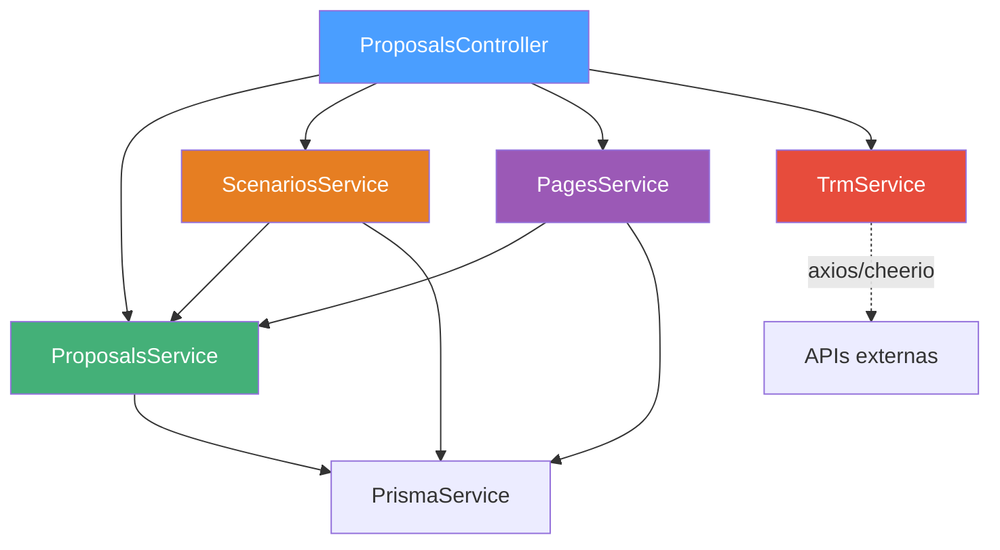

# Descomposición de ProposalsService en Servicios Especializados

## Tabla Resumen

| Archivo | Operación | Líneas Antes | Líneas Después | Responsabilidad |
|:---|:---|:---:|:---:|:---|
| `proposals.service.ts` | **REDUCIDO** | 1,051 | ~370 | Core CRUD de propuestas, ítems, `verifyProposalOwnership` (público), `findAll`, `cloneProposal` |
| `scenarios.service.ts` | **NUEVO** | — | ~230 | 9 métodos de escenarios + `verifyScenarioOwnership` |
| `pages.service.ts` | **NUEVO** | — | ~260 | 9 métodos de páginas/bloques + `verifyPageOwnership` |
| `trm.service.ts` | **NUEVO** | — | ~100 | `getExtraTrmValues` + `parseCurrencyString` + cache interno |
| `proposals.controller.ts` | **MODIFICADO** | 265 | ~250 | Inyecta 4 servicios, delega a cada uno, sin cache propio |
| `proposals.module.ts` | **MODIFICADO** | 12 | 14 | Registra 4 providers |

**Total: ~960 líneas → ~370 (ProposalsService) — objetivo < 500 ✅**

---

## Cambios Clave de Diseño

### 1. `verifyProposalOwnership` ahora es **público**
Cambió de `private` a `public` (`async` sin modificador de acceso = público en TS). Esto permite que `ScenariosService` y `PagesService` lo importen para la cadena de ownership:
- `ScenariosService.verifyScenarioOwnership` → llama `proposalsService.verifyProposalOwnership`
- `PagesService.verifyPageOwnership` → llama `proposalsService.verifyProposalOwnership`

### 2. Cache de TRM movido al servicio
El cache que vivía en el controller (`trmCache`, `TRM_CACHE_TTL_MS`) ahora es interno a `TrmService`. El controller simplemente llama `this.trmService.getExtraTrmValues()`.

### 3. Zero cambios de lógica de negocio
Cada método se movió byte-por-byte. Los ownership checks, transacciones, sanitización, y queries de Prisma son idénticos al original.

---

## Diffs por Archivo

### proposals.service.ts

```diff:proposals.service.ts
import { Injectable, Logger, NotFoundException, ForbiddenException } from '@nestjs/common';
import { PrismaService } from '../prisma/prisma.service';
import axios from 'axios';
import * as cheerio from 'cheerio';
import { ProposalStatus, BlockType, PageType } from '@prisma/client';
import { AuthenticatedUser } from '../auth/dto/auth.dto';
import { sanitizePlainText, sanitizeRichText } from '../common/sanitize';
import {
    CreateProposalDto,
    UpdateProposalDto,
    CreateProposalItemDto,
    UpdateProposalItemDto,
    CreateScenarioDto,
    UpdateScenarioDto,
    AddScenarioItemDto,
    UpdateScenarioItemDto,
    CreatePageDto,
    UpdatePageDto,
    ReorderPagesDto,
    CreateBlockDto,
    UpdateBlockDto,
    ReorderBlocksDto,
} from './dto/proposals.dto';


@Injectable()
export class ProposalsService {
  private readonly logger = new Logger(ProposalsService.name);

  constructor(private readonly prisma: PrismaService) {}

  /**
   * Verifica que el usuario tenga acceso a la propuesta.
   * ADMIN accede a todas; COMMERCIAL solo a las propias.
   */
  private async verifyProposalOwnership(proposalId: string, user: AuthenticatedUser) {
    const proposal = await this.prisma.proposal.findUnique({ where: { id: proposalId } });
    if (!proposal) throw new NotFoundException('Propuesta no encontrada.');
    if (user.role !== 'ADMIN' && proposal.userId !== user.id) {
      throw new ForbiddenException('No tienes acceso a esta propuesta.');
    }
    return proposal;
  }

  /**
   * Verifica ownership a través de un escenario.
   * Busca el scenario → obtiene proposalId → verifica ownership.
   */
  private async verifyScenarioOwnership(scenarioId: string, user: AuthenticatedUser) {
    const scenario = await this.prisma.scenario.findUnique({ where: { id: scenarioId } });
    if (!scenario) throw new NotFoundException('Escenario no encontrado.');
    await this.verifyProposalOwnership(scenario.proposalId, user);
    return scenario;
  }

  /**
   * Verifica ownership a través de una página.
   * Busca la page → obtiene proposalId → verifica ownership.
   */
  private async verifyPageOwnership(pageId: string, user: AuthenticatedUser) {
    const page = await this.prisma.proposalPage.findUnique({ where: { id: pageId } });
    if (!page) throw new NotFoundException('Página no encontrada.');
    await this.verifyProposalOwnership(page.proposalId, user);
    return page;
  }

  /**
   * Busca propuestas recientes que coincidan con el término de búsqueda.
   * NOTA DE SEGURIDAD: Este endpoint muestra propuestas de TODOS los usuarios
   * intencionalmente. Su propósito es detectar cruces de cuenta entre comerciales
   * antes de crear una nueva propuesta para el mismo cliente.
   * Revisado en auditoría de seguridad 2026-04-05 — comportamiento aceptado.
   */
  async findPotentialConflicts(query: string): Promise<any[]> {
    const normalizedQuery = query?.trim();

    // Early return si no hay suficiente información para buscar
    if (!normalizedQuery || normalizedQuery.length < 3) {
      return [];
    }

    const oneYearAgo = new Date();
    oneYearAgo.setFullYear(oneYearAgo.getFullYear() - 1);

    return this.prisma.proposal.findMany({
      where: {
        OR: [
          { clientName: { contains: normalizedQuery, mode: 'insensitive' } },
          { subject: { contains: normalizedQuery, mode: 'insensitive' } }
        ],
        createdAt: { gte: oneYearAgo },
      },
      include: {
        user: { select: { name: true } },
      },
      orderBy: { createdAt: 'desc' },
      take: 10, // Limitamos para evitar sobrecarga visual
    });
  }

  /**
   * Orquesta la creación de una nueva propuesta comercial.
   * 
   * @param {string} userId - ID del usuario comercial que crea la oferta.
   * @param {ICreateProposalInput} data - Payload con la información de la propuesta.
   * @throws {NotFoundException} Si el usuario no existe.
   */
  async createProposal(userId: string, data: CreateProposalDto) {
    try {
      const user = await this.validateUserAccess(userId);
      const clientId = await this.ensureClientExists(data.clientName, data.clientId);
      const proposalCode = await this.generateProposalCode(user.nomenclature, userId);

      return await this.prisma.proposal.create({
        data: {
          proposalCode,
          userId,
          clientId,
          clientName: sanitizePlainText(data.clientName.trim().toUpperCase()),
          subject: sanitizePlainText(data.subject),
          issueDate: new Date(data.issueDate),
          validityDays: typeof data.validityDays === 'string' ? parseInt(data.validityDays, 10) : data.validityDays,
          validityDate: new Date(data.validityDate),
          status: ProposalStatus.ELABORACION,
        },
      });
    } catch (error) {
      this.logger.error(`Falla al crear propuesta para usuario ${userId}: ${error instanceof Error ? error.message : String(error)}`);
      throw error;
    }
  }

  /**
   * Valida la existencia del usuario y su capacidad para crear propuestas.
   * @private
   */
  private async validateUserAccess(userId: string) {
    const user = await this.prisma.user.findUnique({ where: { id: userId } });
    
    // Early return pattern para validación
    if (!user) {
      throw new NotFoundException(`El usuario con ID ${userId} no fue encontrado en el sistema.`);
    }
    
    return user;
  }

  /**
   * Garantiza que el cliente esté registrado en la base de datos centralizada (Master Data).
   * Implementa un patrón Upsert para evitar duplicidad de nombres normalizados.
   * @private
   */
  private async ensureClientExists(name: string, existingId?: string): Promise<string> {
    const normalizedName = name.trim().toUpperCase();
    
    // Si ya tenemos un ID verificado, lo usamos directamente (OCP)
    if (existingId) return existingId;

    // Si no, realizamos un registro automático
    const client = await this.prisma.client.upsert({
      where: { name: normalizedName },
      update: {}, 
      create: {
        name: normalizedName,
        isActive: true
      }
    });

    return client.id;
  }

  /**
   * Genera un código de propuesta único siguiendo el estándar corporativo COT-[NOMENCLATURA][SECUENCIAL]-[VERSION].
   * @private
   */
  private async generateProposalCode(nomenclature: string, userId: string): Promise<string> {
    const prefix = nomenclature || 'XX';
    
    // Buscamos la última propuesta de este usuario para obtener el número secuencial más alto
    const lastProposal = await this.prisma.proposal.findFirst({
      where: { userId },
      orderBy: { proposalCode: 'desc' },
      select: { proposalCode: true }
    });
    
    let nextNumber = 1;
    
    if (lastProposal?.proposalCode) {
      // Extraemos el número del formato COT-PREFIX0001-1 usando regex
      // El patrón busca dígitos antes del guion de la versión final
      const match = lastProposal.proposalCode.match(/(\d+)-\d+$/);
      if (match) {
        nextNumber = parseInt(match[1], 10) + 1;
      }
    }
    
    const sequential = nextNumber.toString().padStart(4, '0');
    
    // El "-1" representa la versión inicial del borrador
    return `COT-${prefix}${sequential}-1`;
  }

  /**
   * Recupera una propuesta con sus ítems asociados para edición.
   */
  async getProposalById(id: string, user: AuthenticatedUser) {
    await this.verifyProposalOwnership(id, user);
    return this.prisma.proposal.findUnique({
      where: { id },
      include: {
        proposalItems: { orderBy: { sortOrder: 'asc' } }
      }
    });
  }

  /**
   * Actualiza los datos generales de una propuesta existente.
   * 
   * @param {string} id - UUID de la propuesta.
   * @param {any} data - Nuevos datos (asunto, fechas, etc).
   */
  async updateProposal(id: string, data: UpdateProposalDto, user: AuthenticatedUser) {
    await this.verifyProposalOwnership(id, user);
    return this.prisma.proposal.update({
      where: { id },
      data: {
        subject: data.subject ? sanitizePlainText(data.subject) : undefined,
        issueDate: data.issueDate ? new Date(data.issueDate) : undefined,
        validityDays: data.validityDays ?? undefined,
        validityDate: data.validityDate ? new Date(data.validityDate) : undefined,
        status: data.status ?? undefined,
        closeDate: data.closeDate ? new Date(data.closeDate) : data.closeDate === null ? null : undefined,
        billingDate: data.billingDate ? new Date(data.billingDate) : data.billingDate === null ? null : undefined,
        acquisitionType: data.acquisitionType ?? undefined,
      },
    });
  }

  /**
   * Añade un nuevo ítem (producto/servicio) a la propuesta.
   * Gestiona el correlativo de orden (sortOrder) automáticamente.
   */
  async addProposalItem(proposalId: string, data: CreateProposalItemDto, user: AuthenticatedUser) {
    await this.verifyProposalOwnership(proposalId, user);
    const aggregate = await this.prisma.proposalItem.aggregate({
      where: { proposalId },
      _max: { sortOrder: true }
    });

    const nextOrder = (aggregate._max.sortOrder || 0) + 1;

    return this.prisma.proposalItem.create({
      data: {
        proposalId,
        itemType: data.itemType,
        name: data.name,
        description: data.description,
        brand: data.brand,
        partNumber: data.partNumber,
        quantity: data.quantity || 1,
        unitCost: data.unitCost || 0,
        marginPct: data.marginPct || 0,
        unitPrice: data.unitPrice || 0,
        isTaxable: data.isTaxable ?? true,
        technicalSpecs: (data.technicalSpecs || {}) as object,
        internalCosts: (data.internalCosts || {}) as object,
        sortOrder: nextOrder,
      }
    });
  }

  /**
   * Elimina un ítem específico de una propuesta.
   */
  async removeProposalItem(itemId: string, user: AuthenticatedUser) {
    const item = await this.prisma.proposalItem.findUnique({ where: { id: itemId } });
    if (!item) throw new NotFoundException('Ítem no encontrado.');
    await this.verifyProposalOwnership(item.proposalId, user);
    return this.prisma.proposalItem.delete({
      where: { id: itemId }
    });
  }

  /**
   * Actualiza un ítem específico de una propuesta.
   */
  async updateProposalItem(itemId: string, data: UpdateProposalItemDto, user: AuthenticatedUser) {
    const item = await this.prisma.proposalItem.findUnique({ where: { id: itemId } });
    if (!item) throw new NotFoundException('Ítem no encontrado.');
    await this.verifyProposalOwnership(item.proposalId, user);
    return this.prisma.proposalItem.update({
      where: { id: itemId },
      data: {
        itemType: data.itemType,
        name: data.name,
        description: data.description,
        brand: data.brand,
        partNumber: data.partNumber,
        quantity: data.quantity,
        unitCost: data.unitCost,
        marginPct: data.marginPct,
        unitPrice: data.unitPrice,
        isTaxable: data.isTaxable,
        technicalSpecs: data.technicalSpecs as object | undefined,
        internalCosts: data.internalCosts as object | undefined,
      }
    });
  }

  /**
   * Lista propuestas filtradas por control de acceso basado en rol (RBAC).
   * ADMIN tiene visibilidad total; COMERCIAL solo ve las propias.
   *
   * @param {any} user - Objeto del usuario autenticado (proviene del JWT payload).
   * @returns Lista de propuestas con datos del comercial asociado.
   */
  async findAll(user: AuthenticatedUser) {
    const accessFilter = user.role === 'ADMIN' ? {} : { userId: user.id };

    return this.prisma.proposal.findMany({
      where: accessFilter,
      include: {
        user: { select: { name: true, nomenclature: true } },
        scenarios: {
          include: {
            scenarioItems: {
              where: { parentId: null },
              include: {
                item: true,
                children: { include: { item: true } },
              },
            },
          },
        },
      },
      orderBy: { updatedAt: 'desc' },
    });
  }

  /**
   * Clona una propuesta existente incluyendo ítems y escenarios.
   * NEW_VERSION: incrementa la versión (COT-LM0001-1 → COT-LM0001-2)
   * NEW_PROPOSAL: genera nuevo código secuencial (COT-LM0002-1)
   */
  async cloneProposal(id: string, userId: string, cloneType: 'NEW_VERSION' | 'NEW_PROPOSAL', user: AuthenticatedUser) {
    await this.verifyProposalOwnership(id, user);
    const original = await this.prisma.proposal.findUnique({
      where: { id },
      include: {
        proposalItems: true,
        scenarios: {
          include: {
            scenarioItems: {
              include: { children: true },
            },
          },
        },
      },
    });

    if (!original) throw new NotFoundException('Propuesta no encontrada.');

    let newCode: string;

    if (cloneType === 'NEW_VERSION') {
      // Increment version: COT-LM0001-1 → COT-LM0001-2
      const baseParts = original.proposalCode?.match(/^(.+)-(\d+)$/);
      if (baseParts) {
        const nextVersion = parseInt(baseParts[2], 10) + 1;
        newCode = `${baseParts[1]}-${nextVersion}`;
      } else {
        newCode = `${original.proposalCode}-2`;
      }
    } else {
      // NEW_PROPOSAL: Generate new sequential code
      const user = await this.validateUserAccess(userId);
      newCode = await this.generateProposalCode(user.nomenclature, userId);
    }

    // Create the new proposal
    const cloned = await this.prisma.proposal.create({
      data: {
        proposalCode: newCode,
        userId,
        clientId: original.clientId,
        clientName: original.clientName,
        subject: original.subject,
        issueDate: new Date(),
        validityDays: original.validityDays,
        validityDate: original.validityDate,
        status: ProposalStatus.ELABORACION,
      },
    });

    // Clone proposal items, mapping old IDs to new IDs
    const itemIdMap = new Map<string, string>();
    for (const item of original.proposalItems) {
      const newItem = await this.prisma.proposalItem.create({
        data: {
          proposalId: cloned.id,
          itemType: item.itemType,
          name: item.name,
          description: item.description,
          brand: item.brand,
          partNumber: item.partNumber,
          quantity: item.quantity,
          unitCost: item.unitCost,
          marginPct: item.marginPct,
          unitPrice: item.unitPrice,
          isTaxable: item.isTaxable,
          technicalSpecs: item.technicalSpecs as object | undefined,
          internalCosts: item.internalCosts as object | undefined,
          sortOrder: item.sortOrder,
        },
      });
      itemIdMap.set(item.id, newItem.id);
    }

    // Clone scenarios with items
    for (const scenario of original.scenarios) {
      const newScenario = await this.prisma.scenario.create({
        data: {
          proposalId: cloned.id,
          name: scenario.name,
          currency: scenario.currency,
          description: scenario.description,
          sortOrder: scenario.sortOrder,
        },
      });

      // Clone root scenario items (parentId = null)
      const rootItems = scenario.scenarioItems.filter(si => !si.parentId);
      const scenarioItemIdMap = new Map<string, string>();

      for (const si of rootItems) {
        const newItemId = itemIdMap.get(si.itemId) || si.itemId;
        const newSi = await this.prisma.scenarioItem.create({
          data: {
            scenarioId: newScenario.id,
            itemId: newItemId,
            quantity: si.quantity,
            marginPctOverride: si.marginPctOverride,
          },
        });
        scenarioItemIdMap.set(si.id, newSi.id);
      }

      // Clone child scenario items
      const childItems = scenario.scenarioItems.filter(si => si.parentId);
      for (const child of childItems) {
        const newParentId = scenarioItemIdMap.get(child.parentId!) || child.parentId;
        const newItemId = itemIdMap.get(child.itemId) || child.itemId;
        await this.prisma.scenarioItem.create({
          data: {
            scenarioId: newScenario.id,
            itemId: newItemId,
            parentId: newParentId,
            quantity: child.quantity,
            marginPctOverride: child.marginPctOverride,
          },
        });
      }
    }

    return cloned;
  }

  /**
   * Elimina una propuesta completa y sus dependencias.
   * Implementa limpieza manual de ítems previa a la eliminación de la cabecera.
   */
  async deleteProposal(id: string, user: AuthenticatedUser) {
    await this.verifyProposalOwnership(id, user);
    return this.prisma.$transaction(async (tx) => {
      // Delete page blocks first (they reference pages)
      await tx.proposalPageBlock.deleteMany({
        where: { page: { proposalId: id } }
      });

      // Delete pages (they reference the proposal)
      await tx.proposalPage.deleteMany({
        where: { proposalId: id }
      });

      // Delete linked scenario items first
      await tx.scenarioItem.deleteMany({
        where: { scenario: { proposalId: id } }
      });

      // Delete scenarios
      await tx.scenario.deleteMany({
        where: { proposalId: id }
      });

      // Delete regular items
      await tx.proposalItem.deleteMany({
        where: { proposalId: id },
      });

      // Delete proposal
      return tx.proposal.delete({
        where: { id },
      });
    });
  }

  /**
   * Obtiene valores extra de TRM (Promedio SET-ICAP y Spot Wilkinson)
   */
  async getExtraTrmValues() {
    const today = new Date().toISOString().split('T')[0];
    const results = {
      setIcapAverage: null,
      wilkinsonSpot: null
    };

    // 1. SET-ICAP Average (POST API)
    try {
      const setIcapRes = await axios.post('https://proxy.set-icap.com/seticap/api/estadisticas/estadisticasPromedioCierre/', {
        fecha: today,
        mercado: 71,
        delay: 15
      }, {
        headers: {
          'User-Agent': 'Mozilla/5.0 (Windows NT 10.0; Win64; x64) AppleWebKit/537.36 (KHTML, like Gecko) Chrome/120.0.0.0 Safari/537.36',
          'Referer': 'https://dolar.set-icap.com/'
        },
        timeout: 5000
      });
      if (setIcapRes.data?.data?.avg) {
        results.setIcapAverage = this.parseCurrencyString(setIcapRes.data.data.avg);
      }
    } catch (e) {
      this.logger.error(`Error fetching SET-ICAP average: ${(e as Error).message}`);
    }

    // 2. Wilkinson Spot Average (Scraping)
    try {
      const wilkinsonRes = await axios.get('https://dolar.wilkinsonpc.com.co/dolar-hoy-spot-minuto-a-minuto/', {
        headers: { 
          'User-Agent': 'Mozilla/5.0 (Windows NT 10.0; Win64; x64) AppleWebKit/537.36 (KHTML, like Gecko) Chrome/120.0.0.0 Safari/537.36' 
        },
        timeout: 5000
      });
      const $ = cheerio.load(wilkinsonRes.data);
      const spotText = $('.display-5.fw-bold.text-dark.lh-1.my-1 span').first().text();
      if (spotText) {
        results.wilkinsonSpot = this.parseCurrencyString(spotText);
      }
    } catch (e) {
      this.logger.error(`Error fetching Wilkinson spot: ${(e as Error).message}`);
    }

    return results;
  }

  /**
   * Normaliza y parsea cadenas de moneda (pudiendo tener . o , como separadores)
   */
  private parseCurrencyString(val: string): number {
    if (!val) return 0;
    // Remueve todo menos dígitos, puntos y comas
    let clean = val.replace(/[^0-9.,]/g, '');
    
    // Si tiene coma Y punto: la última suele ser el decimal
    const lastComma = clean.lastIndexOf(',');
    const lastPoint = clean.lastIndexOf('.');
    
    if (lastComma > lastPoint) {
      // Formato latino 3.704,17
      clean = clean.replace(/\./g, '').replace(',', '.');
    } else if (lastPoint > lastComma) {
      // Formato USA 3,704.17
      clean = clean.replace(/,/g, '');
    } else {
      // Solo uno de los dos o ninguno
      if (lastComma !== -1) clean = clean.replace(',', '.');
    }
    
    return parseFloat(clean);
  }

  // --- MÉTODOS DE ESCENARIOS ---

  /**
   * Recupera todos los escenarios para una propuesta con sus ítems asociados.
   */
  async getScenariosByProposalId(proposalId: string, user: AuthenticatedUser) {
    await this.verifyProposalOwnership(proposalId, user);
    return this.prisma.scenario.findMany({
      where: { proposalId },
      include: {
        scenarioItems: {
          where: { parentId: null },
          include: {
            item: true,
            children: {
              include: { item: true },
            },
          },
        },
      },
      orderBy: { sortOrder: 'asc' },
    });
  }

  /**
   * Crea un nuevo escenario para una propuesta.
   */
  async createScenario(proposalId: string, data: CreateScenarioDto, user: AuthenticatedUser) {
    await this.verifyProposalOwnership(proposalId, user);
    const aggregate = await this.prisma.scenario.aggregate({
      where: { proposalId },
      _max: { sortOrder: true }
    });

    const nextOrder = (aggregate._max.sortOrder || 0) + 1;

    return this.prisma.scenario.create({
      data: {
        proposalId,
        name: data.name,
        currency: data.currency || 'COP',
        description: data.description ? sanitizePlainText(data.description) : undefined,
        sortOrder: nextOrder
      }
    });
  }

  /**
   * Actualiza un escenario existente.
   */
  async updateScenario(id: string, data: UpdateScenarioDto, user: AuthenticatedUser) {
    await this.verifyScenarioOwnership(id, user);
    return this.prisma.scenario.update({
      where: { id },
      data: {
        name: data.name,
        currency: data.currency,
        description: data.description ? sanitizePlainText(data.description) : data.description
      }
    });
  }

  /**
   * Elimina un escenario y sus items vinculados.
   */
  async deleteScenario(id: string, user: AuthenticatedUser) {
    await this.verifyScenarioOwnership(id, user);
    return this.prisma.$transaction(async (tx) => {
      await tx.scenarioItem.deleteMany({ where: { scenarioId: id } });
      return tx.scenario.delete({ where: { id } });
    });
  }

  /**
   * Clona un escenario existente con todos sus ítems y sub-ítems.
   */
  async cloneScenario(scenarioId: string, user: AuthenticatedUser) {
    await this.verifyScenarioOwnership(scenarioId, user);
    const original = await this.prisma.scenario.findUnique({
      where: { id: scenarioId },
      include: {
        scenarioItems: {
          include: { children: true },
        },
      },
    });

    if (!original) throw new NotFoundException('Escenario no encontrado.');

    const aggregate = await this.prisma.scenario.aggregate({
      where: { proposalId: original.proposalId },
      _max: { sortOrder: true },
    });
    const nextOrder = (aggregate._max.sortOrder || 0) + 1;

    const cloned = await this.prisma.scenario.create({
      data: {
        proposalId: original.proposalId,
        name: `${original.name} (Copia)`,
        currency: original.currency,
        description: original.description,
        sortOrder: nextOrder,
      },
    });

    // Clone root items (parentId = null)
    const rootItems = original.scenarioItems.filter(si => !si.parentId);
    const siIdMap = new Map<string, string>();

    for (const si of rootItems) {
      const newSi = await this.prisma.scenarioItem.create({
        data: {
          scenarioId: cloned.id,
          itemId: si.itemId,
          quantity: si.quantity,
          marginPctOverride: si.marginPctOverride,
          isDilpidate: si.isDilpidate,
        },
      });
      siIdMap.set(si.id, newSi.id);
    }

    // Clone child items
    const childItems = original.scenarioItems.filter(si => si.parentId);
    for (const child of childItems) {
      const newParentId = siIdMap.get(child.parentId!) || child.parentId;
      await this.prisma.scenarioItem.create({
        data: {
          scenarioId: cloned.id,
          itemId: child.itemId,
          parentId: newParentId,
          quantity: child.quantity,
          marginPctOverride: child.marginPctOverride,
          isDilpidate: child.isDilpidate,
        },
      });
    }

    // Return the full cloned scenario with items
    return this.prisma.scenario.findUnique({
      where: { id: cloned.id },
      include: {
        scenarioItems: {
          where: { parentId: null },
          include: {
            item: true,
            children: { include: { item: true } },
          },
        },
      },
    });
  }

  /**
   * Vincula un item de propuesta a un escenario.
   */
  async addScenarioItem(scenarioId: string, data: AddScenarioItemDto, user: AuthenticatedUser) {
    await this.verifyScenarioOwnership(scenarioId, user);
    return this.prisma.scenarioItem.create({
      data: {
        scenarioId,
        itemId: data.itemId,
        parentId: data.parentId ?? undefined,
        quantity: data.quantity || 1,
        marginPctOverride: data.marginPct ?? undefined,
      },
      include: {
        item: true,
        children: { include: { item: true } },
      },
    });
  }

  /**
   * Actualiza un ítem dentro de un escenario.
   */
  async updateScenarioItem(id: string, data: UpdateScenarioItemDto, user: AuthenticatedUser) {
    const scenarioItem = await this.prisma.scenarioItem.findUnique({ where: { id } });
    if (!scenarioItem) throw new NotFoundException('Ítem de escenario no encontrado.');
    await this.verifyScenarioOwnership(scenarioItem.scenarioId, user);
    return this.prisma.scenarioItem.update({
      where: { id },
      data: {
        quantity: data.quantity,
        marginPctOverride: data.marginPct,
        isDilpidate: data.isDilpidate,
      }
    });
  }

  /**
   * Elimina un ítem específico de un escenario.
   */
  async removeScenarioItem(id: string, user: AuthenticatedUser) {
    const scenarioItem = await this.prisma.scenarioItem.findUnique({ where: { id } });
    if (!scenarioItem) throw new NotFoundException('Ítem de escenario no encontrado.');
    await this.verifyScenarioOwnership(scenarioItem.scenarioId, user);
    // Cascade: delete children first, then the item itself
    await this.prisma.scenarioItem.deleteMany({ where: { parentId: id } });
    return this.prisma.scenarioItem.delete({ where: { id } });
  }

  /**
   * Aplica un margen global a todos los ítems de un escenario específico.
   * Esto sobreescribe cualquier margen individual previo.
   */
  async applyMarginToEntireScenario(scenarioId: string, marginPct: number, user: AuthenticatedUser) {
    await this.verifyScenarioOwnership(scenarioId, user);
    return this.prisma.scenarioItem.updateMany({
      where: { scenarioId },
      data: {
        marginPctOverride: marginPct
      }
    });
  }

  // --- MÉTODOS DE PÁGINAS DE PROPUESTA ---

  /**
   * Inicializa las páginas predeterminadas para una propuesta.
   * Lee las plantillas globales configuradas por el admin (PdfTemplate).
   * Si no hay plantillas, usa fallback hardcodeado mínimo.
   * Agrega la firma del comercial a la página de presentación.
   */
  async initializeDefaultPages(proposalId: string, user: AuthenticatedUser) {
    await this.verifyProposalOwnership(proposalId, user);
    // Check for ANY existing pages to prevent re-initialization
    const existingCount = await this.prisma.proposalPage.count({
      where: { proposalId },
    });

    if (existingCount > 0) {
      return this.getPagesByProposalId(proposalId);
    }

    // Fetch proposal with user to get signature
    const proposal = await this.prisma.proposal.findUnique({
      where: { id: proposalId },
      include: { user: { select: { name: true, signatureUrl: true } } },
    });

    // Read global templates from admin configuration
    const templates = await this.prisma.pdfTemplate.findMany({
      where: { isActive: true },
      orderBy: { sortOrder: 'asc' },
    });

    // Build page definitions from templates or fallback
    let pageDefs: {
      pageType: string;
      title: string;
      sortOrder: number;
      blocks: { blockType: string; content: object }[];
    }[];

    if (templates.length > 0) {
      // Use admin-configured templates
      pageDefs = templates.map((t) => ({
        pageType: t.templateType,
        title: t.name,
        sortOrder: t.sortOrder,
        blocks: ((t.content as any[]) || []).map((b: any) => ({
          blockType: b.blockType,
          content: b.content || {},
        })),
      }));
    } else {
      // Fallback: minimal hardcoded defaults
      pageDefs = [
        { pageType: 'COVER', title: 'Portada', sortOrder: 1, blocks: [{ blockType: 'IMAGE', content: { url: '/uploads/defaults/portada.png', caption: '', fullPage: true } }] },
        { pageType: 'PRESENTATION', title: 'Carta de Presentación', sortOrder: 2, blocks: [{ blockType: 'RICH_TEXT', content: { type: 'doc', content: [{ type: 'heading', attrs: { level: 2, textAlign: 'left' }, content: [{ type: 'text', text: 'Carta de Presentación' }] }, { type: 'paragraph', content: [{ type: 'text', text: 'Contenido de la carta de presentación.' }] }] } }] },
        { pageType: 'COMPANY_INFO', title: 'Información General (1/2)', sortOrder: 3, blocks: [] },
        { pageType: 'COMPANY_INFO', title: 'Información General (2/2)', sortOrder: 4, blocks: [] },
        { pageType: 'INDEX', title: 'Índice', sortOrder: 5, blocks: [] },
        { pageType: 'TERMS', title: 'Términos y Condiciones', sortOrder: 1000, blocks: [{ blockType: 'RICH_TEXT', content: { type: 'doc', content: [{ type: 'heading', attrs: { level: 2, textAlign: 'left' }, content: [{ type: 'text', text: 'Términos y Condiciones' }] }] } }] },
      ];
    }

    // For the PRESENTATION page, append the commercial user's signature if available
    if (proposal?.user?.signatureUrl) {
      const presentationIdx = pageDefs.findIndex(p => p.pageType === 'PRESENTATION');
      if (presentationIdx !== -1) {
        pageDefs[presentationIdx].blocks.push({
          blockType: 'IMAGE',
          content: { url: proposal.user.signatureUrl, caption: proposal.user.name || 'Firma Comercial' },
        });
      }
    }

    // Create pages and blocks
    for (const page of pageDefs) {
      const createdPage = await this.prisma.proposalPage.create({
        data: {
          proposalId,
          pageType: page.pageType as PageType,
          title: page.title,
          sortOrder: page.sortOrder,
          isLocked: true,
        },
      });

      if (page.blocks?.length) {
        for (let i = 0; i < page.blocks.length; i++) {
          await this.prisma.proposalPageBlock.create({
            data: {
              pageId: createdPage.id,
              blockType: page.blocks[i].blockType as BlockType,
              content: page.blocks[i].content as object,
              sortOrder: i + 1,
            },
          });
        }
      }
    }

    return this.getPagesByProposalId(proposalId);
  }

  /**
   * Retorna todas las páginas con sus bloques para una propuesta.
   */
  async getPagesByProposalId(proposalId: string, user?: AuthenticatedUser) {
    if (user) await this.verifyProposalOwnership(proposalId, user);
    return this.prisma.proposalPage.findMany({
      where: { proposalId },
      include: { blocks: { orderBy: { sortOrder: 'asc' } } },
      orderBy: { sortOrder: 'asc' },
    });
  }

  /**
   * Crea una página personalizada.
   */
  async createCustomPage(proposalId: string, data: CreatePageDto, user: AuthenticatedUser) {
    await this.verifyProposalOwnership(proposalId, user);
    // Insert before TERMS (sortOrder 1000) but after everything else
    const aggregate = await this.prisma.proposalPage.aggregate({
      where: { proposalId, pageType: { not: 'TERMS' } },
      _max: { sortOrder: true },
    });
    const nextOrder = (aggregate._max.sortOrder || 0) + 1;

    return this.prisma.proposalPage.create({
      data: {
        proposalId,
        pageType: 'CUSTOM',
        title: data.title,
        isLocked: false,
        sortOrder: nextOrder,
      },
      include: { blocks: true },
    });
  }

  /**
   * Actualiza una página (título o variables).
   */
  async updatePage(pageId: string, data: UpdatePageDto, user: AuthenticatedUser) {
    await this.verifyPageOwnership(pageId, user);
    return this.prisma.proposalPage.update({
      where: { id: pageId },
      data: {
        title: data.title,
        variables: data.variables as object | undefined,
      },
      include: { blocks: { orderBy: { sortOrder: 'asc' } } },
    });
  }

  /**
   * Elimina una página (solo si no es predeterminada).
   */
  async deletePage(pageId: string, user: AuthenticatedUser) {
    const page = await this.verifyPageOwnership(pageId, user);
    if (page.isLocked) throw new Error('No se puede eliminar una página predeterminada.');

    await this.prisma.proposalPageBlock.deleteMany({ where: { pageId } });
    return this.prisma.proposalPage.delete({ where: { id: pageId } });
  }

  /**
   * Reordena las páginas respetando las posiciones fijas de predeterminadas.
   */
  async reorderPages(proposalId: string, data: ReorderPagesDto, user: AuthenticatedUser) {
    await this.verifyProposalOwnership(proposalId, user);
    await this.prisma.$transaction(
      data.pageIds.map((id, index) =>
        this.prisma.proposalPage.update({
          where: { id },
          data: { sortOrder: index + 1 },
        }),
      ),
    );
    return this.getPagesByProposalId(proposalId);
  }

  /**
   * Crea un bloque dentro de una página.
   */
  async createBlock(pageId: string, data: CreateBlockDto, user: AuthenticatedUser) {
    await this.verifyPageOwnership(pageId, user);
    const aggregate = await this.prisma.proposalPageBlock.aggregate({
      where: { pageId },
      _max: { sortOrder: true },
    });
    const nextOrder = (aggregate._max.sortOrder || 0) + 1;

    const contentToSave = data.blockType === 'RICH_TEXT' && data.content
      ? { ...data.content as object, html: typeof (data.content as any).html === 'string' ? sanitizeRichText((data.content as any).html) : undefined }
      : (data.content || {});

    return this.prisma.proposalPageBlock.create({
      data: {
        pageId,
        blockType: data.blockType as BlockType,
        content: contentToSave as object,
        sortOrder: nextOrder,
      },
    });
  }

  /**
   * Actualiza el contenido de un bloque.
   */
  async updateBlock(blockId: string, data: UpdateBlockDto, user: AuthenticatedUser) {
    const block = await this.prisma.proposalPageBlock.findUnique({ where: { id: blockId } });
    if (!block) throw new NotFoundException('Bloque no encontrado.');
    await this.verifyPageOwnership(block.pageId, user);

    const contentToSave = block.blockType === 'RICH_TEXT' && data.content
      ? { ...data.content as object, html: typeof (data.content as any).html === 'string' ? sanitizeRichText((data.content as any).html) : undefined }
      : data.content;

    return this.prisma.proposalPageBlock.update({
      where: { id: blockId },
      data: { content: contentToSave as object | undefined },
    });
  }

  /**
   * Elimina un bloque.
   */
  async deleteBlock(blockId: string, user: AuthenticatedUser) {
    const block = await this.prisma.proposalPageBlock.findUnique({ where: { id: blockId } });
    if (!block) throw new NotFoundException('Bloque no encontrado.');
    await this.verifyPageOwnership(block.pageId, user);
    return this.prisma.proposalPageBlock.delete({ where: { id: blockId } });
  }

  /**
   * Reordena los bloques dentro de una página.
   */
  async reorderBlocks(pageId: string, data: ReorderBlocksDto, user: AuthenticatedUser) {
    await this.verifyPageOwnership(pageId, user);
    await this.prisma.$transaction(
      data.blockIds.map((id, index) =>
        this.prisma.proposalPageBlock.update({
          where: { id },
          data: { sortOrder: index + 1 },
        }),
      ),
    );
    return this.prisma.proposalPageBlock.findMany({
      where: { pageId },
      orderBy: { sortOrder: 'asc' },
    });
  }
}
===
import { Injectable, Logger, NotFoundException, ForbiddenException } from '@nestjs/common';
import { PrismaService } from '../prisma/prisma.service';
import { ProposalStatus } from '@prisma/client';
import { AuthenticatedUser } from '../auth/dto/auth.dto';
import { sanitizePlainText } from '../common/sanitize';
import {
    CreateProposalDto,
    UpdateProposalDto,
    CreateProposalItemDto,
    UpdateProposalItemDto,
} from './dto/proposals.dto';


@Injectable()
export class ProposalsService {
  private readonly logger = new Logger(ProposalsService.name);

  constructor(private readonly prisma: PrismaService) {}

  /**
   * Verifica que el usuario tenga acceso a la propuesta.
   * ADMIN accede a todas; COMMERCIAL solo a las propias.
   * Público para que ScenariosService y PagesService lo importen.
   */
  async verifyProposalOwnership(proposalId: string, user: AuthenticatedUser) {
    const proposal = await this.prisma.proposal.findUnique({ where: { id: proposalId } });
    if (!proposal) throw new NotFoundException('Propuesta no encontrada.');
    if (user.role !== 'ADMIN' && proposal.userId !== user.id) {
      throw new ForbiddenException('No tienes acceso a esta propuesta.');
    }
    return proposal;
  }

  /**
   * Busca propuestas recientes que coincidan con el término de búsqueda.
   * NOTA DE SEGURIDAD: Este endpoint muestra propuestas de TODOS los usuarios
   * intencionalmente. Su propósito es detectar cruces de cuenta entre comerciales
   * antes de crear una nueva propuesta para el mismo cliente.
   * Revisado en auditoría de seguridad 2026-04-05 — comportamiento aceptado.
   */
  async findPotentialConflicts(query: string): Promise<any[]> {
    const normalizedQuery = query?.trim();

    // Early return si no hay suficiente información para buscar
    if (!normalizedQuery || normalizedQuery.length < 3) {
      return [];
    }

    const oneYearAgo = new Date();
    oneYearAgo.setFullYear(oneYearAgo.getFullYear() - 1);

    return this.prisma.proposal.findMany({
      where: {
        OR: [
          { clientName: { contains: normalizedQuery, mode: 'insensitive' } },
          { subject: { contains: normalizedQuery, mode: 'insensitive' } }
        ],
        createdAt: { gte: oneYearAgo },
      },
      include: {
        user: { select: { name: true } },
      },
      orderBy: { createdAt: 'desc' },
      take: 10, // Limitamos para evitar sobrecarga visual
    });
  }

  /**
   * Orquesta la creación de una nueva propuesta comercial.
   * 
   * @param {string} userId - ID del usuario comercial que crea la oferta.
   * @param {ICreateProposalInput} data - Payload con la información de la propuesta.
   * @throws {NotFoundException} Si el usuario no existe.
   */
  async createProposal(userId: string, data: CreateProposalDto) {
    try {
      const user = await this.validateUserAccess(userId);
      const clientId = await this.ensureClientExists(data.clientName, data.clientId);
      const proposalCode = await this.generateProposalCode(user.nomenclature, userId);

      return await this.prisma.proposal.create({
        data: {
          proposalCode,
          userId,
          clientId,
          clientName: sanitizePlainText(data.clientName.trim().toUpperCase()),
          subject: sanitizePlainText(data.subject),
          issueDate: new Date(data.issueDate),
          validityDays: typeof data.validityDays === 'string' ? parseInt(data.validityDays, 10) : data.validityDays,
          validityDate: new Date(data.validityDate),
          status: ProposalStatus.ELABORACION,
        },
      });
    } catch (error) {
      this.logger.error(`Falla al crear propuesta para usuario ${userId}: ${error instanceof Error ? error.message : String(error)}`);
      throw error;
    }
  }

  /**
   * Valida la existencia del usuario y su capacidad para crear propuestas.
   * @private
   */
  private async validateUserAccess(userId: string) {
    const user = await this.prisma.user.findUnique({ where: { id: userId } });
    
    // Early return pattern para validación
    if (!user) {
      throw new NotFoundException(`El usuario con ID ${userId} no fue encontrado en el sistema.`);
    }
    
    return user;
  }

  /**
   * Garantiza que el cliente esté registrado en la base de datos centralizada (Master Data).
   * Implementa un patrón Upsert para evitar duplicidad de nombres normalizados.
   * @private
   */
  private async ensureClientExists(name: string, existingId?: string): Promise<string> {
    const normalizedName = name.trim().toUpperCase();
    
    // Si ya tenemos un ID verificado, lo usamos directamente (OCP)
    if (existingId) return existingId;

    // Si no, realizamos un registro automático
    const client = await this.prisma.client.upsert({
      where: { name: normalizedName },
      update: {}, 
      create: {
        name: normalizedName,
        isActive: true
      }
    });

    return client.id;
  }

  /**
   * Genera un código de propuesta único siguiendo el estándar corporativo COT-[NOMENCLATURA][SECUENCIAL]-[VERSION].
   * @private
   */
  private async generateProposalCode(nomenclature: string, userId: string): Promise<string> {
    const prefix = nomenclature || 'XX';
    
    // Buscamos la última propuesta de este usuario para obtener el número secuencial más alto
    const lastProposal = await this.prisma.proposal.findFirst({
      where: { userId },
      orderBy: { proposalCode: 'desc' },
      select: { proposalCode: true }
    });
    
    let nextNumber = 1;
    
    if (lastProposal?.proposalCode) {
      // Extraemos el número del formato COT-PREFIX0001-1 usando regex
      // El patrón busca dígitos antes del guion de la versión final
      const match = lastProposal.proposalCode.match(/(\d+)-\d+$/);
      if (match) {
        nextNumber = parseInt(match[1], 10) + 1;
      }
    }
    
    const sequential = nextNumber.toString().padStart(4, '0');
    
    // El "-1" representa la versión inicial del borrador
    return `COT-${prefix}${sequential}-1`;
  }

  /**
   * Recupera una propuesta con sus ítems asociados para edición.
   */
  async getProposalById(id: string, user: AuthenticatedUser) {
    await this.verifyProposalOwnership(id, user);
    return this.prisma.proposal.findUnique({
      where: { id },
      include: {
        proposalItems: { orderBy: { sortOrder: 'asc' } }
      }
    });
  }

  /**
   * Actualiza los datos generales de una propuesta existente.
   * 
   * @param {string} id - UUID de la propuesta.
   * @param {any} data - Nuevos datos (asunto, fechas, etc).
   */
  async updateProposal(id: string, data: UpdateProposalDto, user: AuthenticatedUser) {
    await this.verifyProposalOwnership(id, user);
    return this.prisma.proposal.update({
      where: { id },
      data: {
        subject: data.subject ? sanitizePlainText(data.subject) : undefined,
        issueDate: data.issueDate ? new Date(data.issueDate) : undefined,
        validityDays: data.validityDays ?? undefined,
        validityDate: data.validityDate ? new Date(data.validityDate) : undefined,
        status: data.status ?? undefined,
        closeDate: data.closeDate ? new Date(data.closeDate) : data.closeDate === null ? null : undefined,
        billingDate: data.billingDate ? new Date(data.billingDate) : data.billingDate === null ? null : undefined,
        acquisitionType: data.acquisitionType ?? undefined,
      },
    });
  }

  /**
   * Añade un nuevo ítem (producto/servicio) a la propuesta.
   * Gestiona el correlativo de orden (sortOrder) automáticamente.
   */
  async addProposalItem(proposalId: string, data: CreateProposalItemDto, user: AuthenticatedUser) {
    await this.verifyProposalOwnership(proposalId, user);
    const aggregate = await this.prisma.proposalItem.aggregate({
      where: { proposalId },
      _max: { sortOrder: true }
    });

    const nextOrder = (aggregate._max.sortOrder || 0) + 1;

    return this.prisma.proposalItem.create({
      data: {
        proposalId,
        itemType: data.itemType,
        name: data.name,
        description: data.description,
        brand: data.brand,
        partNumber: data.partNumber,
        quantity: data.quantity || 1,
        unitCost: data.unitCost || 0,
        marginPct: data.marginPct || 0,
        unitPrice: data.unitPrice || 0,
        isTaxable: data.isTaxable ?? true,
        technicalSpecs: (data.technicalSpecs || {}) as object,
        internalCosts: (data.internalCosts || {}) as object,
        sortOrder: nextOrder,
      }
    });
  }

  /**
   * Elimina un ítem específico de una propuesta.
   */
  async removeProposalItem(itemId: string, user: AuthenticatedUser) {
    const item = await this.prisma.proposalItem.findUnique({ where: { id: itemId } });
    if (!item) throw new NotFoundException('Ítem no encontrado.');
    await this.verifyProposalOwnership(item.proposalId, user);
    return this.prisma.proposalItem.delete({
      where: { id: itemId }
    });
  }

  /**
   * Actualiza un ítem específico de una propuesta.
   */
  async updateProposalItem(itemId: string, data: UpdateProposalItemDto, user: AuthenticatedUser) {
    const item = await this.prisma.proposalItem.findUnique({ where: { id: itemId } });
    if (!item) throw new NotFoundException('Ítem no encontrado.');
    await this.verifyProposalOwnership(item.proposalId, user);
    return this.prisma.proposalItem.update({
      where: { id: itemId },
      data: {
        itemType: data.itemType,
        name: data.name,
        description: data.description,
        brand: data.brand,
        partNumber: data.partNumber,
        quantity: data.quantity,
        unitCost: data.unitCost,
        marginPct: data.marginPct,
        unitPrice: data.unitPrice,
        isTaxable: data.isTaxable,
        technicalSpecs: data.technicalSpecs as object | undefined,
        internalCosts: data.internalCosts as object | undefined,
      }
    });
  }

  /**
   * Lista propuestas filtradas por control de acceso basado en rol (RBAC).
   * ADMIN tiene visibilidad total; COMERCIAL solo ve las propias.
   *
   * @param {any} user - Objeto del usuario autenticado (proviene del JWT payload).
   * @returns Lista de propuestas con datos del comercial asociado.
   */
  async findAll(user: AuthenticatedUser) {
    const accessFilter = user.role === 'ADMIN' ? {} : { userId: user.id };

    return this.prisma.proposal.findMany({
      where: accessFilter,
      include: {
        user: { select: { name: true, nomenclature: true } },
        scenarios: {
          include: {
            scenarioItems: {
              where: { parentId: null },
              include: {
                item: true,
                children: { include: { item: true } },
              },
            },
          },
        },
      },
      orderBy: { updatedAt: 'desc' },
    });
  }

  /**
   * Clona una propuesta existente incluyendo ítems y escenarios.
   * NEW_VERSION: incrementa la versión (COT-LM0001-1 → COT-LM0001-2)
   * NEW_PROPOSAL: genera nuevo código secuencial (COT-LM0002-1)
   */
  async cloneProposal(id: string, userId: string, cloneType: 'NEW_VERSION' | 'NEW_PROPOSAL', user: AuthenticatedUser) {
    await this.verifyProposalOwnership(id, user);
    const original = await this.prisma.proposal.findUnique({
      where: { id },
      include: {
        proposalItems: true,
        scenarios: {
          include: {
            scenarioItems: {
              include: { children: true },
            },
          },
        },
      },
    });

    if (!original) throw new NotFoundException('Propuesta no encontrada.');

    let newCode: string;

    if (cloneType === 'NEW_VERSION') {
      // Increment version: COT-LM0001-1 → COT-LM0001-2
      const baseParts = original.proposalCode?.match(/^(.+)-(\d+)$/);
      if (baseParts) {
        const nextVersion = parseInt(baseParts[2], 10) + 1;
        newCode = `${baseParts[1]}-${nextVersion}`;
      } else {
        newCode = `${original.proposalCode}-2`;
      }
    } else {
      // NEW_PROPOSAL: Generate new sequential code
      const user = await this.validateUserAccess(userId);
      newCode = await this.generateProposalCode(user.nomenclature, userId);
    }

    // Create the new proposal
    const cloned = await this.prisma.proposal.create({
      data: {
        proposalCode: newCode,
        userId,
        clientId: original.clientId,
        clientName: original.clientName,
        subject: original.subject,
        issueDate: new Date(),
        validityDays: original.validityDays,
        validityDate: original.validityDate,
        status: ProposalStatus.ELABORACION,
      },
    });

    // Clone proposal items, mapping old IDs to new IDs
    const itemIdMap = new Map<string, string>();
    for (const item of original.proposalItems) {
      const newItem = await this.prisma.proposalItem.create({
        data: {
          proposalId: cloned.id,
          itemType: item.itemType,
          name: item.name,
          description: item.description,
          brand: item.brand,
          partNumber: item.partNumber,
          quantity: item.quantity,
          unitCost: item.unitCost,
          marginPct: item.marginPct,
          unitPrice: item.unitPrice,
          isTaxable: item.isTaxable,
          technicalSpecs: item.technicalSpecs as object | undefined,
          internalCosts: item.internalCosts as object | undefined,
          sortOrder: item.sortOrder,
        },
      });
      itemIdMap.set(item.id, newItem.id);
    }

    // Clone scenarios with items
    for (const scenario of original.scenarios) {
      const newScenario = await this.prisma.scenario.create({
        data: {
          proposalId: cloned.id,
          name: scenario.name,
          currency: scenario.currency,
          description: scenario.description,
          sortOrder: scenario.sortOrder,
        },
      });

      // Clone root scenario items (parentId = null)
      const rootItems = scenario.scenarioItems.filter(si => !si.parentId);
      const scenarioItemIdMap = new Map<string, string>();

      for (const si of rootItems) {
        const newItemId = itemIdMap.get(si.itemId) || si.itemId;
        const newSi = await this.prisma.scenarioItem.create({
          data: {
            scenarioId: newScenario.id,
            itemId: newItemId,
            quantity: si.quantity,
            marginPctOverride: si.marginPctOverride,
          },
        });
        scenarioItemIdMap.set(si.id, newSi.id);
      }

      // Clone child scenario items
      const childItems = scenario.scenarioItems.filter(si => si.parentId);
      for (const child of childItems) {
        const newParentId = scenarioItemIdMap.get(child.parentId!) || child.parentId;
        const newItemId = itemIdMap.get(child.itemId) || child.itemId;
        await this.prisma.scenarioItem.create({
          data: {
            scenarioId: newScenario.id,
            itemId: newItemId,
            parentId: newParentId,
            quantity: child.quantity,
            marginPctOverride: child.marginPctOverride,
          },
        });
      }
    }

    return cloned;
  }

  /**
   * Elimina una propuesta completa y sus dependencias.
   * Implementa limpieza manual de ítems previa a la eliminación de la cabecera.
   */
  async deleteProposal(id: string, user: AuthenticatedUser) {
    await this.verifyProposalOwnership(id, user);
    return this.prisma.$transaction(async (tx) => {
      // Delete page blocks first (they reference pages)
      await tx.proposalPageBlock.deleteMany({
        where: { page: { proposalId: id } }
      });

      // Delete pages (they reference the proposal)
      await tx.proposalPage.deleteMany({
        where: { proposalId: id }
      });

      // Delete linked scenario items first
      await tx.scenarioItem.deleteMany({
        where: { scenario: { proposalId: id } }
      });

      // Delete scenarios
      await tx.scenario.deleteMany({
        where: { proposalId: id }
      });

      // Delete regular items
      await tx.proposalItem.deleteMany({
        where: { proposalId: id },
      });

      // Delete proposal
      return tx.proposal.delete({
        where: { id },
      });
    });
  }
}

```

### scenarios.service.ts (NUEVO)

```diff:scenarios.service.ts
===
import { Injectable, NotFoundException } from '@nestjs/common';
import { PrismaService } from '../prisma/prisma.service';
import { ProposalsService } from './proposals.service';
import { AuthenticatedUser } from '../auth/dto/auth.dto';
import { sanitizePlainText } from '../common/sanitize';
import {
    CreateScenarioDto,
    UpdateScenarioDto,
    AddScenarioItemDto,
    UpdateScenarioItemDto,
} from './dto/proposals.dto';


@Injectable()
export class ScenariosService {
  constructor(
    private readonly prisma: PrismaService,
    private readonly proposalsService: ProposalsService,
  ) {}

  /**
   * Verifica ownership a través de un escenario.
   * Busca el scenario → obtiene proposalId → verifica ownership.
   */
  private async verifyScenarioOwnership(scenarioId: string, user: AuthenticatedUser) {
    const scenario = await this.prisma.scenario.findUnique({ where: { id: scenarioId } });
    if (!scenario) throw new NotFoundException('Escenario no encontrado.');
    await this.proposalsService.verifyProposalOwnership(scenario.proposalId, user);
    return scenario;
  }

  /**
   * Recupera todos los escenarios para una propuesta con sus ítems asociados.
   */
  async getScenariosByProposalId(proposalId: string, user: AuthenticatedUser) {
    await this.proposalsService.verifyProposalOwnership(proposalId, user);
    return this.prisma.scenario.findMany({
      where: { proposalId },
      include: {
        scenarioItems: {
          where: { parentId: null },
          include: {
            item: true,
            children: {
              include: { item: true },
            },
          },
        },
      },
      orderBy: { sortOrder: 'asc' },
    });
  }

  /**
   * Crea un nuevo escenario para una propuesta.
   */
  async createScenario(proposalId: string, data: CreateScenarioDto, user: AuthenticatedUser) {
    await this.proposalsService.verifyProposalOwnership(proposalId, user);
    const aggregate = await this.prisma.scenario.aggregate({
      where: { proposalId },
      _max: { sortOrder: true }
    });

    const nextOrder = (aggregate._max.sortOrder || 0) + 1;

    return this.prisma.scenario.create({
      data: {
        proposalId,
        name: data.name,
        currency: data.currency || 'COP',
        description: data.description ? sanitizePlainText(data.description) : undefined,
        sortOrder: nextOrder
      }
    });
  }

  /**
   * Actualiza un escenario existente.
   */
  async updateScenario(id: string, data: UpdateScenarioDto, user: AuthenticatedUser) {
    await this.verifyScenarioOwnership(id, user);
    return this.prisma.scenario.update({
      where: { id },
      data: {
        name: data.name,
        currency: data.currency,
        description: data.description ? sanitizePlainText(data.description) : data.description
      }
    });
  }

  /**
   * Elimina un escenario y sus items vinculados.
   */
  async deleteScenario(id: string, user: AuthenticatedUser) {
    await this.verifyScenarioOwnership(id, user);
    return this.prisma.$transaction(async (tx) => {
      await tx.scenarioItem.deleteMany({ where: { scenarioId: id } });
      return tx.scenario.delete({ where: { id } });
    });
  }

  /**
   * Clona un escenario existente con todos sus ítems y sub-ítems.
   */
  async cloneScenario(scenarioId: string, user: AuthenticatedUser) {
    await this.verifyScenarioOwnership(scenarioId, user);
    const original = await this.prisma.scenario.findUnique({
      where: { id: scenarioId },
      include: {
        scenarioItems: {
          include: { children: true },
        },
      },
    });

    if (!original) throw new NotFoundException('Escenario no encontrado.');

    const aggregate = await this.prisma.scenario.aggregate({
      where: { proposalId: original.proposalId },
      _max: { sortOrder: true },
    });
    const nextOrder = (aggregate._max.sortOrder || 0) + 1;

    const cloned = await this.prisma.scenario.create({
      data: {
        proposalId: original.proposalId,
        name: `${original.name} (Copia)`,
        currency: original.currency,
        description: original.description,
        sortOrder: nextOrder,
      },
    });

    // Clone root items (parentId = null)
    const rootItems = original.scenarioItems.filter(si => !si.parentId);
    const siIdMap = new Map<string, string>();

    for (const si of rootItems) {
      const newSi = await this.prisma.scenarioItem.create({
        data: {
          scenarioId: cloned.id,
          itemId: si.itemId,
          quantity: si.quantity,
          marginPctOverride: si.marginPctOverride,
          isDilpidate: si.isDilpidate,
        },
      });
      siIdMap.set(si.id, newSi.id);
    }

    // Clone child items
    const childItems = original.scenarioItems.filter(si => si.parentId);
    for (const child of childItems) {
      const newParentId = siIdMap.get(child.parentId!) || child.parentId;
      await this.prisma.scenarioItem.create({
        data: {
          scenarioId: cloned.id,
          itemId: child.itemId,
          parentId: newParentId,
          quantity: child.quantity,
          marginPctOverride: child.marginPctOverride,
          isDilpidate: child.isDilpidate,
        },
      });
    }

    // Return the full cloned scenario with items
    return this.prisma.scenario.findUnique({
      where: { id: cloned.id },
      include: {
        scenarioItems: {
          where: { parentId: null },
          include: {
            item: true,
            children: { include: { item: true } },
          },
        },
      },
    });
  }

  /**
   * Vincula un item de propuesta a un escenario.
   */
  async addScenarioItem(scenarioId: string, data: AddScenarioItemDto, user: AuthenticatedUser) {
    await this.verifyScenarioOwnership(scenarioId, user);
    return this.prisma.scenarioItem.create({
      data: {
        scenarioId,
        itemId: data.itemId,
        parentId: data.parentId ?? undefined,
        quantity: data.quantity || 1,
        marginPctOverride: data.marginPct ?? undefined,
      },
      include: {
        item: true,
        children: { include: { item: true } },
      },
    });
  }

  /**
   * Actualiza un ítem dentro de un escenario.
   */
  async updateScenarioItem(id: string, data: UpdateScenarioItemDto, user: AuthenticatedUser) {
    const scenarioItem = await this.prisma.scenarioItem.findUnique({ where: { id } });
    if (!scenarioItem) throw new NotFoundException('Ítem de escenario no encontrado.');
    await this.verifyScenarioOwnership(scenarioItem.scenarioId, user);
    return this.prisma.scenarioItem.update({
      where: { id },
      data: {
        quantity: data.quantity,
        marginPctOverride: data.marginPct,
        isDilpidate: data.isDilpidate,
      }
    });
  }

  /**
   * Elimina un ítem específico de un escenario.
   */
  async removeScenarioItem(id: string, user: AuthenticatedUser) {
    const scenarioItem = await this.prisma.scenarioItem.findUnique({ where: { id } });
    if (!scenarioItem) throw new NotFoundException('Ítem de escenario no encontrado.');
    await this.verifyScenarioOwnership(scenarioItem.scenarioId, user);
    // Cascade: delete children first, then the item itself
    await this.prisma.scenarioItem.deleteMany({ where: { parentId: id } });
    return this.prisma.scenarioItem.delete({ where: { id } });
  }

  /**
   * Aplica un margen global a todos los ítems de un escenario específico.
   * Esto sobreescribe cualquier margen individual previo.
   */
  async applyMarginToEntireScenario(scenarioId: string, marginPct: number, user: AuthenticatedUser) {
    await this.verifyScenarioOwnership(scenarioId, user);
    return this.prisma.scenarioItem.updateMany({
      where: { scenarioId },
      data: {
        marginPctOverride: marginPct
      }
    });
  }
}
```

### pages.service.ts (NUEVO)

```diff:pages.service.ts
===
import { Injectable, NotFoundException } from '@nestjs/common';
import { PrismaService } from '../prisma/prisma.service';
import { ProposalsService } from './proposals.service';
import { BlockType, PageType } from '@prisma/client';
import { AuthenticatedUser } from '../auth/dto/auth.dto';
import { sanitizeRichText } from '../common/sanitize';
import {
    CreatePageDto,
    UpdatePageDto,
    ReorderPagesDto,
    CreateBlockDto,
    UpdateBlockDto,
    ReorderBlocksDto,
} from './dto/proposals.dto';


@Injectable()
export class PagesService {
  constructor(
    private readonly prisma: PrismaService,
    private readonly proposalsService: ProposalsService,
  ) {}

  /**
   * Verifica ownership a través de una página.
   * Busca la page → obtiene proposalId → verifica ownership.
   */
  private async verifyPageOwnership(pageId: string, user: AuthenticatedUser) {
    const page = await this.prisma.proposalPage.findUnique({ where: { id: pageId } });
    if (!page) throw new NotFoundException('Página no encontrada.');
    await this.proposalsService.verifyProposalOwnership(page.proposalId, user);
    return page;
  }

  /**
   * Inicializa las páginas predeterminadas para una propuesta.
   * Lee las plantillas globales configuradas por el admin (PdfTemplate).
   * Si no hay plantillas, usa fallback hardcodeado mínimo.
   * Agrega la firma del comercial a la página de presentación.
   */
  async initializeDefaultPages(proposalId: string, user: AuthenticatedUser) {
    await this.proposalsService.verifyProposalOwnership(proposalId, user);
    // Check for ANY existing pages to prevent re-initialization
    const existingCount = await this.prisma.proposalPage.count({
      where: { proposalId },
    });

    if (existingCount > 0) {
      return this.getPagesByProposalId(proposalId);
    }

    // Fetch proposal with user to get signature
    const proposal = await this.prisma.proposal.findUnique({
      where: { id: proposalId },
      include: { user: { select: { name: true, signatureUrl: true } } },
    });

    // Read global templates from admin configuration
    const templates = await this.prisma.pdfTemplate.findMany({
      where: { isActive: true },
      orderBy: { sortOrder: 'asc' },
    });

    // Build page definitions from templates or fallback
    let pageDefs: {
      pageType: string;
      title: string;
      sortOrder: number;
      blocks: { blockType: string; content: object }[];
    }[];

    if (templates.length > 0) {
      // Use admin-configured templates
      pageDefs = templates.map((t) => ({
        pageType: t.templateType,
        title: t.name,
        sortOrder: t.sortOrder,
        blocks: ((t.content as any[]) || []).map((b: any) => ({
          blockType: b.blockType,
          content: b.content || {},
        })),
      }));
    } else {
      // Fallback: minimal hardcoded defaults
      pageDefs = [
        { pageType: 'COVER', title: 'Portada', sortOrder: 1, blocks: [{ blockType: 'IMAGE', content: { url: '/uploads/defaults/portada.png', caption: '', fullPage: true } }] },
        { pageType: 'PRESENTATION', title: 'Carta de Presentación', sortOrder: 2, blocks: [{ blockType: 'RICH_TEXT', content: { type: 'doc', content: [{ type: 'heading', attrs: { level: 2, textAlign: 'left' }, content: [{ type: 'text', text: 'Carta de Presentación' }] }, { type: 'paragraph', content: [{ type: 'text', text: 'Contenido de la carta de presentación.' }] }] } }] },
        { pageType: 'COMPANY_INFO', title: 'Información General (1/2)', sortOrder: 3, blocks: [] },
        { pageType: 'COMPANY_INFO', title: 'Información General (2/2)', sortOrder: 4, blocks: [] },
        { pageType: 'INDEX', title: 'Índice', sortOrder: 5, blocks: [] },
        { pageType: 'TERMS', title: 'Términos y Condiciones', sortOrder: 1000, blocks: [{ blockType: 'RICH_TEXT', content: { type: 'doc', content: [{ type: 'heading', attrs: { level: 2, textAlign: 'left' }, content: [{ type: 'text', text: 'Términos y Condiciones' }] }] } }] },
      ];
    }

    // For the PRESENTATION page, append the commercial user's signature if available
    if (proposal?.user?.signatureUrl) {
      const presentationIdx = pageDefs.findIndex(p => p.pageType === 'PRESENTATION');
      if (presentationIdx !== -1) {
        pageDefs[presentationIdx].blocks.push({
          blockType: 'IMAGE',
          content: { url: proposal.user.signatureUrl, caption: proposal.user.name || 'Firma Comercial' },
        });
      }
    }

    // Create pages and blocks
    for (const page of pageDefs) {
      const createdPage = await this.prisma.proposalPage.create({
        data: {
          proposalId,
          pageType: page.pageType as PageType,
          title: page.title,
          sortOrder: page.sortOrder,
          isLocked: true,
        },
      });

      if (page.blocks?.length) {
        for (let i = 0; i < page.blocks.length; i++) {
          await this.prisma.proposalPageBlock.create({
            data: {
              pageId: createdPage.id,
              blockType: page.blocks[i].blockType as BlockType,
              content: page.blocks[i].content as object,
              sortOrder: i + 1,
            },
          });
        }
      }
    }

    return this.getPagesByProposalId(proposalId);
  }

  /**
   * Retorna todas las páginas con sus bloques para una propuesta.
   */
  async getPagesByProposalId(proposalId: string, user?: AuthenticatedUser) {
    if (user) await this.proposalsService.verifyProposalOwnership(proposalId, user);
    return this.prisma.proposalPage.findMany({
      where: { proposalId },
      include: { blocks: { orderBy: { sortOrder: 'asc' } } },
      orderBy: { sortOrder: 'asc' },
    });
  }

  /**
   * Crea una página personalizada.
   */
  async createCustomPage(proposalId: string, data: CreatePageDto, user: AuthenticatedUser) {
    await this.proposalsService.verifyProposalOwnership(proposalId, user);
    // Insert before TERMS (sortOrder 1000) but after everything else
    const aggregate = await this.prisma.proposalPage.aggregate({
      where: { proposalId, pageType: { not: 'TERMS' } },
      _max: { sortOrder: true },
    });
    const nextOrder = (aggregate._max.sortOrder || 0) + 1;

    return this.prisma.proposalPage.create({
      data: {
        proposalId,
        pageType: 'CUSTOM',
        title: data.title,
        isLocked: false,
        sortOrder: nextOrder,
      },
      include: { blocks: true },
    });
  }

  /**
   * Actualiza una página (título o variables).
   */
  async updatePage(pageId: string, data: UpdatePageDto, user: AuthenticatedUser) {
    await this.verifyPageOwnership(pageId, user);
    return this.prisma.proposalPage.update({
      where: { id: pageId },
      data: {
        title: data.title,
        variables: data.variables as object | undefined,
      },
      include: { blocks: { orderBy: { sortOrder: 'asc' } } },
    });
  }

  /**
   * Elimina una página (solo si no es predeterminada).
   */
  async deletePage(pageId: string, user: AuthenticatedUser) {
    const page = await this.verifyPageOwnership(pageId, user);
    if (page.isLocked) throw new Error('No se puede eliminar una página predeterminada.');

    await this.prisma.proposalPageBlock.deleteMany({ where: { pageId } });
    return this.prisma.proposalPage.delete({ where: { id: pageId } });
  }

  /**
   * Reordena las páginas respetando las posiciones fijas de predeterminadas.
   */
  async reorderPages(proposalId: string, data: ReorderPagesDto, user: AuthenticatedUser) {
    await this.proposalsService.verifyProposalOwnership(proposalId, user);
    await this.prisma.$transaction(
      data.pageIds.map((id, index) =>
        this.prisma.proposalPage.update({
          where: { id },
          data: { sortOrder: index + 1 },
        }),
      ),
    );
    return this.getPagesByProposalId(proposalId);
  }

  /**
   * Crea un bloque dentro de una página.
   */
  async createBlock(pageId: string, data: CreateBlockDto, user: AuthenticatedUser) {
    await this.verifyPageOwnership(pageId, user);
    const aggregate = await this.prisma.proposalPageBlock.aggregate({
      where: { pageId },
      _max: { sortOrder: true },
    });
    const nextOrder = (aggregate._max.sortOrder || 0) + 1;

    const contentToSave = data.blockType === 'RICH_TEXT' && data.content
      ? { ...data.content as object, html: typeof (data.content as any).html === 'string' ? sanitizeRichText((data.content as any).html) : undefined }
      : (data.content || {});

    return this.prisma.proposalPageBlock.create({
      data: {
        pageId,
        blockType: data.blockType as BlockType,
        content: contentToSave as object,
        sortOrder: nextOrder,
      },
    });
  }

  /**
   * Actualiza el contenido de un bloque.
   */
  async updateBlock(blockId: string, data: UpdateBlockDto, user: AuthenticatedUser) {
    const block = await this.prisma.proposalPageBlock.findUnique({ where: { id: blockId } });
    if (!block) throw new NotFoundException('Bloque no encontrado.');
    await this.verifyPageOwnership(block.pageId, user);

    const contentToSave = block.blockType === 'RICH_TEXT' && data.content
      ? { ...data.content as object, html: typeof (data.content as any).html === 'string' ? sanitizeRichText((data.content as any).html) : undefined }
      : data.content;

    return this.prisma.proposalPageBlock.update({
      where: { id: blockId },
      data: { content: contentToSave as object | undefined },
    });
  }

  /**
   * Elimina un bloque.
   */
  async deleteBlock(blockId: string, user: AuthenticatedUser) {
    const block = await this.prisma.proposalPageBlock.findUnique({ where: { id: blockId } });
    if (!block) throw new NotFoundException('Bloque no encontrado.');
    await this.verifyPageOwnership(block.pageId, user);
    return this.prisma.proposalPageBlock.delete({ where: { id: blockId } });
  }

  /**
   * Reordena los bloques dentro de una página.
   */
  async reorderBlocks(pageId: string, data: ReorderBlocksDto, user: AuthenticatedUser) {
    await this.verifyPageOwnership(pageId, user);
    await this.prisma.$transaction(
      data.blockIds.map((id, index) =>
        this.prisma.proposalPageBlock.update({
          where: { id },
          data: { sortOrder: index + 1 },
        }),
      ),
    );
    return this.prisma.proposalPageBlock.findMany({
      where: { pageId },
      orderBy: { sortOrder: 'asc' },
    });
  }
}
```

### trm.service.ts (NUEVO)

```diff:trm.service.ts
===
import { Injectable, Logger } from '@nestjs/common';
import axios from 'axios';
import * as cheerio from 'cheerio';


/** TTL del cache de TRM en milisegundos (5 minutos). */
const TRM_CACHE_TTL_MS = 5 * 60 * 1000;

@Injectable()
export class TrmService {
  private readonly logger = new Logger(TrmService.name);

  /** Cache en memoria para evitar scraping repetitivo de TRM. */
  private trmCache: { data: unknown; expiresAt: number } | null = null;

  /**
   * Obtiene valores extra de TRM (Promedio SET-ICAP y Spot Wilkinson).
   * Maneja cache interno de 5 minutos para evitar scraping repetitivo.
   */
  async getExtraTrmValues() {
    const now = Date.now();
    if (this.trmCache && now < this.trmCache.expiresAt) {
      return this.trmCache.data;
    }

    const data = await this.fetchTrmValues();
    this.trmCache = { data, expiresAt: now + TRM_CACHE_TTL_MS };
    return data;
  }

  /**
   * Realiza el fetch real de los valores TRM desde fuentes externas.
   */
  private async fetchTrmValues() {
    const today = new Date().toISOString().split('T')[0];
    const results: { setIcapAverage: number | null; wilkinsonSpot: number | null } = {
      setIcapAverage: null,
      wilkinsonSpot: null
    };

    // 1. SET-ICAP Average (POST API)
    try {
      const setIcapRes = await axios.post('https://proxy.set-icap.com/seticap/api/estadisticas/estadisticasPromedioCierre/', {
        fecha: today,
        mercado: 71,
        delay: 15
      }, {
        headers: {
          'User-Agent': 'Mozilla/5.0 (Windows NT 10.0; Win64; x64) AppleWebKit/537.36 (KHTML, like Gecko) Chrome/120.0.0.0 Safari/537.36',
          'Referer': 'https://dolar.set-icap.com/'
        },
        timeout: 5000
      });
      if (setIcapRes.data?.data?.avg) {
        results.setIcapAverage = this.parseCurrencyString(setIcapRes.data.data.avg);
      }
    } catch (e) {
      this.logger.error(`Error fetching SET-ICAP average: ${(e as Error).message}`);
    }

    // 2. Wilkinson Spot Average (Scraping)
    try {
      const wilkinsonRes = await axios.get('https://dolar.wilkinsonpc.com.co/dolar-hoy-spot-minuto-a-minuto/', {
        headers: { 
          'User-Agent': 'Mozilla/5.0 (Windows NT 10.0; Win64; x64) AppleWebKit/537.36 (KHTML, like Gecko) Chrome/120.0.0.0 Safari/537.36' 
        },
        timeout: 5000
      });
      const $ = cheerio.load(wilkinsonRes.data);
      const spotText = $('.display-5.fw-bold.text-dark.lh-1.my-1 span').first().text();
      if (spotText) {
        results.wilkinsonSpot = this.parseCurrencyString(spotText);
      }
    } catch (e) {
      this.logger.error(`Error fetching Wilkinson spot: ${(e as Error).message}`);
    }

    return results;
  }

  /**
   * Normaliza y parsea cadenas de moneda (pudiendo tener . o , como separadores)
   */
  private parseCurrencyString(val: string): number {
    if (!val) return 0;
    // Remueve todo menos dígitos, puntos y comas
    let clean = val.replace(/[^0-9.,]/g, '');
    
    // Si tiene coma Y punto: la última suele ser el decimal
    const lastComma = clean.lastIndexOf(',');
    const lastPoint = clean.lastIndexOf('.');
    
    if (lastComma > lastPoint) {
      // Formato latino 3.704,17
      clean = clean.replace(/\./g, '').replace(',', '.');
    } else if (lastPoint > lastComma) {
      // Formato USA 3,704.17
      clean = clean.replace(/,/g, '');
    } else {
      // Solo uno de los dos o ninguno
      if (lastComma !== -1) clean = clean.replace(',', '.');
    }
    
    return parseFloat(clean);
  }
}
```

### proposals.controller.ts

```diff:proposals.controller.ts
import { Controller, Get, Post, Body, UseGuards, Query, Request, Param, Patch, Delete, UseInterceptors, UploadedFile, ParseUUIDPipe } from '@nestjs/common';
import { FileInterceptor } from '@nestjs/platform-express';
import { diskStorage } from 'multer';
import { extname, join } from 'path';
import { ProposalsService } from './proposals.service';
import { JwtAuthGuard } from '../auth/jwt-auth.guard';
import { AuthenticatedUser } from '../auth/dto/auth.dto';
import { validateImageMagicBytes, sanitizeFilename } from '../common/upload-validation';
import { SkipThrottle } from '@nestjs/throttler';
import {
    CreateProposalDto,
    UpdateProposalDto,
    CreateProposalItemDto,
    UpdateProposalItemDto,
    CreateScenarioDto,
    UpdateScenarioDto,
    AddScenarioItemDto,
    UpdateScenarioItemDto,
    ApplyMarginDto,
    CloneProposalDto,
    CreatePageDto,
    UpdatePageDto,
    ReorderPagesDto,
    CreateBlockDto,
    UpdateBlockDto,
    ReorderBlocksDto,
} from './dto/proposals.dto';

/**
 * @class ProposalsController
 * Controlador REST para el ciclo de vida completo de propuestas comerciales.
 * Todos los endpoints requieren autenticación JWT.
 *
 * @route /proposals
 */
/** TTL del cache de TRM en milisegundos (5 minutos). */
const TRM_CACHE_TTL_MS = 5 * 60 * 1000;

@Controller('proposals')
export class ProposalsController {
    /** Cache en memoria para evitar scraping repetitivo de TRM. */
    private trmCache: { data: unknown; expiresAt: number } | null = null;

    constructor(private readonly proposalsService: ProposalsService) {}

    @SkipThrottle()
    @UseGuards(JwtAuthGuard)
    @Get('trm-extra')
    async getExtraTrm() {
        const now = Date.now();
        if (this.trmCache && now < this.trmCache.expiresAt) {
            return this.trmCache.data;
        }

        const data = await this.proposalsService.getExtraTrmValues();
        this.trmCache = { data, expiresAt: now + TRM_CACHE_TTL_MS };
        return data;
    }

    @UseGuards(JwtAuthGuard)
    @Get('client-history')
    async getClientHistory(@Query('clientName') query: string) {
        return this.proposalsService.findPotentialConflicts(query);
    }

    @UseGuards(JwtAuthGuard)
    @Post()
    async create(@Request() req: { user: AuthenticatedUser }, @Body() createProposalDto: CreateProposalDto) {
        return this.proposalsService.createProposal(req.user.id, createProposalDto);
    }

    @UseGuards(JwtAuthGuard)
    @Get(':id')
    async getById(@Param('id', ParseUUIDPipe) id: string, @Request() req: { user: AuthenticatedUser }) {
        return this.proposalsService.getProposalById(id, req.user);
    }

    @UseGuards(JwtAuthGuard)
    @Patch(':id')
    async update(@Param('id', ParseUUIDPipe) id: string, @Body() updateData: UpdateProposalDto, @Request() req: { user: AuthenticatedUser }) {
        return this.proposalsService.updateProposal(id, updateData, req.user);
    }

    @UseGuards(JwtAuthGuard)
    @Post(':id/items')
    async addItem(@Param('id', ParseUUIDPipe) id: string, @Body() itemData: CreateProposalItemDto, @Request() req: { user: AuthenticatedUser }) {
        return this.proposalsService.addProposalItem(id, itemData, req.user);
    }

    @UseGuards(JwtAuthGuard)
    @Delete('items/:itemId')
    async removeItem(@Param('itemId', ParseUUIDPipe) itemId: string, @Request() req: { user: AuthenticatedUser }) {
        return this.proposalsService.removeProposalItem(itemId, req.user);
    }

    @UseGuards(JwtAuthGuard)
    @Patch('items/:itemId')
    async updateItem(@Param('itemId', ParseUUIDPipe) itemId: string, @Body() itemData: UpdateProposalItemDto, @Request() req: { user: AuthenticatedUser }) {
        return this.proposalsService.updateProposalItem(itemId, itemData, req.user);
    }

    @UseGuards(JwtAuthGuard)
    @Get()
    async findAll(@Request() req: { user: AuthenticatedUser }) {
        return this.proposalsService.findAll(req.user);
    }

    @UseGuards(JwtAuthGuard)
    @Delete(':id')
    async delete(@Param('id', ParseUUIDPipe) id: string, @Request() req: { user: AuthenticatedUser }) {
        return this.proposalsService.deleteProposal(id, req.user);
    }

    @UseGuards(JwtAuthGuard)
    @Post(':id/clone')
    async clone(@Param('id', ParseUUIDPipe) id: string, @Request() req: { user: AuthenticatedUser }, @Body() data: CloneProposalDto) {
        return this.proposalsService.cloneProposal(id, req.user.id, data.cloneType, req.user);
    }

    @UseGuards(JwtAuthGuard)
    @Get(':id/scenarios')
    async getScenarios(@Param('id', ParseUUIDPipe) id: string, @Request() req: { user: AuthenticatedUser }) {
        return this.proposalsService.getScenariosByProposalId(id, req.user);
    }

    @UseGuards(JwtAuthGuard)
    @Post(':id/scenarios')
    async createScenario(@Param('id', ParseUUIDPipe) id: string, @Body() data: CreateScenarioDto, @Request() req: { user: AuthenticatedUser }) {
        return this.proposalsService.createScenario(id, data, req.user);
    }

    @UseGuards(JwtAuthGuard)
    @Patch('scenarios/:scenarioId')
    async updateScenario(@Param('scenarioId', ParseUUIDPipe) scenarioId: string, @Body() data: UpdateScenarioDto, @Request() req: { user: AuthenticatedUser }) {
        return this.proposalsService.updateScenario(scenarioId, data, req.user);
    }

    @UseGuards(JwtAuthGuard)
    @Delete('scenarios/:scenarioId')
    async deleteScenario(@Param('scenarioId', ParseUUIDPipe) scenarioId: string, @Request() req: { user: AuthenticatedUser }) {
        return this.proposalsService.deleteScenario(scenarioId, req.user);
    }

    @UseGuards(JwtAuthGuard)
    @Post('scenarios/:scenarioId/clone')
    async cloneScenario(@Param('scenarioId', ParseUUIDPipe) scenarioId: string, @Request() req: { user: AuthenticatedUser }) {
        return this.proposalsService.cloneScenario(scenarioId, req.user);
    }

    @UseGuards(JwtAuthGuard)
    @Post('scenarios/:scenarioId/items')
    async addScenarioItem(@Param('scenarioId', ParseUUIDPipe) scenarioId: string, @Body() data: AddScenarioItemDto, @Request() req: { user: AuthenticatedUser }) {
        return this.proposalsService.addScenarioItem(scenarioId, data, req.user);
    }

    @UseGuards(JwtAuthGuard)
    @Patch('scenarios/items/:itemId')
    async updateScenarioItem(@Param('itemId', ParseUUIDPipe) itemId: string, @Body() data: UpdateScenarioItemDto, @Request() req: { user: AuthenticatedUser }) {
        return this.proposalsService.updateScenarioItem(itemId, data, req.user);
    }

    @UseGuards(JwtAuthGuard)
    @Delete('scenarios/items/:itemId')
    async removeScenarioItem(@Param('itemId', ParseUUIDPipe) itemId: string, @Request() req: { user: AuthenticatedUser }) {
        return this.proposalsService.removeScenarioItem(itemId, req.user);
    }

    @UseGuards(JwtAuthGuard)
    @Patch('scenarios/:scenarioId/apply-margin')
    async applyMarginToScenario(@Param('scenarioId', ParseUUIDPipe) id: string, @Body() data: ApplyMarginDto, @Request() req: { user: AuthenticatedUser }) {
        return this.proposalsService.applyMarginToEntireScenario(id, data.marginPct, req.user);
    }

    // --- ENDPOINTS DE PÁGINAS ---

    @UseGuards(JwtAuthGuard)
    @Get(':id/pages')
    async getPages(@Param('id', ParseUUIDPipe) id: string, @Request() req: { user: AuthenticatedUser }) {
        return this.proposalsService.getPagesByProposalId(id, req.user);
    }

    @UseGuards(JwtAuthGuard)
    @Post(':id/pages/initialize')
    async initializePages(@Param('id', ParseUUIDPipe) id: string, @Request() req: { user: AuthenticatedUser }) {
        return this.proposalsService.initializeDefaultPages(id, req.user);
    }

    @UseGuards(JwtAuthGuard)
    @Post(':id/pages')
    async createPage(@Param('id', ParseUUIDPipe) id: string, @Body() data: CreatePageDto, @Request() req: { user: AuthenticatedUser }) {
        return this.proposalsService.createCustomPage(id, data, req.user);
    }

    @UseGuards(JwtAuthGuard)
    @Patch('pages/:pageId')
    async updatePage(@Param('pageId', ParseUUIDPipe) pageId: string, @Body() data: UpdatePageDto, @Request() req: { user: AuthenticatedUser }) {
        return this.proposalsService.updatePage(pageId, data, req.user);
    }

    @UseGuards(JwtAuthGuard)
    @Delete('pages/:pageId')
    async deletePage(@Param('pageId', ParseUUIDPipe) pageId: string, @Request() req: { user: AuthenticatedUser }) {
        return this.proposalsService.deletePage(pageId, req.user);
    }

    @UseGuards(JwtAuthGuard)
    @Patch(':id/pages/reorder')
    async reorderPages(@Param('id', ParseUUIDPipe) id: string, @Body() data: ReorderPagesDto, @Request() req: { user: AuthenticatedUser }) {
        return this.proposalsService.reorderPages(id, data, req.user);
    }

    // --- ENDPOINTS DE BLOQUES ---

    @UseGuards(JwtAuthGuard)
    @Post('pages/:pageId/blocks')
    async createBlock(@Param('pageId', ParseUUIDPipe) pageId: string, @Body() data: CreateBlockDto, @Request() req: { user: AuthenticatedUser }) {
        return this.proposalsService.createBlock(pageId, data, req.user);
    }

    @UseGuards(JwtAuthGuard)
    @Patch('pages/blocks/:blockId')
    async updateBlock(@Param('blockId', ParseUUIDPipe) blockId: string, @Body() data: UpdateBlockDto, @Request() req: { user: AuthenticatedUser }) {
        return this.proposalsService.updateBlock(blockId, data, req.user);
    }

    @UseGuards(JwtAuthGuard)
    @Delete('pages/blocks/:blockId')
    async deleteBlock(@Param('blockId', ParseUUIDPipe) blockId: string, @Request() req: { user: AuthenticatedUser }) {
        return this.proposalsService.deleteBlock(blockId, req.user);
    }

    @UseGuards(JwtAuthGuard)
    @Patch('pages/:pageId/blocks/reorder')
    async reorderBlocks(@Param('pageId', ParseUUIDPipe) pageId: string, @Body() data: ReorderBlocksDto, @Request() req: { user: AuthenticatedUser }) {
        return this.proposalsService.reorderBlocks(pageId, data, req.user);
    }

    // --- UPLOAD DE IMÁGENES ---

    @UseGuards(JwtAuthGuard)
    @Post('pages/upload-image')
    @UseInterceptors(FileInterceptor('file', {
        storage: diskStorage({
            destination: join(process.cwd(), 'uploads'),
            filename: (_req, file, cb) => {
                const safeName = sanitizeFilename(file.originalname);
                const uniqueSuffix = Date.now() + '-' + Math.round(Math.random() * 1e9);
                cb(null, uniqueSuffix + extname(safeName));
            },
        }),
        fileFilter: (_req, file, cb) => {
            if (!file.mimetype.match(/^image\/(jpeg|png|gif|webp|svg\+xml)$/)) {
                cb(new Error('Solo se permiten imágenes'), false);
            } else {
                cb(null, true);
            }
        },
        limits: { fileSize: 10 * 1024 * 1024 }, // 10MB
    }))
    async uploadImage(@UploadedFile() file: Express.Multer.File) {
        await validateImageMagicBytes(file);
        return { url: `/uploads/${file.filename}`, originalName: file.originalname };
    }
}
===
import { Controller, Get, Post, Body, UseGuards, Query, Request, Param, Patch, Delete, UseInterceptors, UploadedFile, ParseUUIDPipe } from '@nestjs/common';
import { FileInterceptor } from '@nestjs/platform-express';
import { diskStorage } from 'multer';
import { extname, join } from 'path';
import { ProposalsService } from './proposals.service';
import { ScenariosService } from './scenarios.service';
import { PagesService } from './pages.service';
import { TrmService } from './trm.service';
import { JwtAuthGuard } from '../auth/jwt-auth.guard';
import { AuthenticatedUser } from '../auth/dto/auth.dto';
import { validateImageMagicBytes, sanitizeFilename } from '../common/upload-validation';
import { SkipThrottle } from '@nestjs/throttler';
import {
    CreateProposalDto,
    UpdateProposalDto,
    CreateProposalItemDto,
    UpdateProposalItemDto,
    CreateScenarioDto,
    UpdateScenarioDto,
    AddScenarioItemDto,
    UpdateScenarioItemDto,
    ApplyMarginDto,
    CloneProposalDto,
    CreatePageDto,
    UpdatePageDto,
    ReorderPagesDto,
    CreateBlockDto,
    UpdateBlockDto,
    ReorderBlocksDto,
} from './dto/proposals.dto';

/**
 * @class ProposalsController
 * Controlador REST para el ciclo de vida completo de propuestas comerciales.
 * Todos los endpoints requieren autenticación JWT.
 *
 * @route /proposals
 */
@Controller('proposals')
export class ProposalsController {
    constructor(
        private readonly proposalsService: ProposalsService,
        private readonly scenariosService: ScenariosService,
        private readonly pagesService: PagesService,
        private readonly trmService: TrmService,
    ) {}

    @SkipThrottle()
    @UseGuards(JwtAuthGuard)
    @Get('trm-extra')
    async getExtraTrm() {
        return this.trmService.getExtraTrmValues();
    }

    @UseGuards(JwtAuthGuard)
    @Get('client-history')
    async getClientHistory(@Query('clientName') query: string) {
        return this.proposalsService.findPotentialConflicts(query);
    }

    @UseGuards(JwtAuthGuard)
    @Post()
    async create(@Request() req: { user: AuthenticatedUser }, @Body() createProposalDto: CreateProposalDto) {
        return this.proposalsService.createProposal(req.user.id, createProposalDto);
    }

    @UseGuards(JwtAuthGuard)
    @Get(':id')
    async getById(@Param('id', ParseUUIDPipe) id: string, @Request() req: { user: AuthenticatedUser }) {
        return this.proposalsService.getProposalById(id, req.user);
    }

    @UseGuards(JwtAuthGuard)
    @Patch(':id')
    async update(@Param('id', ParseUUIDPipe) id: string, @Body() updateData: UpdateProposalDto, @Request() req: { user: AuthenticatedUser }) {
        return this.proposalsService.updateProposal(id, updateData, req.user);
    }

    @UseGuards(JwtAuthGuard)
    @Post(':id/items')
    async addItem(@Param('id', ParseUUIDPipe) id: string, @Body() itemData: CreateProposalItemDto, @Request() req: { user: AuthenticatedUser }) {
        return this.proposalsService.addProposalItem(id, itemData, req.user);
    }

    @UseGuards(JwtAuthGuard)
    @Delete('items/:itemId')
    async removeItem(@Param('itemId', ParseUUIDPipe) itemId: string, @Request() req: { user: AuthenticatedUser }) {
        return this.proposalsService.removeProposalItem(itemId, req.user);
    }

    @UseGuards(JwtAuthGuard)
    @Patch('items/:itemId')
    async updateItem(@Param('itemId', ParseUUIDPipe) itemId: string, @Body() itemData: UpdateProposalItemDto, @Request() req: { user: AuthenticatedUser }) {
        return this.proposalsService.updateProposalItem(itemId, itemData, req.user);
    }

    @UseGuards(JwtAuthGuard)
    @Get()
    async findAll(@Request() req: { user: AuthenticatedUser }) {
        return this.proposalsService.findAll(req.user);
    }

    @UseGuards(JwtAuthGuard)
    @Delete(':id')
    async delete(@Param('id', ParseUUIDPipe) id: string, @Request() req: { user: AuthenticatedUser }) {
        return this.proposalsService.deleteProposal(id, req.user);
    }

    @UseGuards(JwtAuthGuard)
    @Post(':id/clone')
    async clone(@Param('id', ParseUUIDPipe) id: string, @Request() req: { user: AuthenticatedUser }, @Body() data: CloneProposalDto) {
        return this.proposalsService.cloneProposal(id, req.user.id, data.cloneType, req.user);
    }

    // --- ENDPOINTS DE ESCENARIOS ---

    @UseGuards(JwtAuthGuard)
    @Get(':id/scenarios')
    async getScenarios(@Param('id', ParseUUIDPipe) id: string, @Request() req: { user: AuthenticatedUser }) {
        return this.scenariosService.getScenariosByProposalId(id, req.user);
    }

    @UseGuards(JwtAuthGuard)
    @Post(':id/scenarios')
    async createScenario(@Param('id', ParseUUIDPipe) id: string, @Body() data: CreateScenarioDto, @Request() req: { user: AuthenticatedUser }) {
        return this.scenariosService.createScenario(id, data, req.user);
    }

    @UseGuards(JwtAuthGuard)
    @Patch('scenarios/:scenarioId')
    async updateScenario(@Param('scenarioId', ParseUUIDPipe) scenarioId: string, @Body() data: UpdateScenarioDto, @Request() req: { user: AuthenticatedUser }) {
        return this.scenariosService.updateScenario(scenarioId, data, req.user);
    }

    @UseGuards(JwtAuthGuard)
    @Delete('scenarios/:scenarioId')
    async deleteScenario(@Param('scenarioId', ParseUUIDPipe) scenarioId: string, @Request() req: { user: AuthenticatedUser }) {
        return this.scenariosService.deleteScenario(scenarioId, req.user);
    }

    @UseGuards(JwtAuthGuard)
    @Post('scenarios/:scenarioId/clone')
    async cloneScenario(@Param('scenarioId', ParseUUIDPipe) scenarioId: string, @Request() req: { user: AuthenticatedUser }) {
        return this.scenariosService.cloneScenario(scenarioId, req.user);
    }

    @UseGuards(JwtAuthGuard)
    @Post('scenarios/:scenarioId/items')
    async addScenarioItem(@Param('scenarioId', ParseUUIDPipe) scenarioId: string, @Body() data: AddScenarioItemDto, @Request() req: { user: AuthenticatedUser }) {
        return this.scenariosService.addScenarioItem(scenarioId, data, req.user);
    }

    @UseGuards(JwtAuthGuard)
    @Patch('scenarios/items/:itemId')
    async updateScenarioItem(@Param('itemId', ParseUUIDPipe) itemId: string, @Body() data: UpdateScenarioItemDto, @Request() req: { user: AuthenticatedUser }) {
        return this.scenariosService.updateScenarioItem(itemId, data, req.user);
    }

    @UseGuards(JwtAuthGuard)
    @Delete('scenarios/items/:itemId')
    async removeScenarioItem(@Param('itemId', ParseUUIDPipe) itemId: string, @Request() req: { user: AuthenticatedUser }) {
        return this.scenariosService.removeScenarioItem(itemId, req.user);
    }

    @UseGuards(JwtAuthGuard)
    @Patch('scenarios/:scenarioId/apply-margin')
    async applyMarginToScenario(@Param('scenarioId', ParseUUIDPipe) id: string, @Body() data: ApplyMarginDto, @Request() req: { user: AuthenticatedUser }) {
        return this.scenariosService.applyMarginToEntireScenario(id, data.marginPct, req.user);
    }

    // --- ENDPOINTS DE PÁGINAS ---

    @UseGuards(JwtAuthGuard)
    @Get(':id/pages')
    async getPages(@Param('id', ParseUUIDPipe) id: string, @Request() req: { user: AuthenticatedUser }) {
        return this.pagesService.getPagesByProposalId(id, req.user);
    }

    @UseGuards(JwtAuthGuard)
    @Post(':id/pages/initialize')
    async initializePages(@Param('id', ParseUUIDPipe) id: string, @Request() req: { user: AuthenticatedUser }) {
        return this.pagesService.initializeDefaultPages(id, req.user);
    }

    @UseGuards(JwtAuthGuard)
    @Post(':id/pages')
    async createPage(@Param('id', ParseUUIDPipe) id: string, @Body() data: CreatePageDto, @Request() req: { user: AuthenticatedUser }) {
        return this.pagesService.createCustomPage(id, data, req.user);
    }

    @UseGuards(JwtAuthGuard)
    @Patch('pages/:pageId')
    async updatePage(@Param('pageId', ParseUUIDPipe) pageId: string, @Body() data: UpdatePageDto, @Request() req: { user: AuthenticatedUser }) {
        return this.pagesService.updatePage(pageId, data, req.user);
    }

    @UseGuards(JwtAuthGuard)
    @Delete('pages/:pageId')
    async deletePage(@Param('pageId', ParseUUIDPipe) pageId: string, @Request() req: { user: AuthenticatedUser }) {
        return this.pagesService.deletePage(pageId, req.user);
    }

    @UseGuards(JwtAuthGuard)
    @Patch(':id/pages/reorder')
    async reorderPages(@Param('id', ParseUUIDPipe) id: string, @Body() data: ReorderPagesDto, @Request() req: { user: AuthenticatedUser }) {
        return this.pagesService.reorderPages(id, data, req.user);
    }

    // --- ENDPOINTS DE BLOQUES ---

    @UseGuards(JwtAuthGuard)
    @Post('pages/:pageId/blocks')
    async createBlock(@Param('pageId', ParseUUIDPipe) pageId: string, @Body() data: CreateBlockDto, @Request() req: { user: AuthenticatedUser }) {
        return this.pagesService.createBlock(pageId, data, req.user);
    }

    @UseGuards(JwtAuthGuard)
    @Patch('pages/blocks/:blockId')
    async updateBlock(@Param('blockId', ParseUUIDPipe) blockId: string, @Body() data: UpdateBlockDto, @Request() req: { user: AuthenticatedUser }) {
        return this.pagesService.updateBlock(blockId, data, req.user);
    }

    @UseGuards(JwtAuthGuard)
    @Delete('pages/blocks/:blockId')
    async deleteBlock(@Param('blockId', ParseUUIDPipe) blockId: string, @Request() req: { user: AuthenticatedUser }) {
        return this.pagesService.deleteBlock(blockId, req.user);
    }

    @UseGuards(JwtAuthGuard)
    @Patch('pages/:pageId/blocks/reorder')
    async reorderBlocks(@Param('pageId', ParseUUIDPipe) pageId: string, @Body() data: ReorderBlocksDto, @Request() req: { user: AuthenticatedUser }) {
        return this.pagesService.reorderBlocks(pageId, data, req.user);
    }

    // --- UPLOAD DE IMÁGENES ---

    @UseGuards(JwtAuthGuard)
    @Post('pages/upload-image')
    @UseInterceptors(FileInterceptor('file', {
        storage: diskStorage({
            destination: join(process.cwd(), 'uploads'),
            filename: (_req, file, cb) => {
                const safeName = sanitizeFilename(file.originalname);
                const uniqueSuffix = Date.now() + '-' + Math.round(Math.random() * 1e9);
                cb(null, uniqueSuffix + extname(safeName));
            },
        }),
        fileFilter: (_req, file, cb) => {
            if (!file.mimetype.match(/^image\/(jpeg|png|gif|webp|svg\+xml)$/)) {
                cb(new Error('Solo se permiten imágenes'), false);
            } else {
                cb(null, true);
            }
        },
        limits: { fileSize: 10 * 1024 * 1024 }, // 10MB
    }))
    async uploadImage(@UploadedFile() file: Express.Multer.File) {
        await validateImageMagicBytes(file);
        return { url: `/uploads/${file.filename}`, originalName: file.originalname };
    }
}

```

### proposals.module.ts

```diff:proposals.module.ts
import { Module } from '@nestjs/common';
import { ProposalsService } from './proposals.service';
import { ProposalsController } from './proposals.controller';
import { PrismaModule } from '../prisma/prisma.module';

@Module({
    imports: [PrismaModule],
    controllers: [ProposalsController],
    providers: [ProposalsService],
})
export class ProposalsModule { }
===
import { Module } from '@nestjs/common';
import { ProposalsService } from './proposals.service';
import { ScenariosService } from './scenarios.service';
import { PagesService } from './pages.service';
import { TrmService } from './trm.service';
import { ProposalsController } from './proposals.controller';
import { PrismaModule } from '../prisma/prisma.module';

@Module({
    imports: [PrismaModule],
    controllers: [ProposalsController],
    providers: [ProposalsService, ScenariosService, PagesService, TrmService],
})
export class ProposalsModule { }

```

---

## Grafo de Dependencias



## Verificación

> [!IMPORTANT]
> Por instrucción del usuario, **no se ejecutó `tsc` ni `pnpm`**. La verificación debe hacerse manualmente.
